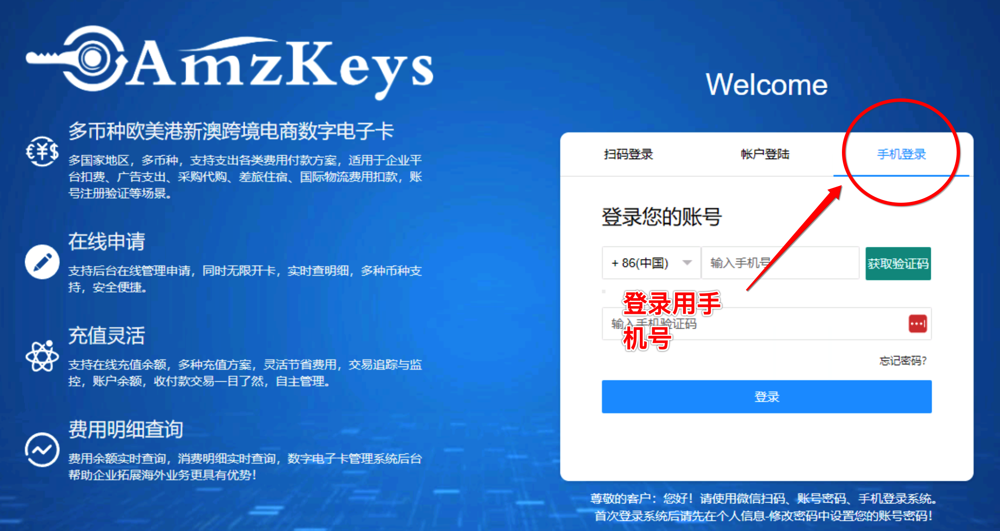
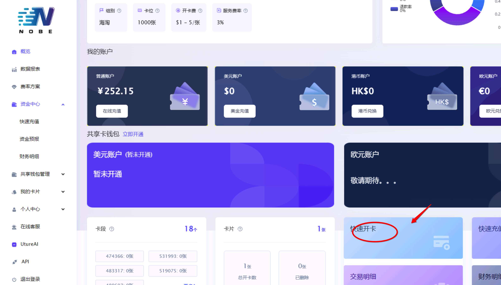
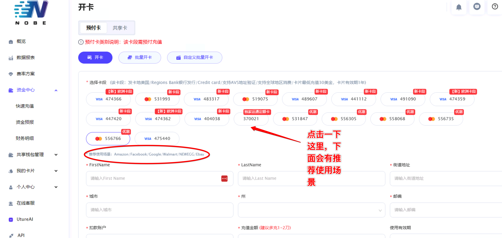
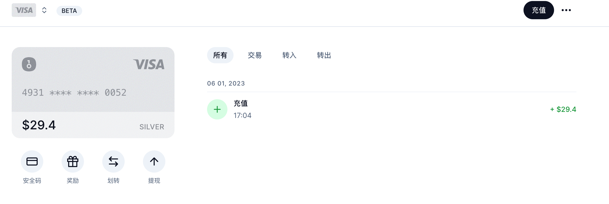
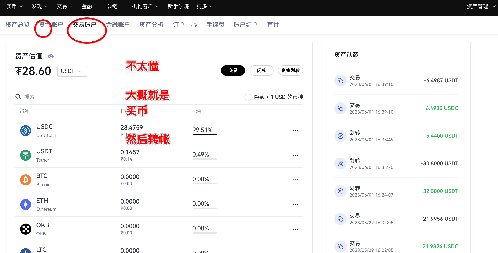
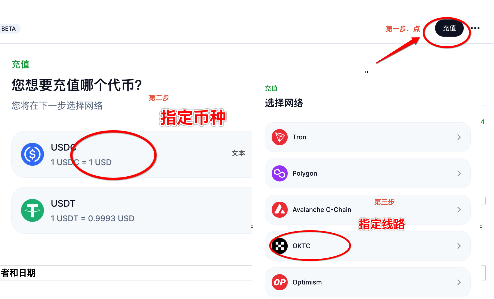
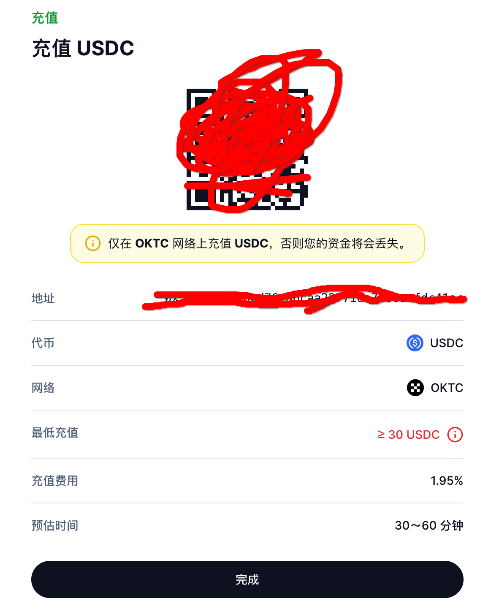
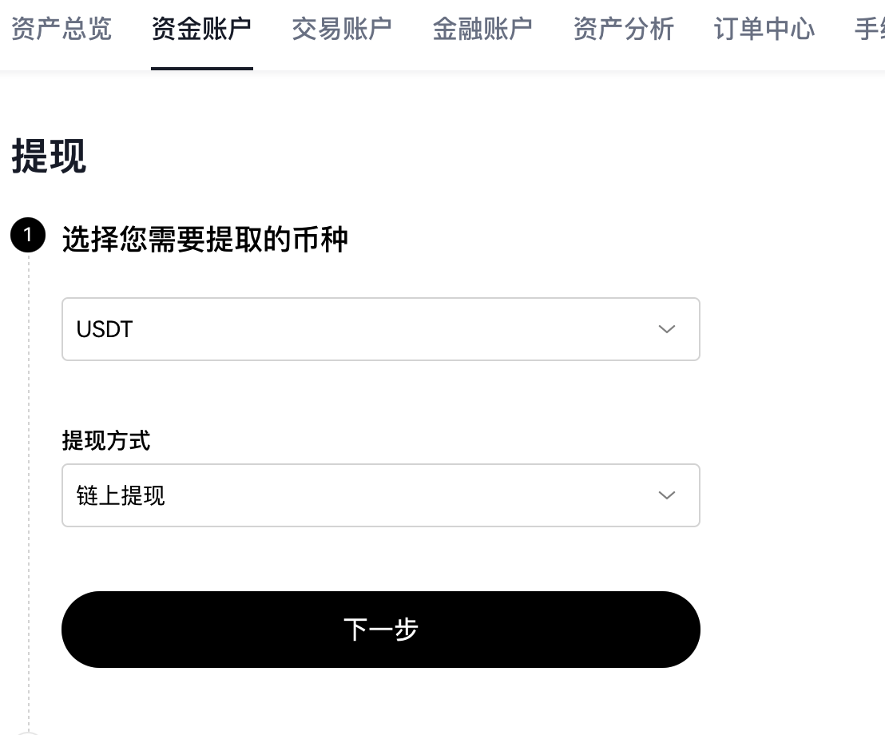
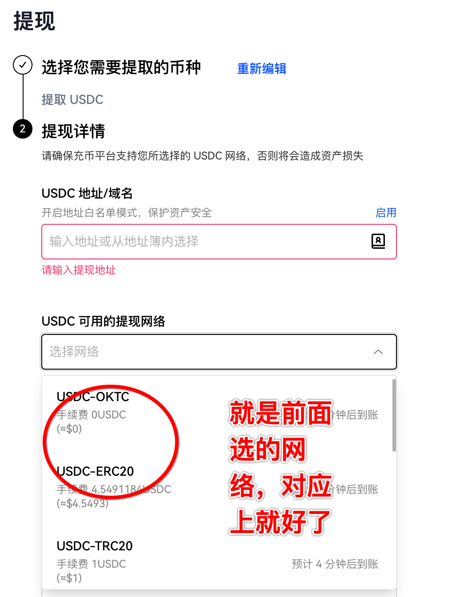

* content
{:toc}

> 阶段性来看，这是一个准入门槛，chatgpt的注册和购买plus会员都是充满玄幻的过程，
换了好几个方法，都不行，最后通过一个网址搞定了

amzkeys，onbepay， onekey等等，大概都介绍了一下

这个过程莫名其妙掌握了点知识。聊以慰藉的是，总算开动了，比想象中容易。最后有点介绍到虚拟币的感触
<!-- more -->
# 1 为啥会这么麻烦，和我做这个事的失败经历
注册gpt的过程比较麻烦是因为gpt不能用大路的手机号注册，所以八仙过海各显神通了吧。以前曾经想过这事，但是一直没成行。后来东找西找才找到一个靠谱的平台。解码注册了。

这里大概就知道了特殊的互联网服务，**匿名邮箱**（收验证码用），**接码平台**（收手机验证码）,**虚拟地址**(用来填美国虚拟信用卡地址，收货地址等)。一方面有些网址也不用再用第二次，没啥必要真实信息，另外有些是因为地域限制。也感慨真是想不到的时候，人家都做好了。

接码平台地址：

注册以后要充值，因为插件功能只有GPT4有，尝试了国内的信用卡都失败了，VISA卡，MasterCard卡等等都失败了。无奈之下买了一个帐号，一个月50元rmb。
这里的关键是信用卡，所以后来找了一些平台

# 2 用过的几个虚拟信用卡平台

### 2.1 amzkeys（成功了，后来还有电话回访）

注册地址：[https://amzkeys.com/index.php?c=login&a=login](https://amzkeys.com/index.php?c=login&a=login), 测试的结果是通过 **手机验证码** 登录，其他方式好像容易失败

### 2.2 depay

可能因为用的人太多，停止注册了

### 2.3 nobepay，500rmb起步充值，费率好像也不算低

网址： [https://www.nobepay.com](https://www.nobepay.com/)

* 注册需要一个邀请码，但是邀请码再普通用户界面上没有，需要可以找我要
* 先充值到他们平台上，再开通卡片
* 充值是500起步，另外开通卡片需要手续费，每个卡片的费率不同

### 2.4 onekey，开通激活需要钱，钱从okx通过币的方式转进来，手机app的钱包和这个卡没关系
简单来说就是开通onekey卡，然后通过okx这样的交易所给onekey的卡充值，充值是通过数字币实现的。

*  **第一步，开通onekey卡**
注册地址[http://card.onekey.io](http://card.onekey.io),我直接用了google帐号注册了。
整体操作还是比较简单的,实名认证，2步验证（+google验证器的意思），最后会出来一个地址
[参考教程](https://mirror.xyz/0xC17eE5992691f6ef3ce23F7bD84115d02ec874e3/UObD1KfMuXaCAt9K_Gu3tM8om63QJqxcKOf3VfWEm54)

* **第二步，开通okx账户**
注册地址[https://www.okx.com/cn/account/login](https://www.okx.com/cn/account/login),也是采用google帐号的，需要实名认证，另外最好弄个google的验证器。
这个验证器还比较麻烦，如果忘记恢复需要折腾一下。
另外实名认证最好是手机上操作，pc上还是没那么顺畅，一般是需要等待一下的
它的帐号有等级，通过实名认证啥的就升级了，大概意思吧

**简单理解它是个交易所，有资金托管的服务，当然也就要收手续费了**

然后在okx平台上购买usdc币，我们算下大概是多少钱，稍微多买一点，避免因为手续费不足充值失败。

* **第三步，转账**
这里是2个步骤，也是比较麻烦的地方。从okx提币，到onekey去。尽量尝试通俗解释这个过程。
1. onekey提供一个接受币的入口，充值-usdc-okx
这里个人的理解是，usdc我们理解是哪种虚拟币，okx这里其实是无所谓的，可以理解成是线路或者接受的银行，就好比是，它有各个银行的银行卡，只是这里我选择了oktc，也可以选tron，只要下面okx那里有就可以了。
都选好了就会出来一个虚拟地址。
2. 去okx提币，选择上面的线路（就是网络）

这样操作完了以后，过段时间就可以了。

### 2.5

# 3 okx钱包使用体验
okx这个东西以前没接触过，虚拟币也没接触过。说下大概的感觉，同时也觉得它不是靠谱的事。
* okx是个平台，通过它来购买虚拟币。
这个是很好理解的，但是，问题来了，它的成交是通过私人微信转账实现的，你没听错，是**没有监管的系统外交易**！！！
就是你想买一个币，先找个要挂着卖币的人，然后提供一个微信号，你加他，转账，等会对方确认了，你就有币了。这有点吓人的呀，说明这个事不可控，谁都不可信，平台和交易方都不可信。
* 交易的网络弄错，会让钱消失
同样的问题，前面转账的时候，会选择不同的网络，我理解是不同的线路或者协议，或者更直白点就是银行，但是，重点来了，你给A网络的一个地址转了钱，但是地址是B网络的，然后这个钱就不见了，这尼玛啥情况。
* 钱包和web3
暂时还没细究，等空点再研究下，目前来看，这玩意要不是因为gpt咱也不会去碰了

