* content
{:toc}

> 因为工作需要把视频中的语音转换成文字，网上找了很多方案，效果不佳不说，大部分都是价格不菲。正好最近在学习OpenAI，于是找到了这款神器，意外的效果好，而且免费，而且本地就能运行。它有一个windows下客户端可以直接使用，但是一次只能处理一个文件，所以就想着如何自动化批量处理，发现原来它有个cli版本。
总的来说，它的原理是先通过ffmpeg转换成音频文件，然后再通过whisper转换成文字
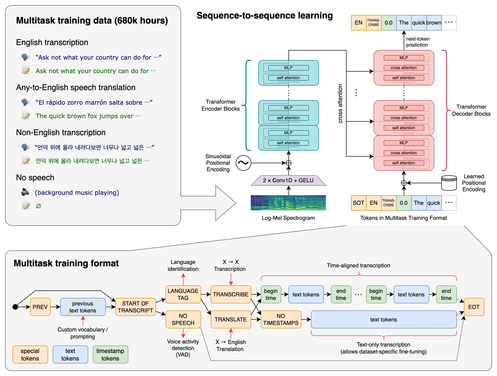


<!-- more -->
# 1、去哪里下载
* 代码下载

https://github.com/openai/whisper/releases
在github上可以下载到最新的版本
>这个是官方的地址，有兴趣可以下来看看，主要用到的是下面地址的内容

* 模型下载（针对命令行方式和客户端方式）

https://huggingface.co/datasets/ggerganov/whisper.cpp/tree/main
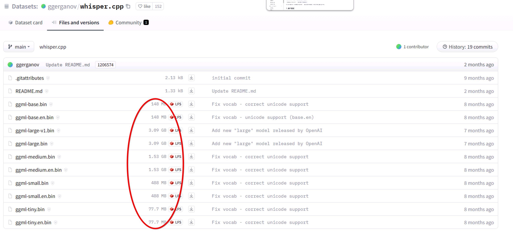

很好理解，模型越大越慢，也越精准，所以我下载了large。

# 2、客户端版本
这里说的客户端版本，就是它提供了一个exe文件，里面可以设置一些东西。
https://github.com/Const-me/Whisper/releases
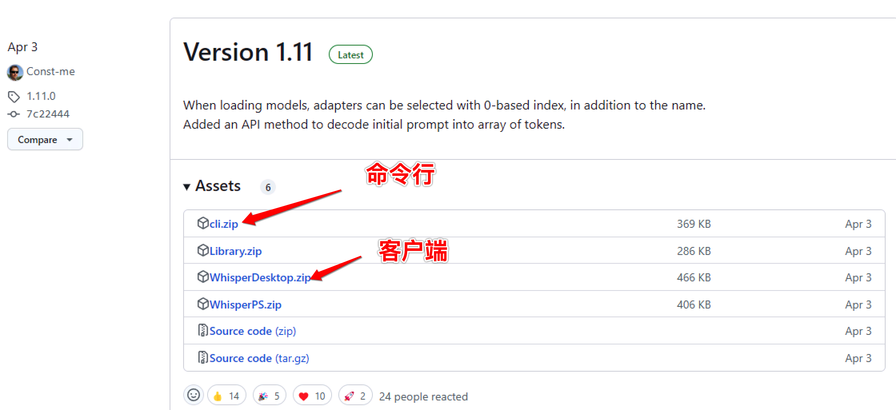

这里的WhisperDesktop就是Windows下的版本了，从这里看应该是没有其他系统的版本了。
客户端版本使用比较简单，但是需要先下载模型文件，下面会用到，它启动就会要求。

### 2.1 启动
启动很简单，加载模型需要一些时间，还挺久的
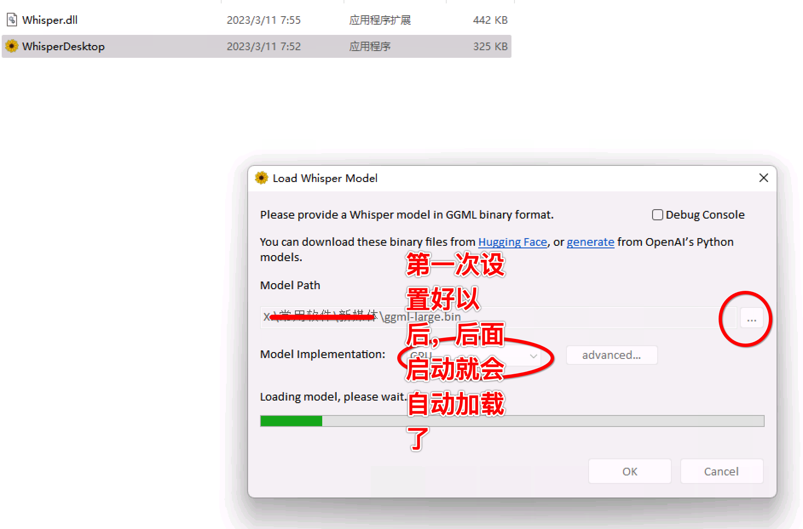
这里可以设置选择哪个显卡，在advanced里面可以设置显卡
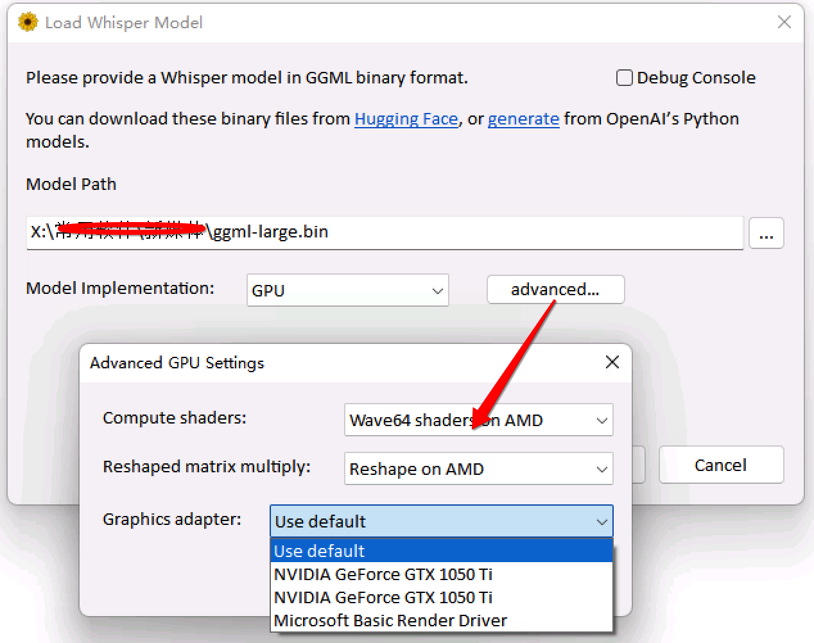
老实说，也没啥必要调整，就一个简单工具，调整也调不出花来。


### 2.2 转换
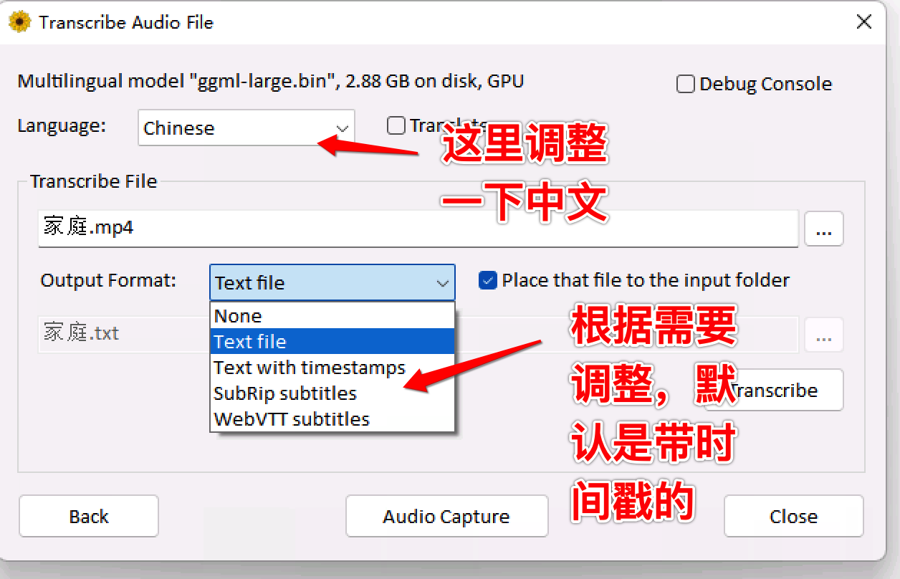
设置一下要转换的文件，还有输出的格式，默认情况，下面的Place that file to the input folder 是没有选中的，选中以后，输出的文件名就和原始文件名一致，但是扩展名不同。
比如图上的，原始文件名是 家庭.mp4,结果就是 家庭.txt。
设置好了以后，就开始走进度转换了

>转换的效果没得说，遗憾的是一次只能搞1个。所以想尝试批量方案。一开始尝试rpa，后来想想有点杀鸡用牛刀了

# 3、Python实现（调用cli命令，最终版）

> 通过cli命令是因为它和客户端版是一起的，而客户端版使用了gpu，并且输出效果很好。

### 3.1 基本配置
下载地址就是上面的那个，cli文件，但是解压以后会发现，它的名字居然叫 main.exe,有点不能忍啊。
反正windows程序，我们简单理解为，在命令行能直接执行的，就在Path里面设置好就行了。
解压到一个地方，把它名字改了。

它的路径放在c盘下面，加到path里面就可以了


这个操作有点复杂，意思就是找到系统属性就行了，不同的操作系统，大同小异，基本都是这样

这样弄好了以后，就可以在命令行里面测试了
``` bash
whispercli --help
```

### 3.2 实现代码

``` python
# -*- coding: utf-8 -*-
import os
import subprocess
import time
from tqdm import tqdm

video_directory = ''

ffmpeg_command = 'ffmpeg -i "{}" -f wav -vn "{}"'
whisper_command = 'whispercli  -gpu "NVIDIA GeForce GTX 1050 Ti" -nt -m "C:\\Program Files\\whispercli\\ggml-large.bin" -l zh  -nt -otxt -f "{}"'

# 使用FFmpeg将视频转换为音频
def convert_video_to_audio(video_path, audio_path, video_name):
    ffmpeg_output = subprocess.check_output(
        ffmpeg_command.format(video_path, audio_path),
        shell=True,
        stderr=subprocess.DEVNULL,  # 阻止FFmpeg输出显示在终端上
    )
    
# 使用Whisper将音频转换为文字
def gen_audio_txt(audio_path, video_name):
    # 不指定文件名，自动就是同名的txt
    whisper_output = subprocess.check_output(
        whisper_command.format( audio_path),
        shell=True,
        encoding='utf-8'
    )  

# 这里用来处理视频文件，生成文件
def process_video():
    start_time = time.time()
    # 遍历视频文件目录中的所有视频文件
    n = 0
    video_files = [f for f in os.listdir(video_directory) if f.endswith((".mp4", ".avi", ".mkv", ".flv", ".mov"))]

    for video_file in tqdm(video_files, desc='正在处理视频文件 '):
        # 获取视频文件路径和文件名
        video_path = os.path.join(video_directory, video_file)
        video_name = os.path.splitext(video_file)[0]

        # 定义音频文件路径
        audio_path = os.path.join(video_directory, video_name + '.wav')
        # 定义txt文件路径
        txt_path = os.path.join(video_directory, video_name + '.txt')

        # 检查txt文件是否已存在，如果存在则跳过当前视频文件
        if os.path.exists(txt_path):
            print(f"跳过视频文件 【{video_file}】, 对应的文案txt文件已经存在.")
            continue

        # 使用FFmpeg将视频转换为音频
        convert_video_to_audio(video_path, audio_path, video_name)
        
        # 使用Whisper将音频转换为文字
        gen_audio_txt(audio_path, video_name)
        os.remove(audio_path)
        n = n + 1
    end_time = time.time()
    print("一共 {:d}个视频，共耗时: {:.2f}秒".format(n, end_time - start_time))


if __name__ == '__main__':
    path = ''
    while True:
        path = input("输入包含视频文件的目录: ")
        if os.path.exists(path) :
            break
        else:
            print(f'{path}文件不存在，可能是路径不对')

    video_directory = path

    # 开始处理文件
    process_video()


```
运行效果如下：

这里会卡挺久，后面就好了，这里现实显卡名字了，就是用显卡了
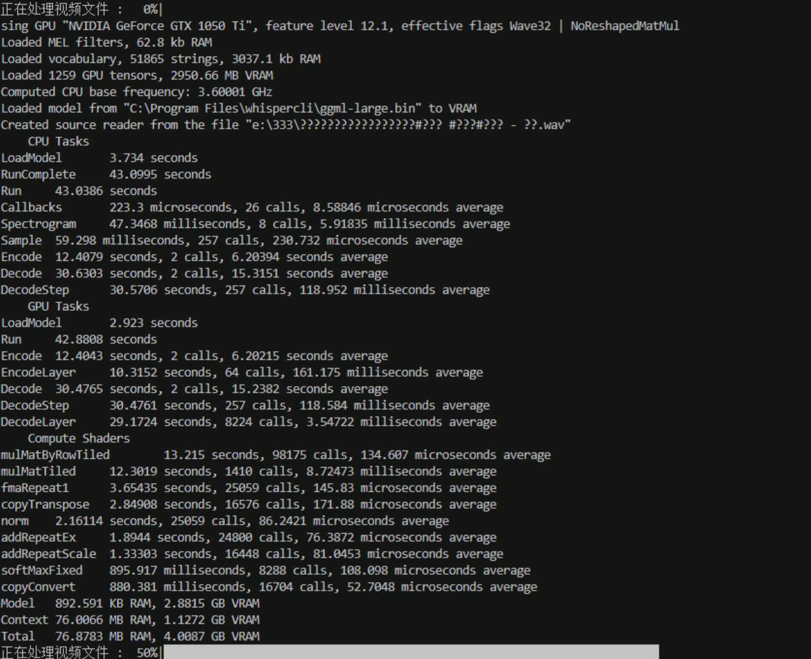

### 3.3 命令说明
基本使用方法如下
> whispercli.exe [options] file0.wav file1.wav ...

我们使用命令行参数带 --help 的时候，比较特别的是，第3列代表着当前的值，也许是我们上次执行之后留下来的值，不知道它保存在哪里，有时候确实会轻松一点

|简写|完整写法|当前值|说明|
|----|----|-----|-----|
|  -h,       |--help          |[default] |show this help message and exit
|  -la,      |--list-adapters |系统中当前的显卡名，给后面的参数用
|  -gpu,     |--use-gpu       |使用gpu加速，这里后面跟的是显卡的名字，
|  -t N,     |--threads N     |[4      ] |number of threads to use during computation
|  -p N,     |--processors N  |[1      ] |number of processors to use during computation
|  -ot N,    |--offset-t N    |[0      ] |time offset in milliseconds
|  -on N,    |--offset-n N    |[0      ] |segment index offset
|  -d  N,    |--duration N    |[0      ] |duration of audio to process in milliseconds
|  -mc N,    |--max-context N |[-1     ] |maximum number of text context tokens to store
|  -ml N,    |--max-len N     |[0      ] |maximum segment length in characters
|  -wt N,    |--word-thold N  |[0.01   ] |word timestamp probability threshold
|  -su,      |--speed-up      |[false  ] |speed up audio by x2 (reduced accuracy)
|  -tr,      |--translate     |[false  ] |从原始语音翻译成英文
|  -di,      |--diarize       |[false  ] |stereo audio diarization
|  -otxt,    |--output-txt    |[false  ] |以txt的方式输出，说白了就是没有时间轴信息了，这个符合我的需求
|  -ovtt,    |--output-vtt    |[false  ] |output result in a vtt file
|  -osrt,    |--output-srt    |[false  ] |输出格式是srt，就是时间轴的那个
|  -owts,    |--output-words  |[false  ] |output script for generating karaoke video
|  -ps,      |--print-special |[false  ] |print special tokens
|  -nc,      |--no-colors     |[false  ] |do not print colors
|  -nt,      |--no-timestamps |[false  ] |不要输出时间轴信息，默认是关闭的，就是一行信息，最前面是时间
|  -l LANG,  |--language LANG |[en     ] |这里指的是输入的音频文件，讲的是啥语音，用的是zh
|  -m FNAME, |--model FNAME   |[models/ggml-base.en.bin] |model path
|  -f FNAME, |--file FNAME    |[       ] |输入的文件名，这里大家可以看到，它是音频文件不是视频问题，所以需要转换

* lang 有时候出来是繁体中文，但是都用的是zh

### 3.4 ffmpeg 一起
同理，ffmpeg也是这样实现的。它的命令更复杂更丰富，这里主要是考虑把mp4文件转换成音频文件
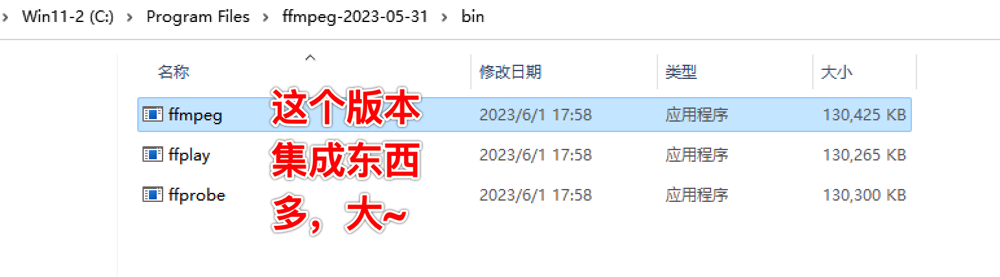
由于前面用的cli是windows下的，所以这里ffmpeg也是windows下的。
下载地址是官方的
https://ffmpeg.org/download.html
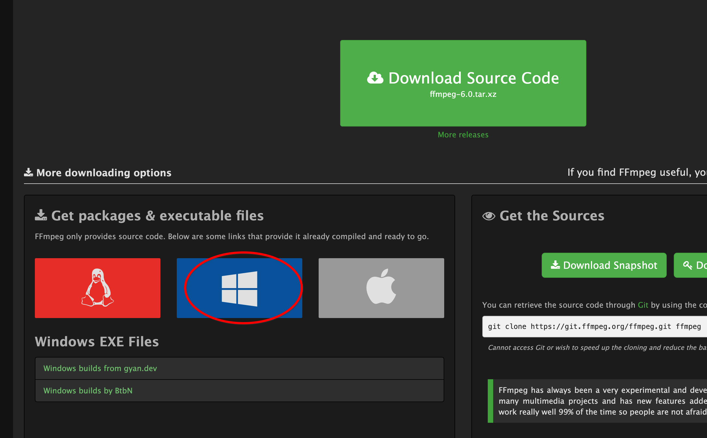

```
ffmpeg -i "{}" -f wav -vn "{}"
```
这里的 :
-i  表示输入文件名
-f  输出文件格式
-vn  输出文件名，这个说法不准确，不过好理解
更复杂的需求可以进一步去了解，东西还是挺多的

之所以选择命令行方式，一个很大的原因是，最开始选择直接用python的时候，无法使用gpu，尝试几个方案都不行,时不时还报错

# 4、Python包实现（调用openai，失败了）
>考虑用Python直接实现，有几个方面的考虑，
> * 前面2个方案都只能在Windows下运行，受限比较多
> * 要配置路径等多出来的事，不利于部署（目前发现这个问题避免不了）
> * 有个隐形的好处，Python直接弄不用事先下载模型，指定参数它会自己去下载

**目前来看，Python包也是调用系统的命令，只是封装了，用起来方便点，最终可能还是命令**

**个人理解是这个玩意需要用c开发，性能才好，很多东西比较底层，python实现一遍未必好弄，效率也成问题
这里的module应该不是指python的模块，而是系统的ffmpeg命令安装**

### 4.1 安装ffmpeg

1. 下载源码编译安装

这次换到mac平台下，日常写文章主要是在mac下，下载地址还是官网地址。
https://www.ffmpeg.org/download.html
下载tar包以后，解压
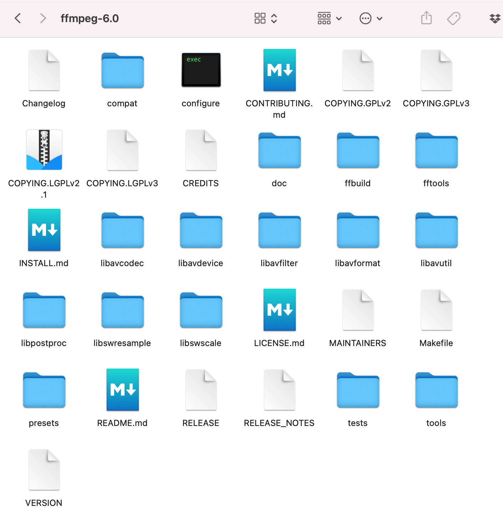

就那3个步骤
```
./configurate
make
make install
```
编译也费了不少劲，至少花了能有个20多分钟吧，可能是电脑配置低的关系
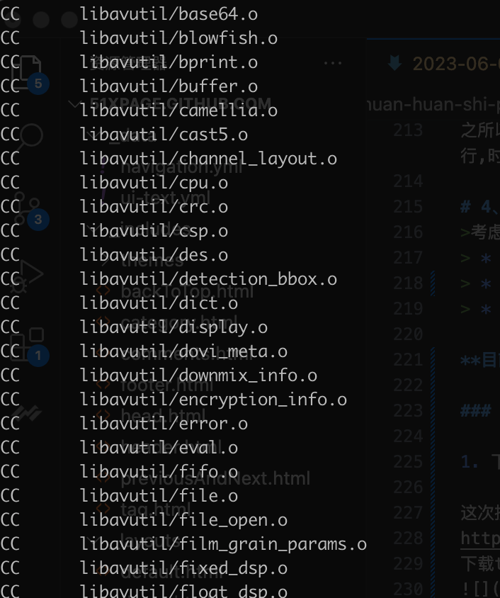
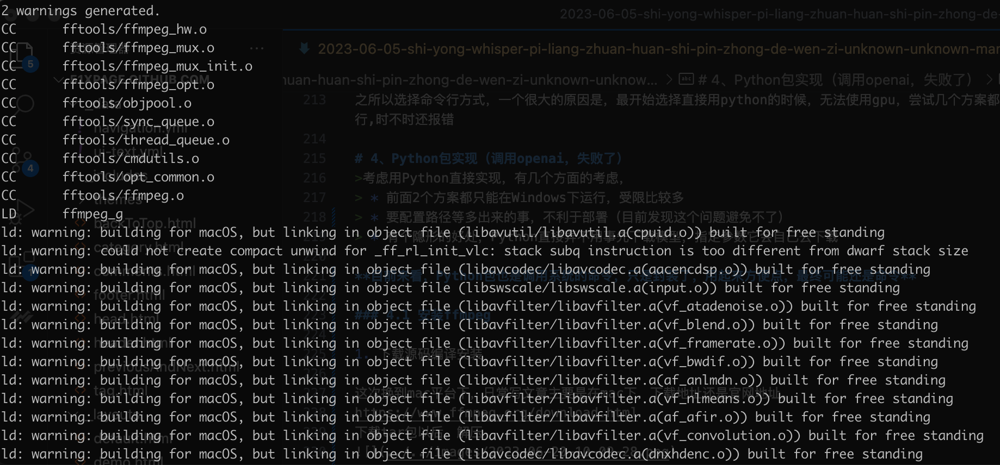

2. brew安装

我的电脑上安装了brew，所以直接
``` bash
brew install ffmpeg
```
好处是省去了设置路径之类的工作，依赖包也不用管了，坏处就是有点慢，大概折腾了有半个多小时吧，看起来是下各种依赖包
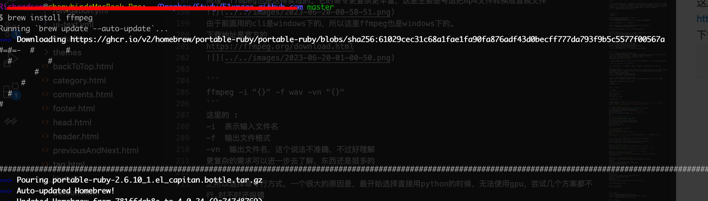
``` bash
 /usr/local/Cellar/highway/1.0.4: 65 files, 4MB
==> Installing ffmpeg dependency: imath
==> Pouring imath--3.1.9.big_sur.bottle.tar.gz
🍺  /usr/local/Cellar/imath/3.1.9: 49 files, 930.6KB
==> Installing ffmpeg dependency: jpeg-turbo
==> Pouring jpeg-turbo--2.1.5.1.big_sur.bottle.tar.gz
🍺  /usr/local/Cellar/jpeg-turbo/2.1.5.1: 44 files, 3.9MB
==> Installing ffmpeg dependency: xz
==> Pouring xz--5.4.3.big_sur.bottle.tar.gz
🍺  /usr/local/Cellar/xz/5.4.3: 162 files, 2.5MB
==> Installing ffmpeg dependency: zstd
==> Pouring zstd--1.5.5.big_sur.bottle.tar.gz
🍺  /usr/local/Cellar/zstd/1.5.5: 31 files, 2.5MB
==> Installing ffmpeg dependency: libtiff
==> Pouring libtiff--4.5.1.big_sur.bottle.tar.gz
🍺  /usr/local/Cellar/libtiff/4.5.1: 473 files, 7.8MB
==> Installing ffmpeg dependency: little-cms2
==> Pouring little-cms2--2.15.big_sur.bottle.tar.gz
🍺  /usr/local/Cellar/little-cms2/2.15: 21 files, 1.3MB
==> Installing ffmpeg dependency: openexr
==> Pouring openexr--3.1.8_1.big_sur.bottle.tar.gz
🍺  /usr/local/Cellar/openexr/3.1.8_1: 194 files, 7.7MB
==> Installing ffmpeg dependency: webp
==> Pouring webp--1.3.0_1.big_sur.bottle.tar.gz
🍺  /usr/local/Cellar/webp/1.3.0_1: 63 files, 2.6MB
==> Installing ffmpeg dependency: jpeg-xl
==> Pouring jpeg-xl--0.8.2.big_sur.bottle.tar.gz
🍺  /usr/local/Cellar/jpeg-xl/0.8.2: 43 files, 19.4MB
==> Installing ffmpeg dependency: libvmaf
==> Pouring libvmaf--2.3.1.big_sur.bottle.tar.gz
🍺  /usr/local/Cellar/libvmaf/2.3.1: 234 files, 7.2MB
==> Installing ffmpeg dependency: aom
==> Pouring aom--3.6.1.big_sur.bottle.tar.gz
🍺  /usr/local/Cellar/aom/3.6.1: 23 files, 13MB
==> Installing ffmpeg dependency: aribb24
==> Pouring aribb24--1.0.4.big_sur.bottle.tar.gz
🍺  /usr/local/Cellar/aribb24/1.0.4: 14 files, 201.8KB
==> Installing ffmpeg dependency: dav1d
==> Pouring dav1d--1.2.1.big_sur.bottle.tar.gz
🍺  /usr/local/Cellar/dav1d/1.2.1: 15 files, 2.3MB
==> Installing ffmpeg dependency: freetype
==> Pouring freetype--2.13.0_1.big_sur.bottle.tar.gz
🍺  /usr/local/Cellar/freetype/2.13.0_1: 67 files, 2.4MB
==> Installing ffmpeg dependency: fontconfig
==> Pouring fontconfig--2.14.2.big_sur.bottle.tar.gz
==> Regenerating font cache, this may take a while
==> /usr/local/Cellar/fontconfig/2.14.2/bin/fc-cache -frv
🍺  /usr/local/Cellar/fontconfig/2.14.2: 88 files, 2.3MB
==> Installing ffmpeg dependency: frei0r
==> Pouring frei0r--1.8.0.big_sur.bottle.tar.gz
🍺  /usr/local/Cellar/frei0r/1.8.0: 127 files, 6MB
==> Installing ffmpeg dependency: ca-certificates
==> Pouring ca-certificates--2023-05-30.big_sur.bottle.tar.gz
==> Regenerating CA certificate bundle from keychain, this may take a while...
🍺  /usr/local/Cellar/ca-certificates/2023-05-30: 3 files, 216.2KB
==> Installing ffmpeg dependency: libunistring
==> Pouring libunistring--1.1.big_sur.bottle.tar.gz
🍺  /usr/local/Cellar/libunistring/1.1: 56 files, 4.9MB
==> Installing ffmpeg dependency: libidn2
==> Pouring libidn2--2.3.4_1.big_sur.bottle.1.tar.gz
🍺  /usr/local/Cellar/libidn2/2.3.4_1: 79 files, 1003.8KB
==> Installing ffmpeg dependency: libtasn1
==> Pouring libtasn1--4.19.0.big_sur.bottle.tar.gz
🍺  /usr/local/Cellar/libtasn1/4.19.0: 61 files, 658.2KB
==> Installing ffmpeg dependency: nettle
==> Pouring nettle--3.9.1.big_sur.bottle.tar.gz
🍺  /usr/local/Cellar/nettle/3.9.1: 95 files, 3.0MB
==> Installing ffmpeg dependency: p11-kit
==> Pouring p11-kit--0.24.1_1.big_sur.bottle.tar.gz
🍺  /usr/local/Cellar/p11-kit/0.24.1_1: 67 files, 3.6MB
==> Installing ffmpeg dependency: openssl@1.1
==> Pouring openssl@1.1--1.1.1u.big_sur.bottle.tar.gz
🍺  /usr/local/Cellar/openssl@1.1/1.1.1u: 8,101 files, 18.5MB
==> Installing ffmpeg dependency: libnghttp2
==> Pouring libnghttp2--1.54.0.big_sur.bottle.tar.gz
🍺  /usr/local/Cellar/libnghttp2/1.54.0: 13 files, 710.3KB
==> Installing ffmpeg dependency: unbound
==> Pouring unbound--1.17.1.big_sur.bottle.tar.gz
🍺  /usr/local/Cellar/unbound/1.17.1: 58 files, 5.9MB
==> Installing ffmpeg dependency: gnutls
==> Pouring gnutls--3.8.0.big_sur.bottle.tar.gz
🍺  /usr/local/Cellar/gnutls/3.8.0: 1,281 files, 10.6MB
==> Installing ffmpeg dependency: lame
==> Pouring lame--3.100.big_sur.bottle.tar.gz
🍺  /usr/local/Cellar/lame/3.100: 27 files, 2.2MB
==> Installing ffmpeg dependency: fribidi
==> Pouring fribidi--1.0.13.big_sur.bottle.tar.gz
🍺  /usr/local/Cellar/fribidi/1.0.13: 67 files, 697.3KB
==> Installing ffmpeg dependency: pcre2
==> Pouring pcre2--10.42.big_sur.bottle.tar.gz
🍺  /usr/local/Cellar/pcre2/10.42: 230 files, 6.4MB
==> Installing ffmpeg dependency: glib
==> Pouring glib--2.76.3.big_sur.bottle.tar.gz
🍺  /usr/local/Cellar/glib/2.76.3: 455 files, 21.2MB
==> Installing ffmpeg dependency: xorgproto
==> Pouring xorgproto--2023.2.big_sur.bottle.tar.gz
🍺  /usr/local/Cellar/xorgproto/2023.2: 267 files, 3.9MB
==> Installing ffmpeg dependency: libxau
==> Pouring libxau--1.0.11.big_sur.bottle.tar.gz
🍺  /usr/local/Cellar/libxau/1.0.11: 21 files, 121.5KB
==> Installing ffmpeg dependency: libxdmcp
==> Pouring libxdmcp--1.1.4.big_sur.bottle.tar.gz
🍺  /usr/local/Cellar/libxdmcp/1.1.4: 11 files, 129.8KB
==> Installing ffmpeg dependency: libxcb
==> Pouring libxcb--1.15_1.big_sur.bottle.tar.gz
🍺  /usr/local/Cellar/libxcb/1.15_1: 2,461 files, 6.9MB
==> Installing ffmpeg dependency: libx11
==> Pouring libx11--1.8.4.big_sur.bottle.tar.gz
🍺  /usr/local/Cellar/libx11/1.8.4: 1,054 files, 7MB
==> Installing ffmpeg dependency: libxrender
==> Pouring libxrender--0.9.11.big_sur.bottle.tar.gz
🍺  /usr/local/Cellar/libxrender/0.9.11: 12 files, 198.3KB
==> Installing ffmpeg dependency: pixman
==> Pouring pixman--0.42.2.big_sur.bottle.1.tar.gz
🍺  /usr/local/Cellar/pixman/0.42.2: 11 files, 1.3MB
==> Installing ffmpeg dependency: icu4c
==> Pouring icu4c--73.2.big_sur.bottle.tar.gz
🍺  /usr/local/Cellar/icu4c/73.2: 268 files, 79.7MB
==> Installing ffmpeg dependency: harfbuzz
==> Pouring harfbuzz--7.3.0_1.big_sur.bottle.tar.gz
🍺  /usr/local/Cellar/harfbuzz/7.3.0_1: 76 files, 9.6MB
==> Installing ffmpeg dependency: libunibreak
==> Pouring libunibreak--5.1.big_sur.bottle.tar.gz
🍺  /usr/local/Cellar/libunibreak/5.1: 17 files, 325.8KB
==> Installing ffmpeg dependency: libass
==> Pouring libass--0.17.1.big_sur.bottle.tar.gz
🍺  /usr/local/Cellar/libass/0.17.1: 11 files, 628.6KB
==> Installing ffmpeg dependency: libbluray
==> Pouring libbluray--1.3.4.big_sur.bottle.tar.gz
🍺  /usr/local/Cellar/libbluray/1.3.4: 21 files, 958.1KB
==> Installing ffmpeg dependency: cjson
==> Pouring cjson--1.7.15.big_sur.bottle.tar.gz
🍺  /usr/local/Cellar/cjson/1.7.15: 23 files, 231.4KB
==> Installing ffmpeg dependency: mbedtls
==> Pouring mbedtls--3.4.0.big_sur.bottle.tar.gz
🍺  /usr/local/Cellar/mbedtls/3.4.0: 160 files, 11.8MB
==> Installing ffmpeg dependency: librist
==> Pouring librist--0.2.7_3.big_sur.bottle.tar.gz
🍺  /usr/local/Cellar/librist/0.2.7_3: 28 files, 703.4KB
==> Installing ffmpeg dependency: libsoxr
==> Pouring libsoxr--0.1.3.big_sur.bottle.1.tar.gz
🍺  /usr/local/Cellar/libsoxr/0.1.3: 29 files, 336.4KB
==> Installing ffmpeg dependency: libvidstab
==> Pouring libvidstab--1.1.1.big_sur.bottle.tar.gz
🍺  /usr/local/Cellar/libvidstab/1.1.1: 25 files, 169.6KB
==> Installing ffmpeg dependency: libogg
==> Pouring libogg--1.3.5.big_sur.bottle.2.tar.gz
🍺  /usr/local/Cellar/libogg/1.3.5: 103 files, 536.9KB
==> Installing ffmpeg dependency: libvorbis
==> Pouring libvorbis--1.3.7.big_sur.bottle.1.tar.gz
🍺  /usr/local/Cellar/libvorbis/1.3.7: 157 files, 2.4MB
==> Installing ffmpeg dependency: libvpx
==> Pouring libvpx--1.13.0.big_sur.bottle.tar.gz
🍺  /usr/local/Cellar/libvpx/1.13.0: 20 files, 5.2MB
==> Installing ffmpeg dependency: opencore-amr
==> Pouring opencore-amr--0.1.6.big_sur.bottle.tar.gz
🍺  /usr/local/Cellar/opencore-amr/0.1.6: 17 files, 710.4KB
==> Installing ffmpeg dependency: openjpeg
==> Pouring openjpeg--2.5.0_1.big_sur.bottle.tar.gz
🍺  /usr/local/Cellar/openjpeg/2.5.0_1: 536 files, 13.8MB
==> Installing ffmpeg dependency: opus
==> Pouring opus--1.4.big_sur.bottle.tar.gz
🍺  /usr/local/Cellar/opus/1.4: 15 files, 1MB
==> Installing ffmpeg dependency: rav1e
==> Pouring rav1e--0.6.6.big_sur.bottle.tar.gz
🍺  /usr/local/Cellar/rav1e/0.6.6: 14 files, 151MB
==> Installing ffmpeg dependency: libsamplerate
==> Pouring libsamplerate--0.2.2.big_sur.bottle.tar.gz
🍺  /usr/local/Cellar/libsamplerate/0.2.2: 32 files, 3MB
==> Installing ffmpeg dependency: flac
==> Pouring flac--1.4.2.big_sur.bottle.tar.gz
🍺  /usr/local/Cellar/flac/1.4.2: 284 files, 7.0MB
==> Installing ffmpeg dependency: mpg123
==> Pouring mpg123--1.31.3.big_sur.bottle.tar.gz
🍺  /usr/local/Cellar/mpg123/1.31.3: 33 files, 1.8MB
==> Installing ffmpeg dependency: libsndfile
==> Pouring libsndfile--1.2.0_1.big_sur.bottle.tar.gz
🍺  /usr/local/Cellar/libsndfile/1.2.0_1: 53 files, 1.2MB
==> Installing ffmpeg dependency: rubberband
==> Pouring rubberband--3.2.1.big_sur.bottle.tar.gz
🍺  /usr/local/Cellar/rubberband/3.2.1: 13 files, 1.6MB
==> Installing ffmpeg dependency: sdl2
==> Pouring sdl2--2.26.5.big_sur.bottle.tar.gz
🍺  /usr/local/Cellar/sdl2/2.26.5: 93 files, 6.4MB
==> Installing ffmpeg dependency: snappy
==> Pouring snappy--1.1.10.big_sur.bottle.tar.gz
🍺  /usr/local/Cellar/snappy/1.1.10: 18 files, 169.7KB
==> Installing ffmpeg dependency: speex
==> Pouring speex--1.2.1.big_sur.bottle.tar.gz
🍺  /usr/local/Cellar/speex/1.2.1: 25 files, 853.2KB
==> Installing ffmpeg dependency: srt
==> Pouring srt--1.5.1.big_sur.bottle.tar.gz
🍺  /usr/local/Cellar/srt/1.5.1: 20 files, 4.4MB
==> Installing ffmpeg dependency: svt-av1
==> Pouring svt-av1--1.6.0.big_sur.bottle.tar.gz
🍺  /usr/local/Cellar/svt-av1/1.6.0: 24 files, 7.5MB
==> Installing ffmpeg dependency: leptonica
==> Pouring leptonica--1.82.0_2.big_sur.bottle.tar.gz
🍺  /usr/local/Cellar/leptonica/1.82.0_2: 53 files, 6.3MB
==> Installing ffmpeg dependency: libb2
==> Pouring libb2--0.98.1.big_sur.bottle.tar.gz
🍺  /usr/local/Cellar/libb2/0.98.1: 8 files, 278.3KB
==> Installing ffmpeg dependency: libarchive
==> Pouring libarchive--3.6.2_1.big_sur.bottle.tar.gz
🍺  /usr/local/Cellar/libarchive/3.6.2_1: 62 files, 3.6MB
==> Installing ffmpeg dependency: pango
==> Pouring pango--1.50.14.big_sur.bottle.tar.gz
🍺  /usr/local/Cellar/pango/1.50.14: 68 files, 3.2MB
==> Installing ffmpeg dependency: tesseract
==> Pouring tesseract--5.3.1_1.big_sur.bottle.tar.gz
🍺  /usr/local/Cellar/tesseract/5.3.1_1: 73 files, 32.4MB
==> Installing ffmpeg dependency: theora
==> Pouring theora--1.1.1.big_sur.bottle.4.tar.gz
🍺  /usr/local/Cellar/theora/1.1.1: 97 files, 2.2MB
==> Installing ffmpeg dependency: x264
==> Pouring x264--r3095.big_sur.bottle.1.tar.gz
🍺  /usr/local/Cellar/x264/r3095: 11 files, 5.7MB
==> Installing ffmpeg dependency: x265
==> Pouring x265--3.5.big_sur.bottle.1.tar.gz
🍺  /usr/local/Cellar/x265/3.5: 11 files, 35.8MB
==> Installing ffmpeg dependency: xvid
==> Pouring xvid--1.3.7.big_sur.bottle.tar.gz
🍺  /usr/local/Cellar/xvid/1.3.7: 10 files, 1.3MB
==> Installing ffmpeg dependency: zeromq
==> Pouring zeromq--4.3.4.big_sur.bottle.tar.gz
🍺  /usr/local/Cellar/zeromq/4.3.4: 83 files, 6.0MB
==> Installing ffmpeg dependency: zimg
==> Pouring zimg--3.0.4.big_sur.bottle.tar.gz
🍺  /usr/local/Cellar/zimg/3.0.4: 27 files, 2.2MB
==> Installing ffmpeg
==> Pouring ffmpeg--6.0.big_sur.bottle.1.tar.gz
🍺  /usr/local/Cellar/ffmpeg/6.0: 284 files, 52.7MB
==> Running `brew cleanup ffmpeg`...
```

好习惯，弄好检查一下，看看版本啥的，为了确保安全，最好另外起个终端，避免执行环境的问题
``` bash
$ ffmpeg --help                                                                                                                                                                                                                                              [10:56:35]
ffmpeg version 6.0 Copyright (c) 2000-2023 the FFmpeg developers
  built with Apple clang version 13.0.0 (clang-1300.0.29.30)
  configuration: --prefix=/usr/local/Cellar/ffmpeg/6.0 --enable-shared --enable-pthreads --enable-version3 --cc=clang --host-cflags= --host-ldflags= --enable-ffplay --enable-gnutls --enable-gpl --enable-libaom --enable-libaribb24 --enable-libbluray --enable-libdav1d --enable-libmp3lame --enable-libopus --enable-librav1e --enable-librist --enable-librubberband --enable-libsnappy --enable-libsrt --enable-libsvtav1 --enable-libtesseract --enable-libtheora --enable-libvidstab --enable-libvmaf --enable-libvorbis --enable-libvpx --enable-libwebp --enable-libx264 --enable-libx265 --enable-libxml2 --enable-libxvid --enable-lzma --enable-libfontconfig --enable-libfreetype --enable-frei0r --enable-libass --enable-libopencore-amrnb --enable-libopencore-amrwb --enable-libopenjpeg --enable-libspeex --enable-libsoxr --enable-libzmq --enable-libzimg --disable-libjack --disable-indev=jack --enable-videotoolbox --enable-audiotoolbox
  libavutil      58.  2.100 / 58.  2.100
  libavcodec     60.  3.100 / 60.  3.100
  libavformat    60.  3.100 / 60.  3.100
  libavdevice    60.  1.100 / 60.  1.100
  libavfilter     9.  3.100 /  9.  3.100
  libswscale      7.  1.100 /  7.  1.100
  libswresample   4. 10.100 /  4. 10.100
  libpostproc    57.  1.100 / 57.  1.100
Hyper fast Audio and Video encoder
usage: ffmpeg [options] [[infile options] -i infile]... {[outfile options] outfile}...

Getting help:
    -h      -- print basic options
    -h long -- print more options
    -h full -- print all options (including all format and codec specific options, very long)
    -h type=name -- print all options for the named decoder/encoder/demuxer/muxer/filter/bsf/protocol
    See man ffmpeg for detailed description of the options.
```

### 4.2 如何在Python中使用ffmpeg转换视频为音频
目前看来，大概有几个方式可以在python中使用ffmpeg，

1. ffmpeg-python
算起来应该是目前最流行的包了，封装了命令调用

``` bash
pip install ffmpeg-python
```

``` python
import ffmpeg
stream = ffmpeg.input('dummy.mp4')
stream = ffmpeg.filter(stream, 'fps', fps=25, round='up')
stream = ffmpeg.output(stream, 'dummy2.mp4')
ffmpeg.run(stream)
```

**注意：这里import是ffmpeg哦**

代码地址 https://github.com/kkroening/ffmpeg-python
看起来最新的代码提交也是2022年了，基本够用吧，如果ffmpeg不变，它也没必要变

2. ffmpy
比ffmpeg-python流行度弱一些，github代码提交2022年以前居多，官方文档说它采用python的subprocess
``` bash
pip install ffmpeg
```

``` python
import ffmpy
ff = ffmpy.FFmpeg(
    inputs={'input.mp4': None},
    outputs={'output.avi': None}
)
ff.run()
```

另外可以通过cmd，看出来它组装的命令行是啥样的
``` python
ff = FFmpeg(
    inputs={'input.ts': None},
   outputs={'output.ts': ['-vf', 'adif=0:-1:0, scale=iw/2:-1']}
)
ff.cmd
```
输入结果是
``` bash
ffmpeg -i input.ts -vf "adif=0:-1:0, scale=iw/2:-1" output.ts
```

github地址：https://github.com/Ch00k/ffmpy
文档地址：https://ffmpy.readthedocs.io/en/latest/

3. PYTHON-FFMPEG-VIDEO-STREAMING
网络摄像头、实时流或 S3 存储桶捕获视频，简单来说就是可以折腾流媒体，这有点牛掰的（其实都是用ffmpeg，前面俩货应该也是可以的，取名还是重要），最近几个月还有提交
``` bash
pip install python-ffmpeg-video-streaming
```
最近的官方文档里面提示，要求在requirements.txt加上
```
python-ffmpeg-video-streaming>=0.1
```

``` python
import ffmpeg_streaming
video = ffmpeg_streaming.input('/var/media/video.mp4')
video = ffmpeg_streaming.input('https://www.aminyazdanpanah.com/?"PATH TO A VIDEO FILE" or "PATH TO A LIVE HTTP STREAM"')
```

github地址：https://github.com/aminyazdanpanah/python-ffmpeg-video-streaming
这玩意接触少，暂时不折腾了，好在知道去哪里找资料了。ffmpeg太强了

4.  ffmpeg（不要搞它，不要搞它，不要搞它）
``` bash
pip install ffmpeg
```
这个玩意为啥放最后，是因为我一开始就是这样安装了的，结果报错找不到包，所以换了一下


### 4.3 最后选择了ffmpeg-python,采用大多数人的选择
``` python

# -*- coding: utf-8 -*-
import os
import time
import ffmpeg
from tqdm import tqdm
import sys
import whisper
import torch

# 它会去自动下载base模型
model = None

# 使用FFmpeg将视频转换为音频
def convert_video_to_audio(video_path, audio_path, video_name, **input_kwargs):
    try:
        (ffmpeg
         .input(video_path, **input_kwargs)
         .output(audio_path, format='wav', acodec='pcm_s16le', vn=1, ar='16k')  # vn表示不输出视频
         .overwrite_output()
         .run(capture_stdout=True, capture_stderr=True)
         )
        print(f'{video_name}转换音频完成')
    except ffmpeg.Error as e:
        print(e.stderr, file=sys.stderr)
        sys.exit(1)


# 使用Whisper将音频转换为文字
def gen_audio_txt(audio_path, txt_file ,video_name):
    # 加载文件
    audio = whisper.load_audio(audio_path)
    audio = whisper.pad_or_trim(audio)

    # make log-Mel spectrogram and move to the same device as the model
    mel = whisper.log_mel_spectrogram(audio).to(model.device)

    # 推断音频使用的语言种类，我们基本就是zh
    _, probs = model.detect_language(mel)
    print(f"Detected language: {max(probs, key=probs.get)}")

    # 音频解码
    options = whisper.DecodingOptions()
    result = whisper.decode(model, mel, options)

    with open(txt_file, 'w+') as f:
        f.write(result.text)
    print(f'{video_name}转换文本完成')


# 这里用来处理视频文件，生成文件
def process_video(bash_path):
    start_time = time.time()
    # 遍历视频文件目录中的所有视频文件
    n = 0
    video_files = [f for f in os.listdir(bash_path) if f.endswith((".mp4", ".avi", ".mkv", ".flv", ".mov"))]

    for video_file in tqdm(video_files, desc='正在处理视频文件 '):
        # 获取视频文件路径和文件名
        video_path = os.path.join(bash_path, video_file)
        video_name = os.path.splitext(video_file)[0]

        # 定义音频文件路径
        audio_path = os.path.join(bash_path, video_name + '.wav')
        # 定义txt文件路径
        txt_path = os.path.join(bash_path, video_name + '.txt')

        # 检查txt文件是否已存在，如果存在则跳过当前视频文件
        if os.path.exists(txt_path):
            print(f"跳过视频文件 【{video_file}】, 对应的文案txt文件已经存在.")
            continue

        # 使用FFmpeg将视频转换为音频
        convert_video_to_audio(video_path, audio_path, video_name)

        # 使用Whisper将音频转换为文字
        gen_audio_txt(audio_path, txt_path, video_name)
        os.remove(audio_path)
        n = n + 1
    end_time = time.time()
    print("一共 {:d}个视频，共耗时: {:.2f}秒".format(n, end_time - start_time))


if __name__ == '__main__':
    path = ''
    # 一次性加载模型， tiny，base，small，medium，large，large-v2
    DEVICE = "cuda" if torch.cuda.is_available() else "cpu"
    print(f'device:{DEVICE}')
    model = whisper.load_model("base", device=DEVICE)
    while True:
        path = input("输入包含视频文件的目录: ")
        if os.path.exists(path):
            break
        else:
            print(f'{path}路径不存在')
    # 开始处理文件
    process_video(path)


```
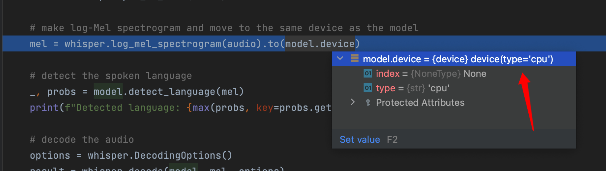


### 4.4 启用显卡支持，cuda也是n家的东西
>为啥要启用gpu，因为cpu会发现慢，而且风扇狂转，有点吓人

1. 失败记录，去官网找了
一开始网上有人介绍说需要去官网下载一个tookit，就是下面这个玩意
https://developer.nvidia.com/cuda-toolkit
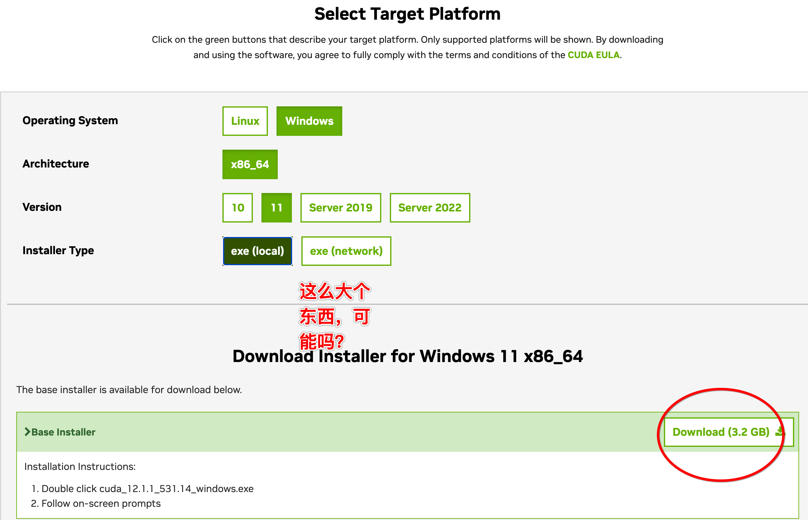
毕竟没弄通，还是试了试，尼玛，不行！想想也是，命令行才几M就能搞定，它要这么大个家伙，也不合理呀！

2. 找pytorch，版本对应上就好了
https://pytorch.org/get-started/locally/
它有个互动的界面让我们选择
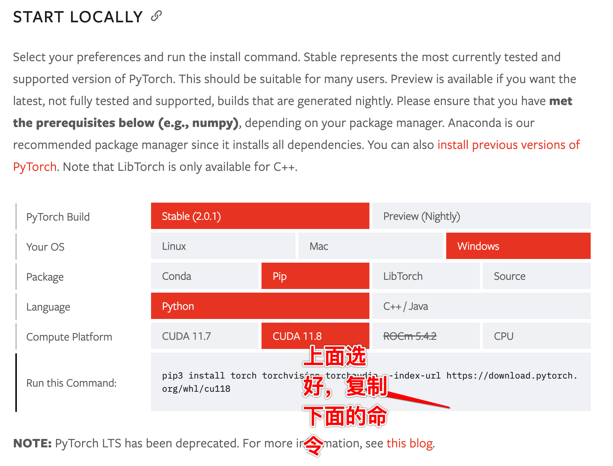
很无奈又回到windows了，没有特别多的波折

3. 测试一下是否启用
随便找个命令行，python
``` python
import torch
torch.cuda.is_available()
True
```
这里返回True就可以了，为了确保还可以在任务管理器里面看下gpu占用。


# 5、异常信息和解决方法

### 5.1 编译ffmpeg报错nasm太老，升级
▶ ./configure
nasm/yasm not found or too old. Use --disable-x86asm for a crippled build.

解决办法就是
```
brew install nasm
```

### 5.2 ModuleNotFoundError: No Module Named 'ffmpeg' 
一开始安装的时候用 pip install ffmpeg，后来卸载再装 ffmpeg-python好了

### 5.3 mac 升级以后无法使用pycharm
我的情况是原来的python版本是3.5，换成最新版本就好了
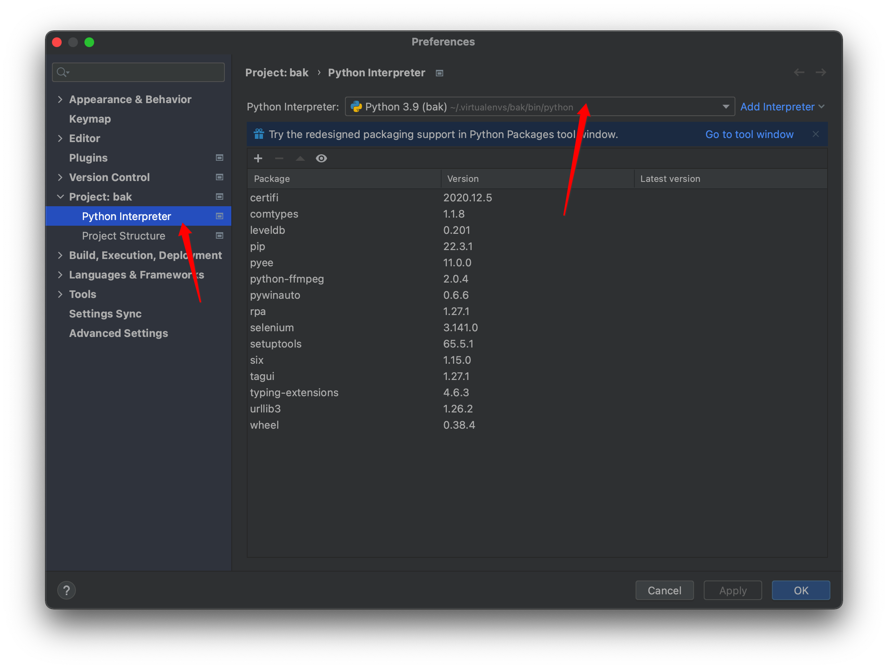

### 5.4 AttributeError: module 'whisper' has no attribute 'load_model'
>   whisper.load_model("base")
> AttributeError: module 'whisper' has no attribute 'load_model'
一开始是pycharm直接给我装的，重新弄下就好了
``` bash
pip install git+https://github.com/openai/whisper.git 

```
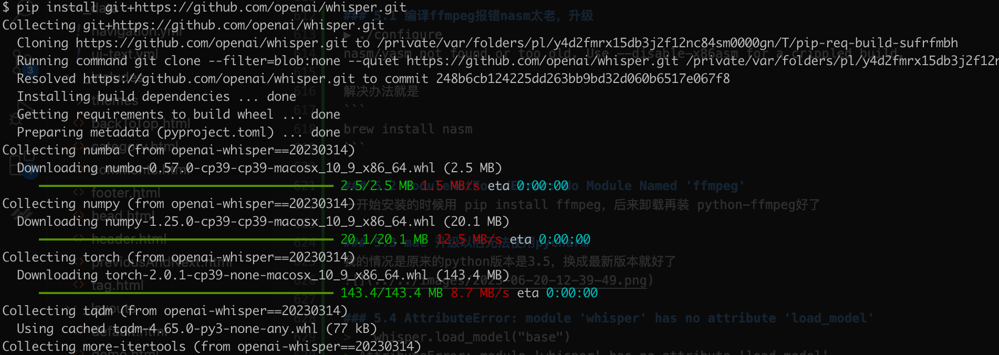
弄好以后，要去pycharm里面把原来它安装的删除掉
在项目属性里面，也就是上面弄python最新版本那里

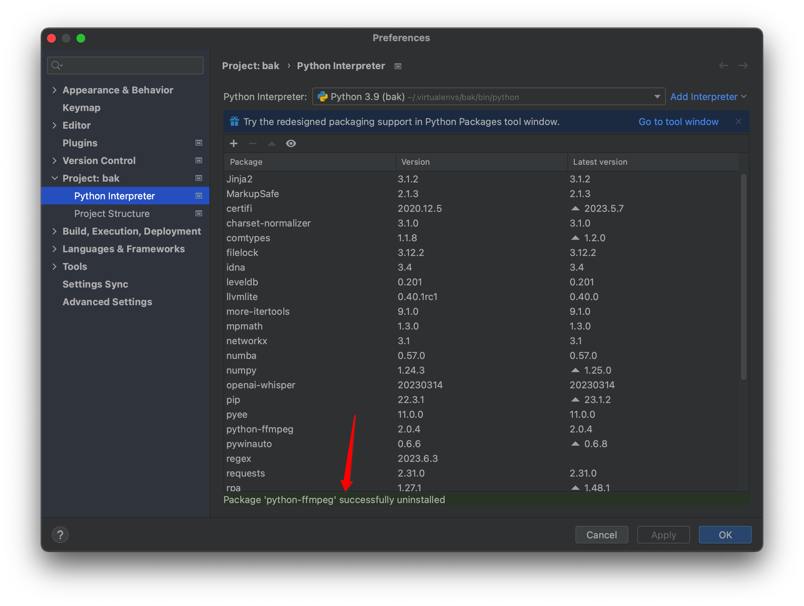

### 5.5  AttributeError: module 'ffmpeg' has no attribute 'input'
``` bash
pip uninstall ffmpeg
pip uninstall ffmpeg-python
pip install ffmpeg-python
``` 

### 5.6 RuntimeError: "slow_conv2d_cpu" not implemented for 'Half'


### 5.7 AssertionError: Torch not compiled with CUDA enabled

### 5.8 Attempting to deserialize object on a CUDA device but torch.cuda.is_available() is False. If you are running on a CPU-only machine, please use torch.load with map_location=torch.device('cpu') to map your storages to the CPU.

尝试了几次都不行，
``` bash
pip3 uninstall torch
pip3 cache purge
pip3 install torch torchvision torchaudio --extra-index-url https://download.pytorch.org/whl/cu116
```

https://github.com/ggerganov/whisper.cpp/releases
