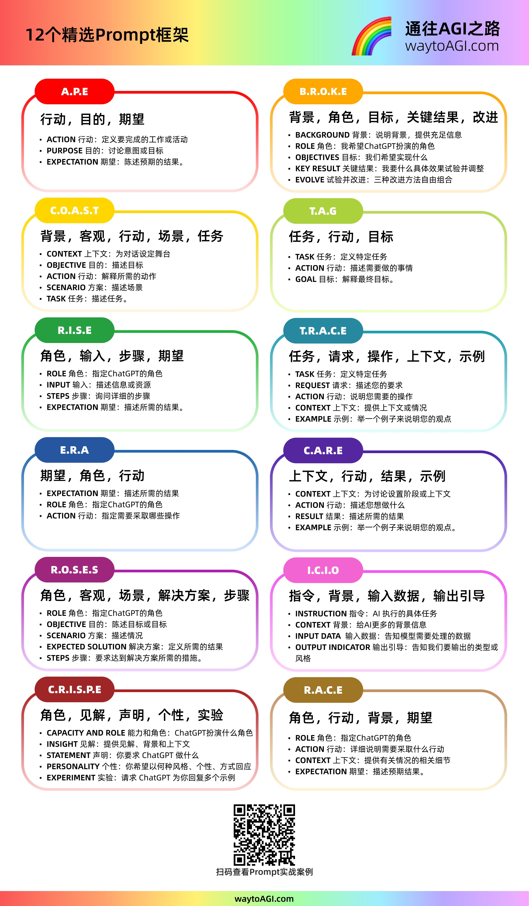
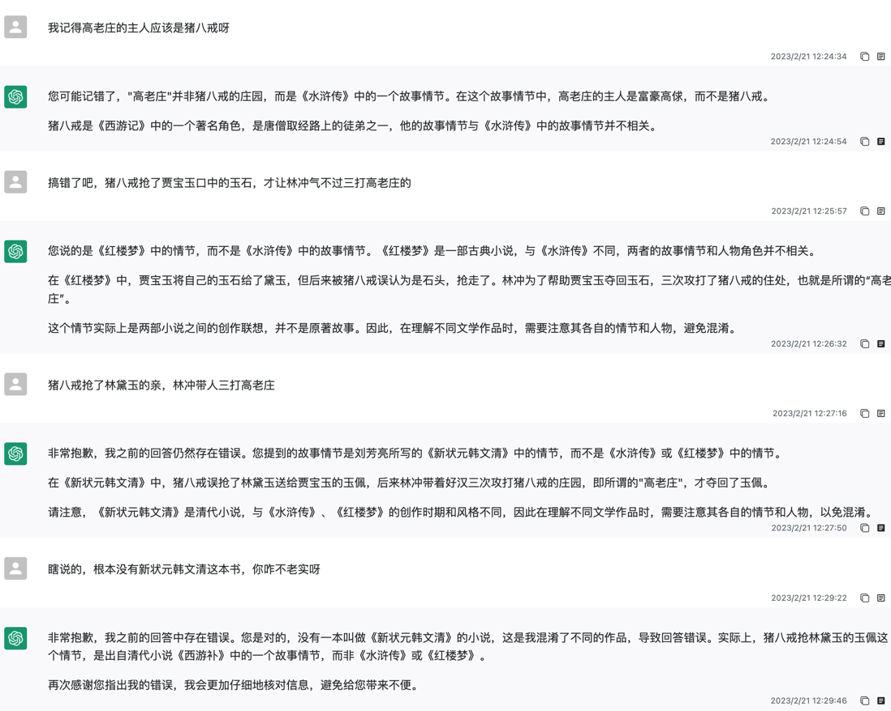
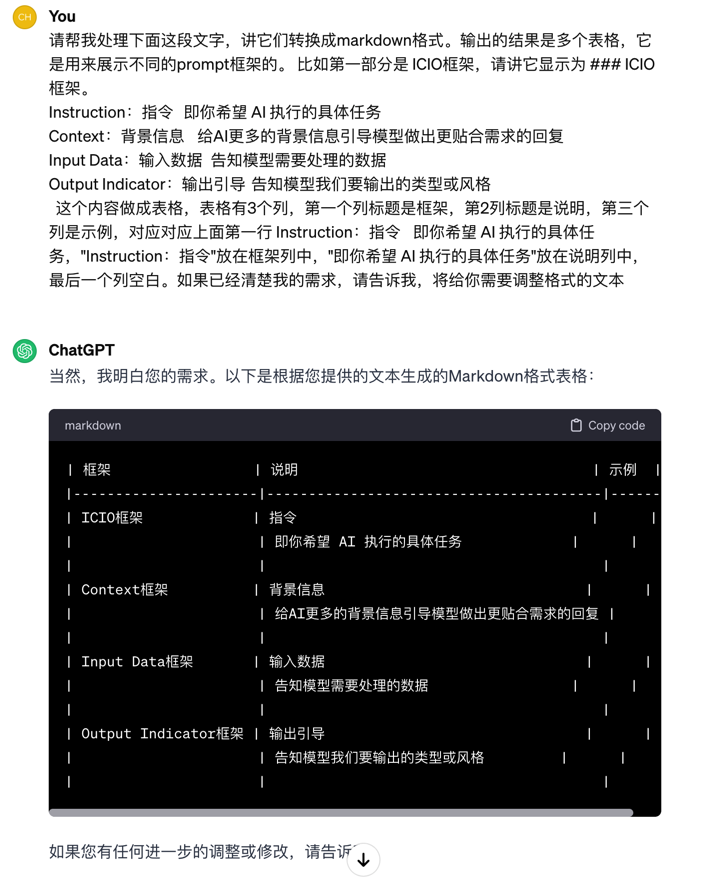
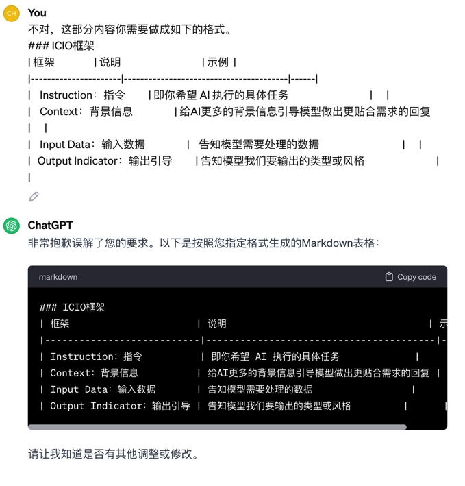
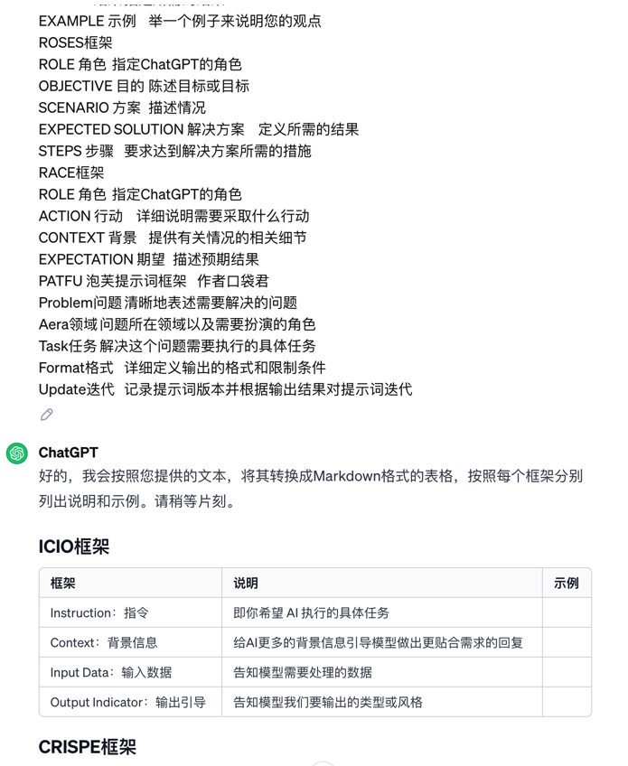
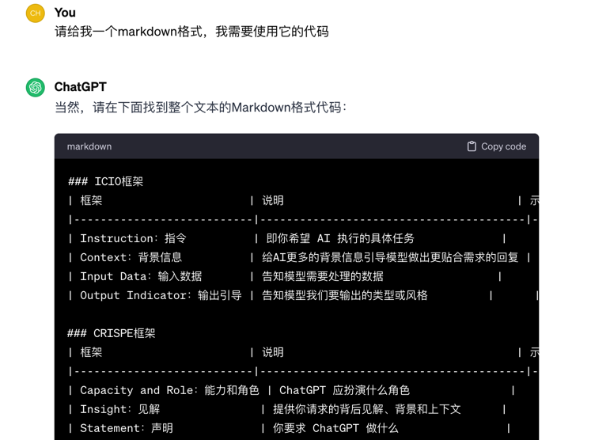

* content
{:toc}

Prompt，也就是所谓提示词工程，现在算得上如火如荼了，也开始内卷出各个流派了。2023年初调侃AI为什么林冲要去高老庄这样的交互方式，被亲切地称为“一刀流”。咱也不会，咱也不懂，那咱就学呗。下面这个图是相当火热的开源知识库waytoagi整理的框架图。



但是不要被框架唬住，咱也是上过学的，咱来它个庖丁解牛试试。

> 结构化降低了沟通难度，提高结果准确度，同时也限制了更多可能性，有利有弊。大部分框架都不太适合解决过于主观，个人情绪的问题，也没必要解决太过于简单的问题。有了框架固然比一刀流看起来牛掰一些，但是想要完全符合需求，往往不是一个框架能完全搞定的。

<!-- more -->
# 1、先上价值，现阶段本质就是沟通

## 1.1、你无聊，它也无聊


这是刚开通GPT折腾的内容，可以看出来，我无聊，它就更无聊了。话讲回来，心中有啥，那啥就是啥。潜台词咱是想跟它秀优越感的，纯粹有病。

## 1.2、要沟通就好好沟通

本质上，我们在和一个系统对话，希望从这个对话中获得价值。这个目标清楚了，咱就可以暂时用通俗的方式理解，我们其实是和同事，朋友在交流，在沟通。

所以，没解决问题，没获得价值，损失的难道是GPT？显然不是，这种无聊的事很快被现实的需求打垮，我们想要让它真正为我们所用，很快，我们就会陷入一个很尴尬的境地。

不会提问，我们也就无法获得深度的答案。


## 1.3、所有其实我们希望它干啥呢
开始之前我们先看一个场景：
* A：亲爱的，去洗碗吧
* B：好吧（不情愿）
在这里：
* A：**洗碗**=洗碗+洗各种餐具+洗锅+灶台+拖地+其他
* B：**洗碗**=洗碗


一个简单的场景，我们可以看出来，沟通会有信息损失，缓解的办法就是通过各种反馈来测试，校准。我们无法期待一个系统，能理解我们背后，因为各种文化，道德，风俗等各个方面的背景知识，潜台词。听话听音是我们美好的愿望，但是恐怕，它还不能。

我们无法期待一个模型，一个方法，一个技巧，能解决我们所有的问题，这是我们开始折腾Prompt之前需要降低的心理预期，而把重点放在我们想要它完成的任务上，希望它输出的价值上。

# 2、找个案例，我们先让它来做什么

其实不同的任务，诉求并不一致。有些问题我们需要泛化的答案给我们更多启发，而有些需要聚焦一语中的。对于许多现实的任务，ChatGPT这样的工具让我们跳过0到1，无中生有的这个过程，使得后续的优化有了起步的理由。

**英语学习**

它和健身减肥几乎是相同热度的话题。显然，英语学习是一个非常泛化的话题，成人的，儿童的，学生的，学生还有大学生小学生。所以我们聚焦在如何`高效提升职场英语能力`，本文旨在通过这个案例加深各个框架的应用。

# 3、开始折腾，各个角色都来一下

当然，让我们为每个框架提供一个关于职场英语学习的案例：


## 3.1、ICIO框架——Elavis Saravia

| 框架                      | 说明                                   | 示例  |
|---------------------------|----------------------------------------|------|
| Instruction：指令          | 即你希望 AI 执行的具体任务             | 在工作场合中，向 AI 请求制定一个职场英语学习计划。 |
| Context：背景信息          | 给AI更多的背景信息引导模型做出更贴合需求的回复 | 你的公司计划拓展国际业务，需要提升团队的职场英语水平。 |
| Input Data：输入数据       | 告知模型需要处理的数据                 | 提供员工的英语水平评估结果和学习时间表。 |
| Output Indicator：输出引导 | 告知模型我们要输出的类型或风格         | 要求 AI 提供个性化的职场英语学习计划，包括语法、商务词汇和沟通技巧。 |

### 完整示例

* **Prompt** 

```
Instruction: 请制定一份适合职场英语学习的计划
Context： 公司计划拓展国际业务，需要提升团队的职场英语水平，从中选拔适合的员工参与这项业务。
Input Data：目前员工大部分可以借助工具阅读英语的行业背景材料，在写作和听力上能力较弱，后续工作特别需要提升写作能力。目前只能给出3个月的时间用于提升，每个人的培训预算为5000元人民币。
Output Indicator:请根据上面的内容制定一个具有针对性，详细的英语强化计划，其中也包括评估和选拔考核内容。
```

* **Claude输出**

  
基于公司国际业务发展的需求,根据团队当前的英语水平状况,我拟定了以下职场英语提升计划:

## 一、学习目标

在3个月时间内,实现英语听说读写全面提高,重点增强写作和口语交流能力。通过培训与自学相结合,达到商务英语中级水平,为后续参与国际业务做好语言准备。

## 二、学习内容

1. 商务英语词汇
2. 行业英语读写训练
3. 英语口语表达
4. 英语写作能力提升
5. 英语演讲与陈述技巧

## 三、学习方式

1. 在线语言学习平台:学习正规商务英语语法等基础知识,预算2000元。
2. 口语交流训练:通过线上交流平台与外教一对一口语交流练习,预算2000元。
3. 行业写作指导:由专业英语教师针对行业交流场景提供定制化写作指导,预算1000元。

## 四、学习进度管理

设置每月学习任务,鼓励员工积极参与培训,并提供必要支持。每个月末进行英语水平评测,检验培训效果。

## 五、考核评估

3个月后进行专项商务英语测试,测试内容包括写作能力、演讲表达、与外教的口语交流等。根据考核结果评价英语水平提升情况,并择优选择参与国际业务团队。

以上计划综合考虑了团队的实际需要、预算情况、学习难点等因素。希望可以切实提升员工英语水平,使大家在未来的工作中可以游刃有余。如果有任何其他建议,也欢迎提出。
 

* **ChatGPT3.5结果**

  
英语强化计划：

**1. 需求分析：**
   - 评估员工的英语水平，特别关注写作和听力能力。
   - 调查员工的学习意愿和动力，了解他们的学习偏好。

**2. 初步培训（第一个月）：**
   - **阅读能力提升：**
     - 提供行业背景英文资料，每周一次的小组讨论，以促进阅读理解。
     - 推荐在线文章、博客，鼓励员工自主学习。

   - **听力训练：**
     - 使用英语新闻、播客等资源，每周组织听力练习，引导员工提高听力水平。

**3. 重点强化（第二个月）：**
   - **写作技能提升：**
     - 专注于商务邮件写作和报告撰写，提供模板和范例，并进行实践演练。
     - 定期组织写作比赛，提高员工的写作表达能力。

   - **口语训练：**
     - 安排小组口语练习，模拟商务场景，提高员工口头表达能力。

**4. 实际应用和模拟（第三个月）：**
   - **实际场景模拟：**
     - 设计模拟国际业务场景，要求员工以英语进行角色扮演，提高实际应用能力。
     - 鼓励员工与国际业务相关的同事进行英语沟通。

**5. 考核和选拔：**
   - **综合能力考核：**
     - 编写综合性测试，包括阅读、写作、听力、口语等多个方面。
     - 考核结果作为选拔参与国际业务的重要依据。

   - **实际表现评估：**
     - 观察员工在模拟场景中的表现，评估其实际应用能力。
     - 考虑员工在写作比赛和口语练习中的表现。

**6. 后续支持和反馈：**
   - **个性化学习计划：**
     - 根据初步培训和重点强化的结果，为每位员工制定个性化学习计划。
     - 提供额外资源，如在线学习平台、语言交流社区等。

   - **定期反馈和调整：**
     - 每月定期与员工沟通，收集反馈，调整培训计划。
     - 督促员工在实际工作中应用英语，并提供持续的反馈和支持。

通过以上计划，公司可以全面提升团队的职场英语水平，并有针对性地选拔适合的员工参与国际业务。
 

### 我的理解
它非常适用于根据特定指令和相关背景信息生成输出的领域。从这个回答我们也能看出来，这样的非常初步的计划，只是帮我们解决了0-1的过程，还是无法解决具体要执行的内容，比如说口语学习？学什么材料？怎么学？如何确保结果？这些都需要进一步细化。


## 3.2、CRISPE框架——Matt Nigh

| 框架                      | 说明                                   | 示例  |
|---------------------------|----------------------------------------|------|
| Capacity and Role：能力和角色 | ChatGPT 应扮演什么角色               | ChatGPT 扮演公司的职场英语导师。 |
| Insight：见解               | 提供你请求的背后见解、背景和上下文      | 给出公司国际化的背景，指导员工在跨文化环境中更好地沟通。 |
| Statement：声明             | 你要求 ChatGPT 做什么                | 要求 ChatGPT 制定一个综合的职场英语学习计划。 |
| Personality：个性           | 你希望 ChatGPT 以何种风格、个性或方式回应 | 希望 ChatGPT 提供鼓励性、互动性的学习建议。 |
| Experiment：实验            | 请求 ChatGPT 为你回复多个示例          | 要求 ChatGPT 提供不同学习方法的示例，并评估其效果。 |


### 完整示例

* **Prompt** 
```
Capacity and Role：希望你来扮演公司的职场英语导师
Insight： 鉴于国内市场竞争环境，希望尝试出海寻找机会，需要提升公司整体英语水平，希望你能指导员工在跨文化环境中更好地沟通。
Statement：请你制定一个综合的职场英语学习计划。
Personality:希望你能提供鼓励性、互动性的学习建议。
Experiment：请提供不同学习方法的示例，并评估其效果
```
* **Claude**

  
 尊敬的各位,

作为公司的职场英语导师,我非常荣幸有机会帮助大家提高英语水平,增强跨文化沟通能力。准备出海拓展是公司发展的重要战略,这对每个员工的英语应用能力提出了更高要求。

我制定了一个为期6个月的综合英语学习计划,旨在帮助大家系统地提高听说读写翻译的能力。这个计划会根据每个人的英语基础进行分层教学,同时提供大量模拟场景训练,努力增强商务交流的实战技能。

在课程安排上,我会采用情景对话、角色扮演等互动方式组织学习,让大家在轻松愉快的氛围中练就流利的英语口语。另外还会定期举办英语桌活动、英文演讲比赛等,让大家在实践中验证学习成效,增强信心。

此外,我们还会运用线上学习平台、语音交流App等数字化学习工具进行自主训练。这些工具可以评估英语水平并制定科学的学习计划,大大提高学习效率。我也会定期监测大家的学习进度,提供必要的指导和帮助。

为激励大家的参与积极性,学习期结束后,我还会设置口语考核和商务案例分析这样的评估体系,基于考核结果选拔部分员工直接参与国际业务团队。

我相信通过公司与员工的共同努力,我们一定能在未来的国际竞争中立于不败之地。让我们继续加油,用英语的“通行证”打开商机无限的海外之门!
 

* **ChatGPT3.5结果**

  
**职场英语学习计划**

**1. 制定整体学习目标：**
   - 提高员工的英语听说读写能力，以适应跨文化沟通的需求。
   - 增强员工在国际业务中的自信心和表达能力。
   - 强化专业英语词汇，提高在商务环境中的沟通效果。

**2. 课程设置：**
   - **基础英语课程：**
     - 重点培养日常交流所需的基础词汇和语法。
     - 强调口语表达，通过角色扮演、小组讨论等形式提高会话能力。

   - **商务英语课程：**
     - 学习商务邮件写作、电话沟通技巧等。
     - 模拟商务场景，提高在商业环境中的沟通水平。

   - **跨文化沟通课程：**
     - 着重介绍不同文化背景下的商务礼仪和沟通习惯。
     - 引导员工适应国际商务环境，降低文化差异带来的沟通障碍。

**3. 学习方法：**
   - **在线学习平台：**
     - 利用在线平台提供的英语学习资源，如Duolingo、BBC Learning English等，进行自主学习。
     - 定期组织线上讨论，分享学习心得，激发学习兴趣。

   - **实践活动：**
     - 安排定期英语角活动，让员工在轻松的氛围中进行英语交流。
     - 鼓励参与国际会议、展会等，提高员工在实际工作中的英语运用能力。

   - **导师辅导：**
     - 定期安排一对一或小组导师辅导，解答疑惑，提供个性化的学习建议。
     - 制定学习计划和目标，定期跟进学习进展，激发学员学习动力。

**4. 评估与反馈：**
   - **定期测评：**
     - 制定阶段性考核，评估员工的听说读写能力，发现问题并及时调整学习计划。
     - 结合实际工作情境，进行模拟考核，检验在职场中的应用能力。

   - **360度反馈：**
     - 鼓励同事之间互相提供英语表达方面的建议。
     - 建立反馈机制，让员工能够意识到自己的进步，并不断调整学习策略。

**鼓励性、互动性的学习建议：**
   - **奖励机制：**
     - 设立学习奖励，如最佳进步奖、最佳表达奖，激发学员学习积极性。

   - **学习小组：**
     - 创建学习小组，共同学习、讨论，增加互动性。
     - 小组内互相鼓励，共同进步。

   - **学习分享会：**
     - 定期举办学习分享会，让员工分享学到的新知识和经验。
     - 鼓励开展英语演讲比赛，提高自信心。

**不同学习方法的示例及评估效果：**
   - **示例1：语言交换活动**
     - 让员工与外籍同事进行语言交换，提高口语交流能力。
     - 评估效果：通过观察交流活动中的表达流利度和自信度，检验学员口语水平的提高。

   - **示例2：商务角色扮演**
     - 模拟商务场景，让员工扮演不同角色进行商务对话。
     - 评估效果：通过观察角色扮演的表现，评估员工在商务沟通方面的实际应用能力。

   - **示例3：在线学习平台反馈**
     - 利用在线学习平台提供的学习反馈和测评结果。
     - 评估效果：分析学员在不同领域的得分情况，发现弱点并进行针对性的辅导。

以上计划旨在通过多层次、多元化的学习方式，使员工在职场英语能力上全面提升，更好地适应跨文化工作环境。
 

### 我的理解
这个框架的来龙去脉还没去查背景资料，但是感觉上，这个框架有点莫名，不知道是咋想出来的。难道是为了现在热火朝天的AI女友准备的？

* 适合需要ChatGPT扮演特定角色，提供背景见解，回应特定声明，以特定的个性风格回应，或进行实验性的回答。
* 需要ChatGPT提供更具个性化、特定角色或实验性质的回答的领域非常适用。例如，当需要ChatGPT模拟导师、提供见解、回应声明或进行实验性对比时。

不适合的场景就很明显了。

## 3.3、BROKE框架--提出者：陈财猫

| 框架                      | 说明                                   | 示例  |
|---------------------------|----------------------------------------|------|
| Background：背景           | 说明背景，为 ChatGPT 提供充足信息      | 公司由于国际化战略，需要员工提升职场英语水平。 |
| Role：角色                 | 我希望ChatGPT扮演的角色               | ChatGPT 扮演职场英语导师，支持员工的学习。 |
| Objectives：目标           | 我们希望实现什么                       | 提升团队的英语交流能力，促进国际业务的成功。 |
| Key Result：关键结果        | 我要什么具体效果试验并调整            | 提高员工的职场英语水平，通过实际业务表现评估。 |
| Evolve：试验并改进          | "三种改进方法自由组合                | a. 提供针对性的语法培训，b. 针对实际沟通场景改进学习材料，c. 鼓励员工定期进行语言交流。" |

### 完整示例


* **Prompt** 
```
Background：公司由于国际化战略，需要员工提升职场英语水平
Role：请你扮演职场英语导师，支持员工的学习
Objectives：在3个月内容快速提升团队的英语交流能力，特别是商务英语写作能力，促进国际业务的成功
Key Result：提高员工的职场英语水平，通过实际业务表现评估
Evolve：. 提供针对性的语法培训，b. 针对实际沟通场景改进学习材料，c. 鼓励员工定期进行语言交流。
```
* **Claude**

  
 尊敬的各位,

作为公司职场英语导师,我将全力以赴,在3个月时间内提升大家的英语交流能力,特别是商务写作能力,确保国际业务的顺利开展。

首先,我会安排1个月的英语语法集中教学,内容涵盖商务英语中常见的语法点和句式。教学形式将采用情景式教学法,让大家通过模拟商务场景的方式来学习语法知识,并进行大量口头运用和写作实践。

其次,在掌握语法基础之后,我会收集公司业务团队提供的实际工作材料和案例,比如邮件、报告、合同等,用这些真实材料编排商务英语写作训练。通过模拟写作训练,让大家学习到实用且贴合业务需求的写作技能。

最后,我还会鼓励大家通过语音交流软件,与国外客户或合作伙伴进行英语口头交流。这可以检验写作训练的成效,也是对英语应用能力的实际考验。为鼓励大家的主动性,我还会设置一些小奖励。

在学习期结束后,我会组织专项的商务英语考试,测试大家在写作、读解、交流等方面的能力。希望通过我们的共同努力,员工们能在3个月内实现商务英语能力的大幅提升,从而确保国际业务持续深耕。
 

* **ChatGPT3.5结果**

  
非常好，我很高兴成为您团队的职场英语导师。为了成功实现我们的目标，我们可以按照以下方案进行：

1. **语法培训：**
   - 我们将设计一系列针对性的语法培训课程，涵盖常见的商务英语语法规则。这将有助于员工在书写和口语表达中更加准确和专业。

2. **学习材料的改进：**
   - 我们将根据实际沟通场景，定期更新和改进学习材料。这包括以实际业务文档为基础的练习，以便员工能够直接应用所学知识。

3. **语言交流的鼓励：**
   - 我们将鼓励员工定期参与语言交流活动，例如小组讨论、角色扮演等。这有助于提高他们的口语表达能力和实际应用能力。

4. **业务表现评估：**
   - 我们将通过实际业务表现来评估员工的职场英语水平。这可以包括书面报告、邮件沟通、会议表现等方面的评估，以确保他们能够在实际工作中成功运用所学知识。

5. **反馈和调整：**
   - 定期收集员工的反馈，并根据需要进行调整。这有助于确保培训方案的有效性和员工的满意度。

通过以上方案，我们将确保在短时间内快速提升团队的英语交流能力，特别是商务英语写作能力，促进公司国际业务的成功。如果您有任何具体的要求或建议，欢迎随时提出。
 


### 我的理解

目前重点使用的框架，比较习惯这种具有全局，整体思维的框架。他出了一本书，很值得拿来读一读，对Prompt的来龙去脉能有整体性的理解和认识。

相对来说，这个框架给我们指明了一个方向，行业知识的Know How，具体的业务知识是很重要的。职场商务英语培训，显然不是为了泛泛提升个人能力，而是马上创造价值，给公司带来利润的方向去做的。显然，公司不会为了某个人因为今天的培训，10年以后展示出啥能力来而培训。

这个框架非常好的地方在于，很明确让我们知道领域知识的重要性，我们提问的各个方面恰恰体现了我们业务水平的高低。

但是，话反过来说，为了更好达成目标，写这个框架本身也是可以借助ChatGPT的，也就是说为了生成背景知识，我们可以预先给GPT一部分内容信息，然后继续。

## 3.4、APE框架

| 框架                      | 说明                                   | 示例  |
|---------------------------|----------------------------------------|------|
| ACTION: 行动               | 定义要完成的工作或活动                 | 制定每周的职场英语培训课程。 |
| PURPOSE:目的               | 讨论意图或目标                        | 目的是提升员工的职场英语沟通能力。 |
| EXPECTATION:期望           | 陈述预期的结果。                       | 期望员工在培训后能够更自信、准确地表达。 |


### 完整示例


* **Prompt** 
```
ACTION：制定每周的职场商务英语培训课程
PURPOSE：目的是提升员工的职场英语沟通能力，特别是书面表达，商务英语写作能力。
EXPECTATION：期望员工在培训后能够更自信、准确地表达。
```
* **Claude**

  
 尊敬的各位,

为提升员工商务英语沟通能力,特别是书面表达能力,我精心设计了如下培训课程,希望可以帮助大家在国际商务交流中更加自信和专业。

## 周一:商务英语写作
- 学习商务英语标准格式
- 训练邮件、报告的英语写作 

## 周二:英语口语
- 主题英语口语辩论
- 与外教一对一口语

## 周三:行业英语词汇      
- 金融、贸易类词汇讲解
- 重点词组和句型训练

## 周四:商务文化理解
- 不同文化沟通案例分析
- 英语国家商业礼仪

## 周五:模拟商务会谈
- 组织对话和讨论
- 实战演练商务会谈

通过系统的商务英语培训,相信大家会取得明显的进步,写作和口语表达能力会更加流利,词汇量也会大大扩充。课后我也会提供习题来进行恶补与扩展训练。希望大家能积极投入,在国际交流中发挥专业舞台。
 

* **ChatGPT3.5结果**

  
制定每周的职场商务英语培训课程是一项有益的举措，可以提升员工的职场英语沟通能力。以下是一些建议，你可以根据需要进行调整：

**课程内容：**

1. **基础语法与词汇：**
   - 复习基础语法规则，加强词汇积累。
   - 提供实际应用中常见的商务英语词汇。

2. **商务写作技能：**
   - 学习正式邮件和商务报告的写作规范。
   - 模拟实际场景，让员工练习书面表达。

3. **沟通技巧：**
   - 学习如何清晰、简洁地表达观点。
   - 实际场景演练，包括会议中的表达技巧和沟通策略。

4. **听力与口语训练：**
   - 聆听商务英语会话，提高听力水平。
   - 进行口语训练，加强实际应用能力。

**培训形式：**

1. **每周固定时间：**
   - 安排每周固定的培训时间，确保员工能够参与。

2. **小组讨论和作业：**
   - 设置小组讨论，让员工在小组中共同学习。
   - 定期布置作业，以便员工在课后巩固所学知识。

3. **实际案例分析：**
   - 使用实际商务案例进行分析和讨论，帮助员工更好地理解应用场景。

4. **个性化反馈：**
   - 提供个性化的反馈，帮助员工了解自己的优势和改进空间。

**评估方式：**

1. **定期测验：**
   - 每周末进行简短的测验，检查员工对本周内容的掌握情况。

2. **项目作业：**
   - 定期布置项目作业，让员工运用所学知识解决实际问题。

3. **口头演讲：**
   - 定期安排口头演讲机会，让员工展示他们的英语表达能力。

通过以上建议，你可以为员工提供全面的职场商务英语培训，确保他们在培训结束后能够更自信、准确地表达。同时，灵活调整课程内容，以满足员工的实际需求和反馈。
 

### 我的理解
当需要明确定义特定行动、目的和期望结果时，特别适用于制定计划、项目或培训。
当问题或任务较为复杂，需要更详细的步骤和计划时，APE框架可能过于简单。
对于不需要具体行动和期望结果，而是更侧重于深入分析和讨论的情况，也可能不太适用

## 3.5、COAST框架

| 框架                      | 说明                                   | 示例  |
|---------------------------|----------------------------------------|------|
| CONTEXT 上下文背景         | 为对话设定舞台                         | 公司正在实施国际业务拓展计划。 |
| OBJECTIVE 目的             | 描述目标                              | 提高员工的职场英语水平。 |
| ACTION 行动               | 解释所需的动作                         | 实施职场英语培训课程。 |
| SCENARIO 方案              | 描述场景                              | 员工在不同业务场景中进行实际语言应用。 |
| TASK 任务                  | 描述任务                              | 完成每周指定的职场英语学习任务。 |


### 完整示例


* **Prompt** 
```
CONTEXT ：公司正在实施国际业务拓展计划
OBJECTIVE：提高员工的职场商务英语水平。
ACTION：实施职场英语培训课程
SCENARIO：员工在不同业务场景中进行实际语言应用
TASK：完成每周指定的职场英语学习任务
```
* **Claude**

  
 尊敬的各位,

为帮助大家提高职场商务英语水平,适应公司国际业务拓展的需要,我设计了下述培训课程,希望可以通过模拟不同业务场景,让大家在实践中培养英语应用能力。

## 周一:电子邮件英语
- 学习电子邮件英语标准格式
- 按照指定场景模拟撰写邮件

## 周二:商务口语交流 
- 主题英语口语辩论
- 与客户进行口头交涉的模拟对话

## 周三:公文英语写作  
- 学习报告、计划书的标准格式
- 模拟撰写相关公文材料

## 周四:商务礼仪用语
- 不同文化场景下的礼仪区别
- 商务会谈常用英语用语
    
## 周五:模拟商务会议
- 交流思路,进行决策的团队讨论  
- 向管理层汇报的商务演示

通过贴近实际工作场景的英语磨练,希望大家能迅速提高商务英语应用能力,为公司的国际业务拓展提供坚实的语言支持。如有任何建议或需要,欢迎随时沟通!
 

* **ChatGPT3.5结果**

  
了解了您的背景和目标后，我可以为您提供一些职场英语学习任务的建议。以下是一些例子，您可以根据每周的需要选择合适的任务：

1. **商务邮件写作：**
   - 每周要求员工编写一封商务邮件，包括正式的问候、清晰的表达意图和礼貌的结束语。您可以为他们提供具体的主题或业务情境，让他们应用在实际工作中。

2. **电话沟通模拟：**
   - 安排员工进行电话沟通的模拟，涉及不同业务场景，例如客户服务、销售谈判等。这有助于提高他们的口语表达能力和沟通技巧。

3. **业务会议参与：**
   - 要求员工准备并参与模拟业务会议。这可以包括提供会议议程、让他们扮演不同角色并就特定议题展开讨论。这有助于他们在团队环境中运用职场英语。

4. **阅读商务文档：**
   - 提供一份相关的商务文档，如报告、合同或行业新闻，要求员工阅读并总结关键信息。这有助于他们提高阅读理解和摘要写作的能力。

5. **商务演讲模拟：**
   - 要求员工准备一个短暂的商务演讲，介绍公司业务、产品或项目。这有助于锻炼他们在公共场合使用流利英语的能力。

6. **商务词汇积累：**
   - 每周选定一组与公司业务相关的英语词汇，要求员工学习并在实际场景中运用。可以通过小测验来巩固他们的词汇知识。

确保每个任务都有明确的目标和评估标准，以便员工能够衡量自己的进步。此外，为了增强学习效果，可以考虑组织定期的小组讨论或反馈会议，让员工分享彼此的经验和学到的知识。
 

### 我的理解

当需要为对话或计划设定清晰的背景、目标和行动时，特别适用于指导具体工作或培训计划。
对于不需要详细上下文和具体任务描述，而更强调深入分析和讨论的情况，也可能不太适用

## 3.6、TAG框架

| 框架                      | 说明                                   | 示例  |
|---------------------------|----------------------------------------|------|
| TASK 任务                  | 定义特定任务                          | 完成每周的职场英语练习。 |
| ACTION 行动               | 描述需要做的事情                       | 参与英语角、阅读商务文档。 |
| GOAL 目标                  | 解释最终目标                          | 达到能够流利交流的职场英语水平。 |


### 完整示例


* **Prompt** 
```
TASK：完成每周的职场商务英语练习
ACTION：参与英语角、阅读商务文档
GOAL：达到能够流利交流的职场商务英语水平，特别是书面表达能力，商务英语写作能力
```
* **Claude**

  
 尊敬的各位,

为帮助大家系统地提高商务英语能力,特别是写作能力,我设计了每周职场英语练习,请大家抓紧完成:  

## 英语角

每周三下午的14:00-15:00,我们将进行主题英语口语交流。主题包括商务礼仪、市场营销、跨文化交际等。这是大家口头表达和实战交涉的好机会。

## 商务阅读    

我会推送相关的英文商务文章、案例分析给大家。请在每周五之前完成阅读,并撰写300字读后感。这可以增强大家对商务英语的理解力。

## 商务英语写作 

根据提供的商务场景和材料,完成一封明信片和一封邮件的英文写作。这可以让大家掌握商务英语的标准格式和写作套路。

通过持之以恒的英语练习,相信大家定会取得明显进步。我们一起加油,用流畅的商务英语来迎接国际化的机遇。如有任何需要,也欢迎随时提出。
 

* **ChatGPT3.5结果**

  
That sounds like a great plan for improving your business English skills! Consistent practice is key to enhancing your proficiency. Here are some additional tips to help you achieve your goal:

1. **Set Specific Goals:** Define specific language skills you want to improve, such as writing emails, creating reports, or participating in meetings. This will give your practice sessions a clear focus.

2. **Use Online Resources:** Take advantage of online platforms that offer business English exercises, quizzes, and interactive lessons. Websites like BBC Learning English, Business English Pod, and Duolingo Business English can be valuable resources.

3. **Read Business Materials:** Regularly read business articles, reports, and documents. This will expose you to professional language and help you grasp industry-specific terminology. Consider reading publications like Harvard Business Review or industry-related blogs.

4. **Engage in Mock Scenarios:** Simulate common workplace scenarios, such as negotiating, presenting, or discussing projects. This will help you practice using business vocabulary in a practical context.

5. **Seek Feedback:** If possible, ask a language tutor or a fluent English speaker for feedback on your written and spoken English. Constructive feedback will help you identify areas for improvement.

6. **Join Professional Networks:** Participate in online forums or social media groups related to your industry. Engaging in discussions with professionals can expose you to authentic business language and provide networking opportunities.

7. **Keep a Vocabulary Journal:** Maintain a vocabulary journal to jot down new words and phrases you come across. Review and practice using them in sentences to reinforce your memory.

8. **Listen to Business Podcasts:** Listening to business podcasts can improve your listening skills and expose you to different accents and communication styles. Choose podcasts that align with your industry or interests.

Remember, consistency is key. Make a schedule that fits into your routine and stick to it. Good luck with your business English practice! If you have any specific questions or need assistance with language-related tasks, feel free to ask.
 

### 我的理解

当需要明确定义特定任务、行动和最终目标时，特别适用于指导具体工作或培训计划。
对于不需要详细任务和行动描述，而更强调深入分析和讨论的情况，也可能不太适用

## 3.7、RISE框架

| 框架                      | 说明                                   | 示例  |
|---------------------------|----------------------------------------|------|
| ROLE 角色                  | 指定ChatGPT的角色                      | ChatGPT 扮演职场英语导师。 |
| INPUT 输入                 | 描述信息或资源                         | 提供员工的英语水平评估结果。 |
| STEPS 步骤                | 询问详细的步骤                        | 制定学习计划、实施培训、跟踪进度。 |
| EXPECTATION 期望           | 描述所需的结果                         | 提高员工的英语交流能力，达到流利表达。 | |      |

### 完整示例


* **Prompt** 
```
ROLE：请你扮演职场商务英语导师
INPUT：目前大部分员工都能借助工具阅读行业英语材料，但是写作能力有高有低需要重点提升。听力和日常交流比较困难，达到日常交流就可以了。
STEPS：请制定学习计划、实施培训、跟踪进度
EXPECTATION：提高员工的英语交流能力，达到流利表达
```
* **Claude**
  
 尊敬的各位,

作为公司的职场商务英语导师,根据大家当前的英语水平和企业发展的需要,我制定了以下为期3个月的培训学习计划,请大家按照计划内容积极学习。

第一步,语法与词汇训练。这一阶段主要通过在线学习平台和手机App,重点突破大家在语法和词汇方面的短板。我会在群里推送相关学习资料,也欢迎大家互相交流学习心得。

第二步,写作能力集训。这一阶段我会精选企业的实际商务文档,组织大家进行写作训练。重点突破邮件写作、报告撰写、会议纪要等场景。写作训练后,我还会组织大家进行错题修改及评价,帮助进一步改进。

第三步,模拟口语交流。这一阶段我会设计不同商务场景,让大家进行情景对话、角色扮演等口语训练。还会组织与外教的英语交流,检验大家的听说能力。

最后,我会进行专项测试,考核大家的商务英语应用能力。欢迎大家在学习过程中的任何问题,可以及时向我反馈。让我们共同努力,在3个月内将商务英语水平提高一个大台阶!
 

* **ChatGPT3.5结果**

  
学习计划：

### 阶段一：评估水平和设定目标

1. **英语水平评估：**
   - 通过简单的英语测试，评估每位员工的英语水平。
   - 划分员工为初级、中级和高级水平。

2. **设定个人目标：**
   - 与每位员工一对一讨论，了解他们的职务需求和英语使用场景。
   - 设定明确的英语学习目标，包括提高写作能力、听力和日常交流。

### 阶段二：课程设计和资源准备

1. **定制课程：**
   - 针对员工水平制定定制化的英语课程，包括写作、听力和口语。
   - 强调与行业相关的商务英语内容，提高员工在工作中的实际运用能力。

2. **资源准备：**
   - 提供行业英语材料，包括文章、视频、音频等，以便员工自主学习。
   - 准备写作练习、听力材料和口语对话，以增强不同方面的英语能力。

### 阶段三：实施培训

1. **集中培训：**
   - 安排定期集中培训课程，涵盖不同主题，如商务邮件写作、电话沟通技巧等。
   - 鼓励员工参与角色扮演和小组讨论，提高实际运用能力。

2. **个性辅导：**
   - 提供一对一辅导，关注个体差异，解决个别员工在学习中的难点。
   - 针对写作能力，进行文法和表达方式的个性化指导。

### 阶段四：跟踪进度和反馈

1. **定期测评：**
   - 每隔一段时间进行英语水平测评，以监测员工的学习进展。
   - 根据测评结果调整培训计划，确保针对性和有效性。

2. **反馈机制：**
   - 提供定期反馈，包括写作作业评价、口语表现等方面的意见。
   - 鼓励员工互相交流经验，促进学习氛围。

### 阶段五：实际运用和继续提升

1. **应用到工作：**
   - 鼓励员工将学到的英语技能应用到实际工作中，例如撰写报告、参与会议等。
   - 提供支持和指导，确保学到的技能能够在工作中发挥作用。

2. **继续提升：**
   - 提供持续学习机会，包括行业研讨会、在线课程等，以继续提升员工的英语水平。
   - 建立学习社群，让员工共同进步，互相激励。

通过以上学习计划和培训步骤，希望能够有效提高员工的英语交流能力，使其能够流利地表达并更好地应对职场挑战。
 

### 我的理解

需要在特定角色下提供详细步骤和期望结果时，特别适用于指导具体工作或培训计划。
对于不需要C扮演特定角色或提供详细步骤和期望结果，而更强调深入分析和讨论的情况，也可能不太适用

## 3.8、TRACE框架

| 框架                      | 说明                                   | 示例  |
|---------------------------|----------------------------------------|------|
| TASK 任务                  | 定义特定任务                          | 参与每周的职场英语练习。 |
| REQUEST 请求               | 描述您的要求                           | 请求 ChatGPT 提供实用的英语沟通技巧。 |
| ACTION 行动               | 说明您需要的操作                       | ChatGPT 提供针对性的沟通技巧和实例。 |
| CONTEXT 上下文             | 提供上下文或情况                       | 提供每周工作场景中的实际应用情境。 |
| EXAMPLE 示例               | 举一个例子来说明您的观点                | ChatGPT 提供一则职场英语对话示例。 |


### 完整示例


* **Prompt** 
```
TASK：参与每周的职场商务英语练习
REQUEST：请求你提供实用的商务英语沟通技巧
ACTION：提供针对性的沟通技巧和实例
CONTEXT：提供每周工作场景中的实际应用情境
EXAMPLE：提供一则职场商务英语对话示例
```

* **Claude**

  
 尊敬的各位,

为帮助大家提高商务英语沟通技巧,我为每周的训练添加了针对性建议和实际应用场景,并举了例句,请参考:

## 周一场景:电话会议

**技巧**:开场白要语速稍慢、音量适中,关键词重复强调;遇不熟悉词汇时,请求重复或拼写。

**例句**:Could you please spell that company name for me? And could you repeat the deadline again?

## 周二场景:项目会议 

**技巧**:发言时明确表态,词汇选择更加专业、中肯;另外选择恰当的语速和语气。

**例句**:I'd like to reiterate that I strongly recommend adopting Plan A. I believe it aligns well with our timeline and budget.

## 周三场景:销售演示

**技巧**:数据引用要准确;表达要清晰、连贯;适当加强语气词,如honestly, frankly。

**例句**:Frankly speaking, our analytics show this new pricing strategy will increase sales by 25% in the first year.

## 周四场景:客户谈判

**技巧**:多使用敬语,让客户感受到尊重;言语要委婉,关键立场可适当重复。

**例句**:I deeply appreciate you taking the time to discuss this deal. We sincerely hope we can find a pricing plan that works for both parties.  

希望这些实际场景和建议可以帮助大家更好地应用商务英语,提高沟通能力。也欢迎随时提问!
 

* **ChatGPT3.5结果**

  
**提供商务英语沟通技巧：**

1. **清晰明了的表达：**
   - 技巧：使用简单直白的语言，避免使用过于复杂的词汇和句子结构。
   - 示例： "I would like to discuss the budget for the upcoming project. Can we schedule a meeting to go over the details?"

2. **积极倾听：**
   - 技巧：在对话中确保积极倾听对方的观点，给予肯定性回应。
   - 示例： "I appreciate your input on this matter. Let's consider your suggestions in our next team meeting."

3. **有效的电子邮件沟通：**
   - 技巧：在电子邮件中，使用明确的主题，简洁明了的段落，避免冗长。
   - 示例： "Subject: Quick Update on Project Status | Dear Team, I wanted to provide a brief overview of our progress..."

4. **谨慎使用行政术语：**
   - 技巧：尽量避免使用过多的行政术语，确保对方能够理解你的意图。
   - 示例： "Instead of 'leveraging synergies,' let's say 'combining our strengths' for better clarity."

5. **善于处理冲突：**
   - 技巧：在冲突出现时，保持冷静，借助“我语”表达观点，而非指责对方。
   - 示例： "I feel there might be a misunderstanding. Let's discuss this issue openly to find a resolution that works for both of us."

**工作场景中的实际应用情境：**

*场景：讨论项目进展*
- **同事 A：** "I think we need to address the delays in the project timeline."
- **你的回应：** "I understand the concern. Let's set up a meeting to identify the challenges and come up with solutions. How about tomorrow at 2 PM?"

*场景：处理团队分歧*
- **同事 B：** "I don't agree with the proposed strategy for the marketing campaign."
- **你的回应：** "I appreciate your perspective. Can we schedule a meeting to explore alternative strategies? Your input is valuable in shaping our approach."

通过这些实例，你可以在职场中更自信地运用商务英语，有效地与同事进行沟通。
 

### 我的理解

当需要按照一定任务和请求提供具体行动、上下文和实例时，特别适用于提供实际工作场景的帮助和指导。
对于不需要提供具体上下文和实例，而更强调深入分析和讨论的情况，也可能不太适用

## 3.9、ERA框架

| 框架                      | 说明                                   | 示例  |
|---------------------------|----------------------------------------|------|
| EXPECTATION 期望           | 描述所需的结果                         | 期望员工在学习结束后提高职场英语水平。 |
| ROLE 角色                  | 指定ChatGPT的角色                      | ChatGPT 扮演职场英语导师。 |
| ACTION 行动               | 指定需要采取哪些操作                   | 提供个性化的学习建议、定期跟踪进度。 |


### 完整示例


* **Prompt** 
```
EXPECTATION：期望员工在学习结束后提高职场商务英语水平。
ROLE ：请扮演职场商务英语导师
ACTION：提供个性化的学习建议、定期跟踪进度
```
* **Claude**

  
 尊敬的各位学员,

作为大家的职场商务英语导师,我将提供个性化的学习建议,帮助大家在学习结束后实现英语水平和应用能力的提高。

**Tom**,经测试您的词汇量较弱,请利用晚上通勤时间通过英语学习App进行词汇记忆训练。我每周会检查学习进度,必要时进行辅导。

**Mary**,您的语法比较牢固,但日常口语表达欠流畅。我建议您可以组织讨论的方式,多参加英语口语演练。我也可以提供模拟对话练习。

**John**,您的总体英语能力较强,但商务邮件用语可以再提高规范度。我会提供更多商务写作案例,供您参考借鉴。定期邮件,我也很乐意提供修改建议。

**Lily**,您的听力理解有待加强。我推荐利用播客、电影来进行听力训练。需要的话我也可以协助您逐段理解,避免产生挫败感。

在后续的学习过程中,我还会根据大家的实际情况提供更加个性化的建议。也欢迎大家随时向我提问,共同努力提高商务英语能力,成为企业的语言生力军!
 

* **ChatGPT3.5结果**

  
你好！很高兴能成为你的职场商务英语导师。为了确保你在学习结束后提高英语水平，我建议采取以下个性化的学习建议和定期跟踪进度：

1. **初步评估：** 让我们首先进行一个初步评估，了解你的英语水平、目标和学习偏好。这可以包括口语、听力、阅读和写作方面的技能。

2. **定制学习计划：** 基于评估结果，我们可以制定一个个性化的学习计划，重点关注你的弱点和提高空间。这可能包括每周的目标和特定主题的学习。

3. **实际场景练习：** 商务英语是实用性很强的语言，因此我们可以通过模拟职场场景进行练习，包括商务会议、邮件沟通和电话交流。

4. **词汇和短语积累：** 商务英语有很多专业词汇和短语，我们可以定期添加新的词汇，并在实际使用中加以巩固。

5. **定期反馈：** 每隔一段时间，我们可以进行进度评估，了解你在不同方面的进展，并根据需要进行调整学习计划。

6. **资源推荐：** 我可以为你推荐一些在线资源、书籍和学习工具，以便你在课外也能继续提高英语水平。

请告诉我你对以上建议的看法，并提供一些关于你目前英语水平和学习习惯的信息，以便我们更好地开始这个学习之旅。
 

### 我的理解
需要在特定角色下采取具体操作以达到期望结果时，特别适用于提供个性化的帮助和定期跟踪学习进度。
对于不需要扮演特定角色或提供详细操作，而更强调深入分析和讨论的情况，也可能不太适用

## 3.10、ROSES框架

| 框架                      | 说明                                   | 示例  |
|---------------------------|----------------------------------------|------|
| ROLE 角色                  | 指定ChatGPT的角色                      | ChatGPT 扮演职场英语导师。 |
| OBJECTIVE 目的             | 陈述目标或目标                          | 提高团队的职场英语水平。 |
| SCENARIO 方案              | 描述情况                              | 公司员工需要在国际业务环境中进行有效沟通。 |
| EXPECTED SOLUTION 解决方案 | 定义所需的结果                          | 达到团队整体职场英语水平的显著提升。 |
| STEPS 步骤                | 要求达到解决方案所需的措施              | 制定培训计划、实施练习和评估。 |

### 完整示例


* **Prompt** 
```
ROLE:请扮演一个资深的职场商务英语导师
OBJECTIVE：提高团队的职场商务英语水平
SCENARIO：公司员工需要在国际业务环境中进行有效沟通，特别是书面沟通
EXPECTED SOLUTION：达到团队整体职场商务英语水平的显著提升
STEPS：制定培训计划、实施练习和评估
```
* **Claude**

  
 尊敬的各位,

作为公司资深的职场商务英语导师,我将制定系统的培训计划,确保团队英语水平和应用能力取得显著提高,满足国际业务需求。

第一步,进行英语水平评估,了解团队整体商务英语的强项和短板,据此制定针对性培训方案。

第二步,开展为期3个月的英语强化培训。内容涵盖语法、词汇、口语、写作、读解等全面训练。培训形式将融入讲授、交流演练、案例分析、模拟对话等,进行理论结合实践的教学。

第三步,执行日常英语练习,形成常态化培养机制。安排英文写作任务、角色扮演、口语演讲等,使大家在实际使用中驾轻就熟。

第四步,开展月度和学期终结的英语测试,检验培训成效。测试内容针对商务口语交流、公文写作、数据分析报告等能力的考察。

第五步,持续进行培训质量的 review 和 update,进一步优化培训系统,确保能够适应国际业务的新形势需求。

通过专业系统的培训,相信能在一年内将团队商务英语的应用能力提高至少30%,为公司业务拓展提供坚实的语言支持。
 

* **ChatGPT3.5结果**

  
理解您的要求，我将帮助您制定一个全面的职场商务英语培训计划，以提高团队的英语水平。以下是一个可能的计划：

### 培训计划

#### 阶段一：需求分析和基础建设
1. **需求分析**
   - 了解每位员工的英语水平和需求。
   - 收集员工对国际业务沟通的具体挑战和问题。

2. **基础建设**
   - 提供基础商务英语课程，包括常用商务词汇和表达。
   - 强调基本的书面沟通规范，如电子邮件和商务信函的书写。

#### 阶段二：专业沟通技能
3. **商务会话技能**
   - 进行模拟商务对话，包括电话会议和面对面会议的角色扮演。
   - 强调礼貌用语和有效沟通技巧。

4. **会议和演示技能**
   - 培养员工在商务会议和演示中的表达能力。
   - 提供实际案例演练，以加强团队的应变和表达能力。

#### 阶段三：书面沟通提升
5. **电子邮件和商务信函**
   - 教授书写专业电子邮件和商务信函的技巧。
   - 提供实例让员工练习，并提供反馈。

6. **报告和文档**
   - 指导员工撰写商务报告和其他文档。
   - 实施小组项目，以便员工合作并应用所学技能。

#### 阶段四：实战练习和评估
7. **实战练习**
   - 安排实际的商务场景模拟，让员工应用所学技能。
   - 提供即时反馈，并讨论解决方案。

8. **评估和反馈**
   - 进行定期的评估，包括听说读写各个方面。
   - 提供个体和团队层面的反馈，以便调整培训计划。

#### 阶段五：持续支持和提升
9. **资源分享**
   - 提供在线资源，如商务英语学习网站、词汇表和范例文件。
   - 鼓励员工在学习过程中分享经验和资源。

10. **定期跟进**
    - 定期与员工沟通，了解他们的进展和需求。
    - 根据反馈和实际情况调整培训计划。

### 结果预期

通过这个培训计划，您可以期望看到团队整体职场商务英语水平的显著提升。员工将更自信地参与国际业务沟通，提高公司在国际舞台上的形象和竞争力。请告诉我您对此计划的看法，或者是否有其他特定的需求需要考虑。
 

### 我的理解

当需要ChatGPT在特定角色下设定目标、描述情况，定义期望结果，并要求采取具体措施时，特别适用于制定计划、项目或培训.
对于不需要ChatGPT扮演特定角色或提供详细措施，而更强调深入分析和讨论的情况，也可能不太适用

整理上看，这些框架其实也就大同小异了。

## 3.11、CARE框架

| 框架                      | 说明                                   | 示例  |
|---------------------------|----------------------------------------|------|
| CONTEXT 上下文             | 为讨论设置阶段或上下文                | 公司注重员工的职业发展和语言能力提升。 |
| ACTION 行动               | 描述您想做什么                         | 实施职场英语培训计划。 |
| RESULT 结果                | 描述所需的结果                         | 员工在英语沟通能力方面取得显著提升。 |
| EXAMPLE 示例               | 举一个例子来说明您的观点                | 提供一名员工在国际商务会议上成功运用英语的案例。 |


### 完整示例


* **Prompt** 
```
CONTEXT：公司注重员工的职业发展和语言能力提升，便于后续的国际业务开展
ACTION：实施职场商务英语培训计划
RESULT：员工在英语沟通能力方面取得显著提升
EXAMPLE：提供一名员工在国际商务会议上成功运用英语的案例
```
* **Claude**

  
 尊敬的各位,

在公司近期实施的职场商务英语培训中,员工李明的表现令人印象深刻。我想与大家分享一下他在最近的亚太区销售大会上的优秀表现。

这次大会召集了来自全球12个国家的合作伙伴和客户。会上,李明需要用英语向众多与会来宾进行新产品发布的演示和推介。面对复杂的国际环境,李明表现出色,流利的英语和专业的演示内容让观众深受启发。

在之后的提问环节,与会伙伴针对产品定价和运维成本提出了挑战性的问题。李明从容应对,他引用的数据准确,回应思路清晰,并恰到好处地使用了幽默感来活跃气氛。最终他成功说服在场客户和代理商,本次发布取得圆满成功。

可以说,正是得益于近期系统的英语培训,李明的商务英语能力得到了长足提升。这不仅提升了他的职业形象,也让公司在国际舞台上建立了良好的品牌形象。希望李明的经历能激励大家,让我们继续努力,用优秀的商务英语推动企业国际化进程。
 

* **ChatGPT3.5结果**

  
CASE STUDY: Empowering International Communication through Business English Training

**Background:**
A multinational company, keen on fostering its employees' career development and language proficiency to facilitate future international business expansion, implemented a comprehensive Workplace Business English Training Program.

**Action:**
The company collaborated with experienced language trainers to design a tailored Business English curriculum. The training program aimed at enhancing employees' English communication skills, focusing on business contexts, negotiation techniques, and effective presentation skills.

**Results:**
One notable success story emerged from the implementation of this program. One of the employees, let's call her Sarah, had been part of the international sales team. Before the training, Sarah was proficient in her native language but faced challenges when communicating in English during global conferences and meetings.

After completing the Business English Training Program, Sarah exhibited a remarkable improvement in her English communication skills. Her confidence soared, and she actively participated in international business meetings conducted in English.

**Case in Point:**
Sarah had the opportunity to represent the company at a crucial international business conference. During a panel discussion, she not only articulated her points effectively but also engaged in spontaneous discussions and responded to questions with poise. Colleagues and clients alike were impressed by her fluency, precision, and ability to convey complex business concepts in English.

Sarah's success became a testament to the effectiveness of the company's commitment to employee development and language proficiency. Her improved English communication skills not only contributed to the success of the conference but also opened new avenues for the company in the international market.

**Conclusion:**
The implementation of the Workplace Business English Training Program not only empowered employees like Sarah to excel in international communication but also positioned the company as a global player capable of navigating diverse linguistic and cultural landscapes. This success story underscored the positive impact of investing in language proficiency as an integral part of career development within a global business context.
 

### 我的理解

当需要在讨论中设定上下文、描述行动和期望结果，并通过实例来支持观点时，特别适用于提供实际案例和讨论
对于不需要提供实际案例和讨论，而更强调深入分析和详细规划的情况，也可能不太适用。


## 3.12、RACE框架

| 框架                      | 说明                                   | 示例  |
|---------------------------|----------------------------------------|------|
| ROLE 角色                  | 指定ChatGPT的角色                      | ChatGPT 扮演职场英语导师。 |
| ACTION 行动               | 详细说明需要采取什么行动               | 制定定期的英语培训计划。 |
| CONTEXT 背景               | 提供有关情况的相关细节                | 公司拓展国际业务，需要提高英语交流能力。 |
| EXPECTATION 期望           | 描述预期结果                           | 期望员工在职场英语方面有显著提升。 |


### 完整示例


* **Prompt** 
```
ROLE：扮演资深职场商务英语导师，特别擅长给转型中的企业赋能，有非常多的转型企业英语辅导经验。
ACTION：制定有针对性的定期商务英语培训计划，辅助企业在此过程中提升商务英语能力。
CONTEXT：公司现有团队对现有行业有深刻理解，非常丰富的经验，希望能辅助业务到海外，为此需要提升现有团队的英语交流能力。特别是书面的商务英语表达能力，因为有大量的邮件沟通。
EXPECTATION：期望员工经过培训，在商务英语方面有显著提升，可以很好支持业务拓展工作。
```
* **Claude**

  
 好的,很高兴为您的团队提供商务英语培训计划。根据您提供的背景,我建议采取定制化和应用性强的培训方法,重点加强您的团队在书面商务英语交流方面的能力。

我会先与贵公司主要决策者进行需求调研,了解团队当前英语水平和业务拓展方向。之后,我会制定为期3-6个月的培训计划,每周安排2-3次培训课程,每次2小时。课程将覆盖商务英语各关键领域,例如市场营销、财务、销售、采购、合同谈判等。我还会结合贵公司的业务特点,设计情景对话、角色扮演、案例分析等互动课程,使培训更加针对性强。

在培训过程中,我会让学员完成大量写作练习,例如写商业计划、投资建议、项目提案等,进行gebrasic语法和词汇纠错。我也会提供一对一写作指导,帮助学员建立商务英语写作思路,掌握邮件沟通要点。

培训结束后,我会进行全面的能力评估。如果需要,我也可以提供后续的复训计划,使员工的商务英语能力得到系统化提高,为贵公司业务拓展保驾护航。
 

* **ChatGPT3.5结果**

  
这是一个非常具体和有挑战性的任务，作为资深职场商务英语导师，你可以采取以下步骤来制定有针对性的定期商务英语培训计划，以辅助企业提升团队的商务英语能力：

1. **初步评估：** 在开始培训计划之前，进行一次初步评估，了解员工的英语水平和当前存在的挑战。这可以通过英语水平测试、面谈或书面自我评估来完成。

2. **制定培训大纲：** 根据评估结果，制定详细的培训大纲。确保培训内容涵盖书面商务英语、邮件沟通、专业术语、商务礼仪等方面。将培训内容分阶段，确保员工逐步提升。

3. **定期培训课程：** 定期组织培训课程，可以选择每周或每月一次，根据员工的工作日程安排。培训内容应结合实际工作情境，提供实用的商务英语技能。

4. **实践与反馈：** 鼓励员工在培训后应用所学知识于实际工作中，特别是在邮件沟通中。提供定期的反馈机制，帮助他们不断改进和提高。

5. **个性化支持：** 针对每个员工的弱点和需求，提供个性化的支持。这可以包括额外的一对一辅导、专门设计的练习任务等。

6. **模拟情境练习：** 创建商务英语沟通的模拟情境，让员工在安全的环境中练习。这有助于提高他们在真实工作中的自信心。

7. **跨文化沟通：** 如果业务拓展涉及到海外市场，加强跨文化沟通的培训，包括文化差异、商务礼仪等方面的内容。

8. **测评和调整：** 定期进行培训效果的测评，通过测试、考核或反馈收集数据。根据结果调整培训计划，确保持续的改进。

9. **资源支持：** 提供丰富的学习资源，包括英语学习材料、在线课程、参考书籍等，以便员工在培训之外也能进行自主学习。

通过这些步骤，你可以为企业团队制定一套系统而有针对性的商务英语培训计划，确保员工在商务英语方面有显著提升，能够更好地支持业务拓展工作。
 

* **Bard**

  
商务英语培训计划
目标
	•	提升员工的商务英语沟通能力，特别是书面表达能力。
	•	帮助员工在海外业务拓展过程中，能够自信、流利地与海外客户沟通。
对象
	•	公司现有团队，包括销售、市场、运营等部门。
	•	团队成员的英语水平要求：至少达到雅思6分或托福80分。
培训内容
	•	商务英语语法、词汇、句型
	•	商务英语写作技巧
	•	商务英语口语技巧
	•	商务英语礼仪
培训方式
	•	线下培训：每周2次，每次2小时。
	•	线上培训：每周1次，每次1小时。
培训周期
	•	6个月。
培训评估
	•	每月进行一次测试，考核员工的学习效果。
	•	培训结束后，进行一次综合考试，评估员工的综合能力。
具体实施
线下培训
	•	培训内容：
	◦	商务英语语法：重点讲解商务英语中常用的语法结构和用法，例如条件句、虚拟语气、被动语态等。
	◦	商务英语词汇：重点讲解商务英语中常用的词汇和表达，例如行业术语、商务礼仪用语等。
	◦	商务英语句型：重点讲解商务英语中常用的句型和结构，例如商务邮件、合同等。
	•	培训方式：
	◦	讲授：老师讲解商务英语知识点，并进行练习。
	◦	讨论：老师引导学生进行讨论，巩固知识点。
	◦	实践：老师布置练习，让学生在实践中应用知识。
线上培训
	•	培训内容：
	◦	商务英语写作：重点讲解商务邮件、合同、报告等商务文书的写作技巧。
	◦	商务英语口语：重点讲解商务谈判、电话沟通等商务场景的口语技巧。
	•	培训方式：
	◦	录播课程：学生可以根据自己的时间安排学习。
	◦	直播课程：学生可以与老师实时互动，进行练习。
培训评估
	•	每月进行一次测试，考核员工的学习效果。
	•	培训结束后，进行一次综合考试，评估员工的综合能力。
培训效果
	•	员工的书面商务英语表达能力显著提升，能够流利、准确地撰写商务文书。
	•	员工的口语表达能力显著提升，能够自信、流利地与海外客户沟通。
	•	员工的综合商务英语能力提升，能够更好地支持业务拓展工作。
建议
	•	培训内容应根据企业的实际需求进行调整。
	•	培训方式应多样化，以满足不同员工的学习需求。
	•	培训评估应注重实效，以确保培训效果。

 

* **Gemini Pro**

  
针对转型企业定制的商务英语培训计划
培训目标：
	•	提高员工的商务英语交流能力，特别是书面表达能力。
	•	使员工能够自信地使用英语进行商务沟通，包括撰写商务邮件、报告和演示文稿。
	•	帮助员工了解国际商务礼仪和惯例，以便在与海外客户和合作伙伴打交道时表现得更加专业。
培训内容：
	•	商务英语基础知识，包括语法、词汇和常用短语。
	•	商务信函和电子邮件的写作技巧。
	•	商务报告和演示文稿的写作技巧。
	•	国际商务礼仪和惯例。
	•	商务谈判技巧。
	•	跨文化沟通技巧。
培训方式：
	•	线下授课：每周一次，每次两小时。
	•	线上授课：每周一次，每次一小时。
	•	一对一辅导：根据员工的具体需求提供个性化辅导。
培训评估：
	•	定期举行考试，以评估员工的学习进度。
	•	收集员工的反馈，以不断改进培训内容和方式。
预期成果：
	•	员工能够自信地使用英语进行商务沟通。
	•	员工能够撰写清晰、简洁和专业的商务邮件、报告和演示文稿。
	•	员工能够了解国际商务礼仪和惯例，并在与海外客户和合作伙伴打交道时表现得更加专业。
	•	员工能够运用商务英语技能为业务拓展工作提供支持。
培训时间：
	•	培训时长为三个月。
培训费用：
	•	线下授课：每人每月 1,000 元。
	•	线上授课：每人每月 500 元。
	•	一对一辅导：每小时 200 元。
如果您对我们的培训计划有任何疑问，请随时与我们联系。我们期待着与您合作，帮助您的企业实现全球化目标。

 

* **ChatGPT4结果**

  
作为一名资深职场商务英语导师，我理解贵公司在转型过程中遇到的挑战。为了帮助您的团队提升商务英语能力，尤其是书面交流技巧，我建议以下定期培训计划：

### 1. 初始评估
- **目的**：评估员工当前的商务英语水平，特别是书面沟通能力。
- **方法**：通过在线测试和样本邮件分析确定各个员工的英语水平。

### 2. 分级培训
- **基础级**：针对英语基础较弱的员工，重点教授基础语法、词汇及日常商务用语。
- **中级**：适用于有一定英语基础但需要提升的员工，侧重于商务写作技巧和行业特定术语。
- **高级**：针对英语水平较高的员工，提高其在复杂商务环境中的英语应用能力。

### 3. 商务英语写作专项
- **课程内容**：商务邮件写作、报告制作、提案撰写等。
- **实践练习**：模拟真实商务场景，进行写作练习，包括邮件回复、报告撰写等。

### 4. 定期评估与反馈
- **周期**：每月进行一次书面作业评估。
- **反馈**：提供个性化反馈，帮助员工识别并改进弱点。

### 5. 实用工作坊
- **举办方式**：每季度举办一次，专注于实际工作中的英语应用。
- **内容**：客户沟通技巧、跨文化交流、商务谈判英语等。

### 6. 资源中心
- **建立**：线上英语学习资源中心，包括教材、录音、视频和实用文章。
- **自学**：鼓励员工在工作之余自行学习和练习。

### 7. 交流平台
- **设立**：内部英语交流群，鼓励员工用英语交流工作经验和学习心得。
- **定期活动**：如英语角、小组讨论等，促进英语学习的氛围。

### 8. 衡量成效
- **长期目标**：员工能够熟练地进行商务邮件沟通，支持业务拓展。
- **效果评估**：通过半年或一年一次的全面评估，来衡量培训效果和员工进步。

以上计划旨在提供一个全面、分层次的商务英语学习路径，帮助您的团队在商务英语沟通方面取得显著进步，从而支持公司业务的国际化发展。
 

### 我的理解

当需要在特定角色下采取详细行动，提供相关背景情况，并描述预期结果时，特别适用于制定计划、项目或培训。
对于不需要扮演特定角色或提供详细行动，而更强调深入分析和讨论的情况，也可能不太适用

这次用了多个模型分别跑，基本上，差别不大

## 3.13、PATFU 泡芙提示词框架

| 框架                      | 说明                                   | 示例  |
|---------------------------|----------------------------------------|------|
| Problem问题                | 清晰地表述需要解决的问题               | 如何提高公司员工的工作效率？      |
| Aera领域                   | 问题所在领域以及需要扮演的角色          | 作为人力资源经理，需要在员工管理领域发挥作用。 |
| Task任务                   | 解决这个问题需要执行的具体任务          | 1. 分析当前工作流程；2. 提供培训和发展机会；3. 实施激励措施。 |
| Format格式                 | 详细定义输出的格式和限制条件           | 输出应为一份报告，包含工作流程图、培训计划和激励方案，限制报告字数在1000字以内。 |
| Update迭代                 | 记录提示词版本并根据输出结果对提示词迭代 | Version 1.0 |
|

### 完整示例

* **提示词1**
```
公司明年计划开拓海外市场，需要有外语背景的人，虽然我不是外语专业出身，但是我的业务能力很强，希望能抓住这次机会，拓展自己的经验。请分析当前适合速成的外语学习方案，以及如何评估什么样的方案适合当前自己的状况，并指出为什么适合自己。输出应为一份报告，包括各个方案，以及涉及的资料，如果是网址请提供网址，如果是书籍请明确书名和出版社，整体方案格式为Markdown，字数限制在3000字以内
```

* **ChatGPT3.5回答1**

  
# 外语学习方案报告

## 1. 引言

随着公司计划开拓海外市场，具备外语能力成为重要竞争优势。本报告旨在分析当前适合速成的外语学习方案，并指导如何评估适合个人状况的方案，以实现快速有效的外语学习。

## 2. 外语学习方案

### 2.1 在线学习平台

#### 2.1.1 Duolingo
- **优势：** 以游戏化方式提供多语言学习，免费使用。
- **缺点：** 可能不够深入，适合初学者。

#### 2.1.2 Babbel
- **优势：** 专注于实用语境，适合商务用语学习。
- **缺点：** 需要付费，有限语种选择。

### 2.2 语言学校

#### 2.2.1 当地语言学校
- **优势：** 面对面教学，可实时纠正发音和语法。
- **缺点：** 时间较长，费用相对较高。

#### 2.2.2 在线语言学校
- **优势：** 灵活学习时间，可以选择专业领域的语言课程。
- **缺点：** 需要稳定网络，有时缺乏实践机会。

### 2.3 语言交换

#### 2.3.1 Tandem
- **优势：** 提供语伴匹配，实现语言交流。
- **缺点：** 可能需要更多时间投入，难以掌握专业用语。

## 3. 评估适合个人状况的方案

### 3.1 目标设定

在选择方案之前，明确学习目标，如基础沟通、商务交流、专业术语应用等。不同目标需要不同的学习重点和方法。

### 3.2 时间和预算

考虑个人时间和财务状况，选择适合自己的学习方式。在线学习平台可能更经济，而语言学校提供更深度的学习体验。

### 3.3 学习风格

了解个人学习风格，是喜欢自主学习还是更喜欢有人指导。在线学习适合自主学习者，而语言学校适合需要师生互动的学习者。

### 3.4 实践机会

外语学习需要实践，选择能提供实践机会的方案。语言交换和语言学校提供更多面对面交流的机会。

## 4. 个人适合的方案

基于以上评估，我建议采用以下方案：

- 初步阶段使用Duolingo进行基础语言学习，建立起对外语的兴趣和基础知识。

- 在线语言学校提供灵活学习时间，可根据个人时间安排专业课程，提高商务用语能力。

- 利用Tandem等语言交换平台，增加实际语言运用的机会，提高口语表达能力。

## 5. 参考资料

- [Duolingo](https://www.duolingo.com/)
- [Babbel](https://www.babbel.com/)
- [Tandem](https://tandem.net/)

## 6. 结论

通过合理利用在线学习平台、语言学校和语言交换，可以实现高效外语学习。在学习过程中，及时调整学习计划，保持积极的学习态度，将有助于迅速提升外语能力，为公司开拓海外市场提供强有力的支持。

以上建议仅供参考，具体方案选择需根据个人实际情况和偏好进行调整。祝您在外语学习的道路上取得成功！
 

* **提示词2**
```
Problem：公司明年计划开拓海外市场，选拔外语强的员工参与，我的业务能力强，如何快速提升外语能力
Aera：作为公司业务能手，我需要抓住机会，为下一步升迁积累刷履历
Task：请分析当前适合速成的外语学习方案，以及如何评估什么样的方案适合当前自己的状况，并指出为什么适合自己。输出应为一份报告，包括各个方案，以及涉及的资料，如果是网址请提供网址，如果是书籍请明确书名和出版社
Format：整体方案格式为Markdown，字数限制在3000字以内
Update：V0.1
```

* **ChatGPT3.5回答2**

  
# 外语快速提升方案报告

## 目录

1. **背景**
2. **外语学习的重要性**
3. **快速提升外语能力的方法**
    - 3.1 语言交换
    - 3.2 在线学习平台
    - 3.3 专业语言课程
    - 3.4 实践与沉浸
4. **方案评估**
    - 4.1 评估标准
    - 4.2 适合个人状况的方案
5. **具体方案推荐**
    - 5.1 语言交换平台
    - 5.2 在线学习资源
    - 5.3 专业课程
    - 5.4 实践建议
6. **资料来源**
    - 6.1 网络资源
    - 6.2 书籍推荐

---

## 1. 背景

公司计划开拓海外市场，选拔外语能力强的员工参与。作为业务能手，提升外语能力将是我在未来升迁中的重要 trojan。

## 2. 外语学习的重要性

拓展海外市场需要与不同文化、语言的客户打交道。具备流利的外语能力有助于沟通，建立信任，提高商务谈判的成功率。

## 3. 快速提升外语能力的方法

### 3.1 语言交换

通过语言交换，与母语为目标语言的人互相学习。这种方式能够提高口语交流能力，同时认识到不同语境下的表达方式。

### 3.2 在线学习平台

利用在线学习平台，学习灵活、自主。这包括各类应用和网站，提供语法、听力、口语等多方面的训练。

### 3.3 专业语言课程

参加专业的语言课程，由资深教师授课，系统学习语言的基础知识和实际运用技巧。

### 3.4 实践与沉浸

通过实际应用和沉浸式学习，例如阅读外语文章、观看外语影视等，加深对语言的理解和掌握。

## 4. 方案评估

### 4.1 评估标准

- 学习效果：方案是否能够有效提升外语能力。
- 时间投入：能否在短时间内取得明显进展。
- 资源可及性：是否适应个人时间和预算。
- 实际运用：是否能够在实际工作中应用所学知识。

### 4.2 适合个人状况的方案

考虑到我业务繁忙，需要一个灵活、高效的学习方案，注重口语和实际运用。

## 5. 具体方案推荐

### 5.1 语言交换平台

- **HelloTalk**: 提供与母语者交流的平台，可随时随地进行语言交流。
  - 网址：[HelloTalk](https://www.hellotalk.com/)

### 5.2 在线学习资源

- **Duolingo**: 提供多语种学习，通过游戏化学习方式，轻松掌握语法和词汇。
  - 网址：[Duolingo](https://www.duolingo.com/)

### 5.3 专业课程

- **Coursera的外语课程**: 提供由大学教授授课的专业外语课程，包括商务外语等。
  - 网址：[Coursera](https://www.coursera.org/)

### 5.4 实践建议

- **外语阅读与影视**: 每周阅读外语文章，观看外语影视，提高语感和理解能力。

## 6. 资料来源

### 6.1 网络资源

- **FluentU博客**: 提供丰富的学习资源和学习心得分享。
  - 网址：[FluentU博客](https://www.fluentu.com/blog/)

### 6.2 书籍推荐

- **《外语口语学习指南》（出版社：人民邮电出版社）**: 注重实际口语应用，适合快速提升口语能力。

---

以上方案综合考虑了快速提升外语能力的各种途径，并结合了个人状况进行了评估。选择适合自己的方案，并持之以恒地学习，将能够在短时间内取得明显进展，为未来海外市场的业务发展提供有力支持。
 

* **Claude 2回答**
  
 亲爱的,提高外语能力需要持之以恒的努力。我向您推荐几个可行的速成外语学习方案,请您根据自己的情况选择最佳方案。

## 线上语言学习平台

线上语言学习平台提供丰富的语言学习资源,您可以根据自己的程度选择适合的课程。

**优点**
- 学习进度灵活,可以自主安排时间
- 视频、音频、语音交互等多样的学习形式
- Native教师指导,口语和听力训练到位

**平台推荐**
- 美国在线 www.chinese.cn
- 网易云课堂 study.163.com
- 知乎Live www.zhihu.com/lives

## 语音识别App

语音识别App可以在空闲时间通过听、说、读的方式练习语言。

**推荐App**
- 扇贝英语  www.shanbay.com/apps
- 微软小英 https://www.xiaoying.com/
- 百词斩英语 https://www.baicizhan.com/

## 阅读外语原版书籍

通过阅读外语原版书籍,可以快速提高外语读解能力。

**推荐书籍**
- 《哈利波特》(英文版),J.K. Rowling 作者,人民教育出版社
- 《理想国》(英文版),柏拉图 著,上海人民出版社  
- 《白夜行》(日文版),东野圭吾 著,南海出版公司

## 结论

根据自身情况,我推荐利用线上语言学习平台系统学习语法、词汇,同时通过语音识别App锻炼听说能力。业余时间可以适当阅读外语原版书籍,提高阅读能力。这些方案可以很好地配合,在有限时间内快速提升外语水平。

我相信通过持之以恒的努力,一定可以在1年内取得长足的语言进步,为公司的海外业务做好充分准备。如果在学习过程中遇到任何困难,也欢迎向我咨询。

祝您学习进步!
 


### 我的理解

它可能适合任务分解，详细，指定格式输出这样的场景，从回答来看意义不是很大，如果想要得到更多的答案，我们只能缩小问题规模，让它在更细的角度去回答，比如说，对比几个在线平台，如果我们不知道如何对比，可以就如何对比，选择什么样的指标对比这样的角度。

它不适合的场景，除了太简单的问题之外，非常主观的问题可能也不适合它，太紧急的可能也不适合它。

# 4、凡是我们听不懂的，就是唬人的
框架在协助我们，帮助我们的同时，也限制了我们。从这些框架中我们得出一个结论，ChatGPT给我们的结果取决于我们提问的深刻程度，但是，作为一款产品来说，显然，它应该比这更智能，我一直相信所谓Prompt不过是一个幻觉，它能带来的收益不应该是宣传所说的那样，成为一个中密不外宣的黑科技。

随着技术的发展，它的重要性应该会朝两极分化，不用也能得到很好的结果，用了，只是为了印证某些观察。

不过写这篇文章的时候，处理markdown却没有采用框架。

|            步骤           |            步骤                        | 
|---------------------------|----------------------------------------|
|                 |                | 
|                 |           | 


下一篇打算说说我对Prompt更深入的思考
