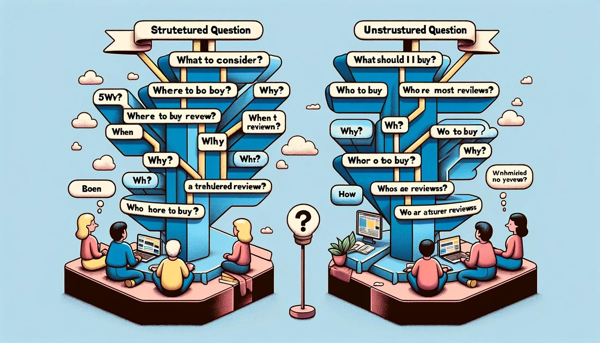
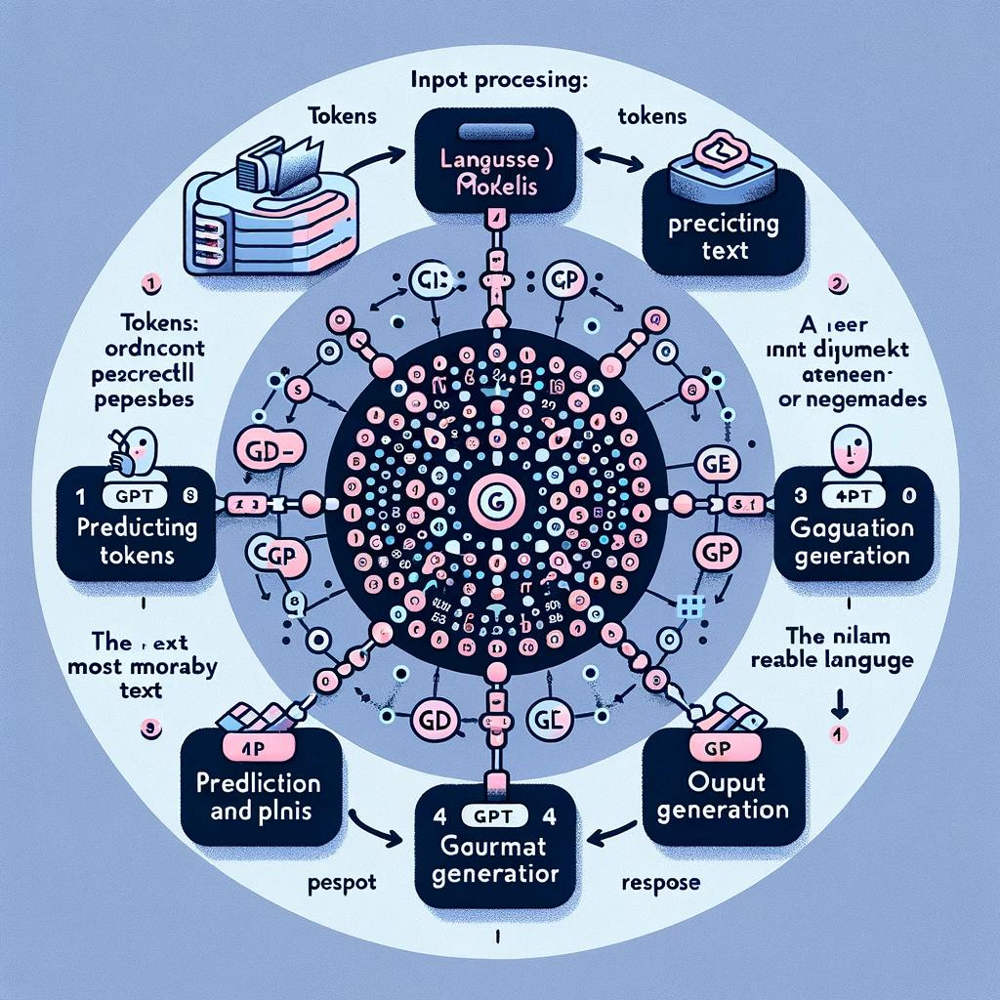
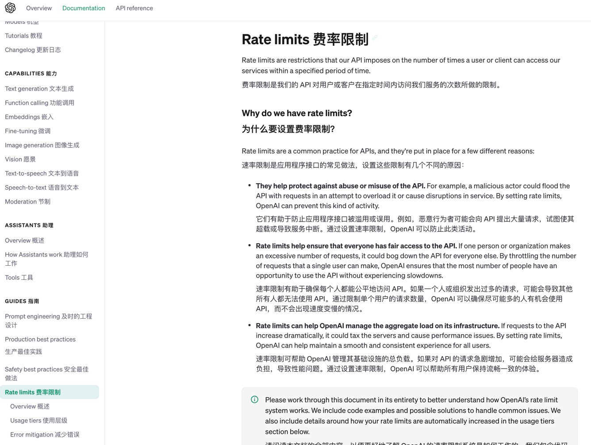

* content
{:toc}

先说结论：
* 真正高薪的不是Prompt，而是这个人本来就很牛
* 目前没有人能完全搞清楚ChatGPT执行的逻辑，意思就是说Prompt有效，但是框架是幻觉
* 所有试图让结果”完全可控“的想法都是徒劳的，不可控不稳定才是常态
* 追求Prompt的奇技淫巧，重要性远远低于行业知识的Kown How
* 追求它作为格式化编程语言的想法都会落空
* 使用框架，学习复杂Prompt的收益，并不会太高


从这个角度来看，我们要和GPT交互，首先是需要放下包袱，而传统的沟通技巧就能用上了：
* 我们的目标是什么
* 背景交代清楚
* 希望对方怎么想
* 希望对方做什么

作为一个产品，需要更好辅助我们完成工作，有个核实的门槛，目前的Prompt叫法，不得不说是打算把它往自然语言编程这个方向引导。并不玄乎，只是沟通技巧。


**给一个提示工程师30W，其中可能有25W给他的行业积累！！！**

<!-- more -->
# 1、关于提示词我们真正要关注的是这些

理解并有效运用基础考量的各个方面对于最大化利用大型语言模型（如GPT系列）至关重要。以下是更详细的阐述和具体案例：

## 1.1、 明确目标
目标明确的提问指的是清楚、具体地表达你想要从模型中得到的信息或答案。

### 正向案例：
- **明确提问**："请列出2023年最受欢迎的五款电动汽车及它们的主要特点。"
- **分析**：这个提问明确指出了信息需求（最受欢迎的电动汽车）和所需的详细信息（主要特点）。

### 负向案例：
- **模糊提问**："告诉我一些关于电动汽车的事情。"
- **分析**：这个问题太过宽泛，没有具体指出感兴趣的电动汽车方面，比如是市场趋势、技术规格、环境影响还是品牌比较。

让我们先从描绘“明确目标”的正向和负向案例开始。在这幅插图中，展示了两个场景：一个是提问者明确提出关于特定电动汽车的具体要求，另一个则是提问者模糊地询问关于电动汽车的信息。这将有助于视觉上展示明确与模糊目标的区别。

这幅插图展示了两个场景，以直观地说明提问时目标明确与目标模糊的差异：

1. **清晰目标**：图中的一位人物正提出一个具体的问题，询问2023年最受欢迎的五款电动汽车及其主要特点。这个问题非常明确，指明了所需的信息类型和细节。
2. **目标模糊**：另一位人物只是笼统地询问关于电动汽车的信息，没有提供具体细节。这个问题由于过于宽泛，导致提问者显得困惑。

此外，我们可以参考SMART（S=Specific、M=Measurable、A=Attainable、R=Relevant、T=Time-bound））原则来指定目标，让自己解决具体问题的时候，更加聚焦。

## 1.2、 结构化问题
结构化问题是指以一种有逻辑和条理的方式提出问题，这通常涉及使用特定的框架或格式。

### 正向案例：
- **使用5W1H框架提问**："当考虑购买新笔记本电脑时，我应该关注什么（What）、为什么（Why）、在哪里购买（Where）、何时购买（When）、谁是最可信的评测者（Who）、如何确保我选择最适合我的需求（How）？"
- **分析**：这个问题使用了5W1H框架，有条不紊地涵盖了购买决策的各个方面。

### 负向案例：
- **非结构化提问**："我想买笔记本电脑，怎么办？"
- **分析**：这个问题虽然明确了需求（购买笔记本电脑），但没有提供足够的方向来引导详细的答案。

用下图来展示结构化问题的正向和负向案例：一个使用5W1H框架明确地询问关于购买笔记本电脑的所有方面；另一个则是提出一个简单且缺乏结构的问题。这将帮助直观展示结构化与非结构化问题的区别。

这幅插图展示了两个场景，以直观地说明提问时使用结构化与非结构化问题的差异：

1. **结构化问题**：图中的一位人物使用5W1H框架来询问购买新笔记本电脑的所有方面，包括考虑什么、为什么、在哪里购买、何时购买、谁是最可信的评测者以及如何确保选择最适合其需求。这个问题通过明确的结构，全面而有条理地指导了信息的请求。
2. **非结构化问题**：另一位人物仅仅简单地提问关于购买笔记本电脑的事项，如“我想买笔记本电脑，怎么办？”这个问题缺乏明确的结构，导致提问者看起来不确定，问题也显得基础且无组织。

我们可以看到在提问时明确目标和结构化问题的重要性。这不仅有助于从大型语言模型中获取更准确、更相关的答案，也有助于提高交流的效率和效果。

当然，还有2个容易忽略的问题：上下文相关性和适度的详细度这两个概念，并通过具体案例来阐释它们的重要性。

## 1.3. 上下文相关性
上下文相关性指的是确保提问与想要的答案的主题紧密相关，并考虑到提问的背景和环境。

### 正向案例：
- **相关提问**："在当前的全球经济放缓背景下，投资黄金相比股票有哪些优势和风险？"
- **分析**：这个问题明确提出了一个与当前经济情况相关的具体投资话题，提问包含了明确的时代背景（全球经济放缓），使得回答更加具有针对性。

### 负向案例：
- **非相关提问**："告诉我一些投资的好主意。"
- **分析**：这个问题虽然提出了投资相关的询问，但没有考虑任何具体的时代背景或特定领域，使得回答可能不够针对性或相关性不足。

## 1.4. 适度的详细度
适度的详细度是指在提问时提供足够的信息来引导模型作出有用的回答，但同时也避免过度详细或冗余，以免引起混淆或偏离主题。

### 正向案例：
- **适度详细提问**："根据最新的科学研究，介绍一下人工智能对于气候变化研究和缓解方面的潜在贡献。"
- **分析**：这个问题提供了足够的细节（人工智能、气候变化、最新科学研究），同时避免了不必要的细节，保持了问题的焦点。

### 负向案例：
- **过度详细提问**："我听说人工智能可以在气候变化研究中起作用，比如模型模拟、数据分析、趋势预测等等，你能不能告诉我每一种方法的具体操作，包括所用的数据类型、算法、软件、历史案例、专家的意见等等？"
- **分析**：这个问题虽然具有针对性，但涉及过多细节，使得回答可能变得非常复杂，难以集中在最关键的信息上。

下图用来展示上下文相关性和适度的详细度在提问中的应用。这幅插图将包含四个场景：上下文相关和不相关的提问，以及适度详细和过度详细的提问，以便直观地展示这些概念的重要性。

这幅插图展示了四个场景，以直观地说明在提问时上下文相关性和适度的详细度的重要性：

* **上下文相关的问题**：图中的一位人物提出了一个关于在当前全球经济放缓背景下，比较黄金与股票投资的优势和风险的相关问题。这个问题考虑到了特定的经济背景，使得回答更加具有针对性。
* **上下文不相关的问题**：另一位人物提出了一个模糊的、缺乏特定上下文的投资相关问题，这使得问题缺乏明确的方向，难以给出具体的答案。
* **适度详细的问题**：第三个场景展示了一个关于人工智能在气候变化研究和缓解方面潜在贡献的问题，这个问题提供了足够的细节，同时避免了不必要的复杂性。
* **过度详细的问题**：最后一个场景展示了一个关于人工智能在气候变化研究中应用的过度详细问题，包括每一种方法的具体操作、数据类型、算法等。这种过度的详细使得问题变得复杂且难以回答。

我们可以看到在提问时考虑上下文相关性和适度详细度的重要性。这些要素有助于确保从大型语言模型中得到更准确、更相关的答案，并且提高了交流的效率。

# 2、我们为什么要用提示词

## 2.1、 基础原理
基于GPT（生成式预训练变换器）模型，这是一种大型的深度学习模型，专门设计用于理解和生成自然语言。它的工作原理基于以下几个关键步骤：

1. **输入处理**：当输入一个问题时，系统首先将你的文字转换为一系列数字（称为“token”），因为计算机只能理解数字。

2. **模型处理**：这些数字被送入神经网络。这个网络由数十亿个参数组成，它们在训练过程中学习了大量文本数据的语言模式。

3. **预测与生成**：基于这些参数，模型预测接下来最可能的单词或短语，并生成回应。

4. **输出生成**：生成的文本再转换回人类可读的语言，作为回答呈现给你。

## 2.2、 图解和代码片段


```python

# 示例代码：文本转换为Token
# 这个代码片段展示了如何将文本转换为模型能理解的数字形式（Token）
# 请注意，这只是一个简化的示例，实际的GPT模型使用更复杂的方法

# 引入一个简单的NLP库进行Tokenization
from transformers import GPT2Tokenizer

# 初始化一个tokenizer
tokenizer = GPT2Tokenizer.from_pretrained('gpt2')

# 示例文本
text = "Hello, how are you?"

# 将文本转换为token
tokens = tokenizer.encode(text)

print("原始文本:", text)
print("转换后的Token:", tokens)


```

它展示如何将文本转换为token，这是理解我的工作方式的一个关键步骤。请注意，这个代码片段只是为了演示目的，它并不代表我内部的实际工作机制，因为我的整个模型非常复杂，无法用一个简单的代码片段来完全展示。

看来在当前的环境中无法运行使用`transformers`库的代码示例。不过，我可以解释这个过程。

### 文本转换为Token的过程
1. **引入库**：首先，我们需要引入一个处理自然语言的库，如`transformers`。

2. **初始化Tokenizer**：然后，我们使用该库中的`GPT2Tokenizer`来初始化一个tokenizer。

3. **编码文本**：我们将一段文本（如"Hello, how are you?"）传递给tokenizer。Tokenizer会将这段文本分解成更小的单位，称为tokens。

4. **转换为数字**：每个token会被转换为一个唯一的数字ID。这些数字代表了模型训练过程中学到的词汇表中的词或字符。

5. **模型处理**：这些数字ID随后被送入GPT模型进行处理，模型根据这些数字来生成回应。

虽然无法直接演示代码，但希望这个解释能帮助你理解将文本转换为模型可以理解的token的过程。

从上面这段内容我们大概可以了解到

# 3、局限性和技巧思考

## 3.1、上下文局限性

**复杂问题不期望一次搞定**，一方面是我们需要分解目标，细化任务，在不断沟通中找到适合我们自己的解决方案。也让GPT更聚焦在比较明确的目标上。更重要的是，我们和GPT的交流目前是局限在对话框中的，也就是说它有记忆上限。



简单说，如果我们发的文字很长，它就噶了。

这个其实也很好理解，GPT有自己的知识体系，我们有现实的问题，可以理解为，它在单独为我们的对话开辟了一个空间，而这个空间是有成本的。一方面是现在的架构带来的，另外也有硬件的局限性，以及满足全球多数人的并发。

目前的GPT Plus有3个小时，40个回合的限制，为了解决这个问题，倒逼我们一次提问尽量能完整精准一些。

这里插播一个关于任务分解的内容，我们知道它有这个局限性，这样就造成写长篇小说有了现实的限制。但是我们是可以通过分解来实现这个目标的。让它先出大纲，然后分别结合大纲来写里面的内容。这样就很大程度上改善了这个局限性。

## 3.2、上下文学习

参考上一篇帖子最后部分，就是我给样例，它来学习，我们让它小步尝试，如果结果ok，再给它完整任务。

## 3.3、思考链（CoT,Chain of Thought）

```
让我们一步一步思考。
```
或者
```
Let's Think step by step
```
这样就激发了GPT的思考模式，将思考过程分解成一系列的逻辑步骤。用一连串的思考步骤来引导模型到达正确的答案。

### 适用场景和问题
CoT适用于那些需要多步逻辑推理的复杂问题。这包括数学问题、编程问题、复杂的决策问题等。它特别适用于那些单步答案无法直接得出的情况。

### 具体案例
假设你要解决一个数学问题：“一个班级有25名学生，男生比女生多5人。班级中有多少男生和女生？”

#### 通常使用步骤
1. **定义问题**：首先，明确问题的要求和已知信息。
2. **分解步骤**：接下来，将问题分解为更小的逻辑步骤。例如，先确定两组的总人数，然后根据性别比例分配。
3. **逐步解决**：按顺序处理每个步骤，逐步构建解决方案。
4. **合成答案**：将所有步骤的结果组合起来，形成最终答案。

### CoT的原理和为什么它有效
CoT的有效性在于它模拟了人类解决问题的方式，即通过分解问题、逐步解决并最终合成答案。这种方法有助于明确思路，避免混淆，并保证在解决复杂问题时不遗漏任何关键步骤。

下图展示CoT在解决上述数学问题中的应用。这幅图将分步展示如何使用CoT解决“班级中男生和女生各有多少人”的问题。


这幅插图展示了如何使用Chain of Thought（CoT）方法解决一个数学问题：“一个班级有25名学生，男生比女生多5人。班级中有多少男生和女生？”插图中的步骤包括：

1. **定义问题**：识别学生的总人数和男女生人数差。
2. **分解步骤**：将问题分解成更小的逻辑步骤，例如先确定总人数，然后根据性别比例分配。
3. **逐步解决**：通过图示展现逐步处理每个步骤的过程。
4. **合成答案**：展示所有步骤的汇总，导致最终答案。

通过这种方法，我们可以逐步解决复杂问题，确保在解决过程中不遗漏任何关键步骤。CoT模拟了人类解决问题的自然思维过程，通过逐步逻辑推理来找到答案，这是它有效的主要原因。


## 3.4、幻觉

简单说就是一本正经胡说八道，目前的一些做法是在提问的时候限制它，不知道的就说不知道。

## 3.5、i人神器
作为i人，很容易被所谓提问的技巧给拍死，久而久之，就不敢提问了，GPT给了广大i人一个非常好的渠道。它也不会评判我们提问技巧，也不说我们这不好，那不好的。大不了多问几次。

其实我们i人并不是不懂礼貌，只是不太擅长随大流。有了它，再也不怕了。基础的问题，往往蕴含着这个行业的大道理。

另外如果对答案不确定，可以让它重新生成，重新生成的答案它有个箭头来回切换。

# 4、一些思考

* 从应用者的角度来看，我们客观对待就显得尤为重要。为我所用固然很好，不能也不用太过于在意。
* 提示词应该是一个中间阶段。企业中对于稳定性和确定性的追求，并不是一个玩具可以轻易搞定的。
* 提示词技巧都有阶段性和时效性，对于普通人来说，不用花费时间在它身上。
* 往往对于吃螃蟹的人来说，这是非常炫酷的，但是实际上通常它只解决了一类需求，而一个长长的提示词还有问题
* 大部分人所谓技巧的追求和三体中的火鸡科学家没有太大区别。
* 要不要使用提示词框架，和我们平常能用Excel解决的事，没有单独编程写个系统出来。写出来不难，升级维护是大问题。

