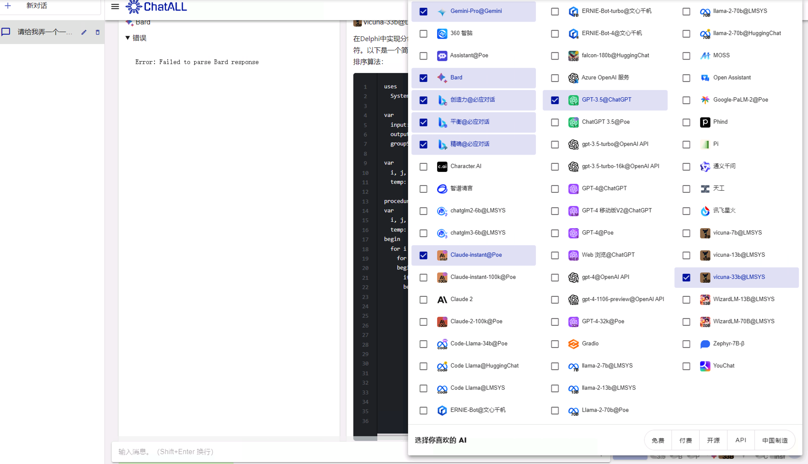
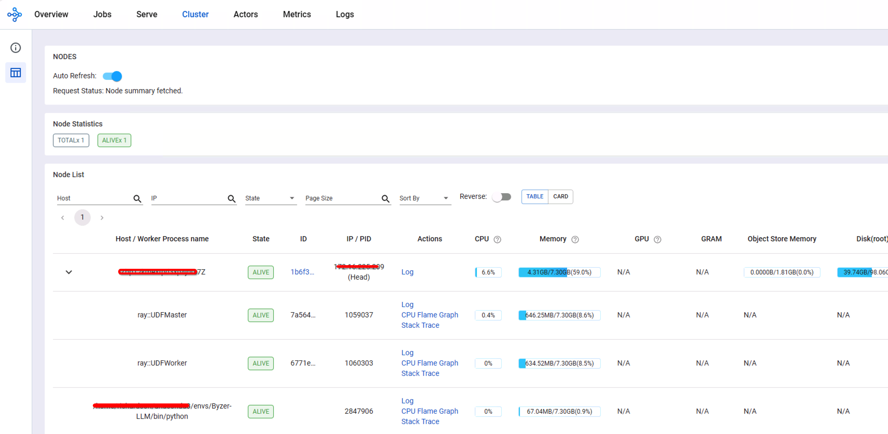
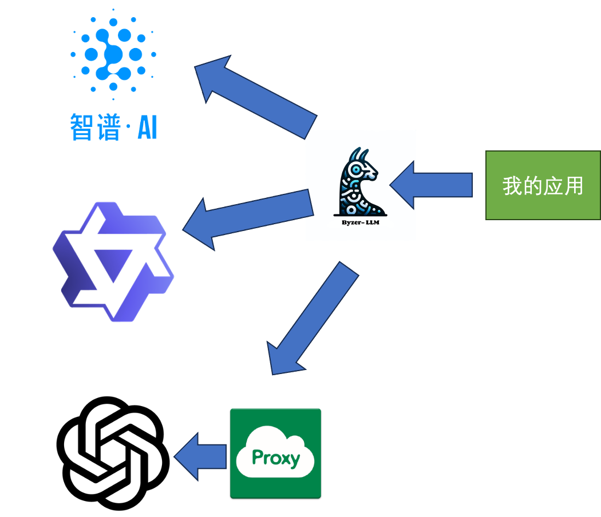
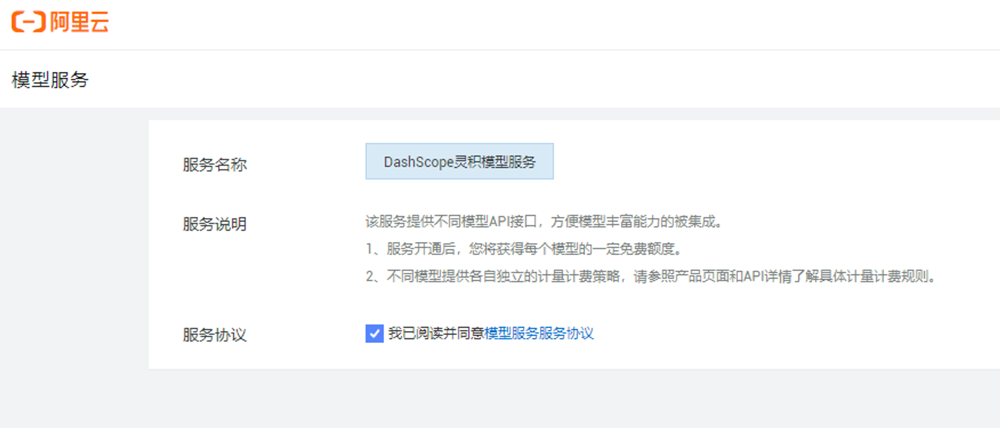
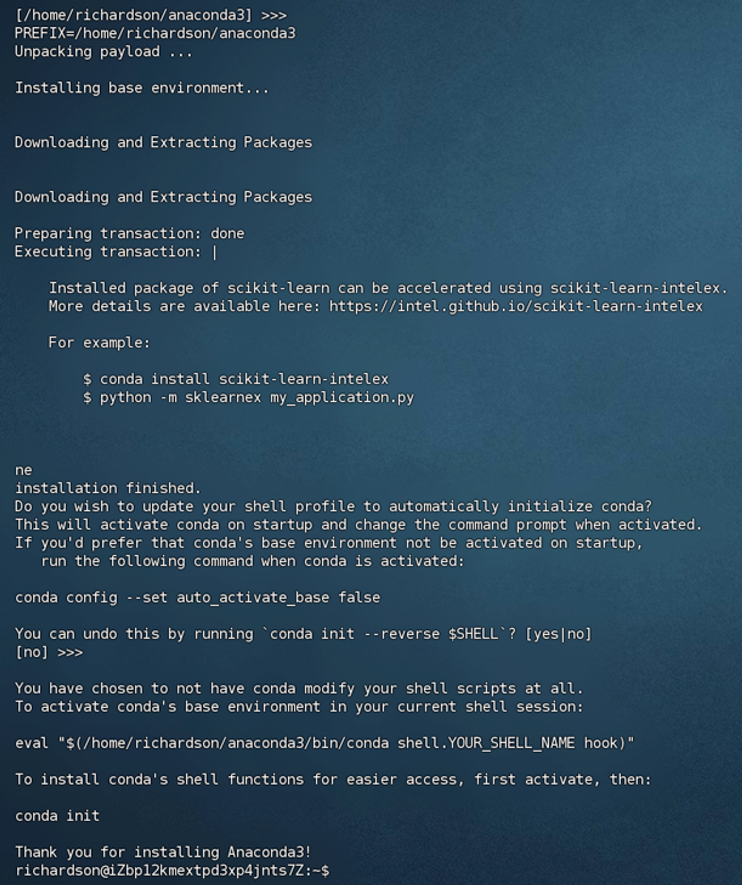

* content
{:toc}

不知道有多少人像我一样，需要使用多个模型，并不是因为研究需要，而是我使用的编程语言太古早。尝试过2个开源项目，但是都没有完全用起来：

* **[ChatAll](https://github.com/sunner/ChatALL)** 这是一个跨平台的客户端程序，可以同时给多个大模型发送指令，一起返回，对于大模型调试的人应该是很有用的，这些大模型是需要使用我们自己的Key的，这个好理解吧。就是它是一个工具来提供界面，来集成，所以工具免费就好理解了。


* **[ChatHub](https://github.com/chathub-dev/chathub)** 这是一个Chrome插件，ChatAll借鉴了它的思路。默认2个一起免费，超过2个就要钱了，没找到录入帐号的地方，可以理解为它帮我出钱了。


* **[Byzer-llm](https://github.com/allwefantasy/byzer-llm)** 需要在自己的系统里面集成各个大模型工具，原因是有时候OpenAI的接口账单来不及支付，或者原来的卡用不了，所以想找方案能快速集成。于是找到了这个，部署有点门槛，最后我会放一个简单的封装代码。



<!-- more -->
# 1、部署目标

* 能集成openai、智谱和通义千问
    * 因为智谱最近送token几个月。我的业务只需要文案生成，所以不一定非要openai。
* 所有的key都在外部维护不在它的平台上存放，它只是中转
* 自动启动

我的情况是对Python部署，对Linux不熟悉，整个过程持续了接近4天，其中还有一天通宵了，所以，如果你的水平和我差不多，看完应该能减少一些摸索的时间。



# 1、环境准备
公司阿里云上有2太机器，一台windows，一台Debian，尝试在Windows上部署，结果失败了，和作者沟通后发现只在mac和linux测试过，那就算了。

> 智谱的key现在有免费送的活动，大概是3个月有效期，通问的申请位置不太好找，在阿里云上，这名字也是有个性的。openai的代理用cf的worker。



## 1.1、安装python环境

``` bash
wget https://repo.anaconda.com/archive/Anaconda3-2023.09-0-Linux-x86_64.sh
chmod +x Anaconda3-2023.09-0-Linux-x86_64.sh
./Anaconda3-2023.09-0-Linux-x86_64.sh
```

> 这里有个小坑,最后按 ESC 键才能继续



因为我是非root环境启动的，习惯安装应用到opt目录，所以需要给richardson用户权限

```bash
切换到root用户
mkdir /opt/condaproj
chown richardson:richardson /opt/condaproj
```

## 1.2、创建虚拟环境

``` bash
回到richardson身份
cd /opt/condaproj/
~/anaconda3/bin/conda create --name Byzer-LLM python=3.10.11 anaconda
```

## 1.3、开始安装byzer-llm

激活环境

```bash
# 进入环境
. ~/anaconda3/bin/activate Byzer-LLM
git clone https://hub.fgit.cf/allwefantasy/byzer-llm.git
cd byzer-llm
pip install -r requirements.txt -i https://mirrors.aliyun.com/pypi/simple/
# pip install -U vllm   如果不用本地gpu，不弄也可以
pip install -U byzerllm -i https://mirrors.aliyun.com/pypi/simple/
ray start --head
```
> 注意，这里用的不是github的环境，而是用了一个第三方的，有可能会失效，我尝试了大概5，6个才搞定，主要是不太会用git…… 

> 这里的所谓gpu是指本地部署大模型，本地跑，我的需求是用openai这样的大模型，在byzer里面就是被称之为saas。

> 这里ray启动的时候，默认绑定在127.0.0.1，也就是说，如果这个linux没有图形化界面，外面是无法访问8265端口的。解决办法看下面的。

> 这里看起来云淡风轻的，其实花费了我很长时间，因为要安装很多依赖，而且还很大，个人推荐的做法是安装screen。简单理解就是远程桌面，一直在跑着的，我们和它的会话断开，它其实还在跑，避免跑一半死了。

```bash
sudo apt install screen -y
screen
```

直接回车就好了，就会新起一个会话，查看列表和恢复命令如下
```bash
screen -ls
screen -r xxxxx
```

# 2、启动服务

``` bash
ray start --head  --dashboard-host=172.16.225.209
```

这里的ip是ecs的内网地址，目的也是安全性考虑，默认是127.0.0.1，我只是换个地址，因为还有另外的windows机器可以看，如果是nginx或者candy反代也很方便。

# 3、我的集成

我的需求是通过byzer来和这些大模型对接，原有的应用通过http请求，但是不再关注它的实现细节，为了更加解耦，这些大模型的key是外部传入的，而byzer提供了一个deploy的机制，所以其实只要开始的时候初始化好，后面就不用带参数了。

文件结构大概是
- app.py
- llm_zhipu.py
- llm_openai.py
- llm_tongwen.py
- ……

通过app来调度，整体结构就清爽了。后面的模型随时可以加。

> 一个坑，这里的文件名不要和系统的名词重合，一开始做了一个openai.py,结果，排查了一天，文件名改成 llm_openai.py ，好了，这玩意咋说呢！！！

## 3.1、app.py

``` python
from flask import Flask, request, jsonify
from llm_zhipu import zhipu_app
from llm_openai import openai_app
from llm_tongwen import tongwen_app

app = Flask(__name__)

app.register_blueprint(zhipu_app)
app.register_blueprint(openai_app)
app.register_blueprint(tongwen_app)
print(app.blueprints)
if __name__ == '__main__':
        app.run(host='0.0.0.0',port=8099)
```

## 3.2、llm_openai.py
```python
import ray
from byzerllm.utils.client import ByzerLLM
from flask import request, jsonify,Blueprint

openai_app = Blueprint('openai', __name__) 

ray.init(address="auto",namespace="default",ignore_reinit_error=True)  

llm = ByzerLLM(verbose=True)

@openai_app.route('/openai/deploy', methods=['POST'])
def openai_deploy():
    data = request.get_json()
    api_key = data.get('api_key')
    model_name = data.get('model_name')
    model_type = data.get('model_type')
    chat_name = data.get('chat_name')
    http_proxy = data.get('http_proxy')
    workers = data.get('workers')

    llm.setup_num_workers(workers).setup_gpus_per_worker(0)
    
    llm.deploy(model_path="",
               pretrained_model_type=model_type,  
               udf_name=chat_name,
               infer_params={
                  "saas.api_key": api_key,
                  "saas.model": model_name,
                  "saas.base_url": http_proxy,
               })
    return jsonify({"ret": "ok"})

@openai_app.route('/openai/chat', methods=['POST'])
def openai_chat():
    print("Receiving openai chat request...")
    data = request.get_json()
    
    content = data.get('content')
    chat_name = data.get('chat_name')

    v = llm.chat_oai(model=chat_name,conversations=[{
	    "role":"user",
	    "content":content,
	}])
    results = v[0].output
                
    return jsonify(results)

```

> 我用的proxy好像没那么复杂，设置base_url就可以了，openai官方的示例里面有个proxies的设置，有点复杂了

## 3.3、llm_zhipu.py
```python
import ray
from byzerllm.utils.client import ByzerLLM
from flask import request, jsonify,Blueprint

zhipu_app = Blueprint('zhipu', __name__) 

ray.init(address="auto",namespace="default",ignore_reinit_error=True)  

llm = ByzerLLM(verbose=True)

@zhipu_app.route('/zhipu/deploy', methods=['POST'])
def zhipu_deploy():
    data = request.get_json()
    
    api_key = data.get('api_key')
    model_name = data.get('model_name')
    chat_name = data.get('chat_name')
    model_type = data.get('model_type')
    workers = data.get('workers')

    llm.setup_num_workers(workers).setup_gpus_per_worker(0)

    llm.deploy(model_path="",
               pretrained_model_type=model_type,  
               udf_name=chat_name,
               infer_params={
                  "saas.api_key": api_key,
                  "saas.model": model_name  
               })
    return jsonify({"ret": "ok"})

@zhipu_app.route('/zhipu/chat', methods=['POST'])
def zhipu_chat():
    print("Receiving zhipu chat request...")
    data = request.get_json()
    
    content = data.get('content')
    chat_name = data.get('chat_name')

    v = llm.chat_oai(model=chat_name,conversations=[{
	    "role":"user",
	    "content":content,
	}])
    results = v[0].output

    return jsonify(results)


```

## 3.4、启动

``` python
python app.py
```

### 测试脚本
* 部署

```bash
curl -X POST -H "Content-Type: application/json" -d '{
    "api_key": "9d3c9fxxxxxxx",
    "chat_name": "zhipu_chat", 
    "model_name": "glm-4",
    "model_type": "saas/zhipu",
	"workers": 4
}' http://127.0.0.1:8099/zhipu/deploy

```

* 会话
```bash
curl -X POST -H "Content-Type: application/json" -d '{
    "chat_name": "zhipu_chat", 
	"content": "你好，你是谁"
}' http://127.0.0.1:8099/zhipu/chat
```

``` bash
2024-01-19 11:09:29,479 INFO worker.py:1489 -- Connecting to existing Ray cluster at address: 172.16.225.209:6379...
2024-01-19 11:09:29,488 INFO worker.py:1664 -- Connected to Ray cluster. View the dashboard at 127.0.0.1:8265 
Send to model[zhipu_chat]:['{"instruction": "", "meta": true}']
Send to model[zhipu_chat]:['{"instruction": "你好，你是谁", "history": []}']
(UDFWorker pid=3677479) MODEL[zhipu_chat] Init Model,It may take a while.
(UDFWorker pid=3677479) MODEL[zhipu_chat] Successful to init model, time taken:0.025364160537719727s
(UDFWorker pid=3677479) MODEL[zhipu_chat] Init Model,It may take a while.
(UDFWorker pid=3677479) MODEL[zhipu_chat] Successful to init model, time taken:0.025364160537719727s
你好，我是一个人工智能助手，很高兴为您提供帮助。请问有什么问题我可以解答或者协助您解决吗？
```

## 3.5、正常部署

因为没搞定uwsgi，换了unicon先顶着用

``` bash
conda install gunicorn
gunicorn -w 4 -b 0.0.0.0:8099 app:app 
```

# 5、失败记录

* 安装依赖的时候花了很长时间，很多包是弄一半死了，即使screen也有这个情况，就重复执行命令吧
* uwsgi安装失败了，作者的建议是另外弄个conda环境，采用pip安装uwsgi
    * 但是那个新环境也需要ray㩐包，弄了 `pip install ray,pyjava, byzerllm`发现不行
    * 还要搞点别的包，放弃了

下面是失败记录
``` bash
pip install uwsgi
```
卡在最后编译环境，提示 libpython.3.10.a 文件不存在

``` bash
conda install uwsgi
```
可以安装，但是如果和Byzer-LLM一样的conda环境会提示
下面是网上找的一样的错误  https://discuss.ray.io/t/runtimeerror-version-mismatch-when-using-conda/13191
``` bash
RuntimeError: Version mismatch: The cluster was started with:
    Ray: 2.8.0
    Python: 3.10.8
This process on node 10.42.0.23 was started with:
    Ray: 2.8.0
    Python: 3.10.13
```

总之是没搞定

``` ini
[uwsgi]

# 外部访问地址
http-socket = 0.0.0.0:8099
base=/opt/condaproj/llm_adapter
chdir=/opt/condaproj/llm_adapter
pidfile = ./uwsgi.pid
wsgi-file = app.py
#plugin=python3
master = true
processes = 4
threads = 2
# flask项目创建的application
callable = app
py-autoreload = 1
enable-threads = true
# 日志文件
logto = /var/log/llm/%n.log
# 清理环境
vacuum = true
# 退出时中断(kill)所有进程,确保不留进程存活
die-on-term = true
```


# 5、后续计划
byzer看起来相当牛掰，好好搞下