* content
{:toc}

本意只是为了利用现有的Linux服务器，加上现在的服务器配置比较低，是一个2003的Windows，于是尝试一下改造老系统。
基本上是
* 准备开发调试环境
* Linux系统升级
* 设置Linux下的库引用
* 自动运行


<!-- more -->

# 1.Linux 环境准备
因为在Windows上已经集成了Ubunte，直接启动就好了。

> 这里有个小技巧，如果忘记密码，可以用PowerShell重置。

打开PowerShell，输入
``` bash
wsl -u root
```
登录上以后，用命令重置
``` bash
passwd xxxxx
```
这样就能重新sudo了。
然后拷贝文件到Linux里面，内置的Linux应该是已经mount了各个盘，在  **/mnt** 下可以找到。
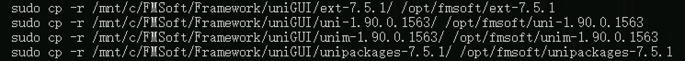
``` bash

  mkdir /opt/fmsoft
  sudo cp -r /mnt/c/FMSoft/Framework/uniGUI/ext-7.5.1/ /opt/fmsoft/ext-7.5.1
  sudo cp -r /mnt/c/FMSoft/Framework/uniGUI/uni-1.90.0.1563/ /opt/fmsoft/uni-1.90.0.1563
  sudo cp -r /mnt/c/FMSoft/Framework/uniGUI/unim-1.90.0.1563/ /opt/fmsoft/unim-1.90.0.1563
  sudo cp -r /mnt/c/FMSoft/Framework/uniGUI/unipackages-7.5.1/ /opt/fmsoft/unipackages-7.5.1
```
这几个是主要需要放的文件。接下来还要弄个PAServer。

> 我想，这里也是要告诉我们，说明真正部署也就拷贝这么些东西而已。

# 2.建立编译环境
我们可以理解为它是Delphi的编译环境和Linux的桥梁，简单可以理解为就是一个scp之类的命令加点别的啥。
> 这个玩意看文档的意思，Mac也是靠它的。
它的下载地址，在帮助文件里面有，我们直接下载就可以了。
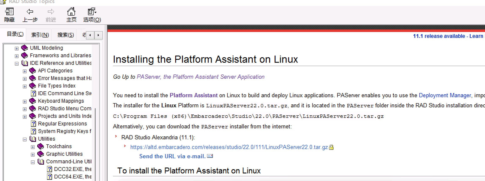
``` bash
cd /opt/fmsoft
sudo wget https://altd.embarcadero.com/releases/studio/22.0/111/LinuxPAServer22.0.
tar.gz
tar -zxvf LinuxPAServer22.0.tar.gz
cd LinuxPAServer22.0
./passerver
```
这个时候会要求输入一个密码，就是Delphi连它的时候的密码，随便输入一个123456也行。
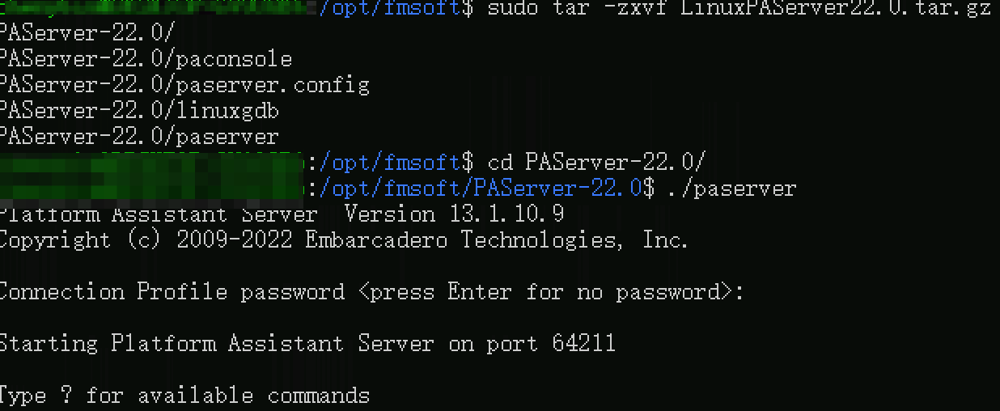

回到Delphi，随便建个工程，编译为Linux程序。第一次编译会提示需要环境，需要一个Profile
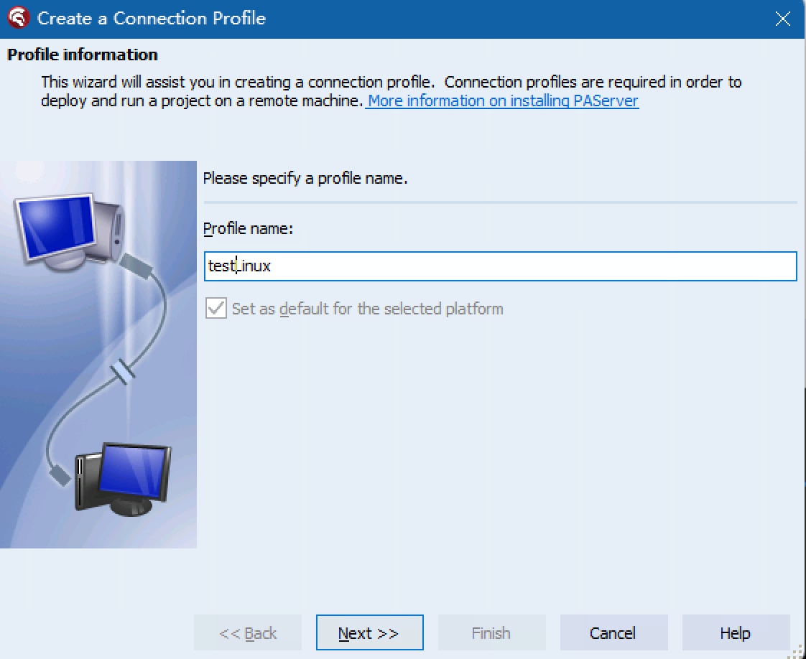
下一步
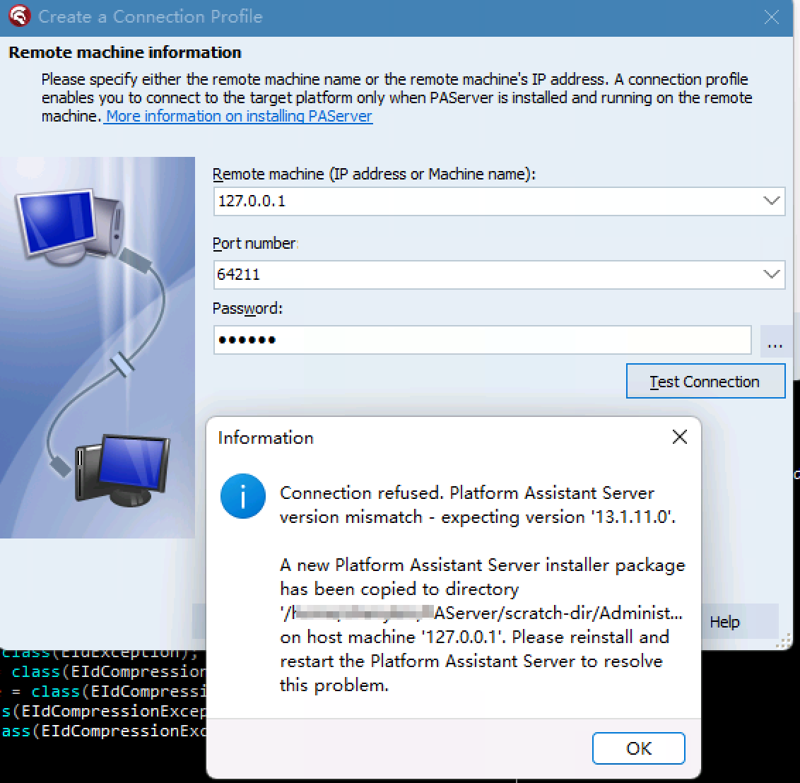

这个错误的意思，应该是说版本没对上，看样子得回去找找安装路径下的PAServer了。
和上面差不多的步骤，但是拷贝的时候，Program Files（X86），这里的文件夹在linux空格处理不太会，所以把文件拷贝出来到根目录了。
其他步骤和上面是一样的。
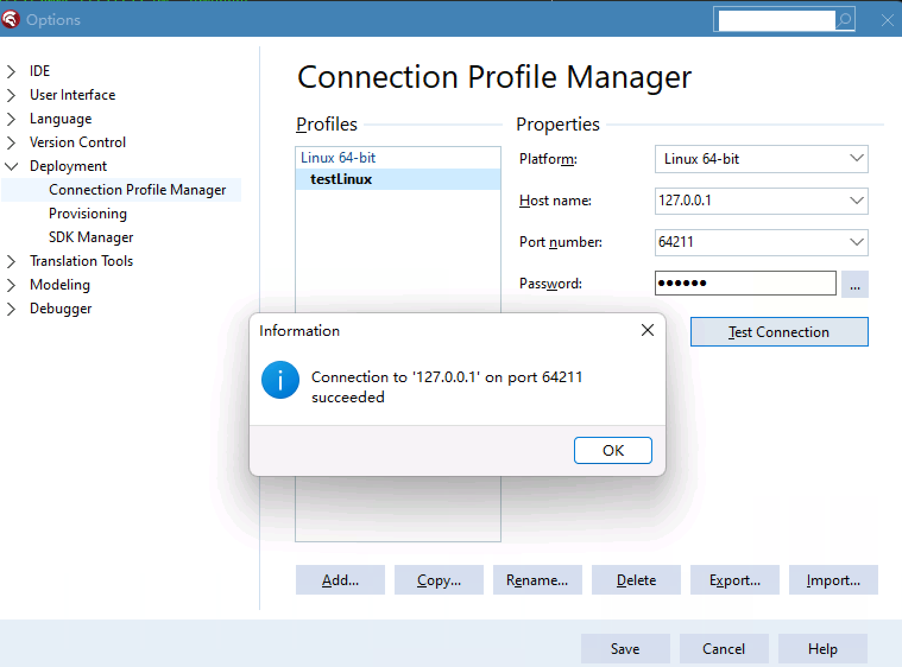

再次编译
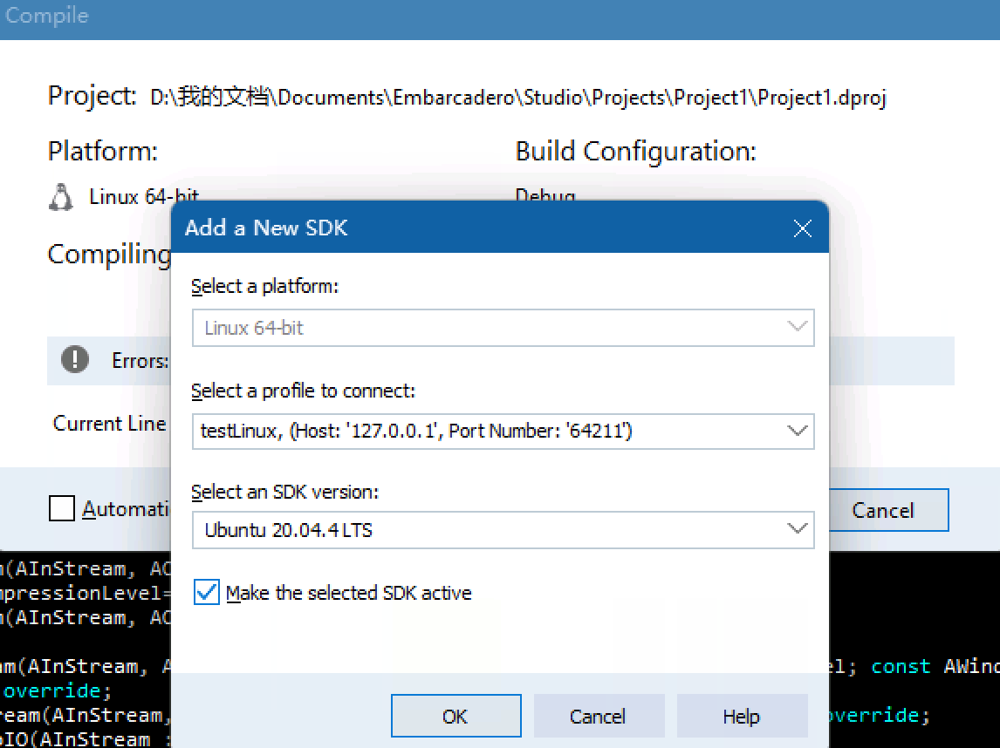
> 这个步骤就是上传一些运行要用的包，手动操作在Tools-Options-Deployments-SDK Manger，update local files cache，效果是一样的。

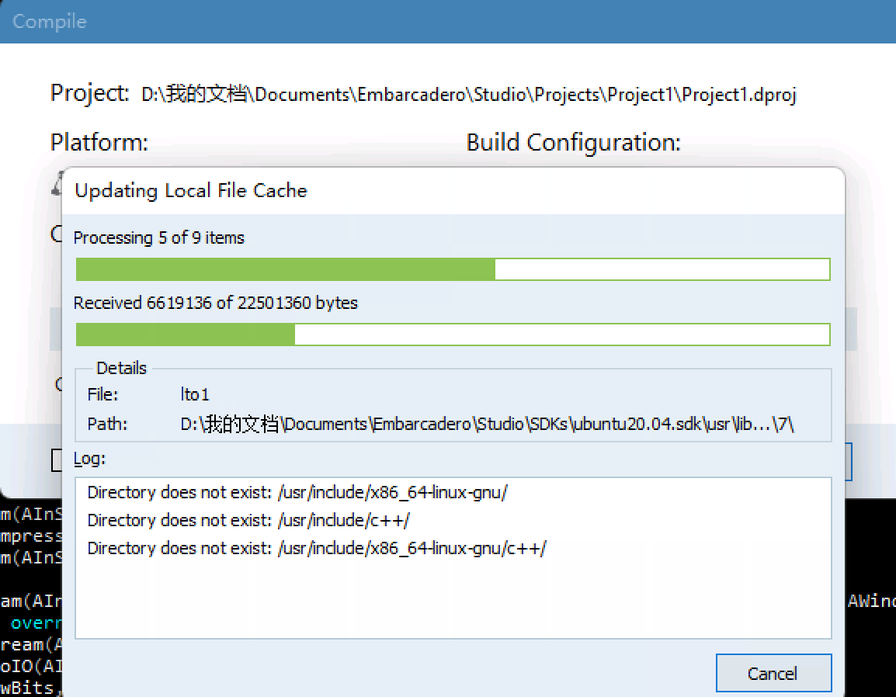
最后会有个提示信息
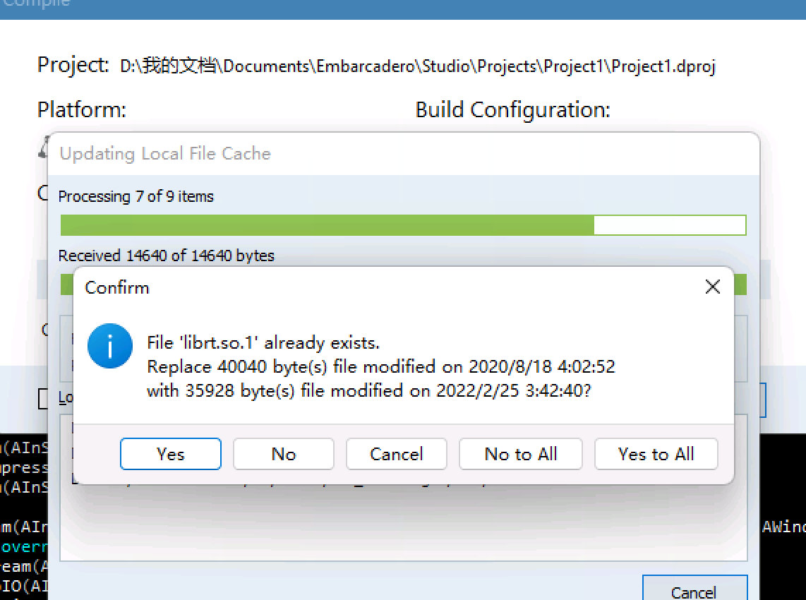


# 3.开始Linux编译
随便建个工程，编译马上出状况了。
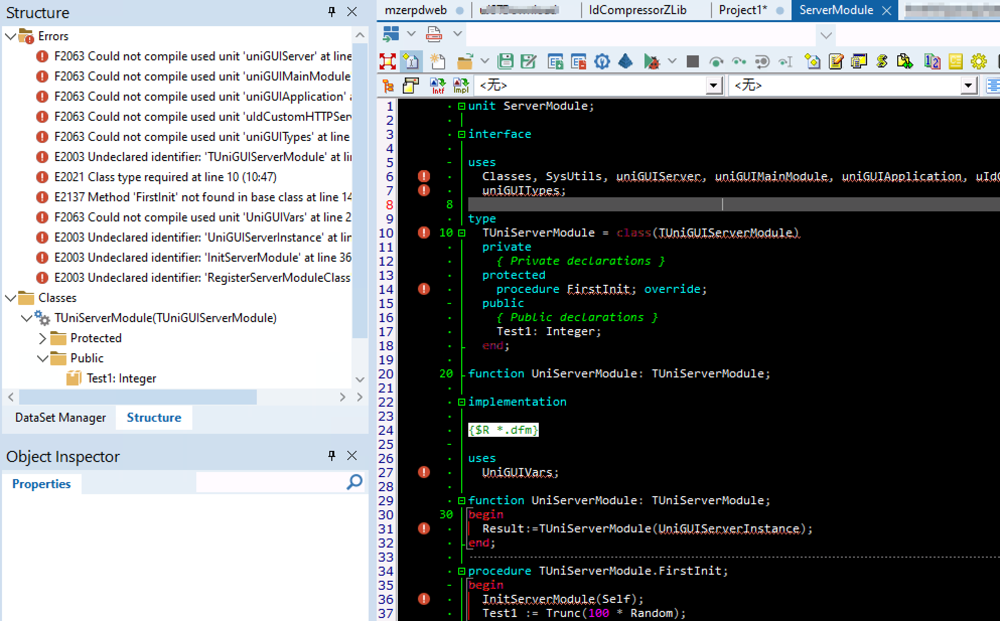
其实这里还比较容易解决，只是因为没有引用而已，加上引用就可以了。
菜单Tools-options
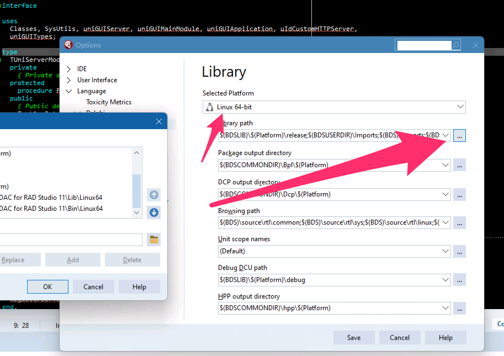

```
$(fmsoft)\uniGUI
$(fmsoft)\uniGUI\uIndy
$(fmsoft)\uniGUI\Source\Core
$(fmsoft)\uniGUI\Source\VCL
$(fmsoft)\uniGUI\Source\Components
$(fmsoft)\uniGUI\Source\Design
$(fmsoft)\uniGUI\Source\Res
$(fmsoft)\uniGUI\uSynEdit\Source
$(fmsoft)\uniGUI\Dcu64\Delphi2024

$(fmsoft)\uniTools
$(fmsoft)\uniTools\Dcu64\Delphi2024
```

出现新状况，发现最基本的 ServerModule编译不过了，因为它要引用 uniGUIServer单元，它有引用了Windows和Messages单元，不可能去改这个文件的吧。网上找了一圈又没找到合适的答案，奇怪了。

原来是这俩没加上，换掉原来的那俩，还是11个，如果不去掉，会遇到 strUniStrUtil之类的错误。
```
$(fmsoft)\uniTools\Dcu64\Delphi2024\Linux64
$(fmsoft)\uniGUI\Dcu64\Delphi2024\Linux64
```
最终结果如下
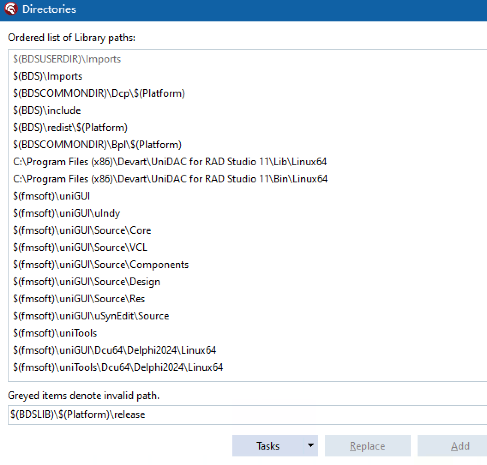

>连接失败了

```
[DCC Error] E2597 C:\Program Files (x86)\Embarcadero\Studio\22.0\bin\ld-linux.exe: error: cannot find -lc
  C:\Program Files (x86)\Embarcadero\Studio\22.0\bin\ld-linux.exe: error: cannot find -ldl
  ...... 太多了，就不贴出来了
[DCC Fatal Error] F2588 Linker error code: 1 ($00000001)
````

# 4.看样子是linux的问题

官网的说法需要升级Ubuntu。
https://docwiki.embarcadero.com/RADStudio/Sydney/en/Linux_Application_Development

``` bash
sudo apt update && sudo apt upgrade && sudo apt dist-upgrade
sudo apt install joe wget p7zip-full curl openssh-server build-essential zlib1g-dev libcurl4-gnutls-dev libncurses5
```
结果是
``` bash
Hit:1 https://mirrors.tuna.tsinghua.edu.cn/ubuntu bionic InRelease
Hit:2 https://mirrors.tuna.tsinghua.edu.cn/ubuntu bionic-updates InRelease
Hit:3 https://mirrors.tuna.tsinghua.edu.cn/ubuntu bionic-backports InRelease
Hit:4 https://mirrors.tuna.tsinghua.edu.cn/ubuntu bionic-security InRelease
Reading package lists... Done
Building dependency tree
Reading state information... Done
12 packages can be upgraded. Run 'apt list --upgradable' to see them.
Reading package lists... Done
Building dependency tree
Reading state information... Done
Calculating upgrade... Done
Some packages could not be installed. This may mean that you have
requested an impossible situation or if you are using the unstable
distribution that some required packages have not yet been created
or been moved out of Incoming.
The following information may help to resolve the situation:

The following packages have unmet dependencies:
 dpkg : Breaks: libapt-pkg5.0 (< 1.7~b) but 1.6.14 is to be installed
E: Broken packages
```
这个过程会比较麻烦一点，原来用的是清华的源，看样子可能改成其他的源也许可以，尝试换阿里云的源。

> 换好了源以后，确实可以直接执行上面的命令了。

另外需要重新update一下local cache到Linux上去。
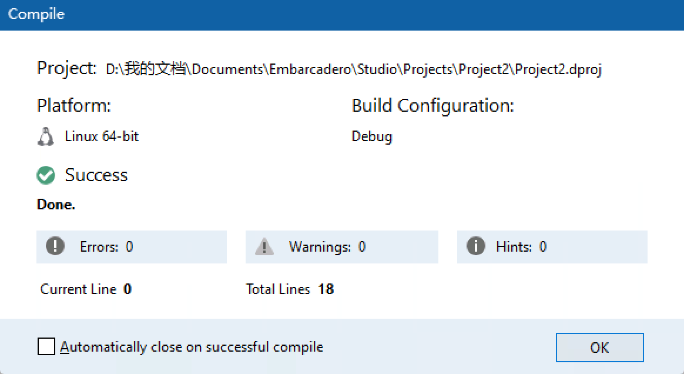
再次运行，然后打开网页

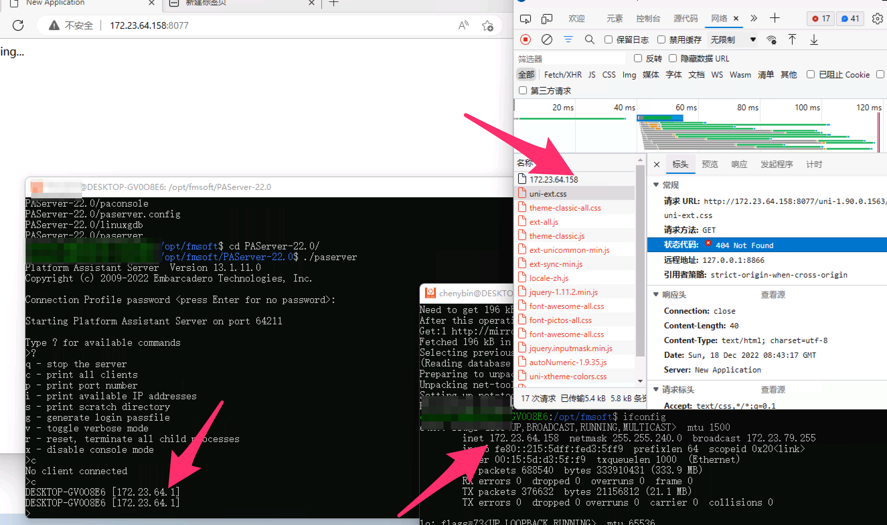

说明文件资源没有对应上，这个需要我们在ServerModule里面指定路径。

``` pascal
procedure TUniServerModule.UniGUIServerModuleBeforeInit(Sender: TObject);
begin
    {$IFDEF  linux64}
    FrameworkFilesRoot := '/opt/fmsoft';
    {$ENDIF}
end;
```


>有人说是librtlhelper_PIC.a这个文件没有被引用到。看起来也是的，但是确实挺麻烦的。因为有个很重要的问题，它是分Debug和Release的，就意味着不能在Tools-Options哪里，也就是Library那里加，但是在Project里面加也没有起效果，可能方法不对，也可能是其他原因。


# 5.Linux开发常见问题汇总

### 编译好的文件在哪里
通过find命令我们可以知道，编译好的文件在home文件夹下面。
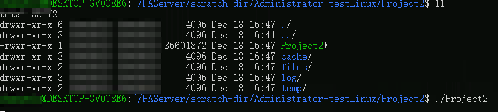
也就是说，我们平常在Debug文件夹下的文件，它在
/home/xxxx/xxxx-profile/项目名/ 下面。里面有files之类的。
如果我们有自己单独弄的文件，可能还是需要手工拷贝上去。
另外看起来它没有区分Debug和Release，所以要区分的话，可能只有通过再弄一个profile这样的方式了。
也许有更好的方式，也欢迎留言告诉我。

### 怎么样让它自动运行，自动重启
自动重启是因为

# 6.通过Jenkins自动化部署