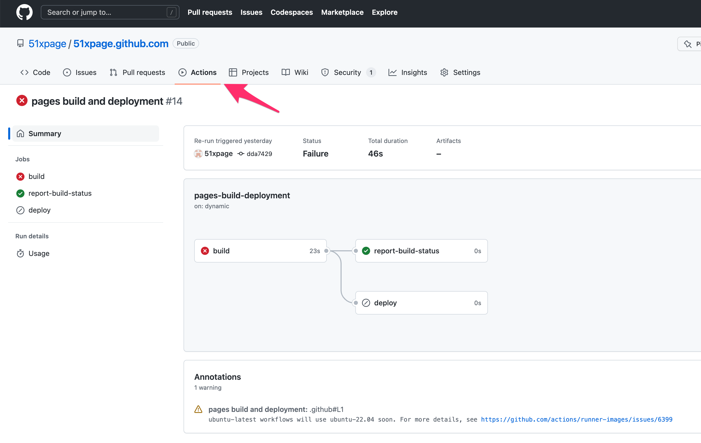

还有几个问题：

显示列表的时候，内容太多了，希望少点，差不多几行就够了
左右尺寸小点
能搜索
有时间线
有个图标

# 本地编译好的，但是提交以后没更新
如果有错误，提交的时候会提示，如果没有提示看看邮件。看起来是没有。

这个时候深入一点可以去仓库的Actions里面看一下，是哪个步骤出错了。


从这里也能更清楚知道jekyll的执行过程

# 安装admin
在Gemfile中加入

``` bash
gem 'jekyll-admin', group: :jekyll_plugins
···

``` bash

bundle install

Using jekyll-theme-tactile 0.2.0
Using github-pages 227
Installing mustermann 3.0.0
Installing multi_json 1.15.0
Installing rack 2.2.4
Fetching rack-protection 3.0.4
Installing tilt 2.0.11
Installing rack-protection 3.0.4
Fetching sinatra 3.0.4

Retrying download gem from https://rubygems.org/ due to error (2/4): Gem::RemoteFetcher::FetchError Net::OpenTimeout: Failed to open TCP connection to rubygems.org:443 (execution expired) (https://rubygems.org/gems/sinatra-3.0.4.gem)
Installing sinatra 3.0.4
Fetching sinatra-contrib 3.0.4
Installing sinatra-contrib 3.0.4
Fetching jekyll-admin 0.11.1
Installing jekyll-admin 0.11.1
Bundle complete! 4 Gemfile dependencies, 101 gems now installed.
Use `bundle info [gemname]` to see where a bundled gem is installed.

```

在./config.yml中加入

``` yaml
jekyll_admin:
  hidden_links:
    - posts
    - pages
    - staticfiles
    - datafiles
    - configuration
  homepage: "pages"
```  

# 摘要，用4个空行来表示也挺好的