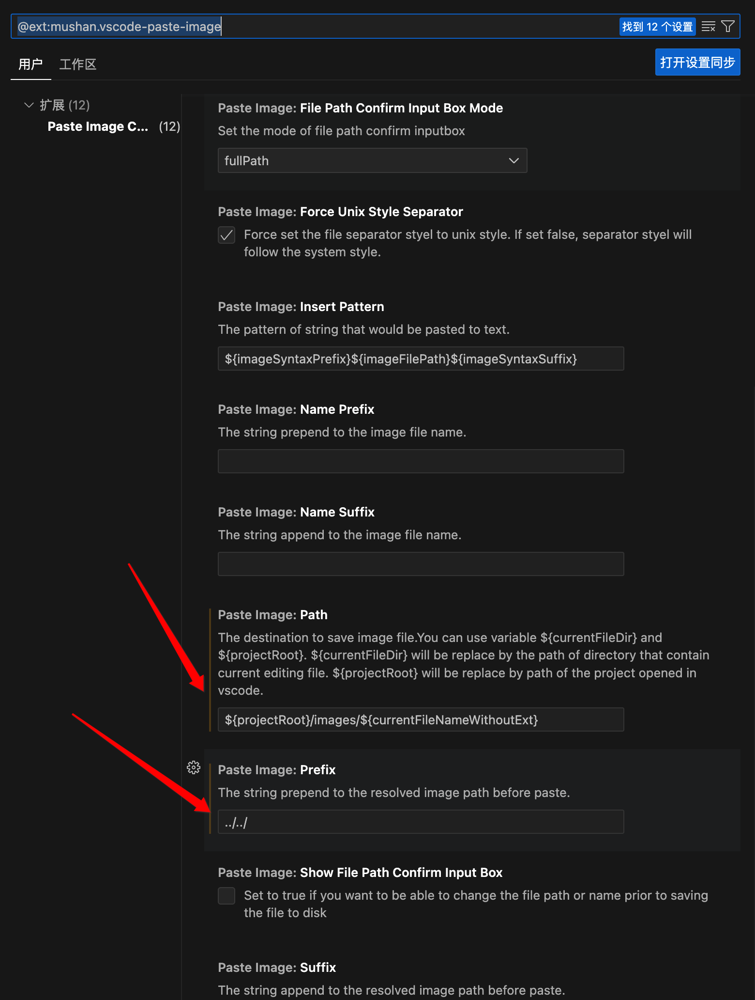
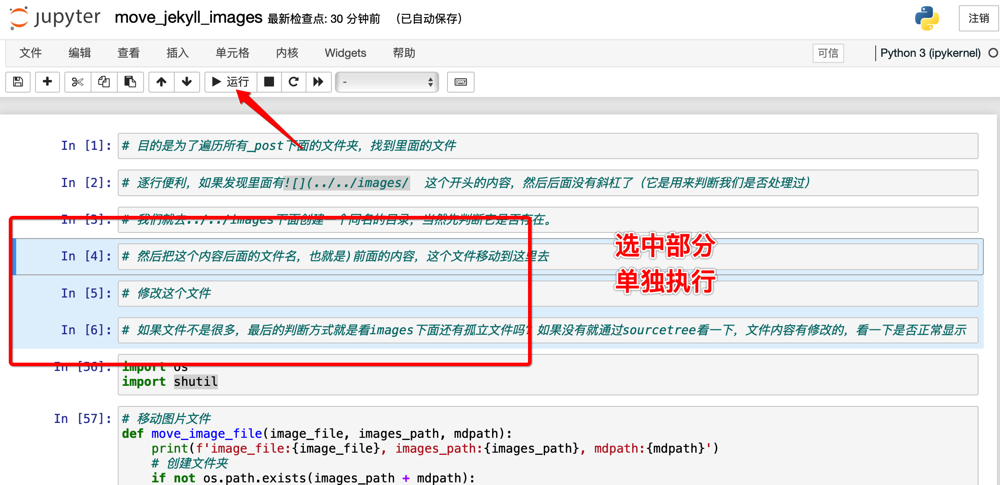

* content
{:toc}

最近因为学习的原因，无意间用了hexo，出奇地顺利。触动比较大的是图片的处理。
* 用typora比vs code方便很多。
* hexo生成页面明显比jekyll快，不知道是啥原因。

但是本着`不折腾，老得快`原则，暂时先还是用vs code吧。

最初在vs code搭建jekyll书写环境的时候，图片放在统一的images文件夹下，可想而知，时间长一点就很痛苦了。照着自己用hexo的习惯，今天痛下决心，写了一段python脚本迁移图片文件到对应目录。

比较意外的是用了一下Jupyter，真香！
<!-- more -->
# 1、问题由来-图片太乱

| 引擎 | 插件 | 路径处理 | 说明 |
| --- | --- | --- | --- |
| hexo | 拼音插件，自动转换中文路径为拼音 | 本地保存中文路径，最后生成的网页是拼音 | 直观方便|
| jekyll | 没找到拼音插件，生成markdown文件的时候，就用buby脚本生成拼音路径，如果后续修改文件名，对应图片路径名不会跟着修改 | 本地就是拼音，服务器也不用转了| [x]不直观|

> 简单来说，jekyll现在的解决方案，在提交到git之前就生成好了拼音路径。而hexo的插件是提交之后自己生成的，对我来说无感。

目前考虑分2步走；
* 第一步 先把图片文件放到文件路径里面去
* 第二步 找个图床方案吧。

# 2、配置修改-截图插件



主要是修改Path,改成：
```
${projectRoot}/images/${currentFileNameWithoutExt}
```
Prefix改成：
```
../../
```

# 2、实现思路


* 目的是为了遍历所有_post下面的文件夹，找到里面的文件
* 逐行遍历，如果发现里面有前面的内容，这个文件移动到这里去
* 修改这个文件
* 如果文件不是很多，最后的判断方式就是看images下面还有孤立文件吗？如果没有就通过sourcetree看一下，文件内容有修改的，看一下是否正常显示

# 3、代码实现

``` python
import os
import shutil

# 移动图片文件
def move_image_file(image_file, images_path, mdpath):
    print(f'image_file:{image_file}, images_path:{images_path}, mdpath:{mdpath}')
    # 创建文件夹
    if not os.path.exists(images_path + mdpath):
        os.makedirs(images_path + mdpath)
        
    # 安全起见，还是复制吧
    if not os.path.exists(images_path + mdpath + "/" + image_file):
        shutil.copyfile(images_path + "/" + image_file, images_path + mdpath + "/" + image_file)
    
    return (f'')

# 遍历文件夹
def search_file(path):
    # 如果是目录，递归调用
    for root, ds, fs in os.walk(path):
        for f in fs:
            fullname = os.path.join(root, f)
            yield fullname

# 读取文件内容
def process_mdfile(filename):
    # 逐行读取，如果需要修改就修改
    #  结尾，而且中间没有 / 了
    # 返回的时候修改文件内容并保存
    is_rewrite = False
    new_data = ""
    with open(filename, "r") as f:
        for line in f:
            nPos = line.find('
            if (nPos != -1):
                print(f'准备开始处理文件：{filename}')
                print(f'修改前{line}')
                line = process_image_file(filename, line)
                is_rewrite = True
                print(f'修改后{line}')
            new_data += line
                
    if(is_rewrite):
        with open(filename, "w") as f:
            f.write(new_data)
        
    return

# 处理图片文件
def process_image_file(filename, image_text):
    # 传入原始的md文件，和图片文件名
    # 创建文件夹，移动文件
    # 注意一行多文件的情况，如 
    # 返回修改后的内容
    new_text = ""
    mdpath = os.path.basename(filename).replace(".md", "")
    images_path = os.path.dirname(filename).split('_posts')[0] + "images/"
    test_str = '
    nPos_Image = image_text.find(test_str)
    
    new_text = image_text[0 : nPos_Image]
    print(f'nPos_Image:{nPos_Image}, new_text:{new_text}')
    image_text = image_text[nPos_Image + len_test_str : len(image_text)-nPos_Image]
    print(f'image_text:{image_text}')
    while nPos_Image != -1:
        image_file = image_text.split(')')[0]
        nPos_C = image_text.find(")")
        print(image_file)
        # 这里判断一下，如果) 前面还有斜杠，说明处理过了，跳过去
        if image_file.find('/') != -1:
            # 表示处理过了，
            new_text += image_file + ")"
            image_text = image_text[nPos_C - 1: len(image_text)-nPos_C]
        else:
            new_text += move_image_file(image_file, images_path, mdpath)
            image_text = image_text[nPos_C - 1: len(image_text)-nPos_C]
        
        
        nPos_Image = image_text.find(test_str)
            
    
    return new_text

def main():
    while True:
        base = input("请输入jekyll下面的_posts文件夹 ")
        if os.path.exists(base):
            break
        else:
            print(f'{base}路径不存在')

    for file in search_file(base):
        if file.endswith('.md'):
            process_mdfile(file)

if __name__ == '__main__':
    main()

```
# 4、测试结果
检查的方案也很简单，images根目录的文件，和里面的文件如果重合的，删除掉，没剩就好了
这里用了一个工具

它有个自动选中的功能，基本上还算智能吧，不行还能手工选，然后删除重复的文件

另外本地启动
``` bash
 jekyll server
```
图片都有了就好了。意外收获是发现了很多没有使用的图片。

# 5、补充说明
插播一句，pycharm破解失效了，就尝试用了Jupyter，真香！



选中部分单独执行，调试起来太方便了，只选中部分运行，如果临时需要弄个测试函数的代码，随便搞一段。完全不用考虑重新弄个命令行还是啥的就运行了，太爽了！

如果不是特别的原因，甚至不用再麻烦pycharm这类工具了。