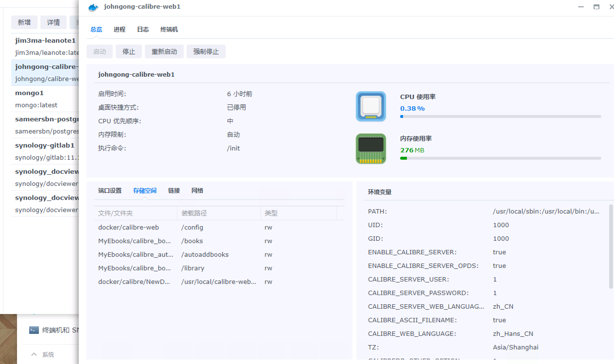
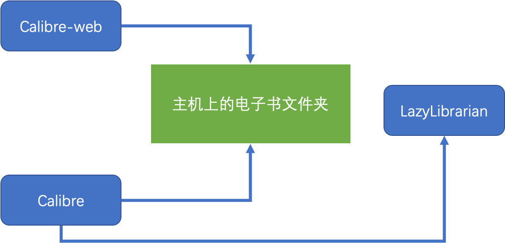
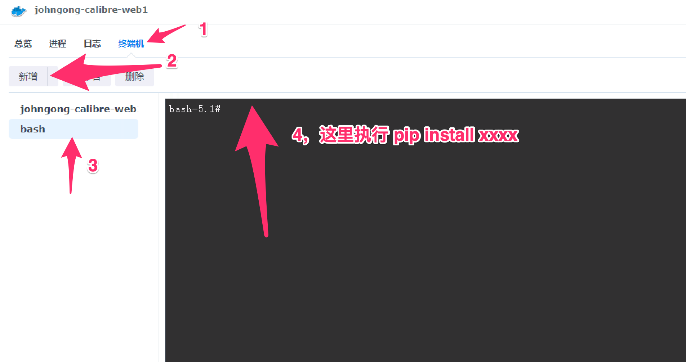
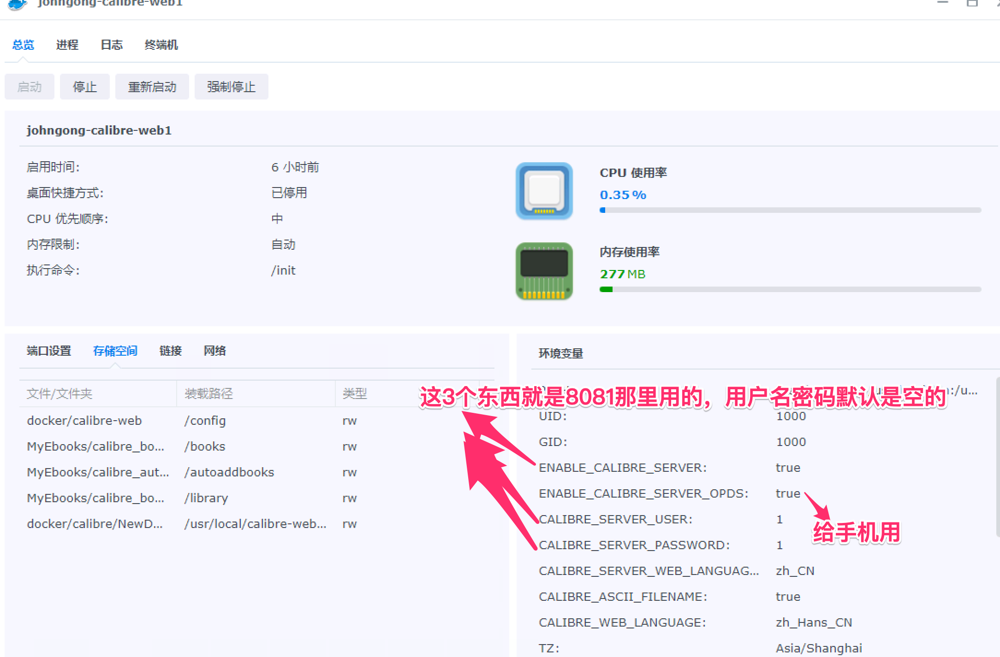
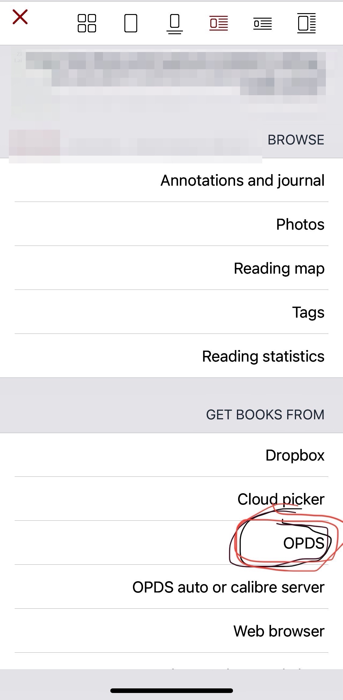

* content
{:toc}

> 最近因为流媒体刮削，所以想到电子书应该也有类似方案，结果找到了Calibre-web+Marvin(OPDS)，记录一下折腾的经过。为了减少精神内耗，也传承以前用kindle的经验（里面只放10本书，看完删除放新的进来），每次要看新书的时候再放到服务器上，也就是说，进去系统的，是这一生中真正看的书（也担心放多它就死了）。不过Marvin不支持mobi格式，kybook支持，操作体验上更习惯Marvin。比较遗憾的是，mobi是我认为比epub更现代的格式，发现我完全理解错了，刚刚收到kindle的邮件提示了。

<!-- more -->
# 00 期望目标和日常流程
* 多平台同步看，就是手机看了，到网页上看，不同电脑上看，进度一致
* 统一管理。有个地方统一管理各种电子书
* 有一个带封面介绍的展示，看起来清爽一点
* 电子书的封面可以通过互联网获取
* 电子书的信息是自动获取的（也就说所谓刮削）
* 电子书自动整理，最好不用通过网页上传，也不要我去维护目录结构

前面这几个是开始做这个事之前想到的。
为什么要弄这个，电子书不知不觉就收集了很多，有些不容易找，年轻时候还很克制，总会把文件整理井井有条。实际上井井有条是反人性的。现在相当于重新开始了。

# 01 前期知识准备
> Calibre是一个开源电子书阅读工具，它并没有提供服务器版本。Calibre-web弥补了这项的不足。那么Calibre-web里面需要用到一个sqllite的数据库，metadata.db。初步估计Calibre-web是外面弄了一个壳去管理Calibre。

#### Docker使用简单说明

> 下面的尝试的几个方案里面，有几个会涉及到文件夹共享的，如果对Docker不是特别熟悉，可以看下这里的说明。
在安装Calibre相关的镜像时，会涉及2个方面的内容。
* 系统变量
简单理解就是操作系统层面的全局参数，镜像里面的工程可能会用到，也是方面定制。一般是不用去调整条目，条目应该都是预设好了的，内容可能根据去修改。

* 文件映射
字面理解，就是主机的文件映射到容器系统里面的位置。我们这里一般是说，电子书是放在主机上一个文件夹里面的，在docker容器里面要如何访问这个文件夹呢，这个时候就可以通过文件映射的方式。不同版本的群晖docker管理界面不太一样，基本上大差不差。

左下脚这里，存储空间前面的部分就是宿主机器的位置，后面是容器里面的位置。后面用豆瓣api会用到。

# 02 镜像选择
因为是基于群晖的Docker安装的，差不多折腾了2天时间，分别说下过程
> 下面是用过的几个镜像，最终放弃了的

### a.linuxserver方案

|              镜像 | 说明 | 
| -----------------: | :-------------- | 
|         linuxserver/calibre-web |          这个是目前来说比较火的镜像了，大部分功能都能完成，遗憾的是没有弄成功批量上传书籍，简单来说就是单纯管理电子书它可以了，但是如果有很多电子书想一次性上传，它做不到               |
| linuxserver/calibre                 |          这个东西核心的是里面有个命令行工具calibre，它的作用是往书库里面添加一本书，没有深究它的功能，我们可以理解为它做了一些辅助整理的工作，比如书的作者，类别等等，自动生成一系列层级的文件夹放在它的库里面  |  
| linuxserver/lazylibrarian |          这个东西和前面2个一起弄的，目的是为了解决电子书自动添加的问题，但是很遗憾是折腾了很久都没弄好，日志里面的错误比较多是关于谷歌连不上之类的问题。 |   

这3个是要一起弄的,可以看出来都是linuxserver下面的。虽然配置不成功，原理大概是明白了，lazylibrarian是一个自动运行的东西，里面囊括了很多自动化的工具配置。
可以参考下面的链接
https://sasquatters.com/lazylibrarian-configuration/
简单来说就是下面图上的意思

这个方案还有一个需要调整的地方，电子书的格式转换还需要另外折腾。

### b. techosoft2000方案

|              镜像 | 说明 | 
| -----------------: | :-------------- | 
|         technosoft2000/calibre-web  |          这是大家说得比较多的，中文支持比较好的，只是比较遗憾安装失败了，看日志发现是有几个python包没有安装上，每次都卡死              |

这个方案卡死一步倒是可以解决，利用的是它每次安装都要通过各种下载去拿最新版的组件，正好可以利用这里的时间差，提前装好python包。

在它安装的过程中，利用终端机进入容器，并执行安装。不过比较遗憾的事，不止一个包，想想算了。

### c.johngong方案

|              镜像 | 说明 | 
| -----------------: | :-------------- | 
|         ljohngong/calibre-web|          基本没有啥问题，可能版本老了点，好在它不出问题，它还集成了格式转换功能。另外它默认提供了2个地址，一个8081仅仅用来浏览，一个8083就是calibre-web的管理界面 |   

# 03 关于刮削和自动处理电子书
**刮削**的意思就是给电子书找到封面和介绍等元数据信息，它们最终会存在数据库中。初步观察，它会在文件夹里面放2个文件，一个封面，一个metadata.opf。刮削的程序可以理解为插件，它们存放在metadate_provider文件夹下。**只要符合条件的文件在这个目录下，它就会加载**。

为了稳妥期间，可以用命令行找一下。
''' bash
find / -name "metadata_p*"
'''
然后做文件映射，把新的刮削器文件指向进来。

关于自动处理电子书，因为这个容器提供了一个临时文件夹，可以理解为它本意是用来下载的中转站，系统定时去找这里的文件，然后尝试处理，成功以后会删除这里的文件，并放到对应的文件夹里面。
> 关于书籍处理，个人的理解是电子书放到指定目录不够，需要真正进入到数据库，才能在页面上显示。也就是说，如果没有自动程序，电子书即使放在那个最终用文件夹，也不行。

> 弄刮削的时候有个可能是bug，如果书名改了，系统就对不上了，造成这本书就没法关联文件，目前的做法就是刮削之前把书名拷贝下来，然后弄好覆盖回去。

# 04 结合Mavin
容器里面有一个opds选项，确定是启用的就行

访问的时候是通过 http://ip:端口/opds，它会产生一个xml文件，Marvin就可以访问它了。
至于为啥用Marvin，是因为找了一圈都没有可以使用自己服务器的app。

# 05 几个注意事项
权限需要注意一下，文件夹需要给它权限。

目前看起来，如果想要在mac下用calibre访问，最简单的办法只有是通过共享文件夹的方式访问，配置成库的位置

>请先配置您的邮箱地址。。。
个人设置里面要设置一下

# 06 该干点正式了，怎么样的读书流程更合适
首先确定阅读目标，其次确定阅读工具，时间下来，手机还是太小了屏幕，用kindle感觉还好点，不过无法同步阅读进度，这点有点难受，如果可以做到calibre和kindle同步也不错，暂时先不管了
