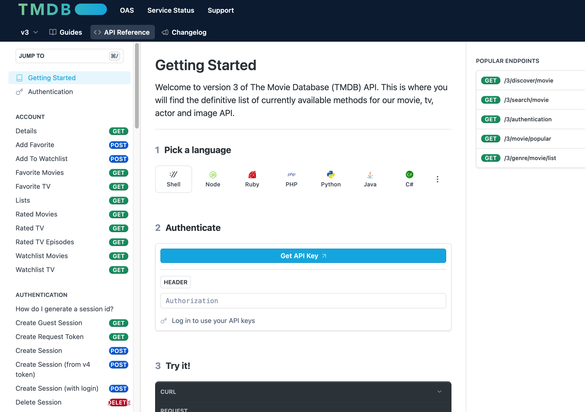
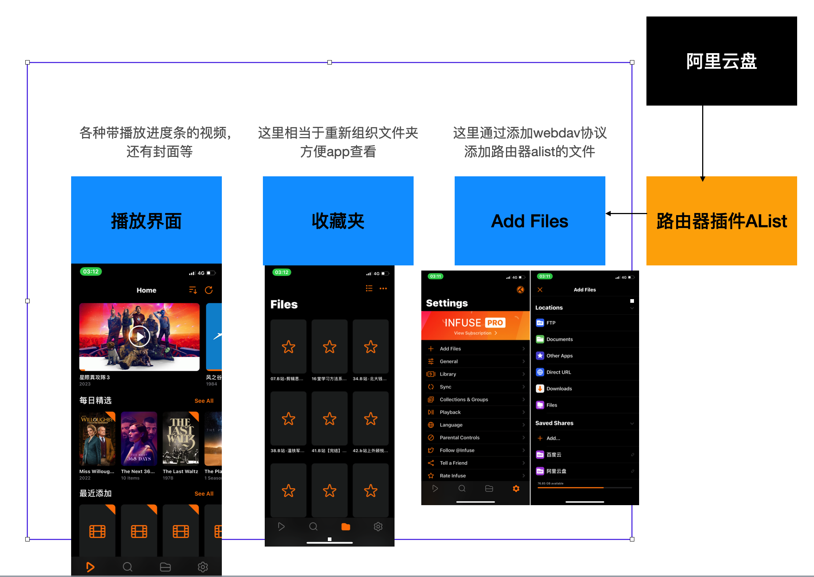
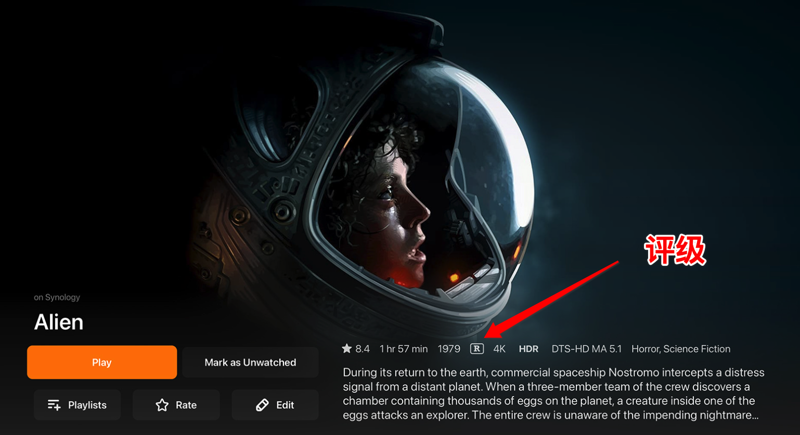

* content
{:toc}

大概有几个机缘，以前看电影有几个办法
1. **自己去下载，等下载完了再看** 
自从节奏快起来以后，发现等不了了，另外以前收藏的地址也无法下载了，百度基本搜不到有价值的东西，所以一度放弃了看电影这件事。

2. **在线网站**
发现大部分在线站点都是带广告的，也不是高清的。意思也很明白，人家就是靠这个赚钱的。时间长了，感觉还是不适合小朋友看。另外有些电影小时候想以后给孩子看，后来发现总感觉大人的视角有问题，咋看咋不合适。如坐针毡。所以想弄个分级管理的东西。

3. **云服务器直接看**
百度云用了很多年，但是时不时把我的电影给删了，关键是也是找了好久的东西，给吃掉了。

至于看电影用啥软件，没讲究，期间换过很多次，最后落在VLC上了，将就看吧。

**直到有一天，有人告诉我，我看的这些东西，叫熟肉，原版高清的那个叫生肉。再来一句，咋吃得下去呀。尼玛，你是毁了我的美好世界呀，尝试了一下，瞬间觉得不香了。**

另外以前有整理文件的系统，后来忙起来没整理，感觉挺别扭的。

目前的状态是 atv+infuse+alist+阿里云盘+迪士尼会员，想看啥，搜一把，放阿里云盘，infuse自动就同步了

<!-- more -->
# 1、几个名词解释

### 1.1 atv

就是appletv，苹果电视，就是机顶盒，用之前就想着，机顶盒能有啥了不起的，还卖这么贵，国内还用不了，这玩意啥情况。

### 1.2 刮削器Scraper

这个东西第一次听说觉得这是嘛呀,后来直到了，它就是帮我们去找电影的介绍信息的，包括海报，演员，评价啥的。详细的介绍放在后面。不过这玩意第一个翻译的人，不知道咋想的，你真是赢麻了呀。

### 1.3 生肉熟肉

第一次听到也是神奇，都是啥呀。传统的区分方式是，电影文件格式是MKV，里面没有字幕，字幕是另外的文件提供的，一把格式是srt，简单理解就是带时间戳/时间轴的文本文件。好处是方便挂各个语言信息。
熟肉的意思就是把mkv文件和字幕文件放一起了，一把就是放简体中文字幕，弄一个单独的文件，一把是mp4格式的。但是现在很多mkv文件里面，包含了字幕也包含了不同的音轨，所以
个人的理解，熟肉是有目的的，目的就是为了加各种广告，特别是刑法中规定不能干的那些事，这些组织也很有动力去搞这种事，反正长尾放着，也无所谓。它们一方面节约成本，会把分辨率降低，另外如果里面有多个音轨直接就删除了，可能一个mkv文件10G，到mp4也就1-2G，或者几百M。
从这个角度来看，熟肉是没法下咽的，特别是看来很多生肉以后…… 

### 1.4 PT/BT

BT很好理解，PT简单可以理解是一个小圈子里面的BT。啥意思呢，因为很多人下载BT以后就关软件了，这样的话他就只索取不付出。所以有人就搞了小圈子，大家必须贡献。当然，我们也很好理解，如果钱给够也没这个限制，这种小圈子通常要求比较多，也会考核节点的贡献度，如果维持，也只能靠内容取胜了。通常东西是好的，但是我们未必能接受这种管束。就一个电影，至于嘛！

### 1.5 emby公益服
这些流媒体服务，虽然一开始看起来是方便diy，也省去了文件整理的麻烦，因为有刮削器的存在，一定程度上，文件就不用整理了，也就减轻这方面的压力。
很容易想到的是，既然我们自己的电脑可以做流媒体服务器，当然也就有了人做了服务器给人用的呗。所以就有了适合各种客户端使用的服务器。
其中有个说法叫emby公益服，意思就是免费用它的服务的意思。但是我们知道，流媒体的带宽占用，播放时候的资源需求都是不小的，所以如果不想自己弄，去找个服务也是可行的。

# 2、购买atv的心路历程
买之前各种担心，担心买过来有质量问题，担心用不起来，担心成摆设了。想买它有个考虑，
1. 想看点迪士尼动画片和纪录片，另外让孩子远离国内这些nc的影视作品。
  这个目的很快达成了，资源太多了！！！
2. 想把以前收集的一些电影啥的给孩子看看。
  自己收集那些完全没必要，原来avi，rmvb，乱七八糟格式的，1G以下的留个名字直接删除了

* **准备工作**
1. 专门为它买了一个mt3000的路由器
2. 专门注册了一个台区appleid，说是比较便宜？我也不知道哪里便宜。
3. 专门买了一根8k的高清线+一根7类1米网线
4. 买了一个infuse软件，这个是用在手机上的，atv商家让我不要登录，那就另外买一个了

* **购买过程**
然后简单对比了几个平台，几百上都差不多，他们都很谨慎，也不会在平台上告诉我们翻的事，
或者说，没有这个基础，他宁可不做这单生意。说是怕钓鱼
一般来说，它们都会给我们几个app。
最后选定了一家店铺，讲了讲美版和港版的区别，就电源线不太一样，老板给了一个适合国内的电源线，也明说了这俩版本差价就那根线没必要，下单以后，他才给了我一个文档，里面告诉我如何安装啥的。

* **收货以后**
拿到以后，发现真没啥难的。
遥控器比我想象中操作简单，和iphone操作异曲同工吧。另外家里的iPhone居然都能操作电视，啥都没设置过（可能是相同wifi，可能是其他技术）

安装了店家给的几个app，主要是
1. infuse 用来看视频，我用了自己的alist连自己的阿里云盘，他也提供一年收费的alist服务
2. cheers 看b站用的
3. atv？ 名字忘记了，大概就是后面可以接普通电视节目，当然是人家的收费源

收费合理是可以考虑的，自己折腾也累人

# 3、刮削和流媒体服务器

### 3.1 刮削器的原理
前面大概说了刮削器的作用，就是获取影片的介绍信息。我们一琢磨就想着，这玩意牛啊，这么智能的吗？根据文件内容的md5信息？后来一想不对啊，这玩意各种熟肉，你加工我加工的，管理起来很复杂呀。
还是我想多了，人家根本没这么考虑问题，它的原理就是根据文件名来的。为了方便管理，给文件名做了一些规范。然后去网络取，我们很容易就想到，这也是互联网基础服务，自然有收费和免费之分。
有了这玩意以后，自然就有开源的刮削器，开源的管理更严格一点，如果文件名不匹配可能就搜不出来了。国外的源主要是tmdb，国内可能豆瓣是不错的选择（以前它自己估计也没想到这个用途吧）
很自然就想到了，既然能给电影搞，当然，也能给音乐搞，也可以给电子书搞。
[https://developer.themoviedb.org/reference/intro/getting-started](https://developer.themoviedb.org/reference/intro/getting-started)

在用这些刮削器的时候，如果文件名不规范，内容也是错乱的，这就有点坑爹，只能从源头上搞定了。相对来说，infuse的刮削器还算可以了。

服务器软件的刮削器各有千秋，对我来说意义不大

### 3.2 流媒体服务器
先说一下流媒体服务器，发明流媒体服务器的，也真是商业奇才了。接触流媒体这个词很久以前了，微软自带的播放器就有这个功能，但是从来也没用过，都几十年了吧。
最近才开始了解，开源的有emby plex jellyfin等，另外群晖nas自己带了一个video station的功能，在我看来，大同小异，反正在docker里面都装了一下，配置起来都不算特别简单，前面提到的刮削器也是各种坑吧。

用这些流媒体服务器，说白了，是为了组织视频文件，方便查找啥的。我们知道，这种东西，装上了，和用好是两回事，完全两码事。最后都没折腾，在路由器装了一个alist插件。

简单说，它就是一个云盘聚合插件，它把各个云盘的文件聚合到它那里，然后提供webdav方式访问，就像是访问本地文件夹一样。测试下来百度云盘好像不行，阿里云盘还是很方便的。

相对应的客户端播放软件有vlc，kodi，infuse，emby等，这里主要介绍infuse播放软件

### 3.3 infuse的神奇之处
infuse有pro版，大概是几百块吧，某宝买的不到20，就是给个帐号，自己登录appstore，去下载就好了。
图上是用了webdav的方式加文件，实际上它可以通过各种协议加文件。

收藏夹是一个挺有意思的功能，相当于重新梳理了界面，想要在播放界面看到的内容，通过收藏夹来实现了。
比如阿里云盘里面有个文件夹，电影，它包含 儿童电影，美剧，2个文件夹。
我们在收藏里面，可以分别加儿童电影和美剧，这样我们在界面选择的时候，就可以看到2个文件夹了。

在播放界面它会帮我们组织好各个电影，另外也会做好关联介绍，省得我们去翻了。它也会展示最新加入的电影，评分高的电影，随机来个电影啥的

**infuse的神奇之处，同步**
这个是我还没想明白的，可能它有个啥协议之类的。
就是在手机上操作了infuse，设定好收藏夹啥的，atv上的infuse，自己就好了，和我手机上的内容一致。
但是他俩没有帐号的问题啊。它也不用登录啊。

> 另外，因为电影本身如果带有分级信息，infuse可以设置分级管理

### 3.4 其他几个app

装了这个玩意以后，就开始折腾，基本上就TED，Youtube， 迪士尼，nasa这些吧，hbo和netflex不太敢，小孩太小了。

# 4、大概有点啥收获
最近家里装宽带的事，无意中接触到atv，于是就开始了一段莫名其妙之旅。流媒体的发展已经很多年了，而我对这件事，几乎完全没有概念。
简单来说吧，以前知道有单反穷三代的说法，也知道音响很费钱，现在知道，干啥都费钱。
接触互联网时间有点长，内里可能一直是稀缺性思维，所以总会想办法在网上找到一些资源。**简单来说，以不花钱为荣，因为资本家说了，你的时间更宝贵**，所以买了很多会员，

**我也一度怀疑这样做的意义是什么，最后发现，人生不折腾，总是缺了点啥，折腾的结果不重要，过程让我了解了原来还有这么大一个世界。**

**更重要的是不折腾，就真的老了**

如果有必要，后面可能加nas，加各种服务，其实atv本身不贵，atv+音箱+电视+各种app+各种资源，费钱了。

不过是看个电影而已，有必要这么折腾吗？折腾完了发现其实也没咋折腾，就是知道了有这么个事，但是不想非功夫去弄，该花钱就花钱，至少知道是咋回事了吧。

# 5、还想干点啥

目前是把电子书的web服务弄好了，但是还是给自己一个限定，系统里面最多放100本书，手机里面最多放10本书。