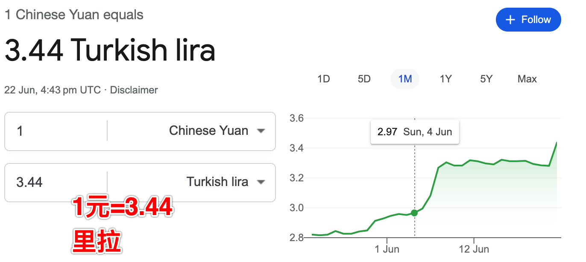
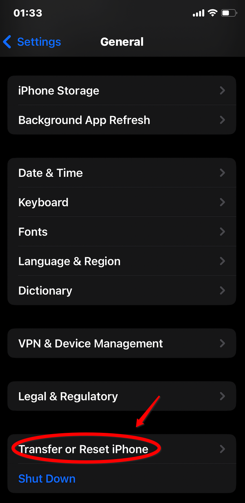

* content
{:toc}

> 心情不佳，居然忘记手机开机密码了，用了3年的密码！开始了焦虑的几天，这也促成我反思数据的梳理和备份问题。毕业以后，大规模数据丢失发生过多次，真正对生活造成重大影响好像并没有。早期的msn，qq，和现在微信聊天记录，当时备份的时候，总觉得会回头看，但是过去这么多年了，并没有再看。即使是早期的学习产物。收集的音乐，视频作品，电子书等等，无一例外都没有绝版，在一波又一波的IT技术浪潮中，总有人在世界的某个角落保存着它们。

> 当然，每个人对数据的价值判断并不相通。个人而言，好像也只有照片和常用软件的配置比较重要了。照片是因为不可再生，软件的配置是因为挺影响使用的。当然，还有日常工作数据。下面主要是劫后余生的数据处理方式，应该能持续一段时间了。

<!-- more -->

# 1、其实我想要什么
就数据而言，重要程度大致是：
1. 个人照片，说起来其实也没那么重要，只是物是人非，总想留点纪念。
2. 各种配置，这里特指app，系统恢复以后，连带着各种配置信息也到位，能快速使用，不用再去搞来搞去。
3. 工作文件，这个一般也没放手机里，目前唯一也就是qq和微信里面的文件

# 2、数据丢失后的一点启发
* 恢复数据的过程很漫长，差不多持续了1周，其中最大的数据恢复是微信，所以恢复以后，把缓存清空了，把一些不重要的群删除记录或者清空了。占用空间，又没咋样。
* 这次才终于明白了，appstore和icloud是两回事，以前一直没搞懂…… 
这事，真是不接触完全没有意识到，第一次听到土区帐号不明所以，后来才明白，操作起来有点繁琐，可能也吓跑了一部分人，所以没有大规模推广。
* 为啥要录入密码是因为那天想用一个升级ios才能用的app，一直尝试，最后也睡不着了，然后也记不起来了。一直折腾到天亮。

# 3、数据备份和处理方案
> 方案变化也很简单，iCloud扩容，iPhone自动备份到云，照片太大备份到其他地方。平常的照片截图啥的，能复现的，该删除就删除。

### 3.1 首当其中扩容icloud
国区的iCloud默认有5G的免费空间，对于我来说是显然不够的，后来开通了6元1个月的50G空间。但是很早以前就超了，以至于备份工作已经停了3年之久…… 
可以看出来，如果升级成国区iCloud，一个月就是21元，2tB就是68元，不能算便宜吧。
同样的配置，土耳其的200G：19.99/3.44=5.81，不到国区的50G价格
[iCloud官方报价](https://support.apple.com/zh-cn/HT201238)

* **家庭共享计划，用土区的帐号扩容，共享给国区的icloud**

这是一个福利吧，以前没有关注过家庭共享的事，想不到被人挖掘出这个用法。说起来很简单，就是另外弄一个土耳其的iCloud帐号，这个帐号买一个200G的空间，然后这个空间，共享给国区的iCloud。

* **注册一个土区帐号，其实也可以直接买**

包括注册美区id，我们发现购物平台上有很多，可以直接买，买了以后改密码啥的，也可以自己注册，买不贵，注册倒也没那么麻烦。基本上都卡在翻墙上。没有美区帐号就没有小火箭，没有小火箭，就出不去,死循环了。
这里就一个点，注册的时候，国家选土耳其就好了，美区帐号也是一样，选个美国地址就好了。

**其实关于帐号注册，一度是困扰我好几年的事，唉……，真的是，干就完了!!!**

**其他没有特别要注意的，就是不要选支付方式就好了，可以空着，对我来说这个很关键。**

* **礼品卡，以前看到超市里面的卡不知道干啥用，原来是干这个用……**
>没玩这个的时候，一方面担心帐号很难注册，后来是担心无法付费，因为没有那个国家的卡嘛！
现在知道有充值卡这个东西，不知道是不是apple故意放出来的。

分2个部分来看，**礼品卡购买**和**礼品卡充值**。礼品卡购买是从[https://www.oyunfor.com/](https://www.oyunfor.com/)，需要在它那注册个帐号（注意垃圾邮件，它的验证码有时候会去垃圾邮件），然后继续操作

用chrome翻译以后，大概是这样的

后面照着提示来就可以了，付款方式是可以用信用卡的

充值的地方，在app store里面，左上角的人头那里，可以充值，有时候要多操作几次。就是Gift Card那里

* **购买iCloud** 
在系统设置里面，登录土区的iCloud帐号，升级到200G（我的手机够用，就没继续括到2T，以后再扩）。

* **与家人共享**
上面这步完成以后，里面就会出来一个与家人贡献这么一个操作，接受到短信的手机操作一下，就加入这个共享空间了，这样我以前国区的iCloud就从50G变成和土区共享的200G了。

>这里比较尴尬的是，我用的旧手机里面没有放手机卡，它又是通过短信来的，而且尝试了用iMessage好像还不行，后来是通过其他人的手机中转的。

关于iCloud共享的几个疑惑放在最后了，等会可以看。

### 3.2 备份照片到Google Photo 和 Nas
为什么是这个选择，道理也很简单，因为iCloud恢复太慢了，另外感觉使用起来不咋可控，所以存到Google Photo去了，它有15G的免费空间，备份速度还可以吧，扩容到100G也还行。

### 3.3 数据恢复为啥很慢，我的理解

* **数据如何恢复**
iPhone恢复的时候，会让我们选择从哪里来，这里就指从iCloud来。如果是新手机这一步操作没选对，进来以后也可以重新操作，通用里面，倒数第二个按钮。

我的备份数据是3年前的，因为这几年格局小了，没去扩容，所以就只能这样了。照片没备份，微信倒是备份了。
恢复的过程大概是这样的。

* **大概恢复过程如何**
它先恢复app本身，然后恢复app里面的数据。

我们可以理解为，app分为应用和数据

这里恢复app的时候，它默认会下载最新版的，数据就恢复数据。
这里有2个很有意思的点

1. 如果app下架了，或者用不了，它还是会有个图标放那里，点的时候会提示要不要删除
2. 从通用-iPhone存储 ，那里可以看到数据恢复到啥程度了，如果数据没恢复完全，app用不了，所以我的微信大概5天以后才能用，数据大概是70G。

* **为啥恢复慢备份快**
这里我大概有这样的猜测，备份快是因为它先把数据收上来，收上来以后慢慢处理，很有可能是加密压缩分块存放。
就是我们备份的时候，可能是增量备份（猜测），系统收到数据以后，把这部分增量数据做压缩，加密，分在不同区，打散存放，为了安全。

恢复的时候，先把区块数据下载到本地，然后解密解压缩，可想而知这个过程是比较慢的，能加速的部分我想可能不在网络速度上，而在于本地的信息处理，理论上可能也快不起来，希望是我想这样，要不然尼玛等几天，太坑爹了。

# 4、几点说明
* 最好另外弄部旧手机登录土区帐号，好处是加入共享计划的时候，手机设置那里要退出icloud，总感觉比较麻烦。另外时不时要切换帐号也麻烦
* 如果另外有个手机登录，平常看余额比较清爽，因为iCloud是一个月一个月扣的，避免忘记续费   

* **土区和国区的数据是如何分配的**
土区和国区的数据其实是没关系的，并不是我想象的那样，数据要到土耳其去了，那不是慢死了吗？实际上它的做法是国区的数据在贵州，土区的数据在土耳其，只是加起来不超过购买的那个套餐而已。毕竟我们的数据不能出去嘛。

* **这种iCloud共享方案会不会有问题，以前那个咋办**
这个做法应该是合理的，因为对于apple来说，也是合理的功能，只不过这个家庭共享有id数量限制，应该是5个，另外用了共享数据以后，以前的那个套餐会自动停掉，我这个帐号是1个月以后停的，以前的数据其实也没用了，因为会用新的备份。

* **icloud帐号和appstore的区别**
其实这个也不是啥区别，就是咋说呢，icloud帐号是管整个手机的，app store是用来下载app的，这么听起来很正常，没毛病。
但是我以前一直以为如果要去下载个小火箭，要重新登录icloud，然后就发现出现各种妖怪的事，比如，有些app没有了？大概是这样吧。
所以现在手机上，icloud登录的是国区的帐号，然后用其他帐号下载安装小火箭（就是切换appstore帐号），我自己注册美区帐号前，花30买了一个小火箭，是的，自己注册一个好像也没毛病的……
另外一个附带的问题是app升级的时候，要换id，或者要输入密码，有点麻烦。后来自己注册了美区id，有几个就重新下载了

* **icloud数据可能是分块存的**

   所谓共享很有可能是各存各的，这样说起来比较合理，因为本地账户考虑到监管，访问速度等各种状况。
   数据安全问题。

* **参考网址**   
[https://zblogs.top/how-to-subscribe-to-turkey-icloud/](https://zblogs.top/how-to-subscribe-to-turkey-icloud/)