* content
{:toc}

经过一段时间折腾，总算是把能智能化的设备都智能化了。先说结论，整体来说，**所谓智能化，现在这个阶段，就是遥控，只是变成用手机遥控而已。其他的都是智障化的尝试。**

**当前市场还非常混乱，而且山头林立，各搞各的，中央空调的vrf是真的坏**

为什么要折腾这个事，缘起大概是这样的：
* **海尔App**
    * 冰箱
    * 洗碗机
    * 洗衣机/烘干机
* **博世App**    
    * 烤箱
* **空调**
    * 日立中央空调，内机好几个，遥控器老找不到

* **米家app**
    * 鱼缸
    
* **音箱**
    * 俩天猫精灵
    * 小爱同学
    * alexa echo

 * **智家app**
    * 3个灯

* **窗帘**
    * 3个威尔的窗帘，需要用天猫精灵控制

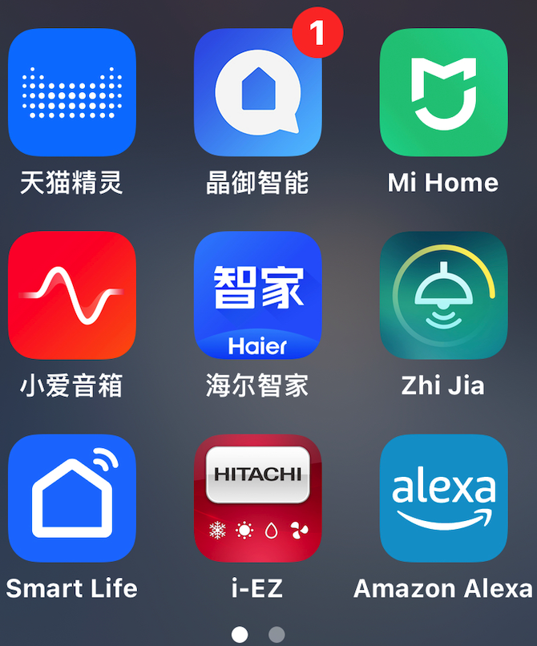
其中有一次操作想统一用小米或者天猫精灵，发现需要重新连接，就没继续尝试了。**目前看起来，终极方案大概是自己去折腾HA（Homeassistant）**

<!-- more -->
# 1. 智能家居情愫，想自己diy一套系统，最后没做
个人而言，希望实现的是一个手机app操作所有家电，不用另外拿遥控器了。
问题是这样的app操作起来也是很复杂的。
另外一个是很多年前无意中接触到树莓派相关的资料，就很想diy一个东西出来。但是一直也没有动手。那个时候还主要是C开发，难度并不低。

随着这段时间了解，发现有了各种解决方案，但是都是零零碎碎的，不能体系，但是从体验上，它多了一个场景的概念，我们直接用手机控制设备通常不止一个。比如说：
* 早上起床
    * 同时打开音箱播放音乐
    * 打开窗帘
    * 甚至开灯，这样一个场景它是组合多个设备的。
* 出门游玩
    * 关闭大部分电器
    * 扫地机器人自动开始打扫
* 临近回家
    * 自动开始消毒柜消毒
    * 提前开好空调
    * 打开电灯

诸如此类，这里我们从技术人的角度来看，它是非常美好的愿望，实际上，这样的美好愿望可能在10年前就有人借助智能的名义在做了，显然，技术远远没有达到这样的程度

# 2. 大家都选择了用音箱来控制
在很多年前，Apple就有了一个HomeKit的提法，我们可以认为那就是智能家居了。同时我们也明白，这些技术是需要配套的。在Apple提出来这个想法的时候，市面上已经在用的大部分设备是无法支持它的。同样Google也有类似的技术，亚马逊也有类似的技术。可以说它们设定是规范和准入机制，是对未来的设想。

从这个角度我们很好理解，一台空调，一部电视，它有遥控器，通常是通过红外控制的，这个时候，这些公司的技术是无法很好满足的，可以认为是过渡期，会有一些产品，附加在它们之上，充当中转的工作。不管用哪种技术，我们都可以认为是弱电控制强电。最终要控制的单元都是差不多的，区别就在于弱电部分的实现逻辑和方式不同。
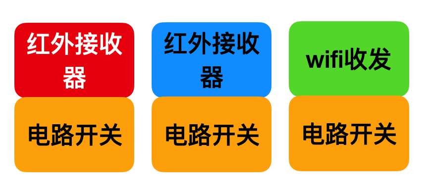
这样一来我们就理解了，各大厂商做的事，就是交互的设计，如何通过它们的方式来控制设备。很有意思的是，最终大家都选择了采用音箱来控制。
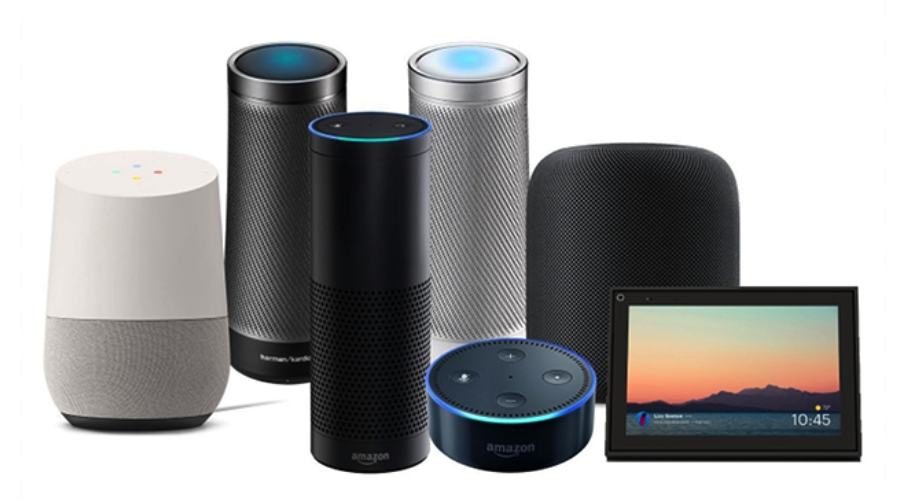
> 正因为这样，所以壁垒就建好了

作为想独霸一方的总集成，各个平台都开放了接入解决方案，前面说HomeKit是接触比较早的，可以理解成是它们成为操作系统那样的存在，如果要和Apple设备很好的集成，就得支持HomeKit，如果要在米家App里面控制，就得实现小米的接口，如果要在天猫精灵用，涂鸦就是一种方案了。我们可以理解为，技术实现上并不会太复杂，但是因为它是门槛和事实上的标准，所以，这就是垄断！而让我意识到这点，仅仅是因为，窗帘想要同时被米家App和天猫精灵控制，有点复杂！

# 3. 技术实现很难吗？核心不在技术而在商业！
从前面的分析，我们可以知道，底层控制设备本身并不会太复杂。可以理解成是固化在硬件中的一段功能，提供了完备的对外接口，上面接收指令可以是红外，蓝牙，zigbee，wifi。这么分析我们很容易就会想到：
**手机弄个红外发射器不就好了吗？**
对于存量设备，就是智能化之前的设备，如果提供了红外接口，这个思路是很自然的。各个厂家也会想着如何快速的切入这个大蛋糕。比如一个思路是插座，让插座里面内置收发功能。这种是折中的做法，新设备只要能接入wifi就可以了。主流的设备基本都是：
* 采用先蓝牙
* 然后把家里的wifi信息给它
* 让它去连路由器
* 然后通过网络来控制它

红外有一个很致命的问题：**没有反馈**，什么意思呢，我们用遥控器控制空调，遥控器不知道它到底开没开，它没有把信息带回来。当然，实际应用中，大不了再控制一次。于是才会想着用其他的协议。
蓝牙，wifi，zigbee,它们随着物联网的推广普及，慢慢走进人们的生活，但是其实也没走太近。**说来说去，协议也就是生意吧，不用太纠结，能解决都是好方案**
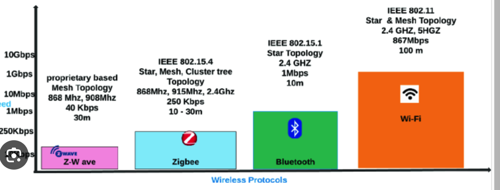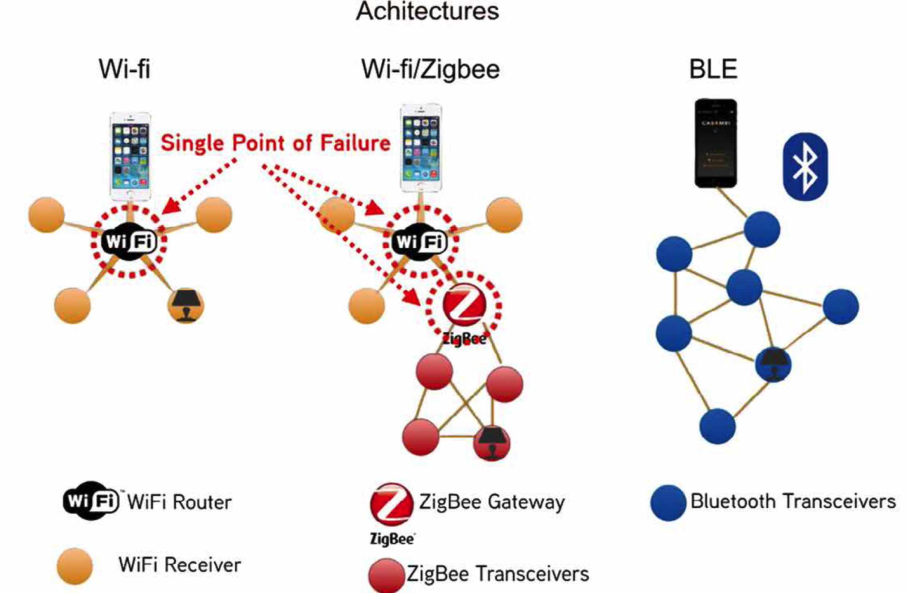
# 4. 红外方案兼空调vrf安装
> 从个人角度理解，红外方案是相对便宜的，如果每个房间都放一个红外设备，同时这个设备能连wifi应该是可行的，这样的模块价格不会太高。在这个探索过程中发现了加强版的“红外”方案——点对点射频，它的作用显然也是非智能化的场景，在老设备上添加接收器，然后通过射频控制它。这里可能用到的协议是MQTT之类的方案，应该来说，也不会很难，但是没有很出圈，可能它的利润？还是别的什么原因，不得而知，也许是我的知识局限。

### 4.1 产品选型过程
空调遥控器时不时找不到了，突发奇想，能不能直接控制呢，于是找了一个app，i-ez，以为这玩意是直接可以用的，然后研究半天，找了说明书资料，发现需要官方一个设备，这个设备接近2000，疯了吧！！！
然后开始找空调控制器，了解到有vrf这个东西，发现x米这个品牌，据说也是生态里面的，但是想出来。价格也差不多小1000了，另外安装费是300，不能少。
这个时候我脑补的场景，包括看到的资料，是在空调外机里面装个东西，一想到要拆开外机，寒毛就立起来了。
再了解，发现它们大部分出自某个代工厂（可能叫中弘，不记得了）。
基本上价格几百到上千不等，最后选了一个不到500的工厂店，他们不提供安装服务，但是会指导安全。

### 4.2 购买安装
因为要考虑供电，所以事先需要把线准备好。
> 确保空调断电了，为了安全我关了总开关，然后用遥控器测试了一下才放心

* 准备电源线
这个线是它们给的，需要自己用工具处理，安装的时候发现这个电源线很难安装到空调内机。原因是螺丝固定的那个缝隙太小了，后来干脆把螺丝整个拧下来了，然后缠上去。
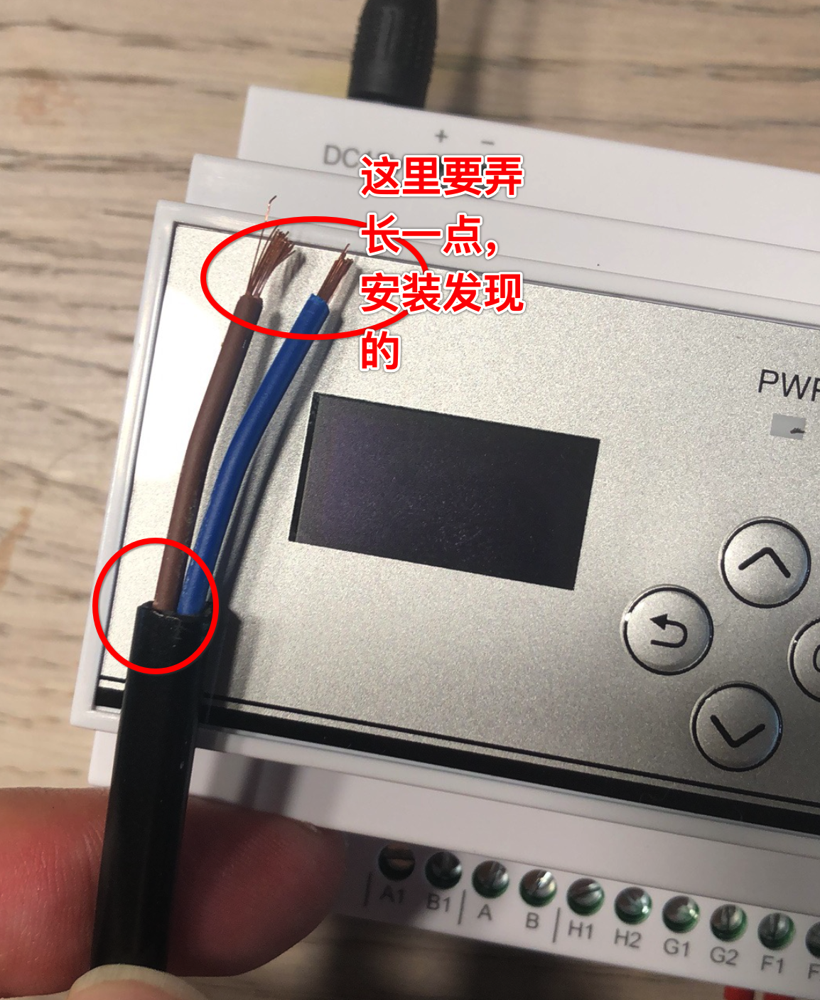* 打开盖子，家里是日立的，每个空调的状况不同，客服有详细的接线表格
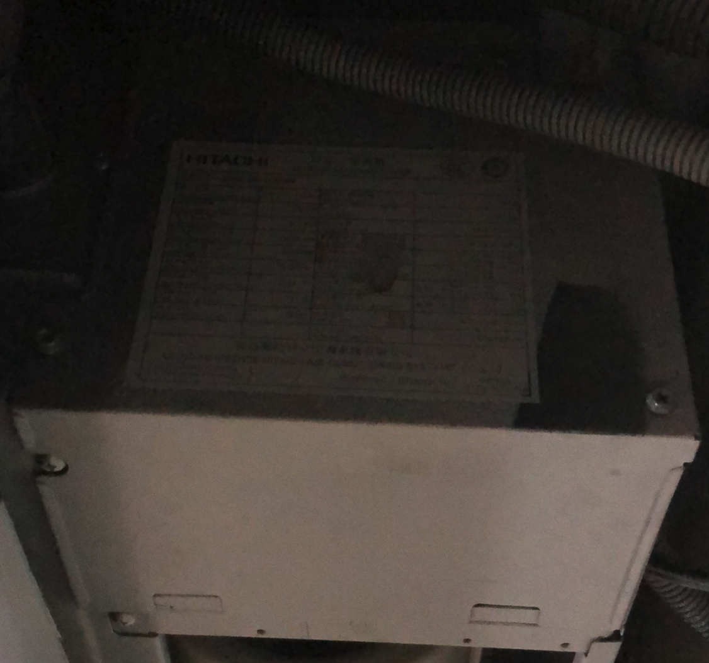* 接线
任何一个内机都可以，拆开以后是这样的，从图上看到给设备供电和控制设备
对我来说这步特别难，花费了1个多小时，指甲还破了一个！
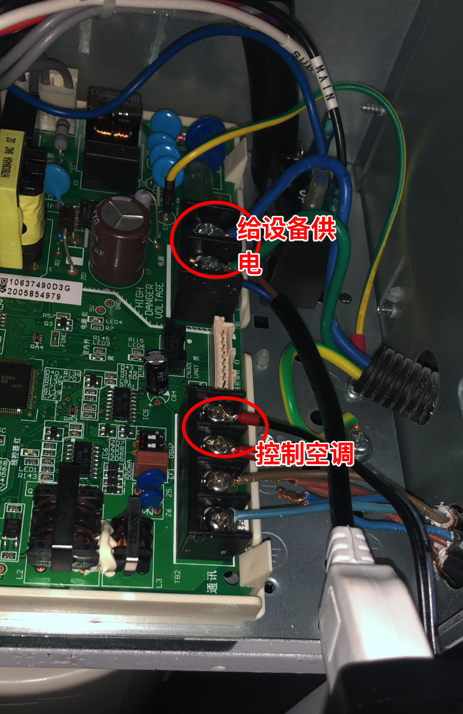图上的圆圈的部分是螺丝拧上的，要特别小心螺丝太松，原来的线容易掉出来
* 上电连接，开米家app设置
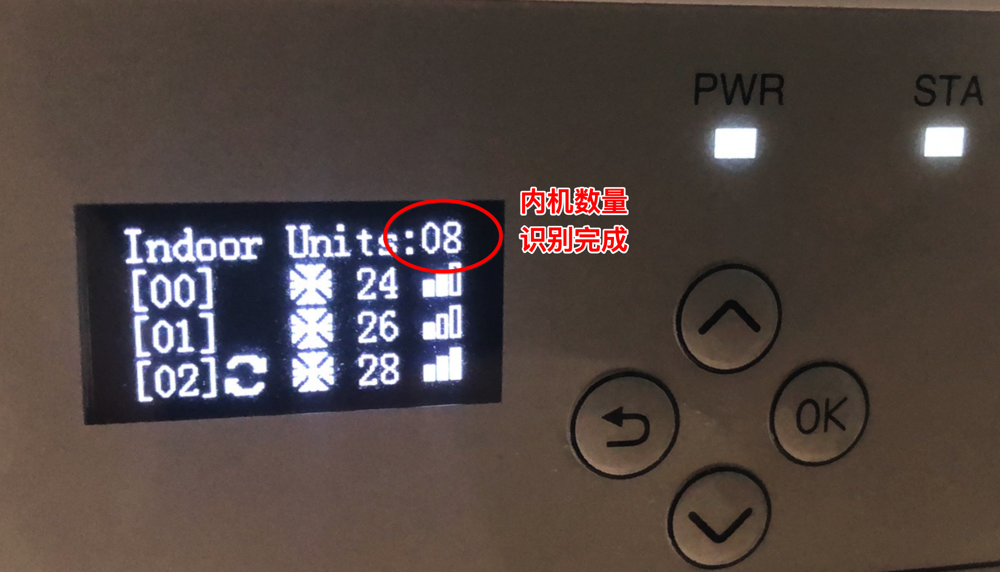手机打开蓝牙，app会自己去连的。
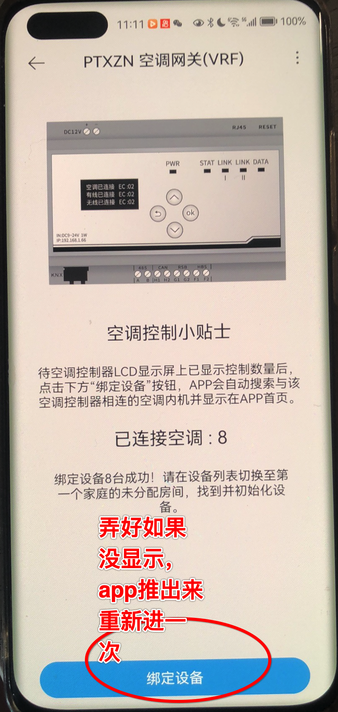
>从这里我们可以看出来，实际上，设备里面提供了控制的能力。只是空调厂商不想提供出来而已！！！这也太坏了。而我安装的过程中，唯一难的是接线，难是因为空间比较狭小，操作不方便，这居然要300！

# 5. 留在将来如果有兴趣折腾HA

关于智能家居借用home-assistant创始人Paulus的观点：
* 第一，业主不应该变成“技术人才”；
* 第二，你不是智能化家居的唯一成员；
* 第三，限制误报和错误；
* 第四，没有app是“最好的app”；
* 第五，中控系统应该在局域网内运行，而不是在云端；好的智能家居，不应该让用户增加烦恼；当它瘫痪时，可以完全被忽略掉！

参考资料：
* [https://www.home-assistant.io/](https://www.home-assistant.io/)
* [https://www.home-assistant.io/installation/raspberrypi/](https://www.home-assistant.io/installation/raspberrypi/)
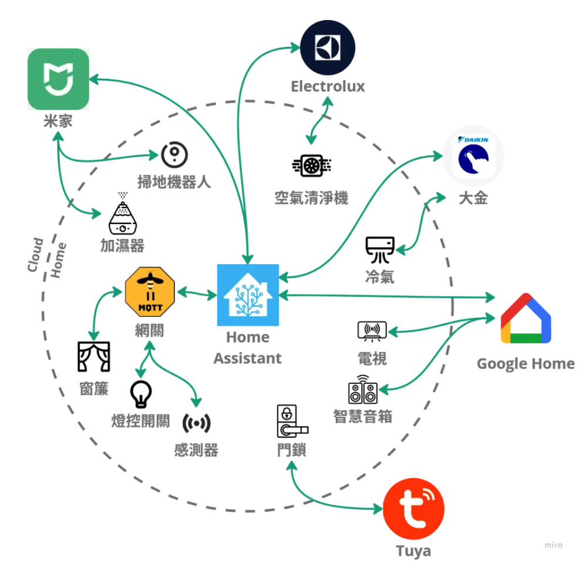

# 6. 一些感触
* 我们无形中把家里的秘密，都告诉了这些公司，小米，阿里等等。
* 米家app如果区域是美国，没有广告，但是很多设备显示不出来

