* content
{:toc}

知识管理和很多技能一样，都存在2个思考角度
 * 【优化，技能提升，小修小补，**量的积累**】我现在的思维方式没问题，听说xx能提升效率
 * 【颠覆，彻底改变，思维体系，**质的飞跃**】旧的思维体系无法满足现有的状况，需要开天眼

这里需要说明一个非常重要而直接的观点：

> 能搞定事情能解决问题的才叫知识。

接下来的内容就是通过DIKW模型，思考如何重塑自己的知识管理过程。
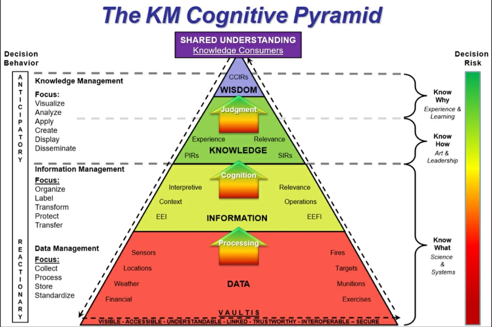

最终目的，我们期望建立的是一个从信息收集，整理加工，内化，再输出的体系。为了让我们真正改变自己对知识管理的理解和认知，让这个体系最终能落实下去，这篇文章是从思维角度入手，期望能抽丝剥茧。

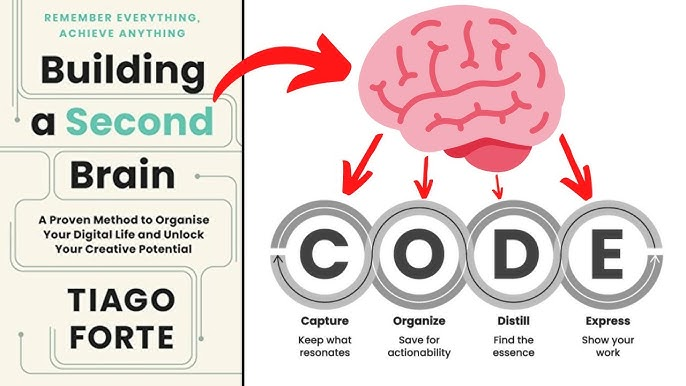

<!-- more -->
> 首先明确一点，寻找银弹的所有方法，最终都会失效，没有体系的支撑，走不远。
> 这里说的知识管理指的是，个人知识管理。


**举例来说** 收集的电子书很多，但是整理起来很麻烦，如果勤快一点按类型分文件夹，但是有些书属于多个类别就比较麻烦，我想有啥办法快速整理，累点倒没什么，这个时候我就去收集文件夹整理的方法。如果这个过程中我找到了`Directory Opus`，`Total Command`之类的工具，我会觉得太麻烦了，然后回去用老办法接着折腾。

这里的原因是这些工具要用好，有工具本身的思考，也就是工具需要重塑我们的思维方式，做事方式，这个思考和现有的工作模式冲突，要丢弃原来的模式，太难了！它可能需要我沐浴更衣，斋戒五日，以后再说吧。

一个不恰当的比喻是游戏中，一个擅长A职业或者角色的人，积累了大量A角色的技能和思考。突然尝试B角色，如果一直是用A角色思维模式，可能会受到很大挑战，乃至放弃，回到原来的模式中。

**最重要的是**，我收集那么多书干什么呢？所以到底什么才是知识管理呢。文章很长，值得深入阅读。

# 1、总是有一堆东西想学
### 1.1、总有东西想要学
* 听说AI很火，得学，咋学呢
    * 先看看抖音上AI干啥的吧，看了一会，哦，原来是这样，那我去学。
    * 听说课程都是割韭菜的，不管了，必须得跟上
    * 学完发现，好像还是很焦虑，没学会，是我太笨了吗？

* 时间管理很重要，得学
* Excel高级技巧，得学
* 2023年，你还不知道双链笔记？
* 为啥你的知识总是管不好，因为你没掌握xxx
* ……

总的来说，因为工作上的效率问题，因为学习上的课程要求等等，在这样的情况下，通常最容易接触的，是渲染焦虑的课程。总结起来，大概就是：

> 你有病，我有药，而且是特效药

### 1.2、买了就相当于看过了
**知识管理=知识收集**
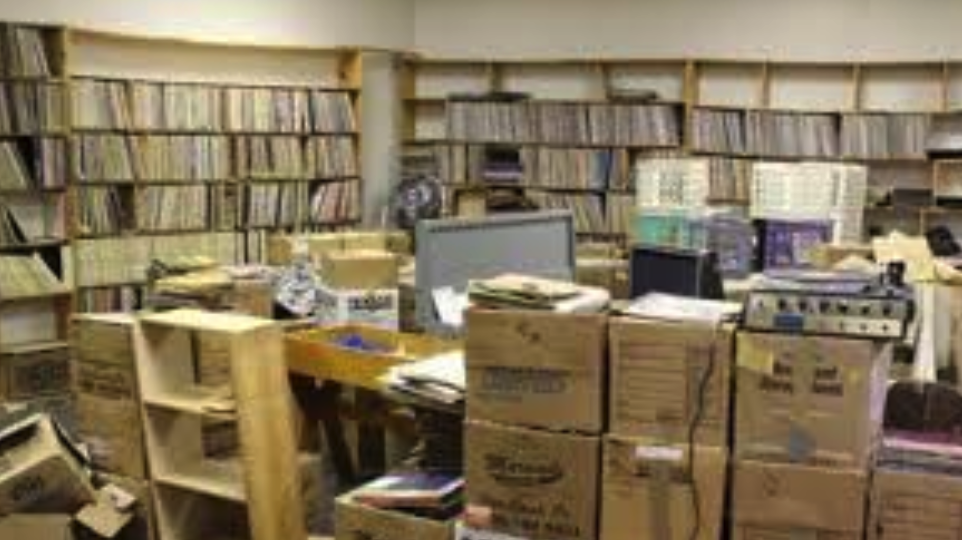
很多时候在潜意识里面

```
买书=看书,买过了=看过了。
```

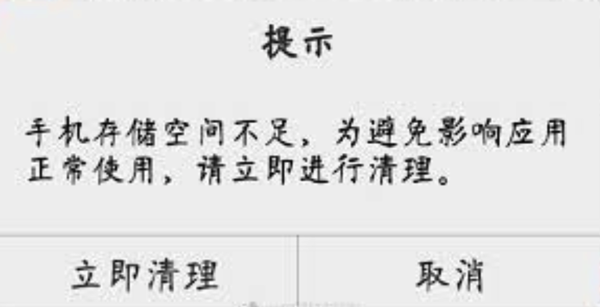
这种情况在知识付费里面也是一样的。囤积各种付费课程，或者买一个超大的网盘，里面放各种课程。
* 哈佛公开课？耶鲁公开课？
* ePub绝版电子书，手慢无
* 最新AI教程
* 学不好AI是因为你没了解它的底层逻辑
* 喜马拉雅/得到/混沌大学付费课程集合，xxxT

### 1.3、各种App里面的垃圾成山
最早接触笔记软件就是印象笔记了，老实说已经很多年没有打开过了。实际上有好几个帐号，录入的时候很开心，但是录入以后就再也没有看过了，这点和买书是一回事，买的时候看了简介，似乎就已经看过书了。
后来尝试过各种笔记软件，曾经有个蚂蚁笔记，支持markdown，当时的颜值也在我的审美上，现在已经不忍直视了。
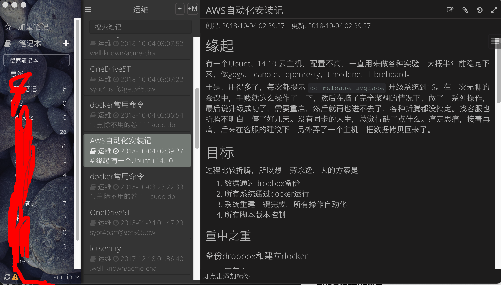

当时是开源项目，可以自己搭建服务器，也是折腾了一番。最后的结果可想而知，写一篇笔记和写10篇笔记，写10篇笔记和写100篇笔记，思考的出发点是不一样的。
工作中的内容大量的记录在公司的Confluence服务器上，后来在钉钉和飞书也积累了不少内容。
各种笔记App里面的数据最后都成为了一个个信息孤岛。更重要的是许多技术类的手册完全没有必要记录在这些笔记中，网上到处都是。

> 各种App里面堆満了垃圾，不忍直视就换个帐号或者换个App，继续堆积，直到受不了

### 1.4、疯狂尝试新App又放弃它
> 潜台词是一个App解决一切
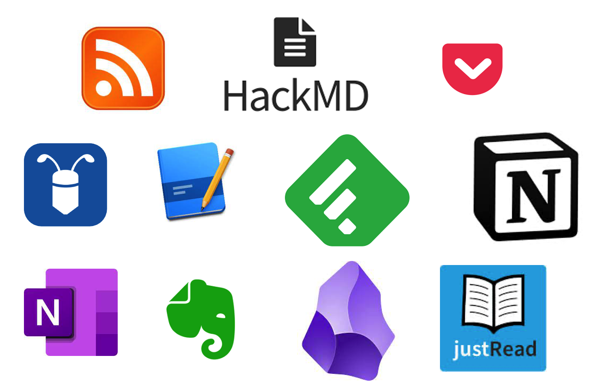
一段时间流行过RSS，Google的工具关闭以后就没咋用了。

它的作用只是稍微缓解一下焦虑，实际上通常是更焦虑，担心会错过一些信息。如果不是相关专业，大多数新闻和我们没有直接的关系。多一些谈资也许是一些人的选择，但是时间确实太宝贵了。

```
实际上，在没有用这些工具以后，甚至每天新闻都不看，短视频不刷，发现世界还是好好的。后来用过一段时间feedly，也不了了之。
```

有段时间流行过网页上做笔记的软件，在群晖上搭建过note服务器，用过一段时间又放下了，原因可能是没那么好用。也可能是收集下来的信息没有进一步加工的动作。

类似的软件很多，宣传的时候也有过类似Pocket这样的工具，稍后阅读，但是并没有形成体系。所以在虽然很久以前就知道Notion，知道Obsidian，无法还是想要通过这些工具快速完成以前那些App做过的事，铩羽而归吧。

而Notion最初是为了做日程管理，因为用过的日程管理软件数不胜数。而OB最初是因为少数派上看到关于双链的资料。

对应的博客也尝试过HackMD等等，直到最近无意间使用了Hexo，突然让我又重新想要尝试整理知识了

### 1.5、断舍离-其实就是躺平
经过这么多时间的折腾，最后并没有留下什么，学的东西很杂，但是并不深入，就像下图所示。


给自己定了一些规则，基本上是：
* 如无必要，勿增实体
    * 如果没有特别理由，不会接触新的知识领域
    * 没有特别理由不买新书
*  kindle里面最多放10本书，如果不看完就不加新书进来
    * 这不是很死板吗？对的，因为当初为啥会放那10本书进来呢？
    * 如果是纸质书，就用铅笔标记，如果不看完，也不看新书
* 删除所有网盘中的课程
    * 网盘里面只放高清电影，反正也不看
    * 如果决定要看视频，事先必须想好，为什么要看，看了想干嘛
* 如果不能坚持，就不要开始
    * 如果开始了，就不要停下来
    * 花更多时间在选择上
* 拒绝碎片知识
    * 基本不听，听了就丢
    * 不成体系的知识不吸收，听过就算

> 而且也坚信，如果无法通过通俗易懂的语言输出，这个知识还不属于我，至少它还无法为我创造价值。

> 然而，人性总是无法违背，现在退化的结果是，浏览器打开很多网页，有的可能1年都没再看，但是每次启动的时候，这个页面都在。

### 1.6、但是我并不想当鸵鸟呀
一个很偶然的机会，在油管看到沙牛的obsidian公开课，突然深刻意识到，实际上真正要的并不是这个软件如何使用，要改变的是自己的知识管理体系。

萦绕心头多年，逐渐清晰知道，不成体系就无法持久，总觉得实行困难极大，迟迟未真正深入思考，沙牛给了最好的答案，迫切想要去认识他。

多年来的急功近利，一直在寻找`银弹`，寻找`一个工具`或者`一个方法`，搞定现在所有的问题。

而这些问题，实际并不是需要解决。什么意思呢？切换了思维模式，这些问题可能就不存在了。

它是根植于大脑深处的，寻求`小概率成功事件`的偏好。

这就好比，用锄头种地，虽然很努力，也曾尝试过拖拉机，但是最终的选择还是让牛拉着拖拉机，也没仔细看拖拉机的说明书，也没去培训(听说培训要好久，算了算了，还是用锄头吧)。

最后又回到用锄头，自我安慰这叫`匠人精神`。我这个人`念旧`，我这个人很有`耐心`。

但是真正要关注的是种地，是需要到点了有收成，而不是这些有的没的。

**如果用了拖拉机，还需要关注锄头带来的一系列问题吗？多半是不用了。但是这个时候也许要关注大规模拖拉机群协同作业的问题，而这个问题，对于用锄头的自己，实在很难描绘。**

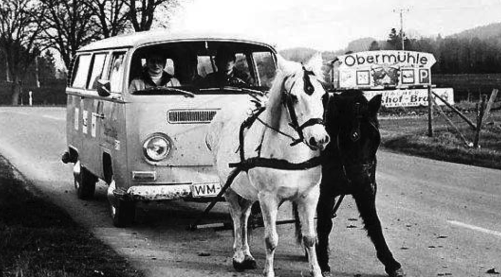

所以，知识管理是管什么呢？


# 2、知识管理其实是在管什么

个人知识管理（PKM，Person Knowledge Management）的起源并不太久，核心思想——作为个体如何管理，组织和分享知识——由来已久。Paul A.Dorsey教授提出

> 个人知识管理应该被看作既有逻辑概念层面又有实际操作层面的一套解决问题的技巧与方法


> 从小的方面来看，可以认为是学霸密不外宣，不可言说的体系。


### 2.1、DIKW模型
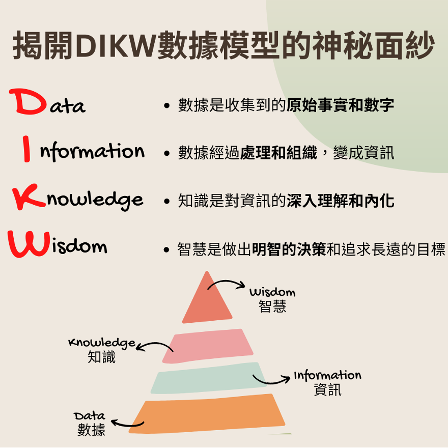

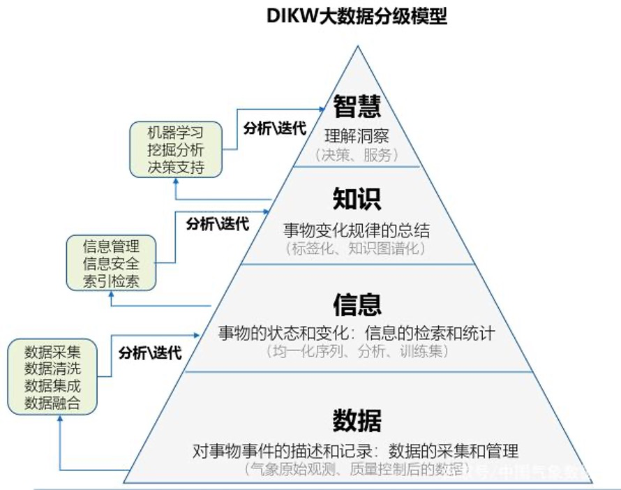

在写这篇文章的时候试图用一些案例来解释如何区分这几个分级，最后也没有特别好的案例，下面试图用表格来加深理解。

| 层级 | 说明 | 气象站 | 商业分析 | 学生成绩 |
| --- | --- | --- | --- | --- |
| 数据 | 记录和描述，杂乱无章，碎片化，生命周期短 | 百叶箱温度计温度 |各种销售数据 | 学生考试分数 |
| 信息 | (What,Who,When,Where)状态和变化，数据汇总处理 | 加权平均得出平均问题 | 整理成销售数据图表 | 成绩和科目关联 |
| 知识 | (How+What)规律总结 | 从气候上看这个城市是否宜居| 得出结论是否调整库存 | 分析学生长处短处 |
| 智慧 | (Why)理解洞察 | 为什么会有这样的气候| 是否符合公司长期战略 | 反思教育方法策略，优化长期目标，全体收益|

> 往往到了Wisdom阶段，已经超越了具体的知识领域，成为很多共性的知识，可以迁移的知识

关于模型本身很学术性的内容，可以参考 [wikipedia](https://en.wikipedia.org/wiki/DIKW_pyramid)

#### 所以我知道这个干嘛？
> 不要期望听到一个消息就改变命运了，如果错过的，也许它本来就不属于我们！

有一点是比较明确的，当我们把各种信息做了区分，我们就更容易知道自己要做这件事的重点在哪里了。
为什么不要沉迷短视频，社交App的原因就在于，这些系统上大部分是属于`信息Information`，它的特点是生命周期短，而且很碎片化，除了浪费时间，收益非常小。

我们对照自己日常的学习，生活，工作，如果无法处理，我们可以屏蔽掉很多这类信息。这个时候我们心理很自然冒出一个想法，如果错过很重要的信息咋办？我们看一个案例就明白了：

> 有人把一些播客做成背景音乐，放在工作中听，如果一个新闻很重要，那么这条信息就会在各个播客中出现。自然也不会错过了。

这个案例我们可以知道，如果这件事真的很重要，我们会从很多渠道听到，我们不用去期望我们得到了一个信息差，然后做成了一件事，可能性微乎其微。原因就在于，所谓做成一件事需要的资源并不是这么一个小小的信息。需要大量资源配合才可以。如果真的狗屎运踩到了，很大的可能，我们会成为先烈，因为很大概率我们没有核心竞争力和足够的护城河。

#### 信息差一直存在
普遍认为我们现在获取知识容易了，所以更重要的是专注力稀缺问题。其实从某种程度上来讲，古时候因为沟通交流不便，实际上要说是书籍形式的，所谓知识已经接近于智慧了。原因在于这些内容已经经过足够的抽象，和深度的思考。回到现代我们所接触的这些知识大部分其实都是信息，真正有价值的部分并不那么容易获得。和古人挑选徒弟类似，真正的深度知识也一直在筛选我们！

### 2.2、隐性知识和显性知识
老实说DIKW这个模型，如何和我们的知识管理有效结合不是一件很容易的事。单单从拒绝短视频的角度够用了。
通常我们关注知识管理是由于信息爆炸带来的。那么在研究之前，给知识做个分类是很好的做法。
我们常常会听到有人说，只可意会不可言传。简单来说，可以意会的就是显性知识，不可言传的就是隐性知识。

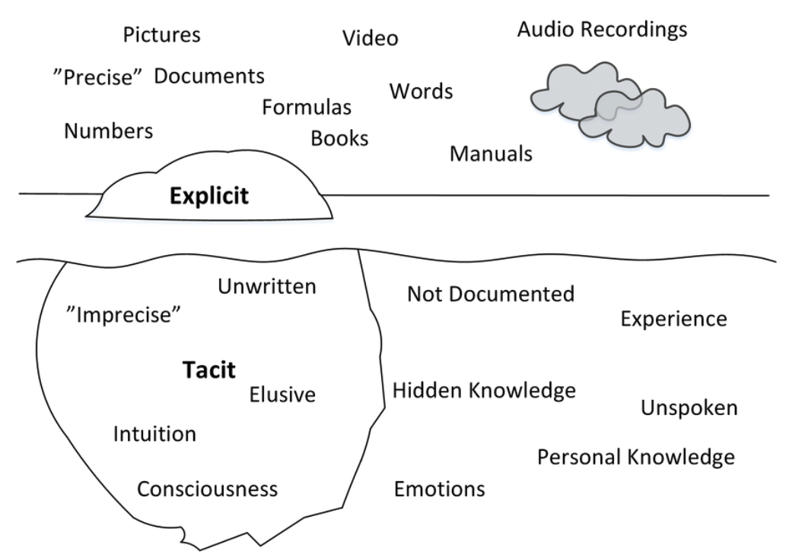

#### 隐性知识（Implicit/Tacit）
> 基于个人经验，背景和认知，难以形式化并传递的知识。通常需要通过实践，模仿和观察来获得。比如绘画技能等。

也包括直觉，熟练度，经验，诀窍等。需要实践，大量练习。

#### 显性知识（Explicit）
> 可以被文档化，结构化并共享的知识。很容易传递给他人。比如`书`，`数据`，`流程`等

写这篇文章的时候，突然感觉到隐性知识也是由显性知识构成的，只是太过复杂，已经无法拆解了。逻辑上讲隐性知识也是可以显性化的。这可能就是以前说的不同的老师，教出不同的效果吧。

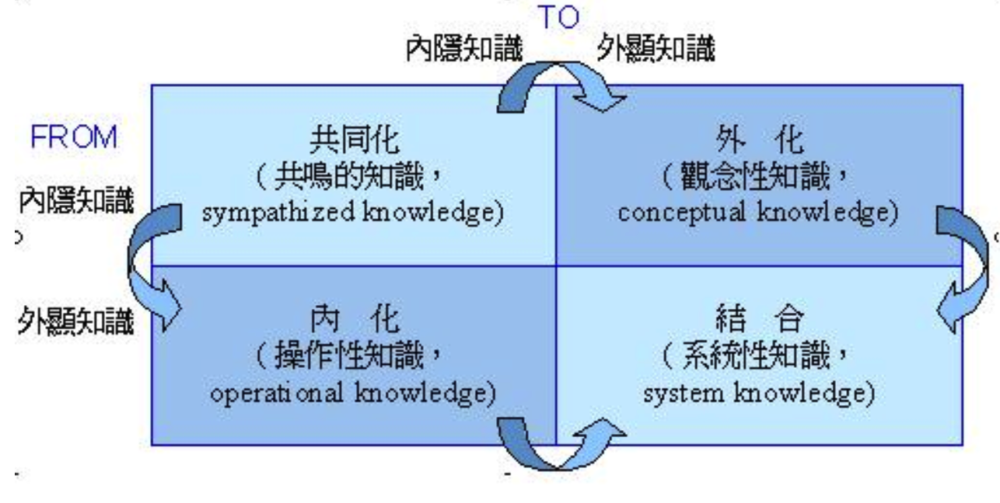

#### 隐性知识和显性知识的相对性

相对性是说，不同阶段不同层级的人对相同的知识看法不一样。对于当前的我来说，这部分是隐性知识，对于同时期的有经验的人来说可能是显性知识。举例说明

> 我在小公司工作的时候，得益于自己还算努力，积累了一些工程方法，看问题凭感觉就可以。但是这些工程方法我是当`隐性知识`看待的。但是因为公司小，工程小，这部分的经验在行业内其实很一般。后来去了大几十倍的公司，进去以后发现我的这些经验，在这里是标配，新入职的人都会了解，而且比我点总结要完善很多，丰富很多。时间稍微长点，对于这些同事来说，这些就可以认为是`显性知识`了。

这个案例的重点是，我在小公司里面积累的经验，不知道如何表达，但是去了大公司，都有很完善的培训体系把这些知识显性化了。所以也就有了平常说的：

```
我们的终点只是别人的起点
```

从这个角度出发，我们把自己的隐性知识显性化，并发出来，至少有一个益处不会闭门造车。

#### 隐性知识->显性知识

隐性知识有些人会把它当成本能，并显示出优越感，其实大可不必。知识管理也可以认为是隐性知识，只是这个内化的过程比较长，每个人本身具备的隐性知识和显性知识差异，造成个体的差异。

> `隐性知识显性化`，会让我们时不时有机会去检验我们的知识体系，正是个人知识管理很重要的目的

只不过相对而已，隐性知识更不自知一些。接下来我们通过知识的四限象就会更明白

### 2.3、知识四限象

#### 学习曲线很抖是什么意思
因为我不知道的东西太多，为什么有些人学东西很快，有些就慢，我们来看一个案例：

> 今天要学习10个知识点，甲已经掌握了其中的7个只是点，乙只知道其中的3个知识点，而且还不清楚，这个时候很明显甲学得快很多。

这里的知识点我们可以认为是显性的知识，也可以认为是隐性的知识。比如有些人很小的时候看过百科全书，看过《上下五千年》，有人给他们讲解过其中的事，那么它去了解历史或者类似的事，乃至于去做一个小组活动可能都会更有优势。如果这个时候去学的是历史，可以认为他用到了`显性知识`，如果是做小组活动，他从某个历史事件中得到启发，那可以认为是`隐性知识`。

#### 我不知道自己不知道

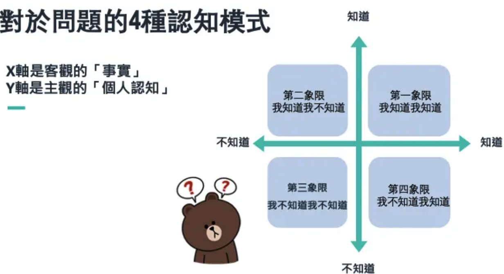

这里很好理解的是我们进入一个新的领域，常常会有这样的解读

* 不知道自己不知道
    * 举例：
        * 不会游泳的时候不知道呼吸方法
        * 不知道手动挡有离合
    * **探索更多兴趣领域**
* 知道自己不知道
    * 举例：
        * 学游泳的时候知道要学呼吸了
        * 知道离合要去学
    * **从下面2个象限（信息库，经验库）转化**
* 不知道自己知道
    * 举例：
        * 学会水里呼吸了
        * 学会用离合了
    * **形成快速查找的`信息库`**
* 知道自己知道
    * 举例：
        * 忘记游泳还需要练呼吸了
        * 离合？开车的时候从来没想过
    * **形成可以重复使用的`经验库`**

这个循环最妙的地方在于我们始终处于这个循环中，拿游泳来说，我们学会游泳了，就进入新的`不知道自己不知道`阶段了。比如我们不知道真正的运动员他们的一些东西。而淹死都是会游泳的，也是因为在未知水域对自己的估计不足。

#### 拿了PPT就会讲了吗？
很多人会担心自己的PPT流出去就如何如何了，和知识分享的道理是一样的，实际上PPT和我们讲出来的知识，它们背后都有大量的知识做支撑。就像现在如火如荼的AI背后的几篇重要论文都是可以看到的。但是我们大部分人实际上是做不到的。对于读者和听众来说，一开始，会存在很多不知道自己不知道的内容。

> 这也解释了，为什么我们听不懂，或者听懂了还不会做，或者做了会卡壳。因为还有很多我们`不知道自己不知道`的内容

#### 为什么只看书摘是不够的
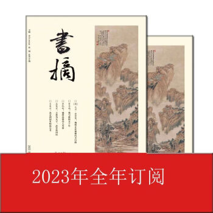
我们知道现在的AI工具可以帮我们快速整理出一本书的摘要，让我们快速了解这本书的梗概，达到快速阅读的目的。但是我们知道一本书很大的价值并不是告诉我们那些信息（Information）。更重要的是这本书教给我们的思考视角，思维体系。这些都藏在了整本书的论证过程，详细描述中。

读一本书该多久还是要多久，取决于我们当前的能力和状况，就像我们自己工作中擅长的部分可以总结出一些东西，做成PPT讲给别人听，但是我们其实隐藏了很多我们不知道自己知道的事，也认为那是自然而然的。没有讲出来，听的人也很难共情。


#### 可能是对未知的敬畏吧

比尔盖兹曾经说，看数看多了，各个知识点就容易关联上，记忆就不成问题了。不知道自己不知道好像能对抗的办法也就是保持对未知的敬畏？

> 知识管理的价值让我们更加清晰认识到，自己的知识领域在哪里，各个知识当前在我们的那个部分

# 3、重新认识知识管理

### 3.1、我的电脑桌面几乎不会放文件

管理=管+理。这两个东西都是对抗人性的。天性使然，人就是懒的。如果涉及到管理，一件事就会变得很痛苦。

工作的前10多年，我的电脑里面，文件总是井然有序，这个过程其实花费了大量的心力。一度认为像Everything这样的工具对我来说是没有意义的。

也一度认为Mac那样的方式，把一堆文件完全不规整的放那里也是不合理的。这也太懒了吧。

所以一度如果有人要给自己偷懒找借口，那就是我有强迫症，实在也没有特别好的办法。

转折点发生在一次电脑重装，正好又发生了其他的一些事，加上年龄往上走，除了工作的文件和平常经常使用的文件，就没有那么清爽了。以前有个Temp文件夹，定时会去清理，后来越堆积越多。

> 我的电脑桌面上基本上不会放东西，Windows下，根目录基本也不会有零散的文件，看到别人满屏的文件，实在是很抓狂

然后开始思考为什么会这样！

原因大概是这样：
* 桌面，我的文档等都放在系统盘，一般是C盘。内存不大时，Windows的技术很依赖C盘空间，如果空余空间小了，会影响性能
* 以前Windows经常要重装，所以C盘一般不放配置之外的东西
* 虽然后来每次重装我都会把这几个目录指向到其他盘，但是习惯好像就没改变了

### 3.2、最好的管理是不管理

管理是一个很高大上的词，但是知识管理，我们是在管什么呢？

| 保存| 分区| 内存释放 |
| --- | --- | --- |
|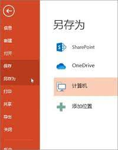 | 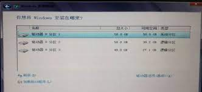|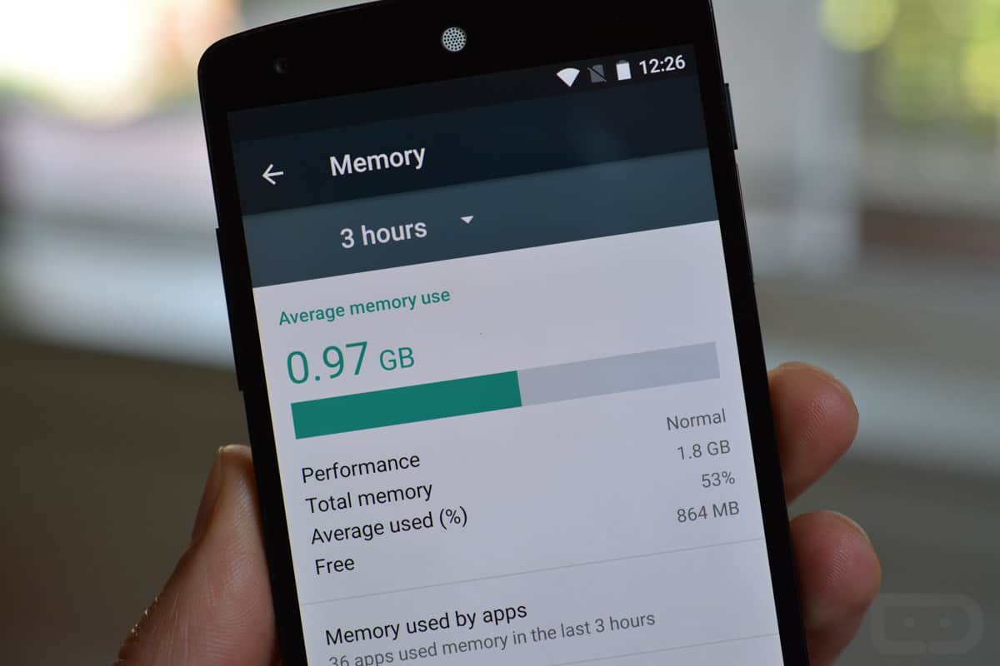|

* 我们很少会意识到，文件`保存` 这个动作其实是很专业的动作，背后逻辑很复杂，但是一定要有这个动作吗？
* Windows分区我们也是自然的，理由是分区会坏，我们可以理解一下这句话，硬盘是一个硬件，它居然会坏其中一个逻辑分区。
* 而早期很多针对安卓手机内存优化的工具。

包括我前面提到的，文件放得整整齐齐的事。它们一直在对抗人性，我们最终的目标是为了`快速找到文件`，然后`使用它`。

iOS主打的就是一个，拿起来就能用。用完放回去，O了。

我们做知识管理的目的也一样，如果我们花费了大量时间在管理上，就是舍本逐末的做法。这里可以简单的思考，我花了10个小时整理文件，但是它为我节省的时间如果只有5个小时，这笔买卖咋算都不划算。

我们当然无法做到绝对的不管理，但是要从重度管理变成`轻度管理`就很有必要了。

文件是知识非常重要的载体，但不是唯一的载体。为了这个目标，我们就要去折中，平衡，应该如何放，又如何找。

### 3.3、知识的类型

##### 潜意识按文件格式分不如不分
从上面我们说的知识分隐性知识和显性知识，隐性知识的管理要通过显性化来解决。那么这个时候我们的知识就可以用具体的载体来呈现了。各种文档文件（word，pdf，txt，excel，html），各种音频文件（mp3，wav），各种视频文件（mp4，ts）等等。

这种对知识的分类方式是最直观的，也是最容易想到的，但是这样就回到了最开始的那个不断整理文件的过程。当然，这里是有各种工具可以帮助我们做这件事的。在群晖里面，针对视频有Vedio Station， 音频有Audio Satation。对于照片也有解决方案。

但是我们知道这样的文件类型划分，对我们的工作没有什么实质性的帮助。

##### 加上个标签，文件依然很乱
至少我们对知识的性质有个分类，这里其实Mac提供了标签的功能。
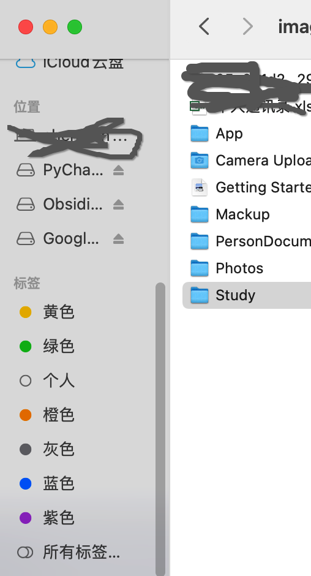

##### 按知识的用途来划分
* 工作知识
    * 工作中用到的各项技能
    * 也包括一些软技能
* 通用能力/个人提升
    * 知识管理
    * 时间管理
    * 写作能力
    * IT技能
    * 其他
* 专业领域新知识
    * 如何跟踪新知识
* 证书
* 学历 

上面不管哪种分类方法，都忘记了一个最重要的点，那就是分了干嘛？回到文章开头的部分，能搞定事的，能解决问题的知识才叫知识。所以很自然就能想到，如果真要管理这些知识，那咱也得管，但是管到性价比平衡才行。

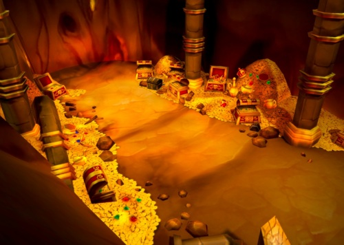

> 君子驭物，小人驭于。如果沉迷在工具耍酷炫技中，就是舍本逐末了。放着金矿不挖，捧着个铲子研究老半天。

所以，我们应该如何更好的去管理知识呢？

# 4、知识管理的原则和流程

### 4.1、 泼个冷水
* 没有放之四海皆准的体系，因为
    * 你和他不同
    * 不同领域的知识，不同的职业状况，不同的认知阶段，对体系的要求也不一样
* 没有一成不变的流程，因为
    * 世界在变
    * 你也在变
* 不要一开始就追求完善完美
    * 知识管理是实践性的，做起来才知道缺什么
    * 重要的是先开始

### 4.2、哪些知识需要管理
我们说能搞定事情的才叫知识，其他的都无所谓，从这个角度来说，我们可以在逻辑上把它分成两个部分，真正我们要重点关注的是知识库，对于DIKW里面至少是部分K，加W，其他的都是信息库。从下面这个图大概能看出点意思。

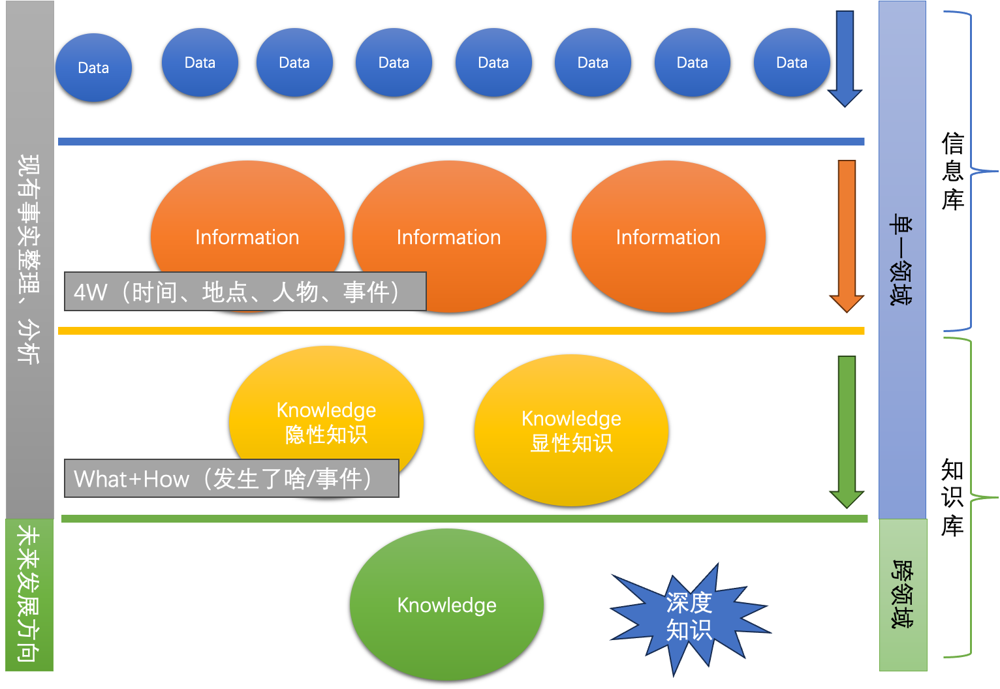


### 4.3、如何思考知识管理这件事
我们有时候很难学习各种知识管理技能，包括学习曲线很抖的那些软件。有一个非常好的思考出发点。也是我们前面说的知识是来帮我们搞定事情，解决问题的。

那么我们就可以从搞定这个角度出发去思考我们应用知识的场景。然后思考这个场景下各个环节。
比如我的场景：
* 写公众号
* 学习AI相关的知识，机器学习，线性代数，想想都头大
* 看到一篇文章不错，想回头仔细看看
* 工作中最近有个突破很有成就感想整理一下
* 和朋友聊天中得到一些点子很有启发
* 走着走着突然想到个啥，想要记录下来回头深入研究
* 一直想把时间管理这个事好好弄一下
* 想要了解复式记帐，但是一直也没开始，总觉得很麻烦
* 时不时想尝试个啥，但是一直也没尝试好，特别是一开始花了好久都没入门，很有挫败感，但是又不甘心
* 文件夹又有点乱了

这些场景我们首先要做的是优先级排序，我们不期望一次性把所有问题搞定，先搞定最重要的部分。

### 4.4、知识管理的流程


关于知识管理的理论有很多，简单起见，选择了`Tiago Forte`的`CODE method`。也就是把知识管理分成4个步骤：

| 步骤 | 说明 |
| --- | --- |
| Capture,获取 | 各种网页，微信，视频…… |
| Organize,整理 | 通过一定规则放起来，它推荐了一个PARA的方法 |
| Distill, 提炼，思考内化 | 对这些内容进行内化 |
| Express, 输出 | 通过各种方式展示，使用 |

关于这个流程也是这个系列文章最重要的部分，后面还会深入探索

### 4.4、 知识管理的原则

* 不期望一招鲜吃遍天的方案和软件
    * 虽然市面上有很多知识管理软件
    * 但是我们很清楚不这么说也没法推广呀
    * 放弃这个想法吧
    * 选择那个最专业的软件，干它最适合的活

* 尽量减少管理，轻管理
    * 尽量通过规则，还有基于规则的自动化操作
    * 让我们少管理

* 使用方便查找分析的资料库
    * 尽量把信息存成方便查找的格式
    * 尽量把信息存放在资料库（OB等）

* 始终记得我们的目的-搞定
    * 一定要记得，知识管理的目的是为了让它产生价值
    * 帮我们搞定事，如果知识管理过程中背离了这个目的
    * 一定要停下来想一下，是不是管理过度了

* 针对场景优化
    * 针对不同场景可以优化
    * 但是总的框架尽量不变

# 总结

* 能解决问题的才是知识，其他的减少输入。
* 方法论，软件过犹不及，以能搞定事，能解决问题为准则。
* 知识库是金矿，适度管理，轻管理。达到性价比平衡点。
* 善用佳软的前提是知道自己要干嘛。初心不变