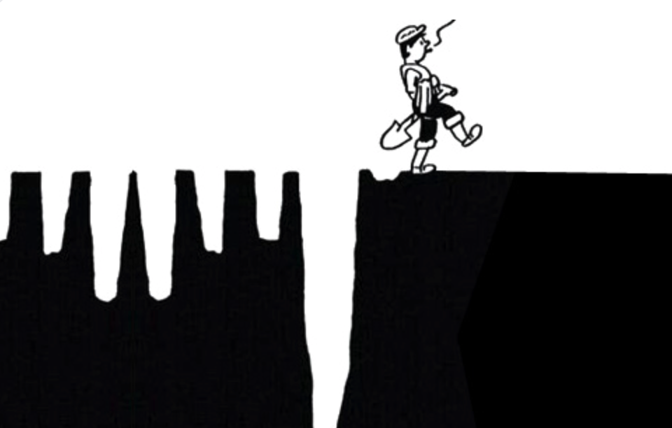

* content
{:toc}

知识管理和很多技能一样，都存在2个思考角度
 * 【优化，技能提升，小修小补，**量的积累**】我现在的工作有阻碍，我想用工具，方法来改善，潜台词是我现在的思维方式没问题
 * 【颠覆，彻底改变，思维体系，**质的飞跃**】我现在把工作搞成一团糟了，我想改善一下，我也不知道咋改善

**举例来说** 收集的电子书很多，但是整理起来很麻烦，如果勤快一点按类型分文件夹，但是有些书属于多个类别就比较麻烦，我想有啥办法快速整理，累点倒没什么，这个时候我就去收集文件夹整理的方法。如果这个过程中我找到了`Directory Opus`，`Total Command`之类的工具，我会觉得太麻烦了，然后回去用老办法接着折腾。

这里的原因是这些工具要用好，有工具本身的思考，也就是工具需要重塑我们的思维方式，做事方式，这个思考和现有的工作模式冲突，要丢弃原来的模式，太难了！它可能需要我沐浴更衣，斋戒五日，以后再说吧。

一个不恰当的比喻是游戏中，一个擅长A职业或者角色的人，积累了大量A角色的技能和思考。突然尝试B角色，如果一直是用A角色思维模式，可能会受到很大挑战，乃至放弃，回到原来的模式中。

**最重要的是**，我收集那么多书干什么呢？所以到底什么才是知识管理呢。文章很长，值得深入阅读。

接下来的内容就是通过DIKW模型，思考如何重塑自己的知识管理过程。


最终目的，我们期望建立的是一个从信息收集，整理加工，内化，再输出的体系。为了让我们真正改变自己对知识管理的理解和认知，让这个体系最终能落实下去，这篇文章是从思维角度入手，期望能抽丝剥茧。


<!-- more -->
> 首先明确一点，寻找银弹的所有方法，最终都会失效，没有体系的支撑，走不远。
> 这里说的知识管理指的是，个人知识管理。

# 1、总是有一堆东西想学
## 1.1、总有东西想要学
* 听说AI很火，得学，咋学呢
    * 先看看抖音上AI干啥的吧，看了一会，哦，原来是这样，那我去学。
    * 听说课程都是割韭菜的，不管了，必须得跟上
    * 学完发现，好像还是很焦虑，没学会，是我太笨了吗？

* 时间管理很重要，得学
* Excel高级技巧，得学
* 2023年，你还不知道双链笔记？
* 为啥你的知识总是管不好，因为你没掌握xxx
* ……

总的来说，因为工作上的效率问题，因为学习上的课程要求等等，在这样的情况下，通常最容易接触的，是渲染焦虑的课程。总结起来，大概就是：

> 你有病，我有药，而且是特效药

## 1.2、买了就相当于看过了
**知识管理=知识收集**

很多时候在潜意识里面

```
买书=看书,买过了就等于看过了。
```

这种情况在知识付费里面也是一样的。囤积各种付费课程，或者买一个超大的网盘，里面放各种课程。
* 哈佛公开课？耶鲁公开课？
* ePub绝版电子书，手慢无
* 最新AI教程
* 学不好AI是因为你没了解它的底层逻辑
* 喜马拉雅/得到/混沌大学付费课程集合，xxxT

## 1.3、各种App里面的垃圾成山
最早接触笔记软件就是印象笔记了，老实说已经很多年没有打开过了。实际上有好几个帐号，录入的时候很开心，但是录入以后就再也没有看过了，这点和买书是一回事，买的时候看了简介，似乎就已经看过书了。
后来尝试过各种笔记软件，曾经有个蚂蚁笔记，支持markdown，当时的颜值也在我的审美上，现在已经不忍直视了。


当时是开源项目，可以自己搭建服务器，也是折腾了一番。最后的结果可想而知，写一篇笔记和写10篇笔记，写10篇笔记和写100篇笔记，思考的出发点是不一样的。
工作中的内容大量的记录在公司的Confluence服务器上，后来在钉钉和飞书也积累了不少内容。
各种笔记App里面的数据最后都成为了一个个信息孤岛。更重要的是许多技术类的手册完全没有必要记录在这些笔记中，网上到处都是。

> 各种App里面堆満了垃圾，不忍直视就换个帐号或者换个App，继续堆积，直到受不了

## 1.4、疯狂尝试新App又放弃它
一段时间流行过RSS，Google的工具关闭以后就没咋用了。

它的作用只是稍微缓解一下焦虑，实际上通常是更焦虑，担心会错过一些信息。如果不是相关专业，大多数新闻和我们没有直接的关系。多一些谈资也许是一些人的选择，但是时间确实太宝贵了。

```
实际上，在没有用这些工具以后，甚至每天新闻都不看，短视频不刷，发现世界还是好好的。后来用过一段时间feedly，也不了了之。
```

有段时间流行过网页上做笔记的软件，在群晖上搭建过note服务器，用过一段时间又放下了，原因可能是没那么好用。也可能是收集下来的信息没有进一步加工的动作。

类似的软件很多，宣传的时候也有过类似Pocket这样的工具，稍后阅读，但是并没有形成体系。所以在虽然很久以前就知道Notion，知道Obsidian，无法还是想要通过这些工具快速完成以前那些App做过的事，铩羽而归吧。

而Notion最初是为了做日程管理，因为用过的日程管理软件数不胜数。而OB最初是因为少数派上看到关于双链的资料。

对应的博客也尝试过HackMD等等，直到最近无意间使用了Hexo，突然让我又重新想要尝试整理知识了

## 1.5、断舍离-其实就是躺平
经过这么多时间的折腾，最后并没有留下什么，学的东西很杂，但是并不深入，就像下图所示。


给自己定了一些规则，基本上是：
* 如无必要，勿增实体
    * 如果没有特别理由，不会接触新的知识领域
    * 没有特别理由不买新书
*  kindle里面最多放10本书，如果不看完就不加新书进来
    * 这不是很死板吗？对的，因为当初为啥会放那10本书进来呢？
    * 如果是纸质书，就用铅笔标记，如果不看完，也不看新书
* 删除所有网盘中的课程
    * 网盘里面只放高清电影，反正也不看
    * 如果决定要看视频，事先必须想好，为什么要看，看了想干嘛
* 如果不能坚持，就不要开始
    * 如果开始了，就不要停下来
    * 花更多时间在选择上
* 拒绝碎片知识
    * 基本不听，听了就丢
    * 不成体系的知识不吸收，听过就算

> 而且也坚信，如果无法通过通俗易懂的语言输出，这个知识还不属于我，至少它还无法为我创造价值。

> 然而，人性总是无法违背，现在退化的结果是，浏览器打开很多网页，有的可能1年都没再看，但是每次启动的时候，这个页面都在。

## 1.6、但是我并不想当鸵鸟呀
一个很偶然的机会，在油管看到沙牛的obsidian公开课，突然深刻意识到，实际上真正要的并不是这个软件如何使用，要改变的是自己的知识管理体系。

萦绕心头多年，逐渐清晰知道，不成体系就无法持久，总觉得实行困难极大，迟迟未真正深入思考，沙牛给了最好的答案，迫切想要去认识他。

多年来的急功近利，一直在寻找`银弹`，寻找`一个工具`或者`一个方法`，搞定现在所有的问题。

而这些问题，实际并不是需要解决。什么意思呢？切换了思维模式，这些问题可能就不存在了。

它是根植于大脑深处的，寻求`小概率成功事件`的偏好。

这就好比，用锄头种地，虽然很努力，也曾尝试过拖拉机，但是最终的选择还是让牛拉着拖拉机，也没仔细看拖拉机的说明书，也没去培训(听说培训要好久，算了算了，还是用锄头吧)。

最后又回到用锄头，自我安慰这叫`匠人精神`。我这个人`念旧`，我这个人很有`耐心`。

但是真正要关注的是种地，是需要到点了有收成，而不是这些有的没的。

**如果用了拖拉机，还需要关注锄头带来的一系列问题吗？多半是不用了。但是这个时候也许要关注大规模拖拉机群协同作业的问题，而这个问题，对于用锄头的自己，实在很难描绘。**


所以，知识管理是管什么呢？

# 2、知识管理其实是在管什么

个人知识管理（PKM，Person Knowledge Management）的起源并不太久，核心思想——作为个体如何管理，组织和分享知识——由来已久。Paul A.Dorsey教授提出

> 个人知识管理应该被看作既有逻辑概念层面又有实际操作层面的一套解决问题的技巧与方法

```
从小的方面来看，可以认为是学霸密不外宣，不可言说的体系。
```


# 2.1、DIKW模型


在写这篇文章的时候试图用一些案例来解释如何区分这几个分级，最后也没有特别好的案例，下面试图用表格来加深理解。

| 层级 | 说明 | 气象站 | 商业分析 | 学生成绩 |
| --- | --- | --- | --- | --- |
| 数据 | 记录和描述，杂乱无章，碎片化，生命周期短 | 百叶箱温度计温度 |各种销售数据 | 学生考试分数 |
| 信息 | (What,Who,When,Where)状态和变化，数据汇总处理 | 加权平均得出平均问题 | 整理成销售数据图表 | 成绩和科目关联 |
| 知识 | (How+What)规律总结 | 从气候上看这个城市是否宜居| 得出结论是否调整库存 | 分析学生长处短处 |
| 智慧 | (Why)理解洞察 | 为什么会有这样的气候| 是否符合公司长期战略 | 反思教育方法策略，优化长期目标，全体收益|

> 往往到了Wisdom阶段，已经超越了具体的知识领域，成为很多共性的知识，可以迁移的知识

关于模型本身很学术性的内容，可以参考 [wikipedia](https://en.wikipedia.org/wiki/DIKW_pyramid)

## 所以我知道这个干嘛？
> 不要期望听到一个消息就改变命运了，如果错过的，也许它本来就不属于我们！

有一点是比较明确的，当我们把各种信息做了区分，我们就更容易知道自己要做这件事的重点在哪里了。
为什么不要沉迷短视频，社交App的原因就在于，这些系统上大部分是属于`信息Information`，它的特点是生命周期短，而且很碎片化，除了浪费时间，收益非常小。

我们对照自己日常的学习，生活，工作，如果无法处理，我们可以屏蔽掉很多这类信息。这个时候我们心理很自然冒出一个想法，如果错过很重要的信息咋办？我们看一个案例就明白了：

> 有人把一些播客做成背景音乐，放在工作中听，如果一个新闻很重要，那么这条信息就会在各个播客中出现。自然也不会错过了。

这个案例我们可以知道，如果这件事真的很重要，我们会从很多渠道听到，我们不用去期望我们得到了一个信息差，然后做成了一件事，可能性微乎其微。原因就在于，所谓做成一件事需要的资源并不是这么一个小小的信息。需要大量资源配合才可以。如果真的狗屎运踩到了，很大的可能，我们会成为先烈，因为很大概率我们没有核心竞争力和足够的护城河。

# 2.2、隐性知识和显性知识
老实说DIKW这个模型，如何和我们的知识管理有效结合不是一件很容易的事。单单从拒绝短视频的角度够用了。
通常我们关注知识管理是由于信息爆炸带来的。那么在研究之前，给知识做个分类是很好的做法。
我们常常会听到有人说，只可意会不可言传。简单来说，可以意会的就是显性知识，不可言传的就是隐性知识。


## 隐性知识（Implicit/Tacit）
> 基于个人经验，背景和认知，难以形式化并传递的知识。通常需要通过实践，模仿和观察来获得。比如绘画技能等。

也包括直觉，熟练度，经验，诀窍等。需要实践，大量练习。

## 显性知识（Explicit）
> 可以被文档化，结构化并共享的知识。很容易传递给他人。比如`书`，`数据`，`流程`等

写这篇文章的时候，突然感觉到隐性知识也是由显性知识构成的，只是太过复杂，已经无法拆解了。逻辑上讲隐性知识也是可以显性化的。这可能就是以前说的不同的老师，教出不同的效果吧。


## 隐性知识->显性知识

隐性知识有些人会把它当成本能，并显示出优越感，其实大可不必。知识管理也可以认为是隐性知识，只是这个内化的过程比较长，每个人本身具备的隐性知识和显性知识差异，造成个体的差异。

> `隐性知识显性化`，会让我们时不时有机会去检验我们的知识体系，正是个人知识管理很重要的目的

只不过相对而已，隐性知识更不自知一些。接下来我们通过知识的四限象就会更明白

# 2.3、知识四限象

## 学习曲线很抖是什么意思
因为我不知道的东西太多，为什么有些人学东西很快，有些就慢，我们来看一个案例：

> 今天要学习10个知识点，甲已经掌握了其中的7个只是点，乙只知道其中的3个知识点，而且还不清楚，这个时候很明显甲学得快很多。

这里的知识点我们可以认为是显性的知识，也可以认为是隐性的知识。比如有些人很小的时候看过百科全书，看过《上下五千年》，有人给他们讲解过其中的事，那么它去了解历史或者类似的事，乃至于去做一个小组活动可能都会更有优势。如果这个时候去学的是历史，可以认为他用到了`显性知识`，如果是做小组活动，他从某个历史事件中得到启发，那可以认为是`隐性知识`。

## 我不知道自己不知道


这里很好理解的是我们进入一个新的领域，常常会有这样的解读

* 不知道自己不知道
    * 不会游泳的时候不知道呼吸方法
    * 不知道手动挡有离合
* 知道自己不知道
    * 学游泳的时候知道要学呼吸了
    * 知道离合要去学
* 不知道自己知道
    * 学会水里呼吸了
    * 学会用离合了
* 知道自己知道
    * 忘记游泳还需要练呼吸了
    * 离合？开车的时候从来没想过

这个循环最妙的地方在于我们始终处于这个循环中，拿游泳来说，我们学会游泳了，就进入新的`不知道自己不知道`阶段了。比如我们不知道真正的运动员他们的一些东西。而淹死都是会游泳的，也是因为在未知水域对自己的估计不足。

## 拿了PPT就会讲了吗？
很多人会担心自己的PPT流出去就如何如何了，和知识分享的道理是一样的，实际上PPT和我们讲出来的知识，它们背后都有大量的知识做支撑。就像现在如火如荼的AI背后的几篇重要论文都是可以看到的。但是我们大部分人实际上是做不到的。对于读者和听众来说，一开始，会存在很多不知道自己不知道的内容。

> 这也解释了，为什么我们听不懂，或者听懂了还不会做，或者做了会卡壳。因为还有很多我们`不知道自己不知道`的内容

## 为什么只看书摘是不够的
我们知道现在的AI工具可以帮我们快速整理出一本书的摘要，让我们快速了解这本书的梗概，达到快速阅读的目的。但是我们知道一本书很大的价值并不是告诉我们那些信息（Information）。更重要的是这本书教给我们的思考视角，思维体系。这些都藏在了整本书的论证过程，详细描述中。

读一本书该多久还是要多久，取决于我们当前的能力和状况，就像我们自己工作中擅长的部分可以总结出一些东西，做成PPT讲给别人听，但是我们其实隐藏了很多我们不知道自己知道的事，也认为那是自然而然的。没有讲出来，听的人也很难共情。


> 知识管理的价值让我们更加清晰认识到，自己的知识领域在哪里，各个知识当前在我们的那个部分

# 3、重新认识知识管理

## 知识真的需要管理吗？

## 知识的来源入口
* 临时想到一个事
* 看到一个视频/一本书/一个网页
* 听朋友说
* 聊天交流中的一些内容
* 最近想要学习的东西
* 工作中的一些心得体会
* 收听的播客
* RSS的订阅
* 计划复盘

## 知识的类型
* 工作知识
    * 工作中用到的
* 通用能力/个人提升
    * 知识管理
    * 时间管理
    * 写作能力
    * IT技能
    * 其他
* 专业领域新知识
    * 跟踪新知识
* 证书
* 学历 


## 知识的状态


# 4、知识管理的流程和原则

## 泼个冷水
* 没有放之四海皆准的体系，因为
    * 你和他不同
    * 不同领域的知识，不同的职业状况，不同的认知阶段，对体系的要求也不一样
* 没有一成不变的流程，因为
    * 世界在变
    * 你也在变

## 如何学习知识

## 如果保存知识

如果一段时间没有学，说明没必要学了，可以丢掉

## 如何分享知识

## 如何创新知识

## 知识管理的框架


捕捉->整理->反思->应用->分享->更新