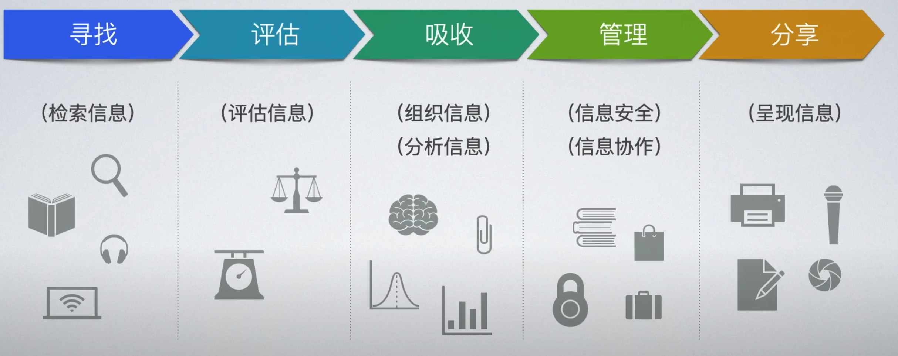
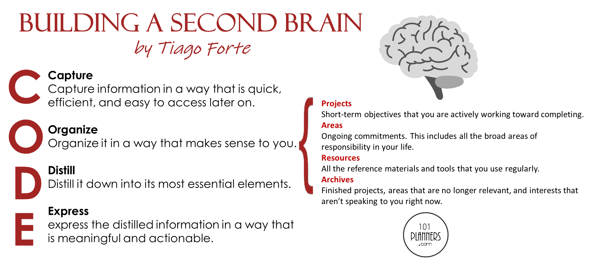
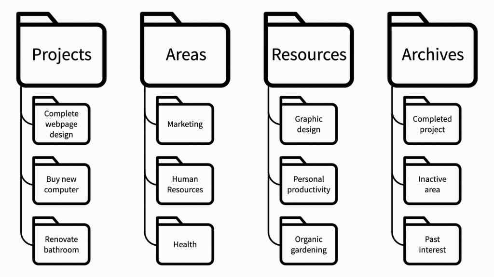
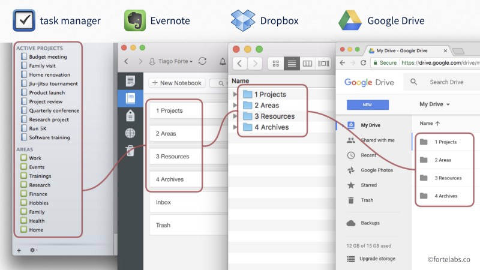
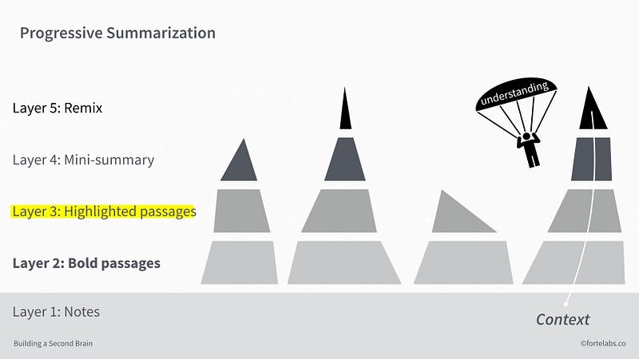
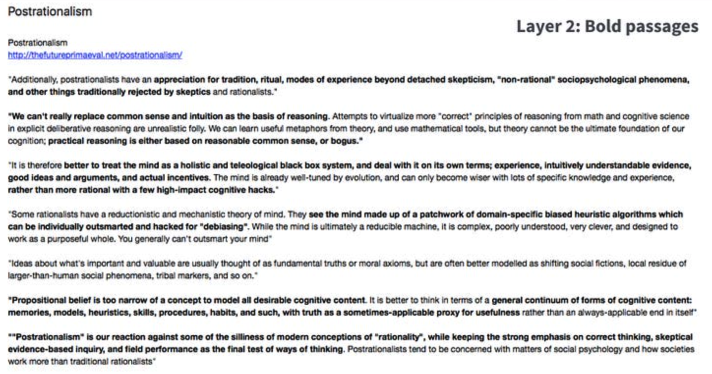
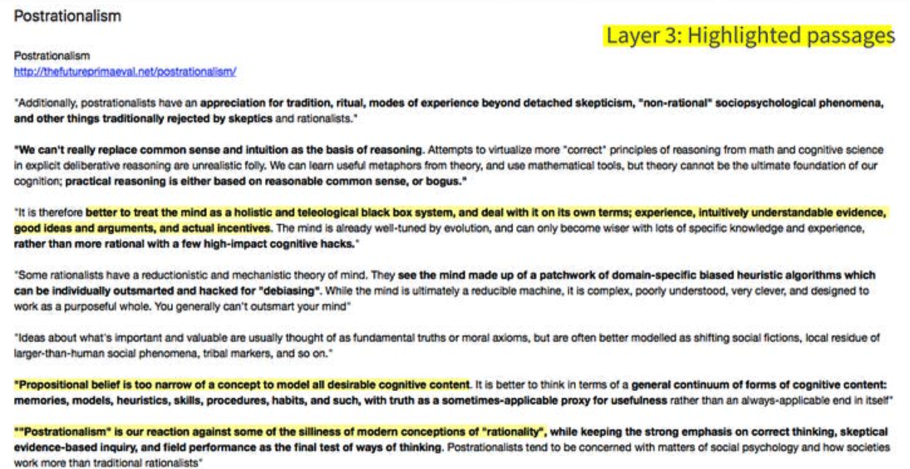
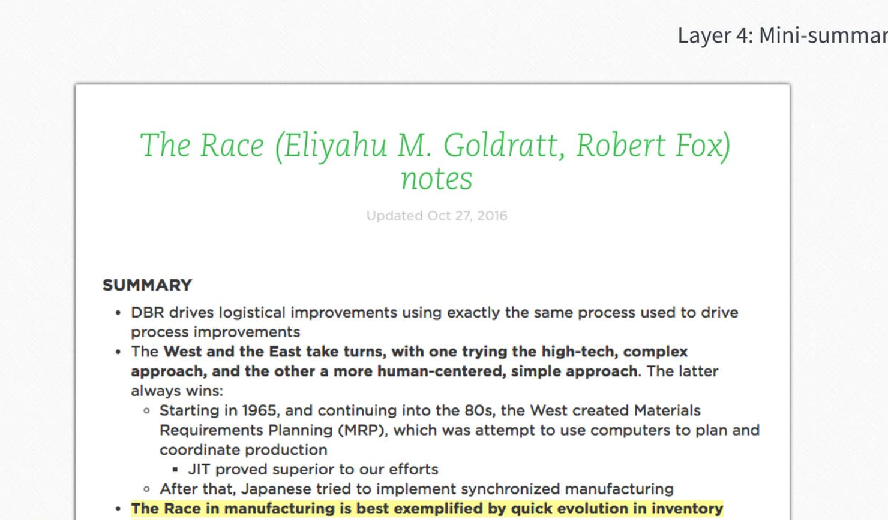
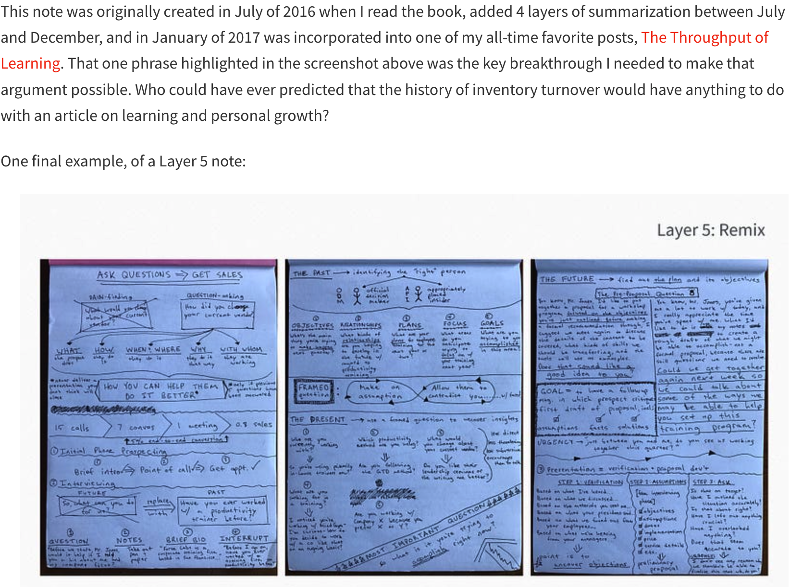
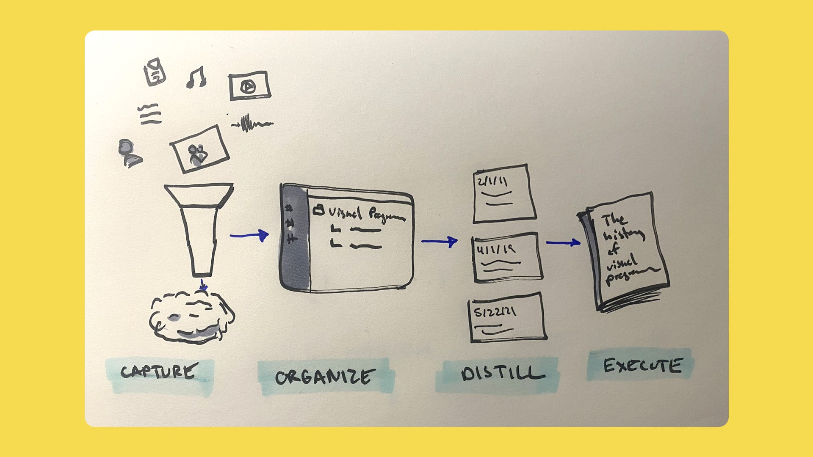

* content
{:toc}

PKM从提出到今年已经过去很多年了。也发展出很多方法论和流程。我们这里会介绍4种流程，Paul Dorsey的7技能，Tiago Forte 的CODE方法，田刚5步骤、沙牛清单方法。我们需要了解的非常重要的观念是：

> 所有的方法论都有适用情况。所有的方法论也不是绝对正确，

我们追求绝对正确（潜意识中）的结果一定是邯郸学步的状态。

但凡涉及到要调整我们思维方式的东西，学起来都会非常别扭。如何区分：
* 方法很好，只是我不好，学不会，怪我学艺不精
* 方法很好，但是其实不适合我。没必要学

> 有一个简单的思考方向，从我们的需求出发，我们想要解决什么问题。

但是以我们当前的认知思维能力无法评判我们的内在需求，因为特别优秀的方法论和工具，内涵会颠覆我们固有的很多东西。这个时候我们也不需要妄自菲薄。可以在上面这个思考点上加上一条，假如我已经学会了，如何如何。

> 我们所期待的未来状态是什么

当然，如果生命中让我们遇到了它，也许我们真应该花点时间了解。

下面会介绍这几个方法，和我对这件事的思考。

<!-- more -->

# 1、知识管理流程方法论

> 介绍这些思维方式是为了让我们了解，大家对知识管理的思考，希望给我们多一些启发
> 信息孤岛一直存在，实际上也没有办法消除，知识管理的痛点之一就是我们需要花大量时间（1/4）在处理这些信息孤岛的连接。疲于奔命。

### Dorsey7技能

| 技能 | 说明 | 补充 |
| --- | --- | -- |
| 📥 Retrieving （检索） | 通过搜索引擎搜索，查找电脑的文件，也包括问同事问朋友 | |
| ⚖️ Evaluating/assessing（评估）| * 评估信息优劣，是否可靠，真伪 \ * 和当前任务相关度，是否马上能用 |  |
| 🗃 Organizing （组织）| 信息放哪里，如何放，它是我们前面提到的各种问题的关键技能，文件存放还是资料库存放，放本地硬盘还是放nas等。图片如何放，影音如何放，照片如何放等。| 放得合适才有可能高效利用|
| 🔎 Analyzing （分析）| 知识内化的过程，从信息中得出结论 | 君子驭物，核心是人 |
| 👁 Presenting （呈现）| 用什么形式展示，博客，公号，视频等 | 从受众出发，别自嗨 |
| 💾 Securing （安全）| 硬盘损坏或者忘记密码，或者其他 | 备份，同步 |
| 📝 Collaborating around （协作）| 这里的协助是围绕信息的协作，各种即使通讯工具，甚至各种企业软件应该都算 | |

**信息安全** 有一个非常惨痛的教训，工作10年左右积累的大量内容因为硬盘丢失而丢失了。有一部分内容通过网盘等方式恢复了，但是还是有很多内容找不回来了。后来做了几个事：
* 重要文件单独存放，并多处同步（个人学习产出，个人信息，家庭信息等）
    * dropbox
    * nas
    * 百度云盘
* 有些文章之类的，分发给同事朋友，以后还能找回来
* 严格限制收集的内容，从那个时候开始，电影和音乐基本上不收集了
    * 大部分能能很容易找到，另外开通些会员
    * alist配合阿里云盘，高清的东西很容易找到
    * 大部分文章，文档都不会再看，
* 电子书也是一样，要看的时候买或者下载都可以，丢了并不可惜

[参考文档](https://web.archive.org/web/20090523110010/http:/www.millikin.edu/pkm/pkm_istanbul.html)

> 老实说，看完这个，能给我们一些启发，告诉我们需要哪些技能，但是确实无法有很实际的指导。

下面这个图是从杨奇油管频道中截取的，相对来说，更直观一些

### C.O.D.E 方法

Tiago Forte把知识管理分4个部分，分别是Capture（捕获）、Organize（整理）、Distill（提炼）和Express（表达）

#### Capture收集

收集信息很好理解，但是常常被我们忽略。这里我认为是有几个比较重要的角度

* 听过就听过了
我们平常看到一个视频，和朋友聊一个东西，觉得有句话很有启发，如果没有及时记录下来，时间一长就忘记了，甚至都忘记是哪里听来的了。所以很重要的一点是我们能有个机制快速记录下来

* 看过就看过了
看到一本书一篇文章，有些内容很不错，但是不知道记录在哪里，有时候记录在本子上，有时候记录在记事本里面

* 灵光一现
走着走着突然一个激灵想到个啥，然后在脑子里面回味一下，然后就忘记了，甚至掏出手机想要记，等找到合适app，打开app，忘记了……

* 工作中的积累
我们知道，真正决定一个人和别人不同的，是不断总结提升自己。但是往往这又是很困难的改变

> 从个人角度来看，我们打造知识管理系统很重要的是，如何建立一个非常丝滑又能应对大部分情况的信息收集体系，可以是软件可以是纸笔（比如随身带个小本子之类的）

#### Organize整理
信息收集回来以后，需要整理，虽然我们不赞同重度整理，但是适当的整理才能让我们从乱石丛林中快速找到需要的知识。

在整理上，Tiago Forte给出了P.A.R.A的方法
* Project，项目文档
当前在干的，有时间限制，结果明确的任务。这么说不太直观，
我的理解就是**最近干的活，都放这里。每天都要打开的文件夹，就是这个Project。**
* Areas, 领域
存放需要长期耕耘的领域的相关文件；
没有截止日期，包含多个项目，并且需要一定的标准去维持，需要时不时的关注。
我的理解是**我要学习AI，有很多方面的资料，长期关注的**
* Resource：资源
支撑项目、领域运转的外部和内部资料。
存放与主题或兴趣相关内容，它们可能会成为未来课题的来源；
我的理解是**前面这2个内容中涉及的资料都放这里**
Archive：归档
那些永久的，不常提取的文件。
我的理解，**前面那些东西都可以移过来**

> 为什么知道很多道理却过不好这一生，因为这些道理举的例子，到我们真正的实际情况，中间还有很多细节被抽象掉了。

其实我们思考一个场景就可以了：
> 我要学习AI，每天这个领域都有很多知识，比如说推，油管视频，公众号，各个群。然后我决定先从机器学习入手，
> * 【决策点1】所以找了一个机器学习的课程，如果下载放哪里，如果不下载这个链接存哪里。
> * 【决策点2】显然我一次性学不完，需要好几天。东西放哪里
> * 【决策点3】学的过程中我发现，线性代数很重要，我得去补，中断一下机器学习。机器学习放哪里。
> * 【决策点4】过几天机器学习学完了，我这个时候就想着整理笔记，输出点东西，这个写的过程，东西放哪里
> * 【决策点5】中间用到的资料放哪里，写完以后放哪里，以后还要修改版本，放哪里。
> * 【决策点6】学完发现有些文章没用到，但是感觉可能有用，是删除还是留着呢，留着的话放哪里呢？
> * 【决策点7】接着学神经网络。发现概率论也得学，概率论的课程还挺多的，可能多看看，这些东西放哪里呢？

从文件夹结构上可以看下有人做的图。但是对我来说，写到这里，其实更大的困惑在于这些文件夹之间按什么规则如何移动，新的文件应该放哪里，以及子文件夹的规划。（当然，可能相通了，就不用管了）

> 个人的体会是，没有完美的方案，只有那个阶段合适的方案，建立的时候痛苦一些是正常的。从原则来说大概要满足：
> * 简单，只有简单才能更好坚持
> * 直观，原则不能太拗口，最好不要去思考
> * 平衡，兼顾存放和拿取方便。
> * 不完美，始终存在一个temp，一个临时区域，让自己接纳不完美 

#### Distill提炼
* 知识内化
总结文章大意，找出核心观点或者探寻相悖的论断
* 浓缩知识
尤其针对音频，视频内容，用关键词或者描述方便检索，建立它们之间的关联

> 浓缩知识个人认为应适合在组织这个步骤去做，视频音频类都有一些工具管理，而且大多数有刮削器

这个步骤里面。还有另外一个更有指导性更强的说法是`渐进式总结`。核心逻辑：
> 为了避免`信息过载`，首先要明确的是：遇到了什么问题,想提升什么能力。开始前先想好这个事。

字面理解就是加粗，高亮，总结和混合。其实我们大部分人在看书的时候，这几个步骤都会去做，至少划个线，加粗，荧光笔画一下总会做。我会在内容旁边写一些自己的疑惑和总结。但是后面的步骤就没有继续做了。

> 我想可能很多人不能特别好养成阅读习惯，大概是这个闭环不能很好建立，而且反馈不及时。

[Progressive Summarization II: Examples and Metaphors](https://fortelabs.com/blog/progressive-summarization-ii-examples-and-metaphors/)

这篇文章里面做了一个说明，大概是这样的，
* 第一步，先快速浏览一遍

* 第二步，重新看，加粗`关键重要的部分`，加粗的好处是要关注的内容大大减少了。

* 第三步，再看，高亮`最好部分中的最好部分`，内容进一步缩短

* 第四步，总结

* 第五步，关联/混合，我的理解是和其他知识产生练习了

> 看起来比较适合那些不太长的内容，还有适合精读的内容。当然，这是当前我给自己找的借口，实际上这个过程是需要专门刻意练习的。

> 前面这几个步骤真要落实到自己身上使用还是有很多不顺畅的点的，比如说纸质书咋办？文本内容建议用啥工具阅读方便加粗加字体（calibre倒是可以）。写好的笔记放哪里？如何快速的找出来？如何建立关联呢？

文章里面还提了一些原则和建议，大体上是：
* 不是所有知识和笔记都要走完所有步骤
* 每个步骤的时间精力分配也要有所侧重
* 什么是重点，`共鸣`，是很好的标准，或者说那些`触动`你的部分
* 不要高估自己，按自己最懒散的状态设计这套体系
* 认知胜于回忆（就是完全内化的意思吧）
* 笔记看起来一目了然

#### Express表达
展示自己的成果。有个很重要的观点，从外部观察:
>产出就是你的总和，输出的内容决定了你是谁

> 这里我的理解是，产出不一定是文档（文章或者视频）的形式，为了方便自己回顾迭代升级，这类产出固然很重要，但是更重要的，还是自己切实发生改变的解决问题的能力，更强的思考能力，对事务更深度的思考。

### 田刚5步骤
田刚在《你的知识需要管理》中把知识管理分成了5个步骤，分别如下

#### 知识保存

#### 知识使用

#### 知识共享

#### 知识

### 沙牛清单方法

# 2、知识管理的目的和流程

### 1.1 学习知识
保存知识
使用知识
共享知识
创新知识

目标

思路

如果用起来很别扭，可能是啥问题呢？可能是我不会，可能是没必要，从目标开始考虑

# 1、知识的使用

# 2、知识的分享

信息孤岛问题

 如何学习知识

## 如果保存知识

如果一段时间没有学，说明没必要学了，可以丢掉

## 如何分享知识

## 如何创新知识

## 知识管理的框架

捕捉->整理->反思->应用->分享->更新

现在的卡点，比如写文章，时不时为找不到文章发愁

另外时不时会有些想写的主题，但是没地方记录就忘记了

流程的中间部分可以小范围自动化，不要过早自动化，流程本身更重要

不追求一开始就完美，先开始比较重要。

### 4.1、

## 知识的来源入口
* 临时想到一个事
* 看到一个视频/一本书/一个网页
* 听朋友说
* 聊天交流中的一些内容
* 最近想要学习的东西
* 工作中的一些心得体会
* 收听的播客
* RSS的订阅
* 计划复盘

不要追求大一统

规则和流程

知识管理=知识+管理
知识=知识库+信息库
管理=规则+流程

记录在备忘录的东西，啥时候去看，每周定时看吗

少管理，不追求一个工具，不同工具做不同的事，首先是把事理清楚。减少管理，

选工具的目的

学习一个东西的过程中，有写过程的结论想记录下，但是翻到原来那个文件很麻烦，咋办

## 知识的状态

# 4、知识管理的流程和原则

目的是什么，高效使用，高效复用

让自己很心安，啥都可以弄，可以弄一些准入门槛，门槛不宜过高

# 1、知识管理系统的目标

# 2、知识管理的思路

# 3、知识管理的工具

如何看待日常嘈杂的声响，而错过机会？
他们有登记之分吗？
如果搭建自己的体系，让这个过程变得顺畅。
取决于你想干嘛？

没有放之四海皆准的体系，也没有一成不变的流程，世界在变，你也在变。够用就好。如果决定要使用，每个工具我们都应该深入研究，同时我们也应该清楚知道，我们这个体系的框架在那里，骨架不变，那就只变其中的环节。

我们知道chatgpt可以快速做摘要，可以帮我们快速阅读，但是我们知道，读一本书该多久还是要多久，这就像是我们自己工作中最擅长的部分，可以总结出一些东西，通过ppt讲给别人听

但是我们有大量的不知道自己知道的内容，并没有讲出来，所以听的人其实是没有办法公顷的。而这些内容就隐藏在整本书的论证过程中，

我们学习的过程，很多时候是因为知道了10个知识点中的8个，

知识可迁移

知识树和知识灌木

一门深入，尝试薰修，一通百通，前提是已经走到最后了

所谓学习曲线抖是指什么？

所以需要管理一个标签？

学习知识的4个想象，为什么你没听懂，为什么好像听懂了不会做

知识树和知识灌木

完美？

能不能坚持？

中学为体是什么意思

最终的目的是什么：结论前置

心理建设
知识管理的技术债
如何更好的处理精读和粗读
追求一劳永逸终将疲于奔命
过犹不及始终需要调适
# 4、用哪些软件来落实知识管理
# 5、曾经走过的弯路

很多年前接触过UML和RUP，当时的经理在论坛很活跃，但是产出很有限。很多年以后做咨询顾问，回想起这段经历。工具是协助思维想法流程落地的，更大的价值在于前面的梳理。然而对于很多人来说，工具就像是十八般武艺，一技榜身，行走天下，信奉技多不压身的理念。殊不知，从来没有跳出低层重复的泥沼和陷阱。

放弃图床是因为一直没折腾好iPic这个东西，这里其实反应出自己的急功近利，同时也容易失去目标。急功近利的意思是看到这个东西想要弄，结果一点困难就吓倒了，下次和人说的时候，这个话题是可以讲的，但是不会太深入。始终流于表面

只针对个人！！！

你ihao

confluence，很久没用了，尴尬，里面不应该放附件，插件多了也不合适

学得百家从，使得龙凤放，前提是有个基本的体系在，糅合所有优点，最多是个四不像，从最基础的部分出发

# 参考资料

* [https://www.cliveshd.com/building-a-second-brain/](https://www.cliveshd.com/building-a-second-brain/)
* [https://zhuanlan.zhihu.com/p/508824878](https://zhuanlan.zhihu.com/p/508824878)
* [https://fortelabs.com/blog/progressive-summarization-iii-guidelines-and-principles/](https://fortelabs.com/blog/progressive-summarization-iii-guidelines-and-principles/)
* [https://www.youtube.com/watch?v=KtOyhY5DdD4](https://www.youtube.com/watch?v=KtOyhY5DdD4)
* [https://www.yangqi.show/posts/what-is-pkm](https://www.yangqi.show/posts/what-is-pkm)