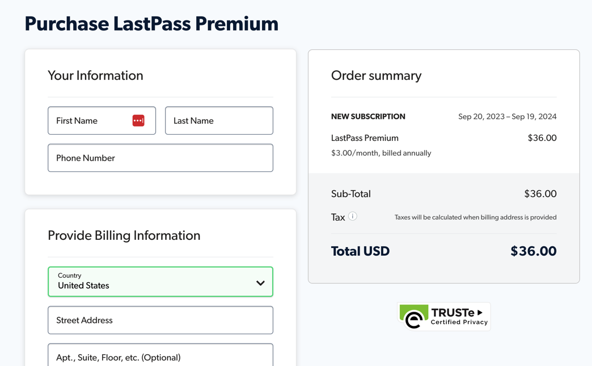
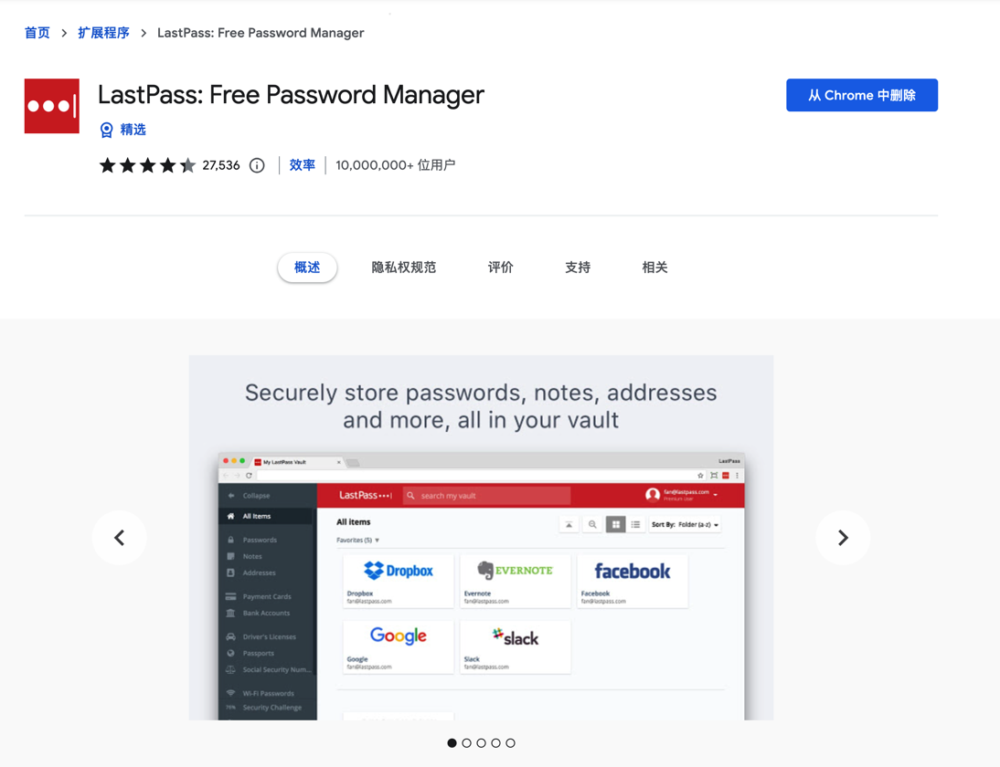
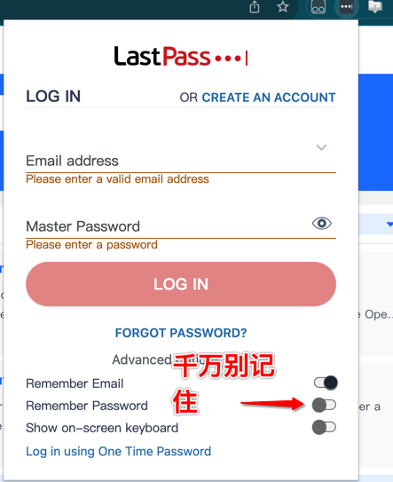
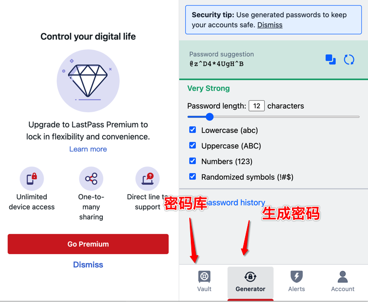
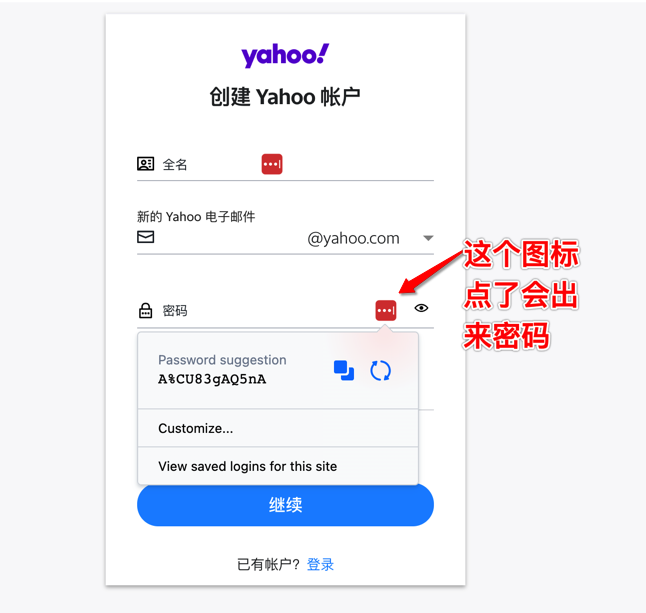
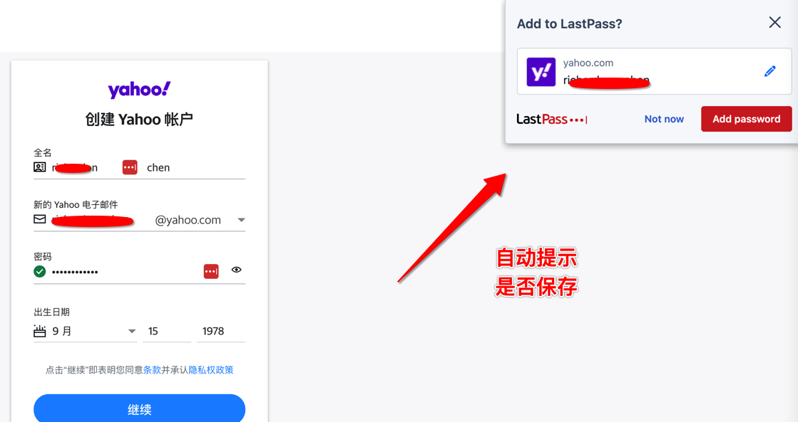
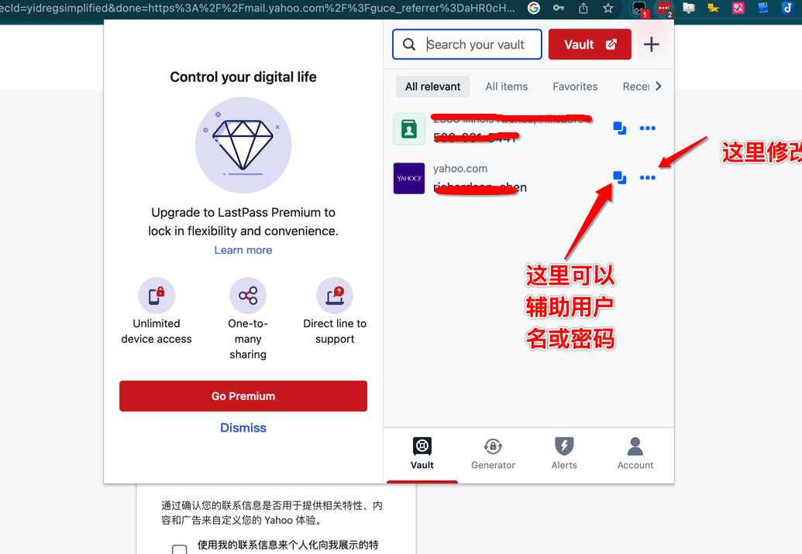
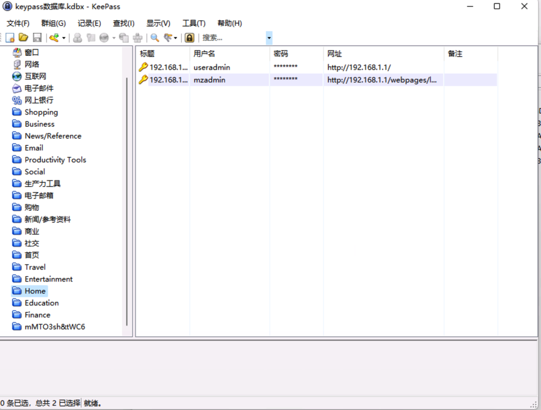
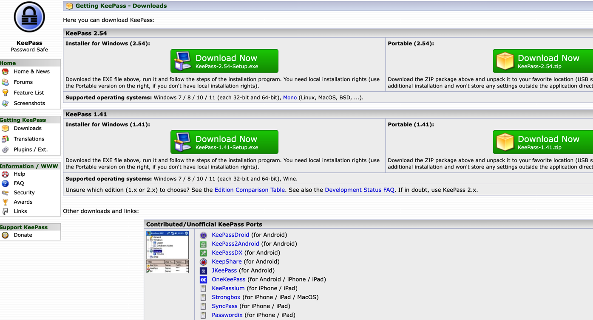

* content
{:toc}

密码管理为什么要放在知识管理里面呢？这里就不得不说知识管理一个很重要的原则，信息集中，知识集中。

原因很简单，我们不希望做重复劳动，也不希望因为密码的事分心。有些人所有的网站都用一个密码，简单好记。当然可以，出问题的时候也是一锅端的。

另外还有一个状况是有些网站开始要求密码复杂化，包含大小写，包含数字和特殊字符，这个可就要难住一部分人了，因为它还会要求不能太容易猜。

所以对于密码管理我们希望通过系统来实现：
* 它可以帮我们生成符合规则的复杂密码
* 它可以帮我们区分不同网站
* 它可以自动帮我们筛选当前网站密码辅助填充
* 它不能限制客户端数量（用了10年的LassPass限制3个终端）
* 没有网络也能用
* 不同设备间可以同步

<!-- more -->
# 1、Lasspass
用了10多年了，还是挺有感情的，但是费用不低，打算放弃，里面存了差不多500个密码了。另外前几年好像说是被拖库了。

费用和其他的几个比不算太贵，但是主要是拖库的阴影有点吓人！

## 下载安装
最初只用了Chrome插件，后来有了手机客户端，但是后来在Mac上的Safari浏览器无法安装扩展需要另外启动一个程序，算了，老老实实用Chrome吧。

注册比较简单，可以去他们官网注册。也可以在插件里面注册。

它有一个主密码，可以想象这个主密码还是要复杂一些吧，里面的密码可全靠它了。当然我们如果不在意密码，主密码可以简单一点。

> 主密码不要记住！！！因为如果一直不用主密码登录——会忘记的！！！

Vault就是密码仓库，Generator是密码生成器。

## 创建密码
我们进入一个网站要注册的时候，它会自动识别密码框，然后会有个按钮出来，可以选择密码

个人习惯上都会点复制按钮，也就是2个方块叠起来的那个图标，它其实会自动记住密码。

## 修改信息

插件会显示符合这个网站的密码数，可以修改添加备注，点开 Edit Item以后的界面是这样的：

## 自动填充
就是登录的时候，自动会帮我们填充密码，这个和浏览器本身自带的那个差不多。

## 密码质量检查
它提供的额外功能，就是检测我们密码质量，因为有些临时网站密码都很简单，另外考虑到手机登录，可能就弄特别简单了，它会提示。

## 导入导出
它可以导出密码，就是一个明文的csv文件，导入其他地方也方便。

## 技巧
前面那里有个Name，yahoo.com,这里建议要加全一些，比如我们是多个帐号的，就写成是
yahoo.com(帐号xxxx)。这样做的好处是修改信息那里的列表展示，会更清楚一些。要不然容易弄混，看起来都是 yahoo.com。乱

# 2、1Password
没玩过，据说是老大

# 3、Keypass

开源方案，可以自己部署。说起来其实就是一个文件管理器，目前是通过Dropbox同步的。

Keypass看起来是纯开源的，意思是说，人家给咱一个桌面程序就不错了，iOS，Andriod的就顾不上了。所以这些都第三方做的。看起来还做了挺多版。不过话说回来，这种东西，多了，只能说力量很分散呀。我用的是Keypass Touch。

。

## 同步
它最终会有一个文件.kdbx文件，我们只要同步这个文件就可以了。

# 4、BitWarden

## 下载安装

## 

# 5、浏览器自带
用习惯了也还好，但是毕竟还是没有其他几个，管理上方便。

# 结论
首先我们需要有一个工具帮我们统一管理密码。然后它能跨平台管理维护的。

* lastpass: 基本上够用
* 1password: 应该是不错
* keypass: 还是挺折腾，因为各个平台不一致
* **BitWarden**：有服务器的首选。各端一致。
* 浏览器自带：见仁见智