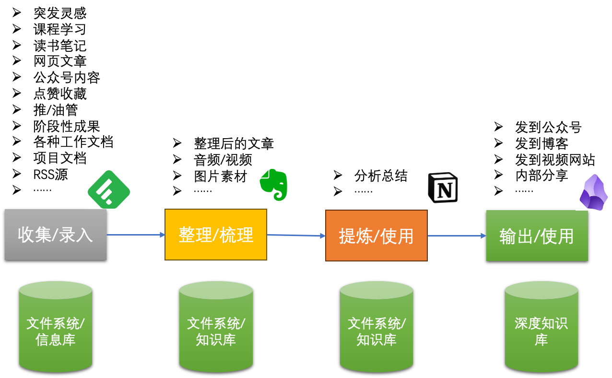
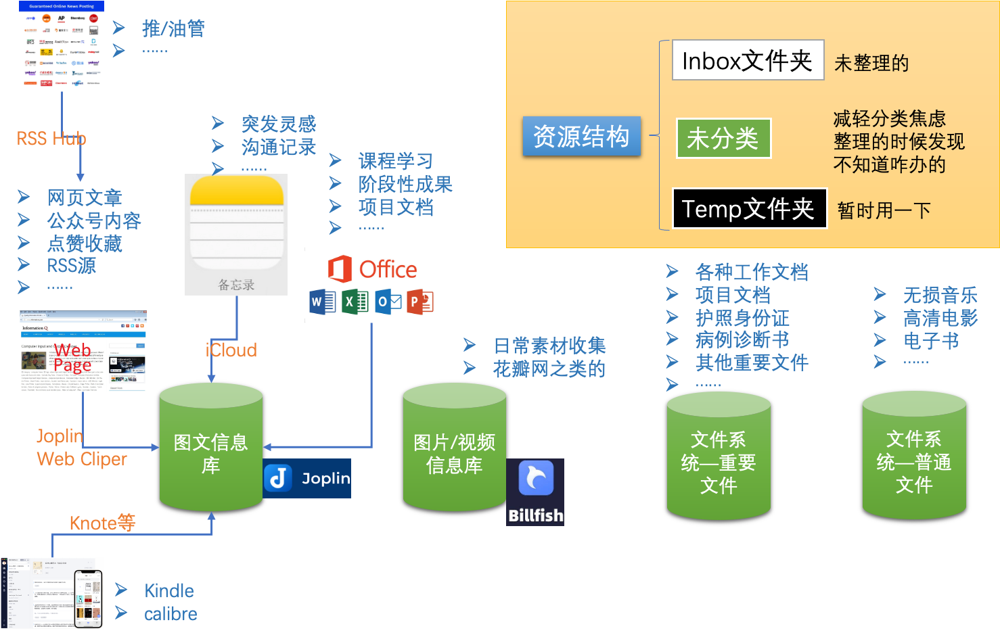
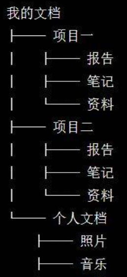
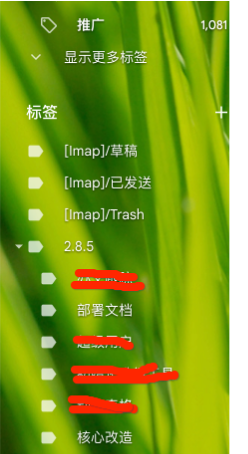
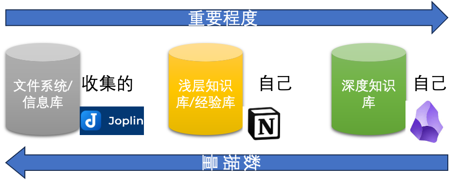
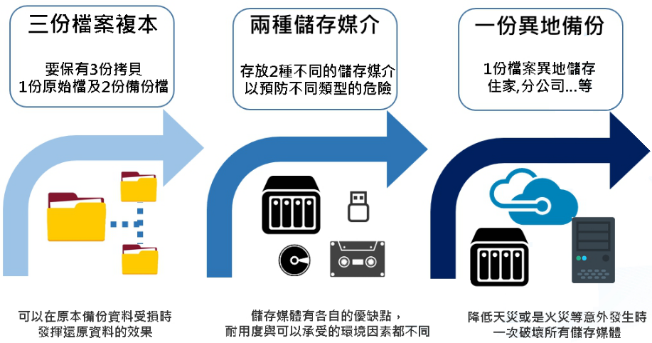
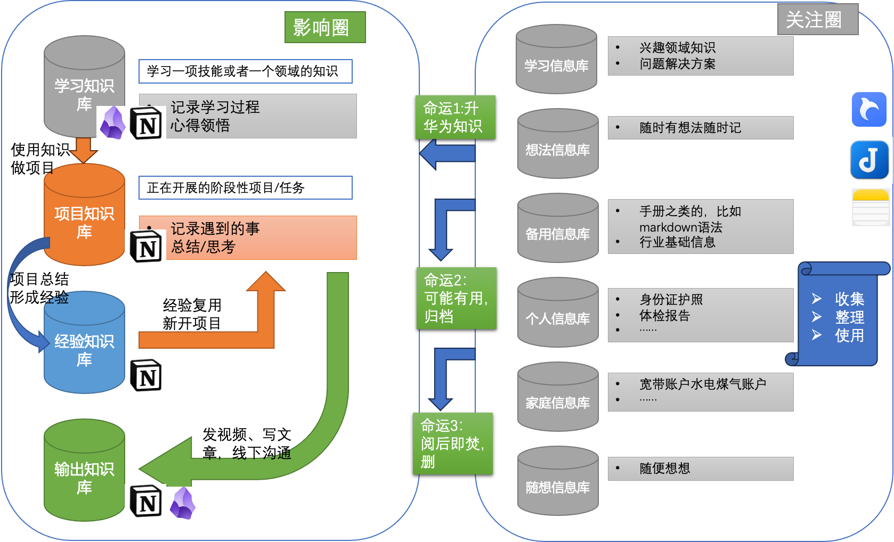
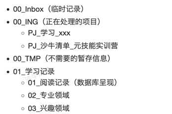

* content
{:toc}

将知识管理分为4个步骤，根据不同类型的知识分别提供不同的方案。另外为了切实执行，指定了整体原则。

<!-- more -->
# 0、整体原则

## 01、整体优先，延迟优化
* 对于具体场景来说，优先考虑贯通整体流程
* 延迟优化。如果其中某个环节涉及的操作或者软件不是很高效，先不优化，确保整体流程贯通，然后再来优化。
* 不要过早开始自动化，流程跑通更重要。

## 02、简单可依赖
不期望一个软件解决所有问题，确保整体流程贯通。不让软件做它很别扭的事。

## 03、适度原则，拒绝完美
有几个方面的考量：
* 平衡投入产出比，如果这个软件很折腾，需要花费大量精力，可以考虑换掉
* 主要针对不太重要的东西，不用过度去整理，乱就乱一点。

## 04、一致性原则
各个系统中的存放规则大致类似，不需要特殊适应。如果某个软件需要用到特殊的东西，尽量不用，避免将来迁移成本过高。

# 1、整体框架

之所以要这样去考虑知识管理，是为了让我们有一个抽离软件，知识类别和知识内容的思考视角。核心是为了让我们能减少这些思考方向的羁绊去思考整个知识闭环。

## 1.1、收集/录入
在开始之前，我们需要从自身的实际情况出发，思考我们的信息来源有哪些。这里最好是多一些思考维度和思考角度。
### 使用频率
为什么要考虑这个视角呢？因为我们目的是为了收敛知识管理的范围。使用频率不同，我们对它们的存取速度要求也就不一样。比如照片，我可能不会有那么高的频次，工作中的文档频次就高很多。

### 重要程度
这个也很好理解，重要程度高的，比如深度整理的知识，需要重点考虑。平常网上收集的资料就弱一些。大部分的软件安装程序甚至连管理都不用去做。差不多了就可以删了。

### 文件格式
文本文件，office文件，图片，视频，照片，软件安装包等等，

### 资料用途
日常家庭工作的照片文件等，
* 工作中需要提升的技能如ppt制作（最终输出个`手册`之类的就可以了）。
开启思维观念，如知识管理这种（需要`深度实践`，`深度思考`）。

### 收集渠道/方式
* 群里有人发了一个文档看起来不错
* 有人发了一篇文章看起来不错
* 语音录入等
* 计划复盘

> 收集环节对工具的要求：
> * 快速录入：比如有个想法要快速记录下来，如果一个app打开老半天想法都忘记了
> * 多场景：当前的场景是手机，它就需要支持手机，当前的场景是浏览器它就要支持浏览器
> * 使用简单：录入信息了拿还那么多事呢？

> 收集环节的原则：
> * 没啥必要就别折腾了

目前考虑的收集工具是
* iOS自带的备忘录
* joplin 的web cliper

待研究方案
* feddly
* raindrop.io
* cubox
* poket

## 1.2、整理/梳理
这个环节要考虑将前面收集的信息做整理，通常对信息的整理有2种思路，文件夹结构和标签结构。文件夹结构很好理解，就是树形的结构。我们换一个角度可以理解，对于一条信息来说它就有了一个属性，就是文件夹。目的是为了我们更好去找到它。

虽然看起来很清爽，但是同时也限制了它，只能有一个属性，显然我们不能为了有不同的视角去复制很多份。当然，对于文件系统中的文件来说，它的属性并不需要太多。在Mac中，提供了一种解决方案，也就是加颜色标签。但是在频繁使用的知识显然就不够了。在GMail中，它提供了一种解决方案，为邮件加上很多标签，相当于就是一个不同视角的筛选了。

> 文件夹和标签都可以认为是一种筛选文件，筛选信息的手段。从不同的维度去看待这些知识。

GMail中的标签是可以有子标签的，这样一来可以减少一级标签数量。

### 整理原则和技巧

在这个环节中CODE提供了[PARA方法](./2023-08-23-ru-he-da-jian-shu-yu-zi-ji-de-zhi-shi-guan-li-ti-xi-unknown-si-wei-pian-02-unknown.md)。

也可以参考这个标准来，除此之外建议有2个文件：
* **inbox**。 还没有整理过的
    * 这里需要注意的是，它应该是常常要清空的
    * 原因是，如果是一时半会如果用不上，很有可能一直也用不上
    * 实在不行另外弄个文件夹，``未分类``作为过渡
* **temp**。临时文件夹
    * 应该要清理

### 文件系统和资料库取舍
如果信息不是很多，常常要用，建议是放在资料库中，比如身份证护照扫描件。小朋友各种信息等，不会很大，也不会很大，放在文件夹其实不方便。
    
> 整理环节对工具的要求：
> * 有标签功能
> * 支持Markdown
> * 可以导出导入
> * 可以同步备份
> * 本地私有部署
> * 筛选查找功能

> 整理环节原则：
> * 过犹不及，不要的就果断删掉
> * 以达到高效筛选查找为目的

目前考虑的整理工具是
* 资料库
    * joplin
    * billfish
* 文件操作辅助工具
    * directory opus
* 待研究
    * 思源笔记

## 1.3、提炼/使用
这个环境比较重要的是对信息的加工和思考，在整理部分我们只是对信息放在合适的文件夹下，加上合适的标签，最多加一些简单的注释。而到了提炼环节，我们需要对知识进行整理和思考。比如现在要学习AI，这个时候就应该对这些内容做一些总结，整理，加上自己的思考。也可以认为是精读的产物。

### 技能性，操作性的清单
这个技能性的比如说服务器操作，可能会反复需要用到的，安装ssl证书等，可以形成一个命令行清单，下次可以照着做。这个过程中，会涉及到很多参考文档，还有自己操作时候的信息记录。

或者家里安装个啥东西。

> 这次为了学习知识管理，回头看了一下自己以前在印象笔记中的内容。差不多都是10多年前的技术文章，几乎没有用了。所以这里也给自己一个启发，这种大路货是没有必要放到知识库里面的，收集一下还可以。如果作为自己的知识库内容就没必要了。

### 认知类的，心得
举例来说，学习知识管理，这是一个持续的实践过程，中间会收集很多资料，那么我们在打造自己知识体系的过程中会有一些心得，可以记录下来。这个过程会存在反复优化。加深理解。知识管理的理论理解，和知识管理涉及工具优化调整。
这个过程中就显得尤为重要。

### 计划复盘
这个是一个很重要的深度思考来源，所以放在这里提炼这个环节。复盘的过程就是一个非常好的外部视角观察自己思维模式的过程。

> 提炼环节对工具的要求：
> * 支持标签、分类
> * 支持Markdown
> * 有分析功能（因为涉及到知识反复使用）
> * 可以导出导入
> * 可以同步备份

> 提炼环节原则：
> * 不要重复前面的收集工作
> * 尽量只放自己思考过的东西

目前考虑的工具是
* 资料库
    * notion
    * obsidian
* 待研究
    * 思源笔记

## 1.4、输出/使用
输出本身固然是重要的，因为在输出的过程中会强迫自己发现很多的思考卡点，然后需要进一步收集信息，也是一个深度思考的过程。它本身是一项非常重要的思考过程和思考产物。更重要的是这只是起点。随着时间推移，深度思考的关联性开始显像。建立它们之间关系就很重要了。

输出的内容建议是markdown保存，随时可以转换。另外最好是有版本管理。
 
> 输出环节对工具的要求：
> * 有标签功能
> * 支持双链
> * 支持Markdown
> * 可以导出导入
> * 可以同步备份

目前考虑的工具是
* 资料库
    * obsidian
    * github
    * workcopy
    * typora

另外，从知识的逻辑上划分，他们的重要程度是这样的，最重要的是管理好自己输出的内容，已经这些内容将来可能产生的价值。

# 2、资料备份

因为几次数据灾难，所有有了一些小小的思考。

## 备份321原则

| 原则 | 说明 |
| --- | --- |
| 3份副本 | 备份的文件至少是有3个副本，也就是原始1份 + 2份拷贝 |
| 2种媒介 | 至少2钟媒介，媒介包括   本地硬盘   各种云盘   移动硬盘   Nas |  
| 1份异地备份 | 至少有一个不在本地，我的理解就是云盘了 |

> **定期冷备很重要** 如果要真正做到这个备份原则并不容易，但也确实给了我们一个思路。这里容易有个误区，因为我们手工去做会比较繁琐，能不能全部自动化呢？不是很建议。因为这个备份原则还有针对勒索病毒的意思。如果都自动了，不是全部都搞死了吗？所以重要文件的定期冷备也很重要。

我的方案算是偷懒的方案。
* 重要文件通过群晖的Drive同步，这个时候已经完成了2个副本+2种介质了
* 另外通过移动硬盘定期备份，就补上了介质
* 但是异地还做不到，简单的办法就是把硬盘放公司/Nas放家里

## 2.1、文件系统
**特别重要的文件** 
放在一个文件夹里面，这个文件夹就花点心思弄结构吧。这个文件夹做多重备份。目前是用Dropbox，因为空间小，所以也限制了自己对重要程度的判断。

**网上收集的视频啥的**
如果不是特别稀缺，甚至都不用刻意保存，真想保存就弄个大的云盘放着吧

**照片**
建议用百度云，阿里云，iCloud等同步，我用的是群晖自带的服务，另外谷歌也备份了。

**电子书**
老实说，大部分情况下不会看的。只放自己看的，不看的那些也只是收集。我目前的方案是有2个文件夹，一个待整理，一个是给calibre-web用的，它会自动刮削信息。也可以传给kindle。

## 2.2、资料库
这里说的资料库主要是针对joplin，obsidian的备份，通过群晖Drive备份，同时又给OneNote也同步了。
> 为什么可以做到这点是因为这些软件大部分都是通过一个数据库文件+普通知识文件这样的方式，整个文件夹备份就可以了。

## 2.3、手机备份
买了土区的iCloud，如果没有特别必要也不截屏啥的了。
定时清理一下微信缓存。
关于土区iCloud可以参考 [土区icloud](./2023-04-20-icloud-hui-fu-shou-ji-hen-man--dan-shi-hao-xiang-mei-you-te-bie-hao-de-ban-fa.md)

## 2.4、硬件老化
因为接触了Nas，开始思考这个问题，一般来说，Nas最好是做Raid，硬盘冗余备份，相对来说，硬件相比数据，真没啥的。另外一个很重要的点是硬盘老化。

* **固态硬盘会死得挺挺的** 目前几次情况是死了就死了，数据恢复都很难。传统机械平台还可以自己修复一下，拷贝一下数据啥的，固态好像不行，可能是我方法不对。
* **适当冷备** 就是用移动硬盘等，定期备份重要数据，平常不通电。也就是`冷备`的意思。移动硬盘一直挂着很快就坏了，它不适合长期通电。所以也就有所谓冷备的说法。
* **买企业级硬盘，定期换** 最好是几年就让它退役吧，最好购买企业级的硬盘。相比数据，这个钱真不算什么。

# 3、各种网盘

| 网盘名 | 免费空间 | 价格 | 免费终端限制 | 是否那啥 |
| --- | --- | --- | --- | --- |
| Google Drive | 15G | 19.99刀/100G年 | 不限制 | :white_check_mark: |
| Dropbox | 2G，某宝可扩到18G | 19.99刀/2T年 | 3 | :white_check_mark: |
| OneDrive | 5G | 540元/1T年 | 不限制 | :x: |
| pCloud | 2G，做任务可到10G | 49.99刀/500G年| 不限制 |:white_check_mark:|
| iCloud | 5G | 22元/200G月 | 不 | :x: |
| Mega | 50G | 107.93刀/2T年 |不 | :x: |

*价格是2023/8月的*

## 3.1、Google Drive
google的网盘，默认有15G空间，但是这个空间是所有产品的总和，我的GMail用了快10G了，后面只能另外注册一个，用来放照片。

## 3.2、Dropbox
因为是免费用户，默认是2G还是多少，通过邀请可以扩展到20G的样子，某宝可以帮忙整，很快。主要是用习惯了，暂时还好

## 3.3、OneDrive
微软家的，用微软帐号就有

## 3.4、pCloud
默认是2G空间，通过做任务最多可以扩展到10G，类似于验证邮箱，下载客户端之类的任务，还有邀请好友。这个网盘有个奇葩的价格方案，可以买终生，不知道该说点啥……

## 3.5、Mega
常常有文件在这里，但是速度也确实很慢。

## 3.6、Nas
群晖自己的同步工具Drive，也是目前的主要同步工具。不便宜，机器加盘，几个K还是要的。值得!相对而言，群晖更成熟一些。它最惊艳的是它的在线Office功能真的很强大！有很多

# 4、几个环节的细节补充

## 4.1、关于Notion
选择Notion是因为它有数据库的功能，它本质上是一个网页工具，只是把数据展示和数据存储合并在一起了。改变了传统做网页的方式。它做了很多对知识管理的优化，这部分优化对没有深入知识管理的用户是不小的挑战。当然这个挑战是值得的。
更大的困难在于它是基于线上的，数据没有存储在本地。

> 如果从备份321原则来说，它是真的没有

## 4.2、关于Obsidian
我相信它的出现代表了一种方向，同时它也不会是终局，所以从知识管理本身来说，就不太期望过于依赖它特殊的部分，做到够用就好。这里就包括Markdown语法的问题。
标准的Markdown是很基础的，官方网址上做一部分扩展语法，但是现在很多软件都加入了Markdown方言。简单来说，如果从程序的角度来看就是：
* SQL语法有通用的国际标准
* 但是Oracle，Mysql等都有自己的关键字
* 如果用了这些关键字，系统就无法迁移到其他平台了

## 4.3、信息收集的思考
信息收集的时候，大部分功能都会有把网页转换成markdown的功能，但是好像没有去广告和杂项的功能，可能有但是我没有找到，这里可能需要考虑一下。问题可以描述为收集的时候如何

## 4.4、密码管理lastpass
密码管理的工具很多，用了lastpass差不多10年，最近因为收费的原因，计划转移到keepass。
基本上有几个点
* 密码生成，各种规则都可以适应
* 密码填充，就是不用记密码的意思

它也可以导出密码，现在是通过导出来实现备份的

# 5、沙牛流程参考

> 规则是依照流程来，现有流程再有规则。逐步优化。这个规则需要后续不断完善。尽量做到无脑丝滑。

## 5.1、基本结构说明

* **Inbox(临时记录)**
快速信息收集箱

* **ING（正在处理的项目）**
    * 它一定是项目
    * 还没有处理完的
当前需要关注处理的项目，项目都是用PJ开头的项目文件夹
    

* **TMP（不需要的暂存信息）**
做完就不不需要了的

* **存档**
比如换工作了，以前的内容可以放这里了，用不到了，但是毕竟是自己的劳动成果，就放这里存档

## 5.2、结构规则

梳理出一套适应各个工具的`通用结构`，好处是
* 这个结构可以在各个工具里面都用到，不用每次都想来想去。
* 一开始就建立，避免事后整理压力山大，甚至放弃

## 5.3、命名规则
录入的时候就给它改个文件名，养成习惯以后就不觉得麻烦。但是对后续使用它带来极大的便利。

## 5.4、标签规则

文件夹和标签的区别在于：
* 文件夹表示它是什么
* 标签，表示它有什么属性

独创的状态标签，前面用！，如：
* !focus
表示近期很重要，需要持续关注
* !todo
近期需要执行的
* !review
比如保存了一篇文章学习以后感觉特别好，需要重新看的
* !tmp
暂存的，用完可以删的

## 5.5、知识库规则
这里主要指知识要记录的相关详细信息。
* 信息类别（主要它在哪个阶段）
    * 学习相关
    * 项目相关
    * 经验相关

* 信息格式（便于后续复盘）
    * 基础信息，比如日期
    * 随时记录
    * 总结心得

* 学习规则
    * 勾画
    * 批注
    * 脱水（信息整体未必有用，必须要压缩）

> 这些规则本身也要记录在知识库中