* content
{:toc}

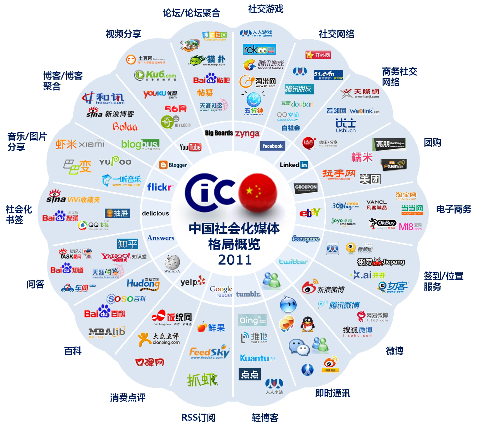

作为知识管理最前端的工作，就是如何快速收集信息，对于大部分接触知识管理，最终也是止步于此。原因可能有这样几个方面：
* 信息源不断增加，以前可能只有文件，网页，现在多了音频，视频，短视频平台，各种博客，各种社交媒体
* 有一些临时的想法，和朋友的交流等等，当时挺有触动，时间一长就忘记了
* 收集到各种笔记软件发现里面一团乱码，以至于都不想再打开了。
* 你说不看吧，怕错过重要信息，再不济和朋友的话题也少了呀，看吧，就看个没完，这事给闹的。

这篇文章就是来解决如何快速丝滑记录信息。

<!-- more -->
# 1、冷静，你想干什么

在收集这个环节我们一定要想清楚自己要干什么，首要的任务是如何快速收集，然后放那里。只要达到这个目标就好了。其他的都是锦上添花。

通常，我们面对一个新的应用，都会按照自己的理解先上去体验一下。如果没有完全用好大概有几种状况：

* **软件上手容易**。按自己的理解上去用，发现对现有工作有改善。这里之所以成功是因为应用设计者刻意降低了门槛。
> 这里的思维陷阱是，我们用了原有的思维模式，迁移了一个应用场景。

就比如说word，学会基本排版，然后就好了。因为我们在没有使用word之前，我们的工作模式就是这样的，并没有因为它是电子的，而多了一些东西。但是word本身有很多特别好的用法，比如有人没有使用过`格式刷`等等，在做大量Word操作的时候，就会非常低效。其他的类似Markdown语法，一开始有过一些html基础的，去看待Markdown就会用html的视角去看它，道理是一样的。

* **软件上手不易**。这类软件一开始就把它要传递工具理念摆出来，以至于连基本的使用都需要大量时间练习，适应，一般来说就放弃了。
> 这个时候我们称之为，学习曲线很陡。但是很多时候我们无法了解学会它以后带来的改变。这种改变就像是`飞轮`，会让我们进入另外一个不同的发展路线。

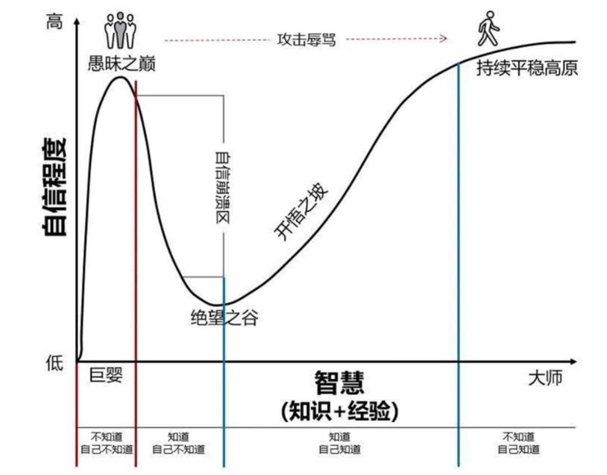


为啥要放这个图，是因为在知识管理这个领域，对我来说，最痛苦的不是应用，而是背后的那套体系。所以知道自己要什么，在这个过程中非常重要。

# 2、信息的归宿

> 信息库存在的价值是让我们有一个地方可以存放信息，但是它没有加工过，对我们的知识内化帮助不大，所以其实也没那么重要。不需要做深入的整理。它存在的另外一个目的，是让我们把更多精力放在更深度的知识整理中。

## 2.1、信息囤积的征兆起于收集
之所以要先讲收集到的信息归宿，是因为它会决定我们是否能走下去。最近打开了10年没打开的印象笔记，里面笔记有几百条，但是老实说我不知道如何用它们，可能当时也没有用。一想到要整理，就开始排斥了，特别是那么多的时候。

## 2.2、收集要快，整理也要快
这里简单把信息分成4类：
* 1、二进制文件，word，excel，pdf等
* 2、各种视频网站，各种播客等
* 3、网页信息，各种论坛，新闻，博客，公众号等
* 4、自己临时的想法等

这次主要针对的是3和4。1会在后面的文章中探索。会详细探讨P.A.R.A的文件组织方法。基本的概念前面的文章中有提及。把文件夹归4类，分别是项目（P），领域（A），资源（R）和归档（A）。我们收集的信息，基本上都可以算作资源。所以不会有很多的整理工作。

### 快速收集
从上面的场景来看，要做到快速收集有2个基本的手段
* **针对网页**，我们就选择网页剪藏功能。所谓剪藏字面意思理解是裁剪+收藏。
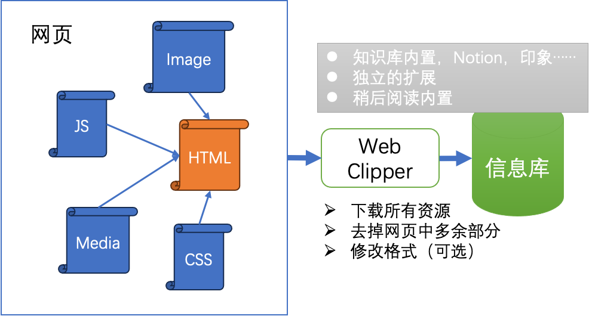

从这个图上我们可以看出来，发展到今天，大部分剪藏功能的功能是类似的，一般也都提供了从网页到Markdown的功能。从这个角度来说，选择哪款剪藏器，取决于最后我们选择用啥做信息库。

* **针对信息**
就用手机备忘录（iOS）,或者纸笔。在iOS上，`可以把备忘录加到首页`。

### 整理要快
整理要快的意思是我们需要给自己制定一个整理周期，定时整理这些信息。如果时间过长，很容易就会陷入囤积症侯。为了做到整理快速，给自己减轻心理压力。整理的规则很简单。

* 所有文档进入资料库都放到信息库inbox区。
* 进入信息库的内容，提取关键信息（放到后面提炼环节知识库的inbox），移动到对应分类/区域，沉淀
* 处于信息库中的内容，几乎没有流动的动作
* 对于`技术类`的文章，剪藏的效果并不好，权当个备份，最后我们整理出一个适合自己的操作步骤，它也就没哈用了。

## 2.3、信息库做资料库
存在于信息库中的信息大多数不会改变，我们可以把一些个人身份信息，一些凭证，帐号信息等放进去。给这个库加上一个密码。

> 知识管理的一大痛点就是无法快速有效找到需要的信息，而把信息有效的组织起来是很重要的一环。

# 3、信息收集软件选择joplin+备忘录
实际上，供选择的信息收集软件很多，各种笔记软件都是可以的，有几个考虑的点：
* 支持网页剪藏
* 有文件夹和标签体系
* 支持markdown
* 支持同步
* 开源，本地部署，省得后面各种广告轰炸

其实供选择的软件有好几个，包括joplin，思源，还有一个Trilium。开源社区如果为爱发电，如果没有切实的盈利模式很难持续。
* 有切实的盈利模式
* 社区发达，一个例子就是插件多
* 颜值高，说明愿意投入精力了，生命力应该会长一点

> 其实群晖也有一个note，也有剪藏功能，用过一段时间，实在不咋滴，放弃了。

> Trilium最大的点，可能是因为它的颜值完全长在了我这样的直男审美上，和第一眼看leanote的感觉几乎一毛一样。

当然，这些评判还是很主观，暂时来说Joplin够用了。

## 3.1、Joplin安装和基本设置
[下载地址](https://joplinapp.org/download/)
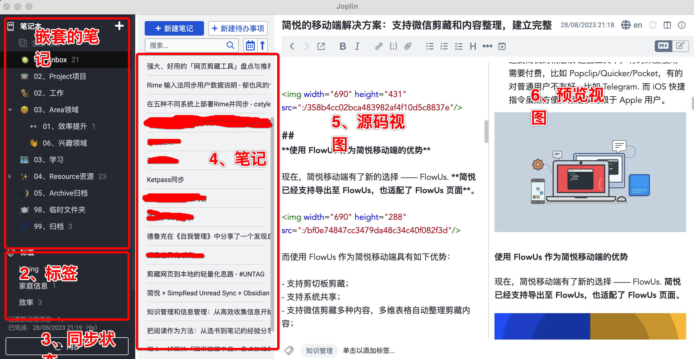
安装一步步往下走就好了，比较遗憾的是没有找到笔记存放位置，所以暂时就放弃了通过文件夹同步的想法。

### 同步设置
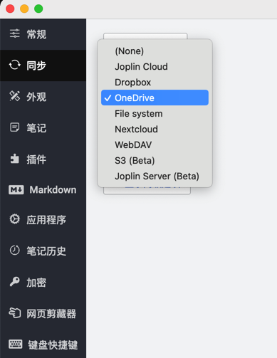

* **WebDAV**
它提供了主流的几种备份方案，其中WebDAV方案很容易实现，部分网盘（比如阿里云，日本有个网盘也有），另外群晖Nas也提供了WebDAV协议，但是它们都不符合我的期望，我希望的是通过文件夹同步的方式，因为后续我都会整理一个全局同步的文件夹。

* **FileSystem**
就是放本地文件，可能可以满足我的需求，后面再试试，不过本地搞个副本，多少是有点bing的吧。

* **Joplin Cloud**
这里的Joplin Cloud是官方的服务，也算是附加服务，相信会做一些优化，差异化才能提高付费意愿吧。

* **Joplin Server** 
就是自己部署的意思吧

最后我选择的是OneDrive。操作比较简单，iOS/Mac/Windows 都同步成功了。
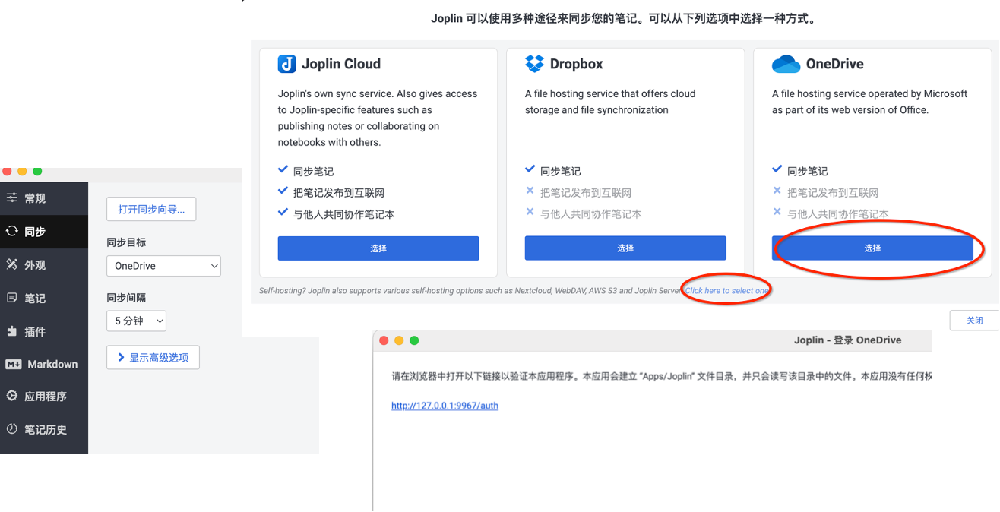

### 网页剪藏服务
这里简单说明一下为啥它会需要在这里设置，因为为了提高效率，它在剪藏的时候让我们可以设置后面存放在哪个笔记里面，以及添加哪些标签，这就需要它能和joplin之间通信。
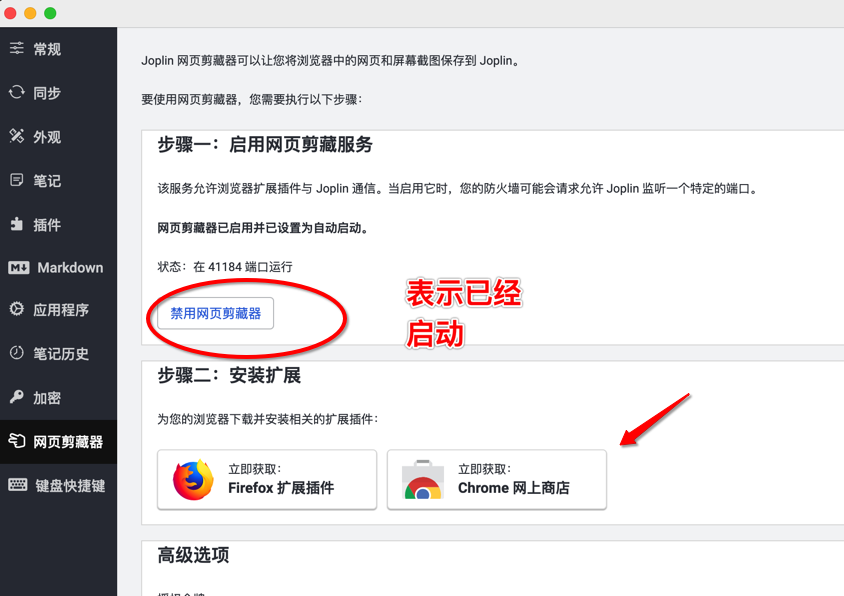
在浏览器里面执行效果如下
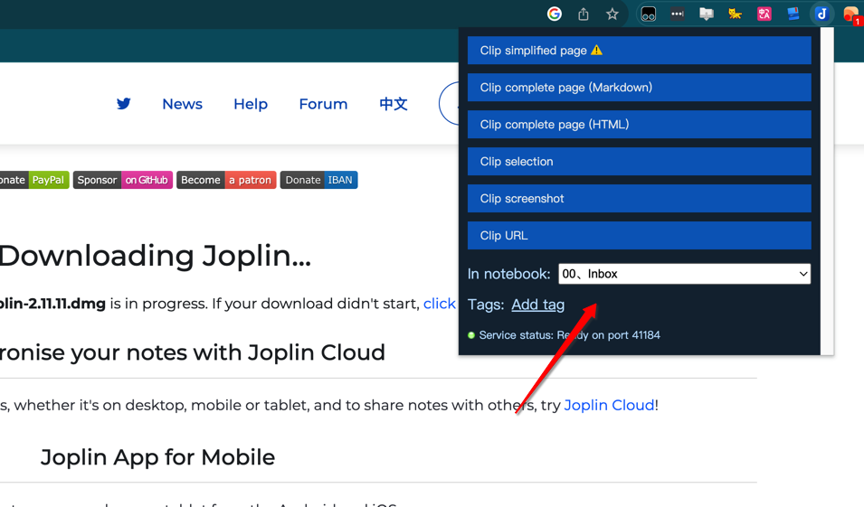

### 网页剪藏样式
前面提到了，网页剪藏里面包括了网页的裁剪处理，就是html源码中的部分内容可以被替换成markdwon的标签，也就是类似我们平常markdown->html的逆过程。那么我们就很容易想到。

| markdown | html |
| --- | --- |
| # | h1 一级标题 |
| ## | h2 二级标题 |

也就是说，这个过程如果我们加上自己的样式，就减少一次对结果的处理。下面是沙牛的样式文件

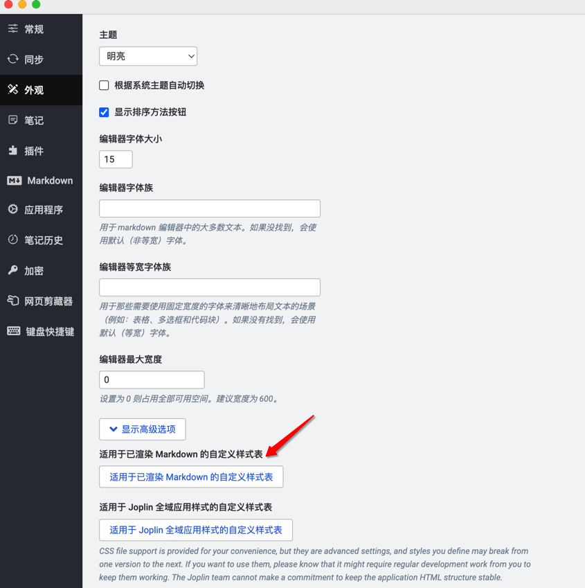

它会打开系统默认的编辑器，把下面的内容贴进去就可以了。

```css
body {
	font-family: Helvetica, arial, sans-serif;
	font-size: 15px;
	line-height: 1.428571429;
	padding-top: 10px;
	padding-bottom: 10px;
	background-color: white;
	padding:30px 50px;
	color:#777777;
}
 
body > *:first-child {
	margin-top: 0 !important;
}
 
body > *:last-child {
	margin-bottom: 0 !important;
}
 
a {
	color: #7BBA35;
}
 
a.absent {
	color: #7BBA35;
}
 
a.anchor {
	display: block;
	padding-left: 30px;
	margin-left: -30px;
	cursor: pointer;
	position: absolute;
	top: 0;
	left: 0;
	bottom: 0;
}
 
h1, h2, h3, h4, h5, h6 {
	margin: 20px 0 10px;
	padding: 0;
	font-weight: bold;
	-webkit-font-smoothing: antialiased;
	cursor: text;
	position: relative;
	color:#1EA089;
}
 
h1 tt, h1 code {
	font-size: inherit;
}
 
h2 tt, h2 code {
	font-size: inherit;
}
 
h3 tt, h3 code {
	font-size: inherit;
}
 
h4 tt, h4 code {
	font-size: inherit;
}
 
h5 tt, h5 code {
	font-size: inherit;
}
 
h6 tt, h6 code {
	font-size: inherit;
}
 
h1 {
	font-size: 28px;
	color: #1EA089;
}
 
h2 {
 	color: white;
    background: #1EA089;
    margin-left: 0;
    border-left: 10px solid #FDB22F;
    padding: 3px 0 3px 10px;
    font-size:22px;
}
 
h3 {
    padding: 6px;
    color: #1EA089;
    padding-left: 0;
    border-bottom:2px #FDB22F solid;
    font-weight: bold;
    font-size: 18px;
}
 
h4 {
	font-size: 16px;
}
 
h5 {
	font-size: 15px;
}
 
h6 {
	font-size: 15px;
}
 
p, blockquote, ul, ol, dl, li, table, pre {
	margin: 15px 0;
}
 
hr {
	background: transparent url() repeat-x 0 0;
	border: 0 none;
	color: #cccccc;
	height: 4px;
	padding: 0;
}
 
body > h2:first-child {
	margin-top: 0;
	padding-top: 0;
}
 
body > h1:first-child {
	margin-top: 0;
	padding-top: 0;
}
 
body > h1:first-child + h2 {
	margin-top: 0;
	padding-top: 0;
}
 
dy > h3:first-child, body > h4:first-child, body > h5:first-child, body > h6:first-child {
	margin-top: 0;
	padding-top: 0;
}
 
a:first-child h1, a:first-child h2, a:first-child h3, a:first-child h4, a:first-child h5, a:first-child h6 {
	margin-top: 0;
	padding-top: 0;
}
 
h1 p, h2 p, h3 p, h4 p, h5 p, h6 p {
	margin-top: 0;
}
 
p,li {
	margin: 20px 10px;
    max-width: 100%;
    min-height: 1em;
    color:#777777;
    text-align: justify;
    line-height: 28px;
    box-sizing: border-box !important;
    word-wrap: break-word !important;
    letter-spacing: 1px;
}
 
li {
	margin:20px 10px !important;
}
 
p strong {
	color:#1EA089;
}
 
p em {
	color:#FDB22F;
	font-weight: bold;
	font-style:normal;
}
 
li p.first {
	display: inline-block;
}
 
ul, ol {
	padding-left: 30px;
}
 
ol#footnotes {
	padding-top: 15px;
	background: transparent url() repeat-x 0 0;
}
 
ul :first-child, ol :first-child {
	margin-top: 0;
}
 
ul :last-child, ol :last-child {
	margin-bottom: 0;
}
 
dl {
  padding: 0;
}
 
dl dt {
	font-size: 14px;
	font-weight: bold;
	font-style: italic;
	padding: 0;
	margin: 15px 0 5px;
}
 
dl dt:first-child {
	padding: 0;
}
 
dl dt > :first-child {
	margin-top: 0;
}
 
dl dt > :last-child {
	margin-bottom: 0;
}
 
dl dd {
	margin: 0 0 15px;
	padding: 0 15px;
}
 
dl dd > :first-child {
	margin-top: 0;
}
 
dl dd > :last-child {
	margin-bottom: 0;
}
 
blockquote {
	border-left: 4px solid #1EA089;
	padding-left: 10px;
	color: #666666;
	margin-left:10px;
}
 
blockquote > :first-child {
	margin-top: 0;
}
 
blockquote > :last-child {
	margin-bottom: 0;
}
 
table {
	padding: 0;
}
 
table tr {
	border-top: 1px solid #cccccc;
	background-color: white;
	margin: 0;
	padding: 0;
}
 
table tr:nth-child(2n) {
	background-color: #f8f8f8;
}
 
table tr th {
	font-weight: bold;
	border: 1px solid #cccccc;
	text-align: left;
	margin: 0;
	padding: 6px 13px;
}
 
table tr td {
	border: 1px solid #cccccc;
	text-align: left;
	margin: 0;
	padding: 6px 13px;
}
 
table tr th :first-child, table tr td :first-child {
	margin-top: 0;
}
 
table tr th :last-child, table tr td :last-child {
	margin-bottom: 0;
}
 
img {
	max-width: 100%;
}
 
span.frame {
	display: block;
	overflow: hidden;
}
 
span.frame > span {
	border: 1px solid #dddddd;
	display: block;
	float: left;
	overflow: hidden;
	margin: 13px 0 0;
	padding: 7px;
	width: auto;
}
 
span.frame span img {
	display: block;
	float: left;
}
 
span.frame span span {
	clear: both;
	color: #333333;
	display: block;
	padding: 5px 0 0;
}
 
span.align-center {
	display: block;
	overflow: hidden;
	clear: both;
}
 
span.align-center > span {
	display: block;
	overflow: hidden;
	margin: 13px auto 0;
	text-align: center;
}
 
span.align-center span img {
	margin: 0 auto;
	text-align: center;
}
 
span.align-right {
	display: block;
	overflow: hidden;
	clear: both;
}
 
span.align-right > span {
	display: block;
	overflow: hidden;
	margin: 13px 0 0;
	text-align: right;
}
 
span.align-right span img {
	margin: 0;
	text-align: right;
}
 
span.float-left {
	display: block;
	margin-right: 13px;
	overflow: hidden;
	float: left;
}
 
span.float-left span {
	margin: 13px 0 0;
}
 
span.float-right {
	display: block;
	margin-left: 13px;
	overflow: hidden;
	float: right;
}
 
span.float-right > span {
	display: block;
	overflow: hidden;
	margin: 13px auto 0;
	text-align: right;
}
 
code, tt {
	margin: 0 2px;
	padding: 0 5px;
	white-space: nowrap;
	border: 1px solid #eaeaea;
	background-color: #f8f8f8;
	border-radius: 3px;
}
 
pre code {
	margin: 0;
	padding: 0;
	white-space: pre;
	border: none;
	background: transparent;
}
 
.highlight pre {
	background-color: #f8f8f8;
	border: 1px solid #cccccc;
	font-size: 13px;
	line-height: 19px;
	overflow: auto;
	padding: 6px 10px;
	border-radius: 3px;
}
 
pre {
	background-color: #f8f8f8;
	border: 1px solid #cccccc;
	font-size: 13px;
	line-height: 19px;
	overflow: auto;
	padding: 6px 10px;
	border-radius: 3px;
}
 
pre code, pre tt {
	background-color: transparent;
	border: none;
}
 
img {
	text-align: center;
	margin: 0 auto;
}
figcaption {
	text-align: center;
	margin: 0 auto;
}

```

弄好要重新启动一下应用才能生效，结果如下
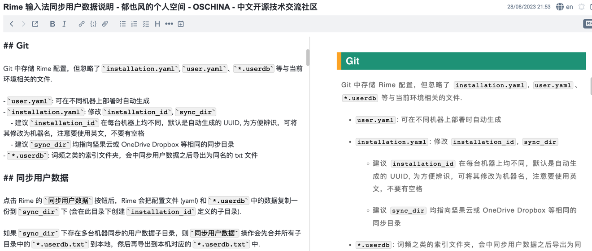

> 比较遗憾的是，同步的时候，这个文件没有同步过来，说明配置信息没有同步，只是同步了笔记内容。


## 3.2、joplin里面放个人信息等
考虑到它是本地部署的，另外个人信息啥的，平常不注意放在文件系统没那么容易找，可以考虑放在它这里。
这个时候最好设置一下密码。
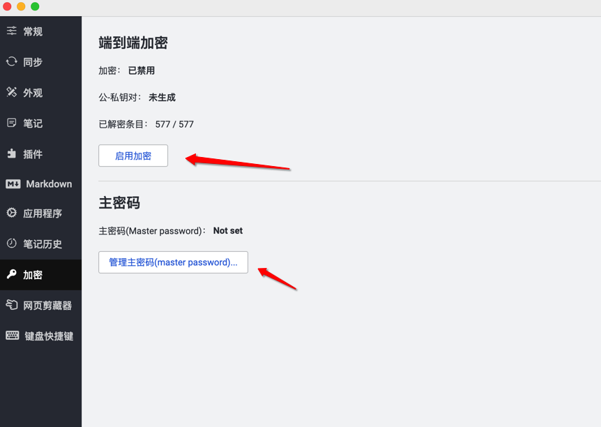

## 3.3、joplin插件安装

下面几个插件根据需要安装，不折腾也没事，官方地址是 [https://discourse.joplinapp.org/c/plugins/18](https://discourse.joplinapp.org/c/plugins/18)

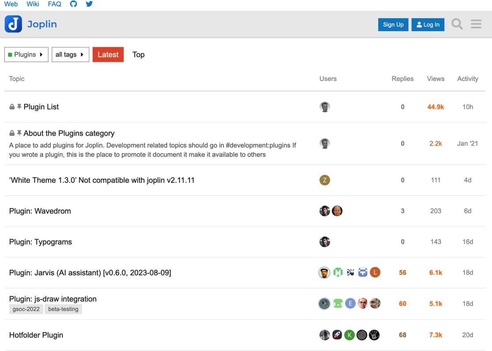

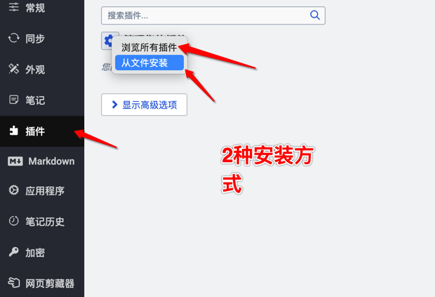

* **Quick Linkes**
输入@@自动显示标题，可以选择所需文章快捷创建链接。

* **joplin-link-graph**
用于查看不同的Joplin笔记之间的连接的UI

* **Automatic Backlinks to note**
自动回链，双向链接。一般我们在A笔记粘贴B笔记的md链接，A笔记能通过链接访问B，但是B却无法访问A，有了它就可以自动帮你加回链，形成“双向链接”，并且也可以在关系图上看到笔记间的关联。

* **Favorites**
星标，收藏夹，将喜欢的笔记、Todo加入收藏夹。

* **Note Tabs**
类似浏览器Tab标签页，但是值得注意的是，要点击Tab标题右上角的钉子图标才能将其固定。

* **Outline**
标题目录，即TOC目录显示在侧边栏。默认它会出现在最右边，可以通过`工具`菜单里面隐藏/显示它。

安装以后就是这样的。

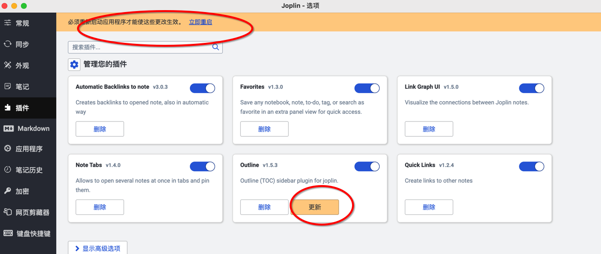
它有个启用和禁用的标记，我只启用了outline。安装完这些插件以后，整个界面的布局会改变，如果觉得outline占用空间太大，可以在菜单里面调整。视图-更改应用布局
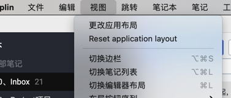

> 很显然，插件也是不能同步的。

## 3.4、删除未引用的资源释放空间

[https://joplin-utils.rxliuli.com/web/joplin-batch-web/#/](https://joplin-utils.rxliuli.com/web/joplin-batch-web/#/)

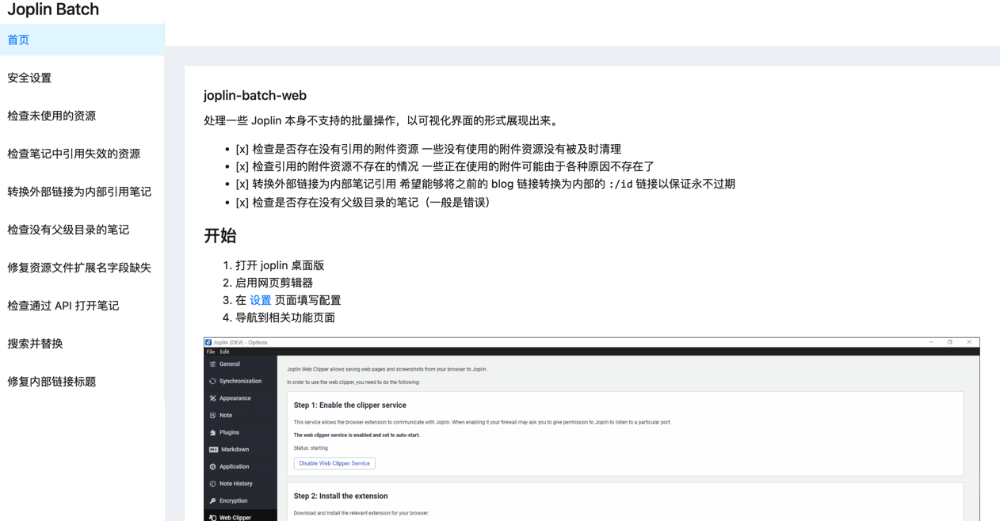

## 3.5、备忘录推送到joplin
实际上备忘录的信息不见得都适合放在joplin。如果需要放的话，手机上需要安装joplin，在iOS里面，可以分享到joplin里面去。

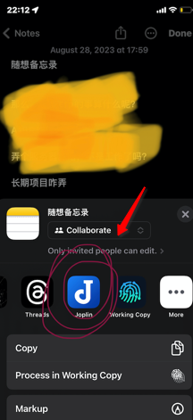

> 另外有个memo的应用，在App Store里面评分非常高，但是它真的太简单了，就一个录入信息的地方，不知道为啥它会评分那么高，13K的人评价，无法想象。也许是我的打开方式不对？

# 4、joplin中的笔记结构和原则
这里的笔记结构和原则，和下面的素材库是一样的，从PARA的角度来说，这两类都属于R下面的，所以在这里划分笔记结构/文件结构的时候，就不用按PARA来，直接放大类型就可以了。
原则上是不能超过3层，但是因为少了PARA，所以这里应该是不超过2层就可以了。

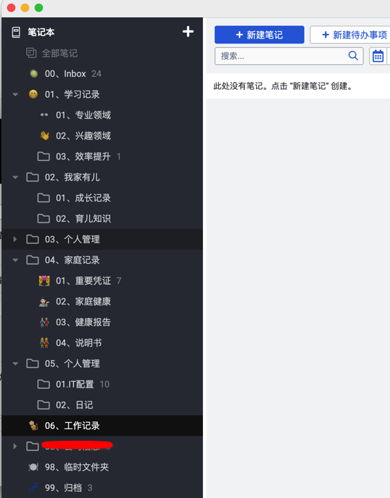

总的来说，在joplin里面的内容，除了家庭凭证相关的部分，其他的是不需要频繁整理的。这个文件结构除了inbox和archive，其他都可以算成是PARA里面的R部分。不用过于在意。

另外比较建议当前工作的相关内容，单独做一个笔记本，原因是为了方便使用。joplin的笔记本移动很方便，这个是比较好的使用方法。

前面的数字是为了方便排序用，个人习惯，一般最后一个用99，表示放归档内容。


# 5、素材收集库（Billfish）
> 同时支持Mac和Windows，这玩意能收集字体，音视频，还有其他文件，我差不多要冲动让它管文件了，但是还是冷静一下先。

它的安装很简单，主要是说明文件结构参考joplin
下载地址：[https://www.billfish.cn/](https://www.billfish.cn/)

## 5.1、基本设置

素材里面的内容划分可以更细致一些，整体上还是按joplin的方式。
> 【注意】：它的文件夹排序不是按字母来的，是按创建的先后顺序。但是可以拖动改变顺序

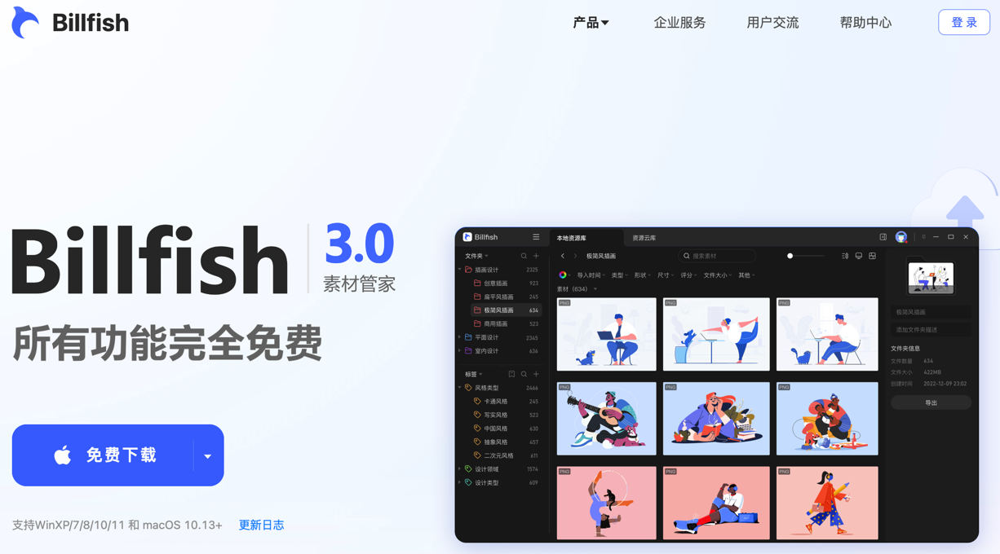

## 5.2、标签设置

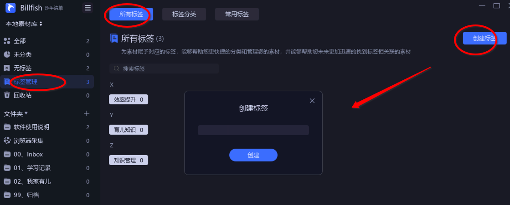

素材有一个很大的状况是无法像文字那样快速搜索，所以能尽量多个添加属性对于我们检索是有非常大的好处的。Billfish提供了标签、标签分类这样的功能。这样的话我们对素材的检索又多了一些功能。

## 5.3、如何加入素材
它可以从其他平台导入素材，包括花瓣网络。

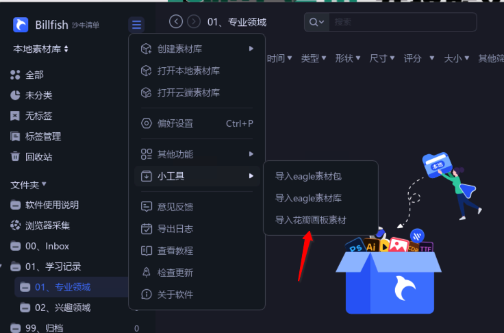

显然，浏览器直接采集是最重要的，所以就有了[https://www.billfish.cn/extension](https://www.billfish.cn/extension)

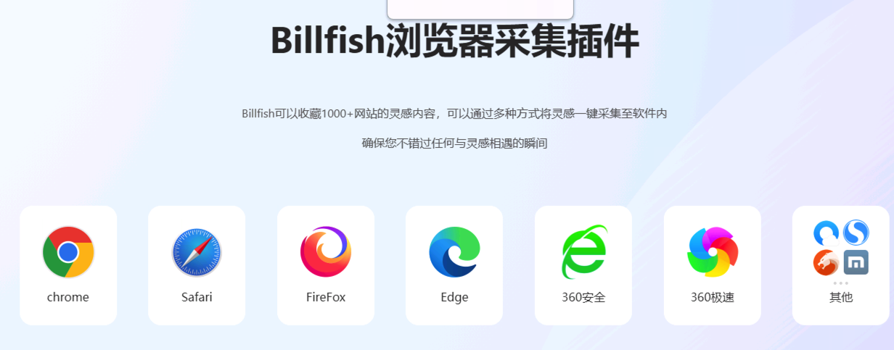

* **批量采集**


* **勾选需要的图片**

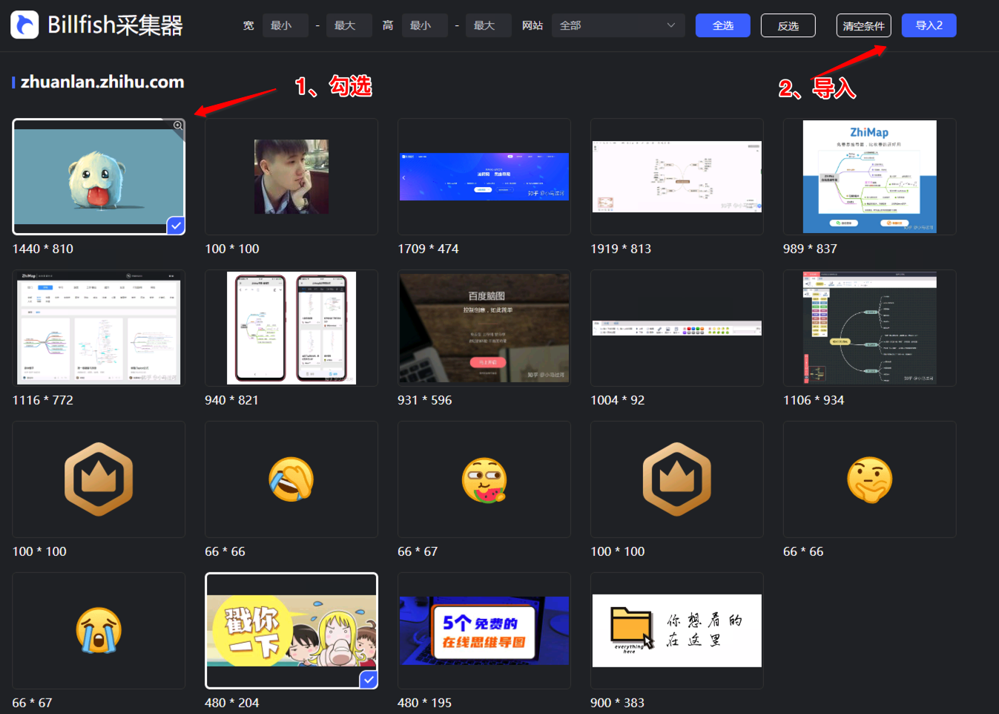

* **导入到执行文件夹**
它和joplin的剪藏器不一样，这个步骤没有设置标签的地方。


## 5.4、如何使用素材 

直接复制出来就可以了。


## 5.5、关于备份
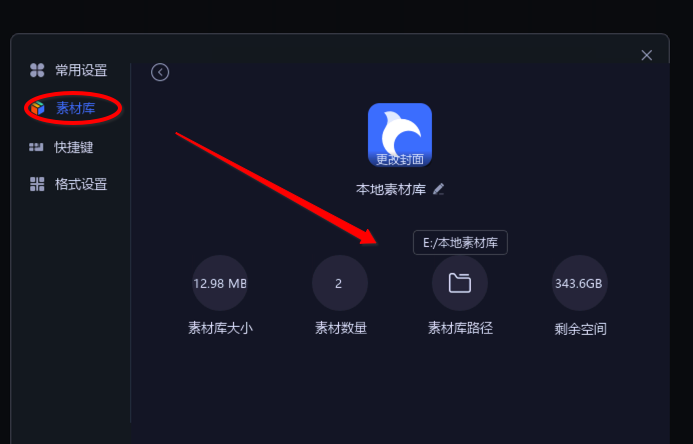

这个文件夹备份好就可以了

因为我们知识管理体系更多面向个人，如果在企业环境如果能和Nas等存储结合就更好了。

> 整体原则还是一样的，如果没有必要就别放进来了，如果觉得不错就放进来，同时也整理一下。图片如果后续想整理是很难的。

# 6、RSS收集
RSS如果叫古早互联网应用不为过，在Web 2.0兴起的时候，它也悄然兴起。简单来说，它对于我们非常大的价值是去广告，让我们更关注内容。这个说法不太严谨，但是从我们信息收集角度来说，足够了。

## 6.1、RSS大概是个什么

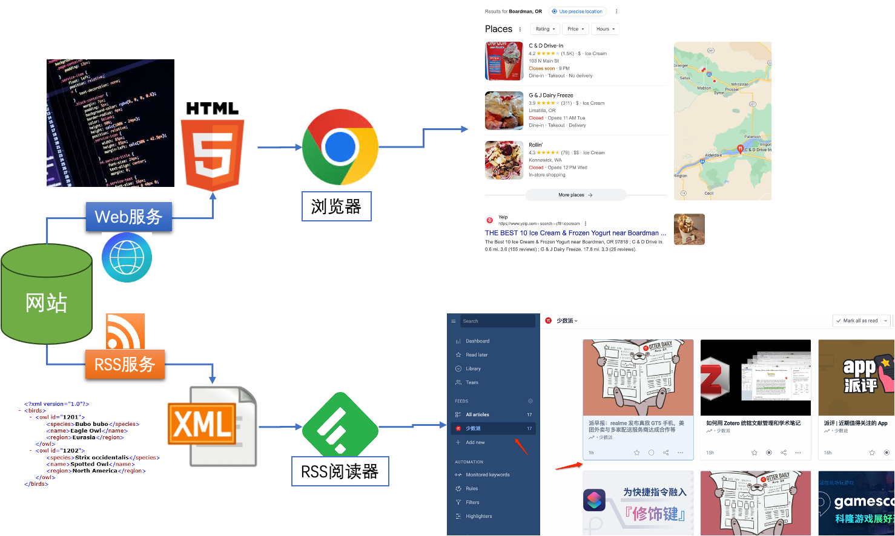

简单来说，RSS解决了这样几个问题：
* **信息汇聚**

信息汇聚的意思，就是我们可以通过一个应用把我们想要关注的信息都统一放在一个地方，这样做的好处是我们不用`打开N多个应用了`。举例来说，我们关系的是AI新闻，就可以把google新闻，油管上某些博主，推上的一些人最新发布的内容都汇聚在这个RSS阅读器里面。不用打开那些网站就可以看了。

* **去除噪音**

去除噪音包括广告限制了，相关内容推荐也没有了。我们只关注我们想要关注的内容。另外也不用整个网站都关注。如果不想了，随时取消关注就好了。
但是也*少了推荐*。因为都是我们主动关注的，所以大数据的推送对我们作用就不大了。

## 6.4、RSS客户端
现在回忆起来最好用的还是Google Reader，但是很多年前就被停了，然后用过一段时间Feedly。这次推荐的是[`Inoreader`](https://www.inoreader.com/)，多个平台都能用，也有网页版，免费用户有订阅数限制，但是信息收集的第一要义应该是`克制再克制吧`。

登录可以用Google、Apple，也可以用户名密码。免费用户基本够用，付费是1个月8刀的样子。不是很有必要。
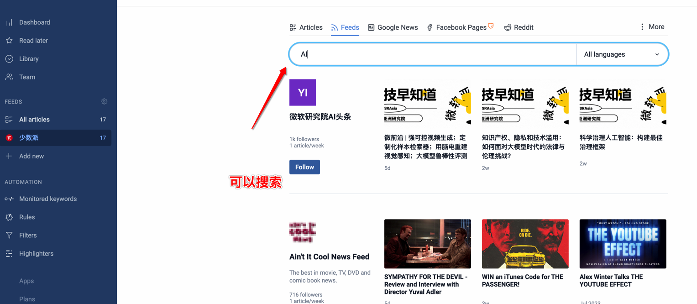

它可以搜索RSS源，也能自己添加。它也有一些智能的功能，我们第一个阶段先不去折腾了，先用起来再说，后面有精力再折腾。

iOS和MacOS有一个开源免费的客户端，叫NetNewsWire。它的体积非常小，号称是用swift语言开发，最大的开源项目了。显然，它就更适合喜欢折腾的朋友了。
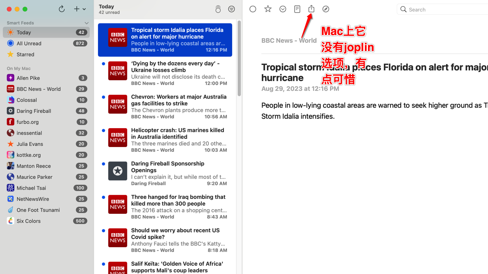

> 在找客户端的时候，想着要跨平台啥的，后来想想其实没啥必要，给自己限定一个平台，找个时间集中处理一下就好了。

> 客户端还是挺多的，先把流程走通，再考虑优化，我们对RSS的诉求就是能更专注看信息，不会轻易被带走带偏就好了。

> 不要担心大数据推荐找不到我们，如果这个事真的重要，我们的订阅里面会出现的，大量平台都会转发的。

## 6.3、如何找RSS的源
并不是所有网站都提供RSS订阅的功能，毕竟，它都去广告了…… 。
* 带有rss标记的，也就是上图中RSS服务上面那个图标
* 自建服务器/第三方，对没有提供RSS服务的内容，提供转换服务，然后再通过阅读器订阅 

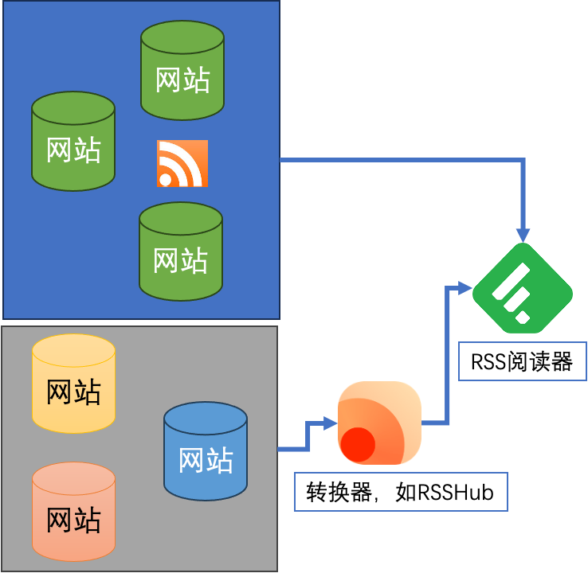

这里有一个工具`RSSHub`,它的口号是万物皆可RSS。老实说这个过程还是挺折腾的，主要是因为我关注的内容并没有那么多，恰好又没有RSS服务，我又不想看广告啥的。

国外的RSS源推荐
[https://rss.com/blog/popular-rss-feeds/](https://rss.com/blog/popular-rss-feeds/)

中文RSS源推荐
[https://github.com/weekend-project-space/top-rss-list](https://github.com/weekend-project-space/top-rss-list)

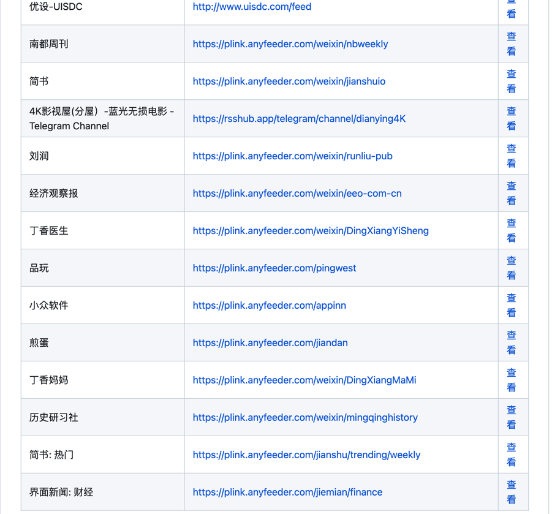

## 6.4、自己搭建RSSHub
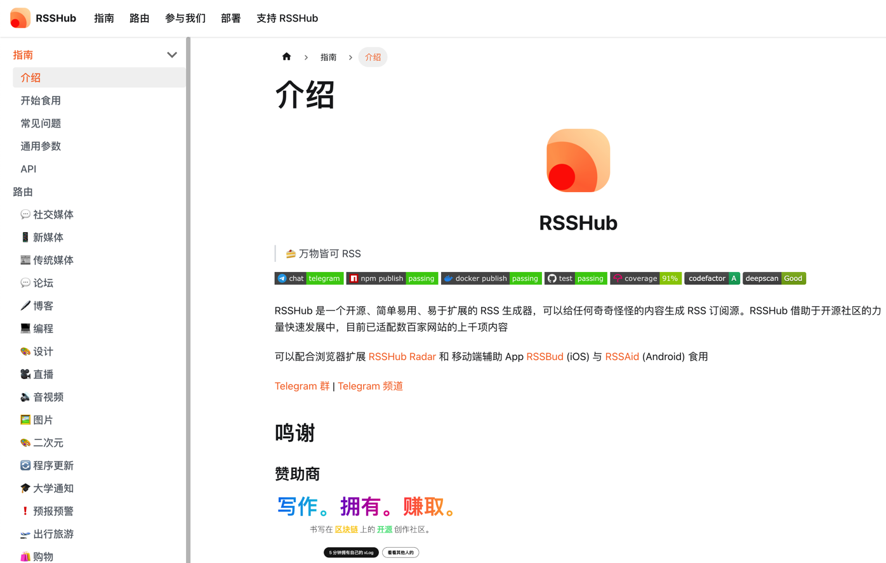

因为涉及到部署，不算太简单，我是部署在vercel上了，部署成功以后是这样的。
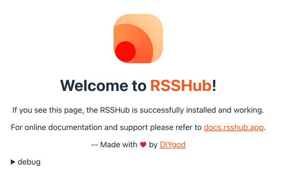

和我们想象的不一样，没找到它有个啥配置界面上的，都是通过下面这样的路由去配置的。然后这个rsshub就成了中转站，我们在rss订阅里面就可以录入地址，如果返回的是XML就说明订阅成功了。

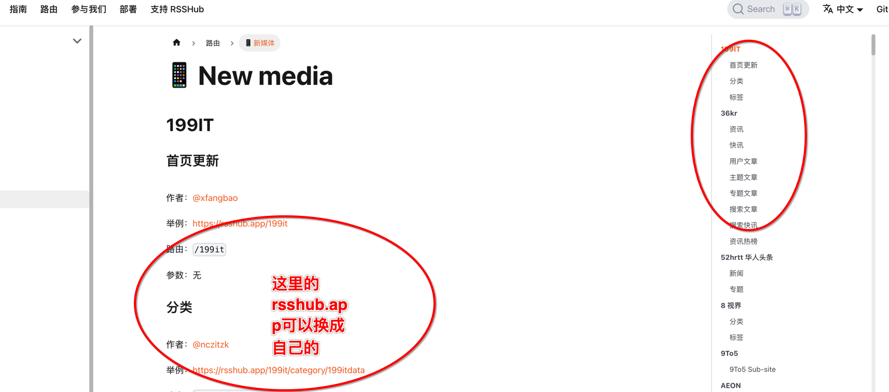

不过我关注的几个地方，推和油管好像都不行了，不知道啥原因，回头再研究了。不过咋说呢，多弄一个服务，就多一个折腾的事，还是把重心放在知识整理本身上。

> 为啥不在群晖上搭建，老实说，我是很担心它噶了，就那小身板，放点资料就好了，折腾来来去去，把它弄噶了不值当。

## 6.5、Rss和joplin
在Mac上，NetNewsWire不能直接转到Joplin，iOS上只能转个链接，简直就是个寂寞。所以也就只是暂时手工复制了吧。电脑上的话就多了一个步骤，

原则上来说，RSS的内容大部分情况是不需要进入到Joplin的。

那能不能给joplin加一个rss插件呢？不建议，因为它的本业不是干这个的。

# 7、同步和备份策略
总结一下，原来计划在RSS上多折腾一下，但是最后我关注的几个来源都没实现，暂时就放弃了。Joplin暂时使用OneDrive没有发现啥问题，就这么先用着。后续有新的心得会继续补充上来。

# 8、总结

* 想法随时记，那是自己的。
* 外面的东西没啥必要就别记了
* 如果记了，随手就简单整理一下，打个标签啥的。
* 信息类的东西随时记得提炼，然后就可以不管它了。
* inbox常常要清理