* content
{:toc}

Notion作为新型笔记工具，知识管理工具，溢美之辞不消多说，似乎带来了知识管理的革命，而它的All in One口号也深入人心。

但是其实仔细想一下，实际上它只是一个网页制作工具，只是相比传统认知中的网页制作工具，它更贴切的身份可能是`低代码平台`。当然，我们知道如果它叫低代码是万万没有这么大的想象空间的。

>  这次梳理知识管理系统的时候，有点感触，学习新工具之前，最好是对自己的诉求有一个基本的思考。这样的思考多了还是大有裨益的。原因就在于——君子驭物。

接下来会从网页制作角度，结合本次知识管理目标，简单粗暴介绍一下。

> 我们追求的是简单可用的完整产品，不是复杂产品的0.1版，而是简单产品的1.0。

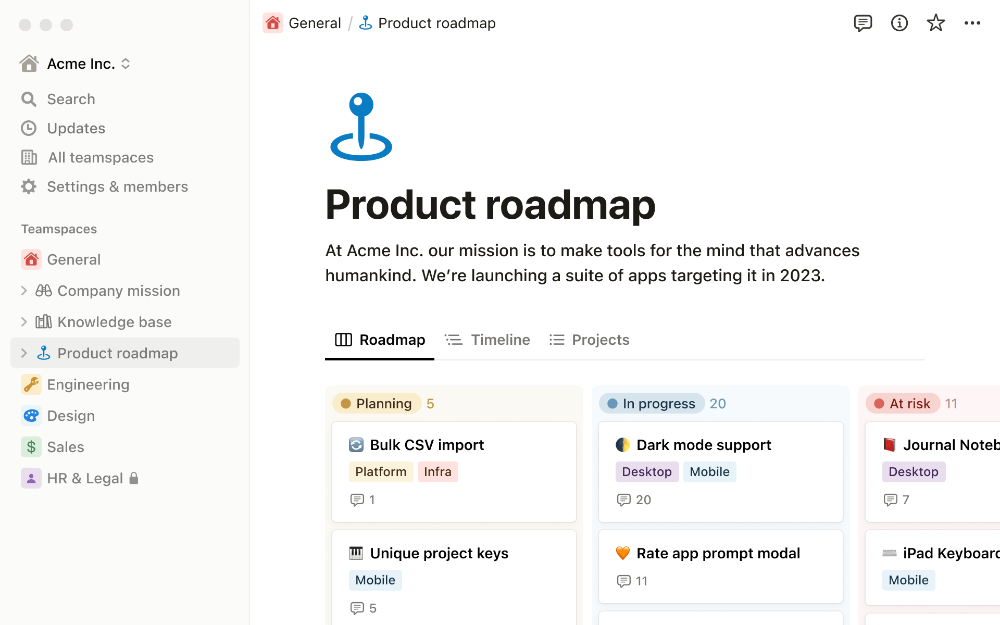

<!-- more -->
# 1、我们想要用工具来帮我们做什么

> 我们是为什么要用一款软件，一个工具，一个方法？前面在整理Para的时候深刻认识到，大部分的视频介绍都停留在Para概念的阶段。当深入去看那边书的时候，发现其实有很多细节。所以我们应该如何改善这种状况呢？

避免被工具牵着走一个很简单有效的办法，是先理清楚我们想要什么。当然，也许你会问，我先看看它能咋样，能给我一些思路呢？那不是更好吗？也许你是对的。但是，大部分情况下，我们会顺着路边的野花跑了，而忘记了其实我们真正的目的地！

在使用Notion之前，我们也许对知识管理知之甚少，也可能已经驾轻就熟。这篇博文主要从前几天的理论和思想出发，假定看文章的时候，还没有仔细研究过Notion。

所有我们真正的目标有哪些呢？
* 一个可以随时打开的知识库
* 我希望这个知识库里面可以很方便查找，迁移各种知识
* 我希望它成为一个中心，可以整合我的很多资源，包括外部的资源
* 我希望它对不同知识能有不同的展示，因为可能重点是不同的
* 我希望它能支持文件夹和标签管理

从这个角度来说，我们要的真的很简单，也很少，而我们要去了解的Notion功能只要能做到这些，至少我们就已经可以开始用了。后面的所有的所有，都是加分项。既然这么简单我们为什么要选择它呢？后面看到它的高级功能我们再考虑如何拓展我们的思考。下面先从网页制作角度开始。

# 2、简单聊下网页制作和Word

## 2.1、网页制作以前为什么这么难
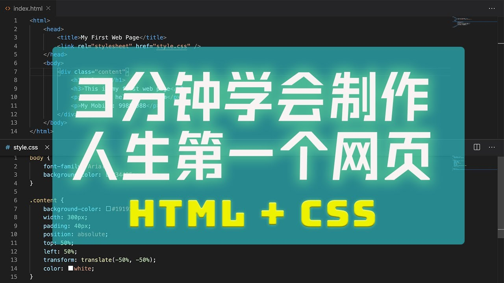

软件开发中，一直以来，数据存储和数据展现都是分离的。很大原因是他们处于不同的问题领域，需要用不同的范式去处理。这个是什么意思呢？

某种程度上来说，这些技能确实也需要不同的思维方式，所需要的技能也不尽相同。相对而言，程序设计需要更严密严谨，而网页展示的时候就具有更大的容错性，从程序设计者的角度来看，大不了长得丑点，又不是不能用！

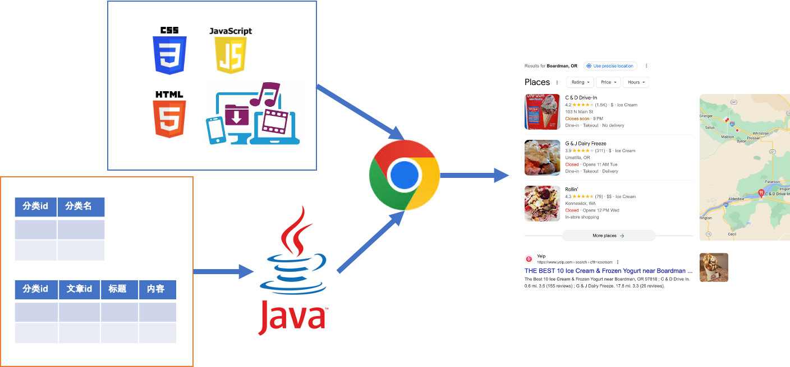

这个图本身不重要，只是想说明，网页制作在早期都是针对企业，用来帮助企业管理各种信息，有这样的门槛很大原因是为了让整个系统的开发效率更好。
## 2.2、个人要的一直很简单
而我们做网页设计，在展现出来的结构基本的有标题，表格。基本上在很多表单自定义的工具里面都能看到身影。

网页设计上我们如果从Word角度就很好理解了，它把word日常文字

一个空白页面，我们不断从上往下填充内容，这是一个非常自然的习惯，针对文字的样式，可以加粗，斜体，还可以是一级标题，二级标题等等，也有表格啥的。我们知道一个word里面的内容要做得很漂亮并不容易，通常也没有这个必要。我们制作网页也是秉承类似的理念，从上往下排列各种元素。
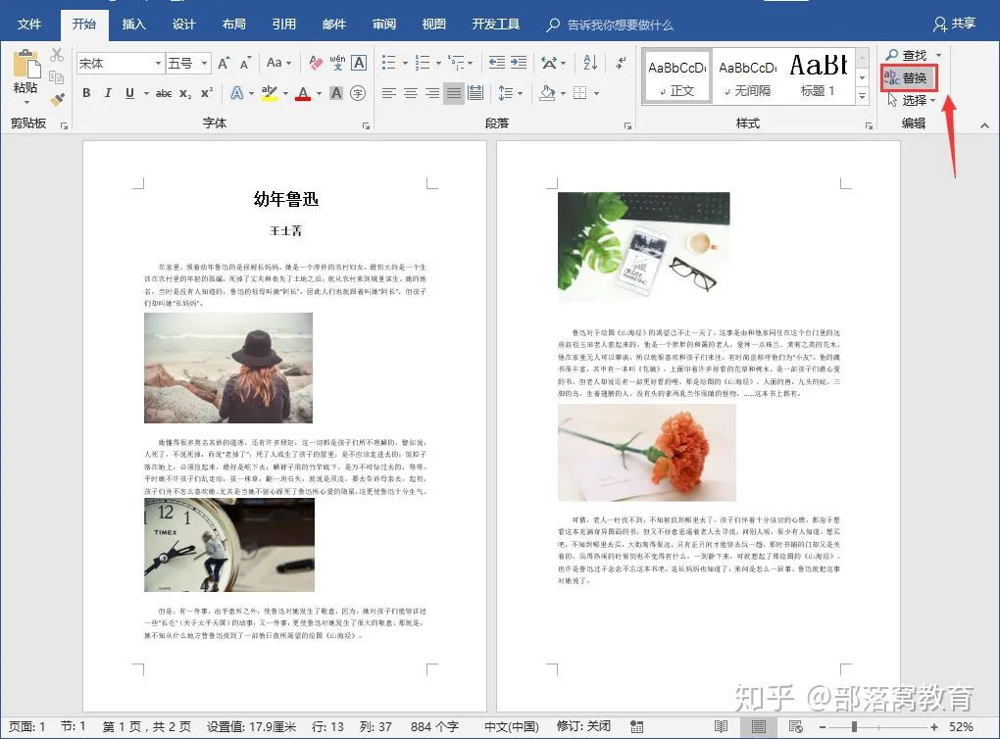

* 有些是纯粹内容：
    * 文字
    * 图片
* 有些是布局：
    * 表格
* 有些特殊含义：
    * 不同级别标题

说起来我们的知识，最后也是通过文字+样式+布局这样的形式来呈现。

从博客的界面风格可以看得出来，颜值并不是追求的重点，我们继续来看Notion

# 3、在Notion中搭建PARA结构

Notion比较特别的地方，在于它是WebApp，它没有本地部署。所以数据并不在我们自己手里，能冒天下之大不韪，也算是有勇气的。官网地址是：[https://www.notion.so/](https://www.notion.so/)。

可以通过Google邮箱登录，基本上免费使用也足够了。打开以后，就是一个基本的页面，分左右结构，左边是目录，右边是内容。

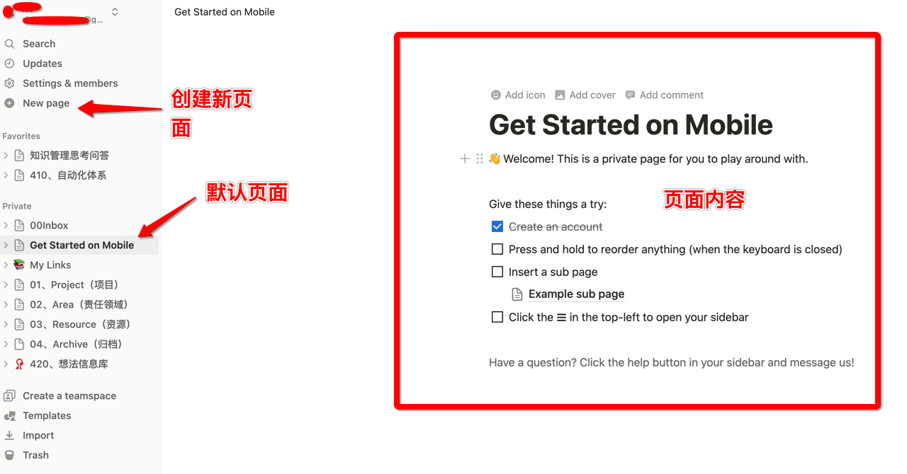

## 3.1、Notion的页面就是文件夹

从前面简单的说明可以知道，我们想要的只是有个地方能存放知识，然后方便去使用这些知识。类似Joplin这样的笔记软件，有笔记本的概念，和文件系统中的文件夹概念是一致的。Notion淡化了文件夹的概念，在Notion中页面本身就是文件夹。

> 这可能就是从使用者的角度来看，少学习了一个概念，也减低了上手的门槛。但是对于被信息化系统教育过的人来说，这点还挺新奇的，甚至一开始不太好接受。

企业应用中信息一般都归属不同领域，所以文件夹本身需要考虑大协作的需要，更方便信息流动。Notion淡化了文件夹的概念。直接创建页面就可以了。下面简单描述一下页面的基本操作。

## 3.2、页面的简单操作
通过左边的New Page按钮（Ctrl+ N）可以创建页面，也可以通过左边的文件夹点加号创建。
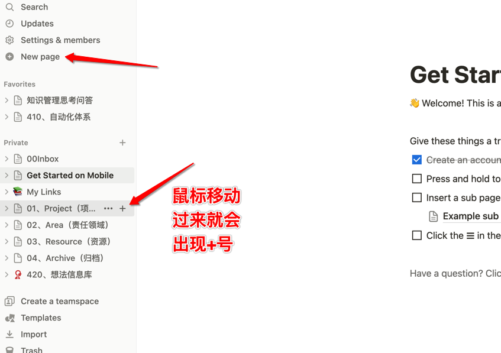

页面就是我们知识存放的主要载体，Notion实际上框定了我们对页面设计的基础架构。

作为主文件夹，我们给它设置成全屏。

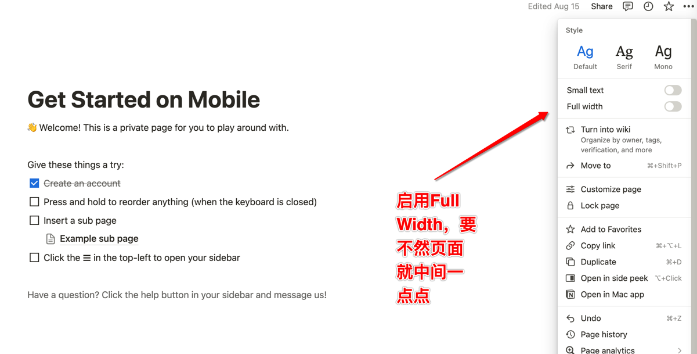

### 区块操作
我们前面提到，网页的内容是从上到下一块一块来的。在Notion中我们就可以这样操作。鼠标移动到一个块，就会出现2个菜单。

> 可以认为在Notion中，操作的单位就是区块

* **区块操作**
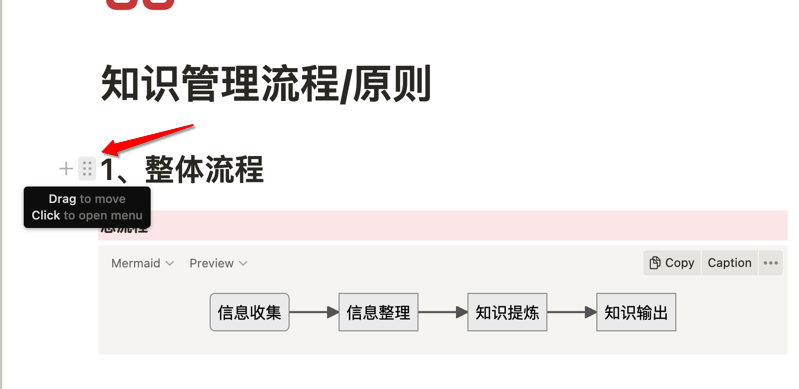
按住可以拖动，点击出现新的菜单。
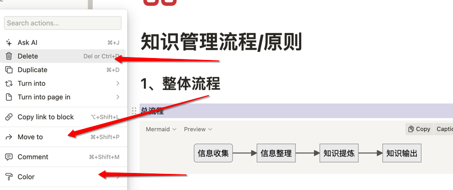
一开始我们只要了解 Delete(删除，到回收站），Move to（移动到其他文件夹），Color(背景颜色或者字体颜色)，Duplicate(复制，这里的Ctrl+D的快捷键和浏览器冲突，操作的时候留意一下)，这几个就可以了。

* **添加内容**
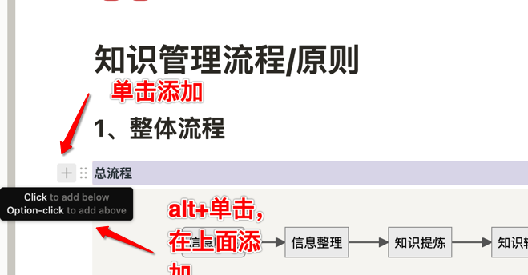
里面的内容基本都点一下差不多也就知道了，基本的信息就是标题文本之类的
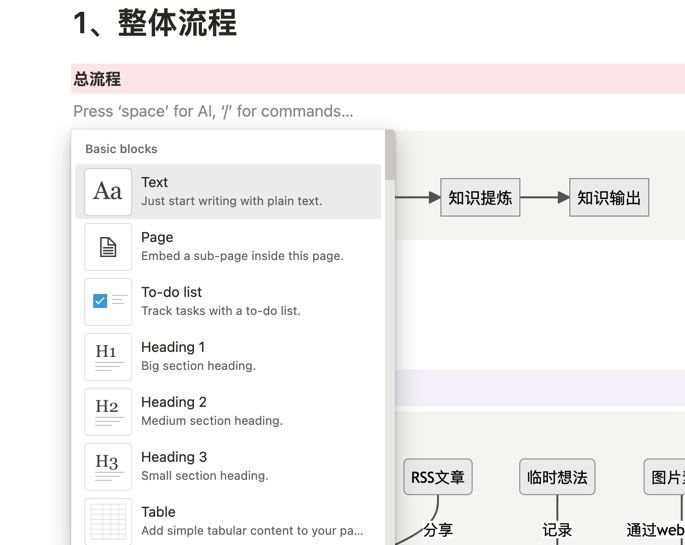

### 区块布局

当我们设置了Full Width以后，页面可操作的区域就大了很多。这个时候我们可以开始给它做更丰富的操作。
前面提到，我们在word里面通过表格来进行布局，也可以分栏布局。Notion里面提供了这样的功能。

* **分栏**

其中有一个内容用得比较多一些。就是分栏
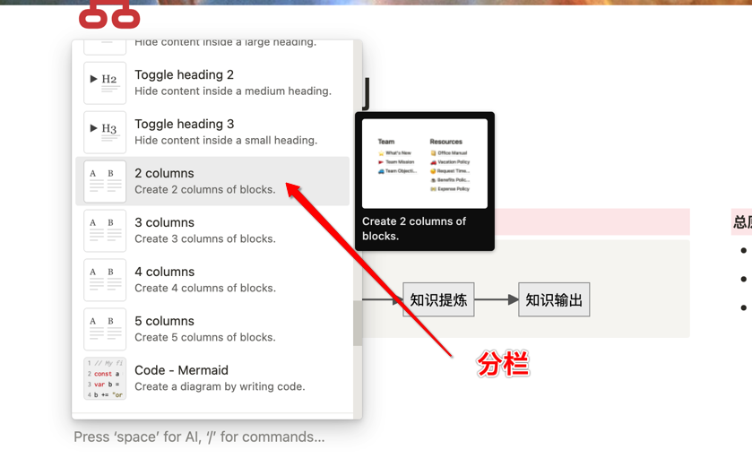，可以看出来是分几个栏。可以简单理解成是word里面的表格，把表格边框线变成白色，几个列就是几个栏。

> 鼠标在2个分栏之间的时候，会出现一条虚线，可以按住拖动，改变区块间的大小。

* **折叠区块** 
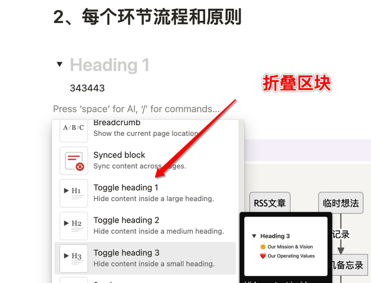

这里的Toggle Heading就是折叠区域的意思。但是到现在为止，知识管理上，我还不需要用到折叠，知识管理在我看来，展示出来是很重要的。

> 分栏和折叠区块只是我这么叫，其他人有不同的叫法，明白就好了。

通过这里的操作，基本内容就具备了。我们先开始搭建需要的文件夹结构。

## 3.3、开始构建PARA结构
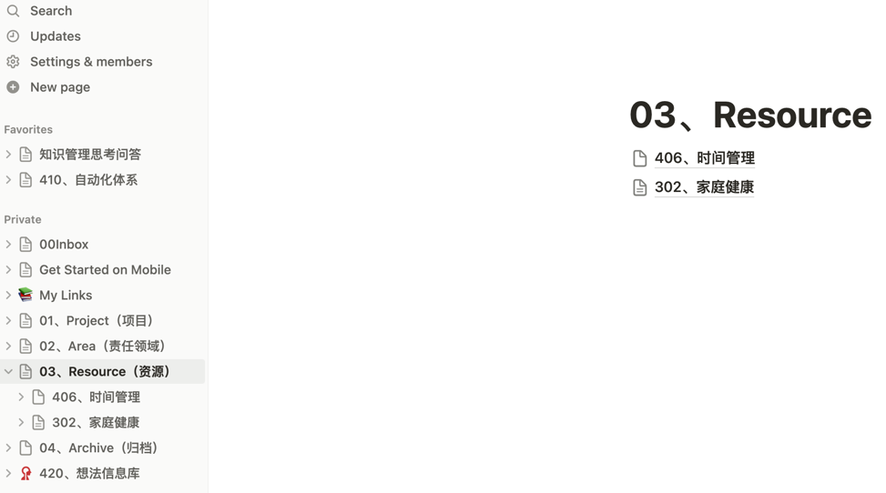

> 可以通过拖动调整文件夹的归属，也就是这个页面属于那个页面

> Notion的页面排序不是根据标题字母排序，而是根据加入的时间先后排序，当然我们可以拖动调整顺序。

开始之前，我们需要先问自己一些问题，为什么需要这个结构，已经这个结构下面要放什么。
## 3.4、从简单开始，逐步迭代
一开始我们总会有一种冲动，想要做到最好，把各个文件夹都创建好。举例来说，如果我对减肥感兴趣（这个是一生的兴趣），对时间管理感兴趣，那我应该都创建起来，但是后来我发现创建好以后，我不知道该如何去使用它了。

所以，我在知识管理这个页面做了这样几件事

### 为什么需要知识管理
这个问题看起来是显而易见的，但是它却异常重要，当我们迷失在细节的时候，它一定会拉我们回来。其他的几个大文件夹也是需要这样。

> 随着时间的推移，我们对知识管理本身，对各个领域的知识，不断深化，这个时候，最初的那个目标就显得尤为重要，我们为什么要出发？

### 知识管理流程和原则
流程和原则是不断迭代优化的，但是这里有一个很重要的思考点，从大流程开始，逐步细化到小流程。为什么要这样呢？原因是框架决定了边界，明确了边界我们才知道折腾这些东西的目标是什么，不至于陷入到具体的细节中。

这里的流程图一开始一直没有找到特别合适的工具，想过用draw.io，visio等，考虑用流程图和泳道图，时序图，但是最后发现很简单在Notion中实现了。

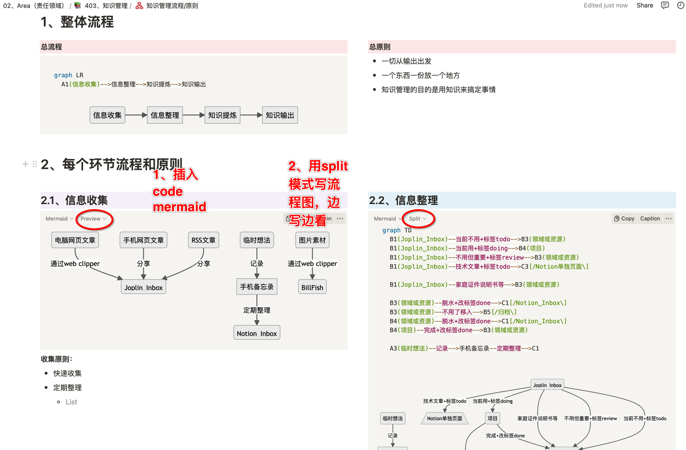

关于Mermaid的语法可以参考它的官网教程：[https://mermaid.js.org/syntax/flowchart.html](https://mermaid.js.org/syntax/flowchart.html)

另外有一个在线的网址可以练习 [https://mermaid.live/](https://mermaid.live/)

简单来说，mermaid是markdown语法的一个扩展。如果需要这方面更深入交流，可以留言给我。

### 总结一下页面原则
* 我们根据需要在PARA各个文件夹下创建对应的页面。
* 这一级页面最好是full width
* 给它弄个封面和图标
* 给它明确一个主题，以及什么样的内容要放进来，以及处理规则
    * 我在创建好文件夹以后，重新写这个的时候，发现文件夹有歧义
* 需要再创建，以后再迭代

好了，有了这个基础，我们用Notion放我们的基本知识就OK了。就这？有必要吗？

## 4、知识管理迭代思考
目前在知识管理上，采用的做法是

## 5、此数据库非彼数据库

我们开始正式进入它的世界

>>>> Notion比较积贼的地方也放弃了程序员的思维

比如说12306订票系统。用户信息是存放在他们的数据库中。我们可以通过网页登录，也可以通过iPhone登录，也可以用小米手机登录。显然，手机登录的界面和网页登录的界面是不一样的，这样做的好处是每个环节只管自己的事就可以了。也让多样性成为可能。

传统关系数据库查询有一个标准语言就是SQL。这些概念随着技术的发展已经深入人心。最早接触到数据存储和数据展现放一起的是Office里面的Access，它既是数据库，也可以在里面做表单做交互，最后形成一个mdb文件。

# 2、数据库是什么
可以看

为了达到这样一个目的，Notion开创性的加上了属性的概念，所以让数据库这个概念成为了可能。

# 3、页面也是文件夹

最早接触conflueence的时候，对这个东西还是挺有些不清楚的。

实际上它从程序开发的角度很自然的扬起了这个视角，页面就是文件夹，文件夹也就是页面，所以根本不需要去思考这个问题。我们只要通过文件夹创建就可以了，然后就有了我们的para结构了

然后可以拖动，页面的基本操作就是这样，

几个重要的元素其实也就很自然去理解了

然后我们开始往里面填充知识内容了

什么是块，这其实就是块了，它不是用表格这样的概念，确实也简化了很多，这点来说是真的好的

数据库是什么呢？

# 4、此数据库非彼数据库

# 5、区块是个啥

# 6、

降低了难度，极大

从目的出发，哪里的教程最好，显然是官方的最好

Notion不适合做什么，适合做什么