* content
{:toc}

> 先说结论吧，希望通过软件改变我们的状况，很容易会陷入小人驭于物的状况。

> 知识的流动本身就会产生价值，让我们重新审视自己的内在系统。

> 相比之下，我们宁愿让自己陷入忙碌的整理，而不去思考知识本身对于我们的价值。

[IDC：The Knowledge Quotient: Unlocking the Hidden Value of Information Using Search and Content Analytics](http://pages.coveo.com/rs/coveo/images/IDC-Coveo-white-paper-248821.pdf)
> 根据我们的研究，知识工作者每周平均花费约 16% 的时间来收集信息：搜索、检索和浏览内部和外部信息。这些知识工作者有 44% 的时间找不到他们正在寻找或需要的信息。当我们从整个组织的角度来审视这个问题时，知识工作者浪费时间所造成的财务影响就会变得非常严重。如果我们假定知识员工的平均工作周为 41.8 小时，年薪为 80,000 美元，那么每位知识员工每年浪费在搜索信息上的时间成本为 5,700 美元。一个拥有 1,000 名知识工作者的低 KQ 组织，每年浪费在搜索但找不到信息上的时间超过 570 万美元。这些结果是基于保守的估计

[The Innovator’s Guide to Modern Note Taking](https://info.microsoft.com/rs/157-GQE-382/images/EN-US%2017034_MSFT_WWSurfaceModernNoteTaking_ebookRefresh_R2.pdf)
> 员工平均每年要花大约 76 个小时来寻找放错位置的笔记、物品或文件。换句话说，我们每年在全美花费 1770 亿美元--比芬兰整个中央政府的预算还要多--来寻找那张一秒钟前还在这里的便条

**总结起来**：不知道自己其实在寻找文件/知识的过程中花费了大量时间。想要改变时，劝退自己的第一个门槛，整理起来太麻烦，东西太多了！。

接下来我们通过PARA在Notion中建立初步的目录结构，并在Notion中完成知识整理的过程。

<!-- more -->
前面部分先介绍为什么会有PARA，它产生的背景，然后是它的原则。主要内容来自[《Building a Second Brain》](https://yes-pdf.com/book/5477)。

# 1、给你的知识一个更好的"家"
分享一个鸡汤
> 某国某小朋友在家里的鱼缸，养了一条鲨鱼，养了很久，但是总也长不大，后来因为一些原因搬家了，就忍痛把它送给当地的海洋馆，过了几年回来想要去看鲨鱼，一直找不到，但是有一条大鲨鱼总是跟着他，他突然意识到这就是他以前养的那一条鲨鱼。所以一个鱼缸的环境限制了鲨鱼的成长。

环境常常会改变我们对一些事物的看法，通常也会影响我们看待世界的视角。
* **更容易抽象思考，关于未来**
一个天花板很高的空间，大山之巅，一望无际的大海。
* **先解决具体任务，着眼当下**
一个逼仄的卧室，凌乱到无法转身的厨房。

> **大教堂效应**。研究表明，我们所处的环境极大地塑造了我们的思维。

# 2、整齐到不忍心动就好吗？
我们知道图书馆的书籍分类如果做不好，对所有人来说都是灾难，所有有很多关于它的方法，比较有名的是杜威的十字方法。

我们知道，任何事物都是有代价的，我们要维护一套这样的方法，对于个人来说会陷入一个困局，我们鼓足勇气按照这样的思路来一次，然后再也不想来，或者根本没有勇气按照这套流程来做。天性如此，怎奈我何呀！

如果我们不是特别擅长整理，特别有意志力，这些方法最后都会流于无形。
> 据说某位收纳整理大师，在生了第3个小孩以后，家里终于——乱——了——了——了

所以，很重要的是，当我们在整理上花费了更多时间，维护这套体系让自己疲于奔命的时候，它的性价比就非常低了，所以会有什么样的方法呢？

# 3、基于使用场景划分而不是它的类型
基于一件具体的事也许更有效：
> 很久以前，在客户现场支持项目的时候，我都会把相关内容放一个单独的文件件，实际上也没有多少时间去整理，然后做一个思维导图，把各个现场状况记录进来，按照优先级开始解决，解决的过程中给这个分支往后添加内容，如果有临时状况，都放到一个特别的分支里面，继续当前的任务，有文件丢文件夹，思维导图里面备注一下。

我们对于文件的整理，通常会按文件类型来分，大体上可以会参考这个做法
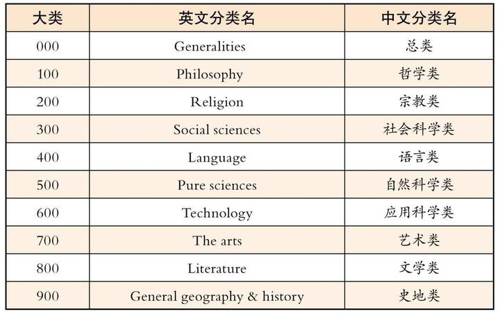

> 杜威的威力在于，它每3位都是一个区块，差不多可以无限扩展。xxx xxx xxx xxx 。这样它的可能性就是 1000 x 1000 x 1000 x 1000 。完全足够了。个人没必要去折腾，又不是图书馆。

很尴尬的是，曾经收集过很多电子书，买Kindle，特意买了大容量的。电子书应该有好几个T。常常会收集一些书，但是其实时间长了都忘记我收集了那些书。常常是有人提到某书不出我就去找，下载的时候提示本地已经有了。

> 我们应该按照使用场景来划分，因为我们不是图书馆！

这是一个非常重要的观点。如果我们要了解孩子的状况，心理学的书需要，运动的书也需要，营养的书也需要，这个时候，也许我们还会记录一些状况，那这个时候只有进入我们一个专属的文件夹的书，才是我们真正能用起来的书。

用使用场景/项目/主题这样的维度去整理知识，电子书等除了在实施过程中给我们很大帮助，更大的好处是还可以回顾。因为随着时间的推移，知识经验的改变，我们对当时的自己又有了新的方法

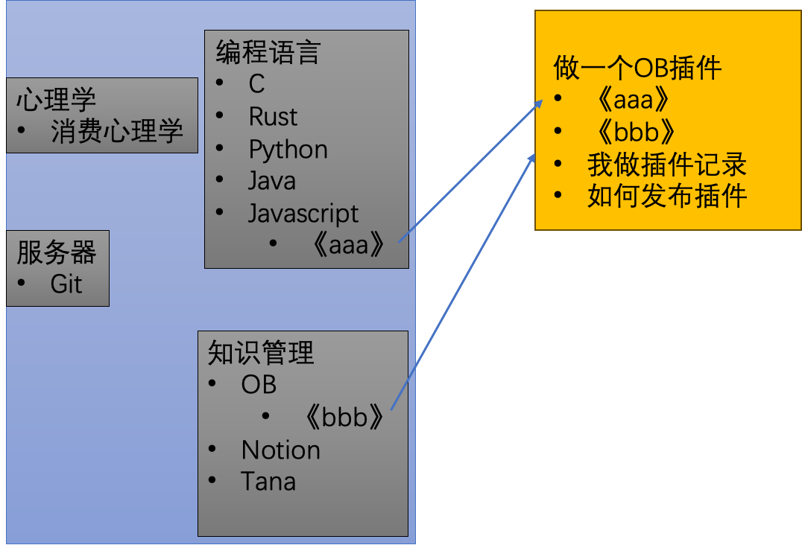
从这个案例里面来说，为了解决具体的一件事，把相关信息都规整过来是比较好的办法，那我们是不是所有文件都放过来呢？比如说，我对减肥有兴趣，这可是长期的活呀。或者这个事完成了呢，这个东西放哪里去呢？或者这件事重新又开始了呢？比如重新做一个插件，原来的有部分知识可用有部分不可用，咋弄呢？

# 4、P.A.R.A
PARA就是针对我们前面的疑问来解决的，首先它的几个原则是：
- **以终为始**：以支持得到有价值内容为基础构建
- **独立**：不依赖平台和来源，不受这些条件限制
- **灵活**：能处理当前和未来的任何项目，活动
- **简单**：不需要刻意耗时维护，标记
- **开放**：可以和任务，项目等对接
- **模块化**：允许根据当前任务调整优先级等细节

个人经验来看，第一条是很容易忽略的，容易陷入系统的执行维护细节。忘记了知识管理本身。

关于名词解释的部分，前面有提到过，这里重新完整解释一遍。
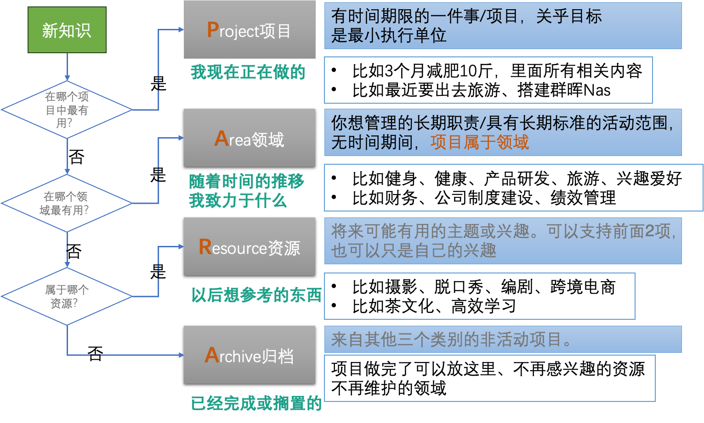

项目这个词有很多的解读视角，并不是我们PMP里面那种大项目才是项目，或者说，很多项目都是我们一个人的事。那么这里容易混淆的是项目和领域，这个词不太好翻译，目前大家都这么叫。通常来说，项目是基于领域的，下面用一张图来阐述：

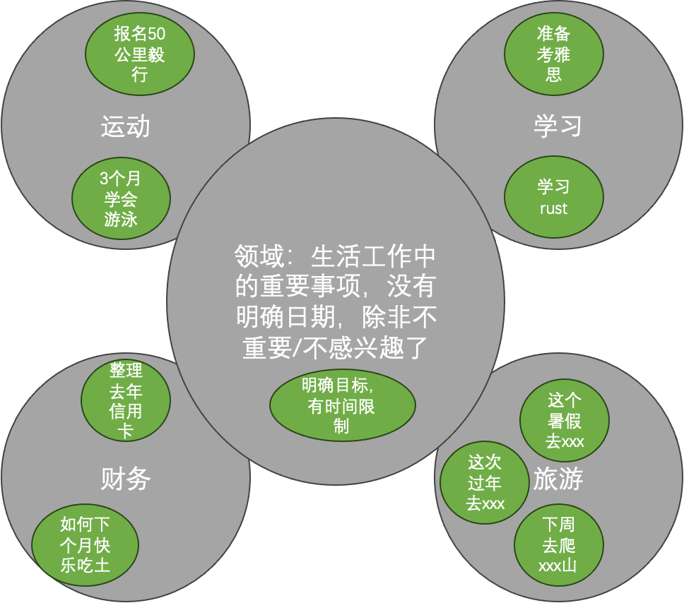

看起来好像理解了，但是里面还是很乱的呀，难道我就只有4个文件夹吗？

# 5、主题划分和文件夹原则
这4个文件夹是固定的，基本上我们整体的思路就已经很清晰了。该去哪里找大概是知道了，接下来的问题是，里面如何划分呢？可以用上面提到的杜威方法，相比之下，另外一个方法的视角可能更适合一些——维基百科方法。

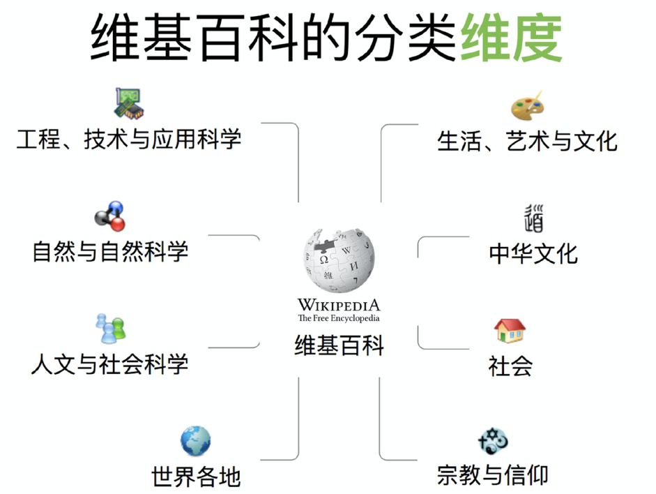

我们就可以简单划分为4个方面，另外，个人的理解是这样，我们不用考虑一蹴而就，所以在PARA文件下为了考虑将来的冗余，序号上就可以3位数来
* **100 学习**
* **200 工作**
    * 持续提升
* **300 兴趣**
* **400 日常**
    * 亲子
    * 水电煤气

100 表示学习，以后如果要添加学习相关的内容可以从101——199。保持一定的灵活性，同时也不用太费力去思考。

# 5、建立PARA的顺序
## 5.1、 从项目开始
这个很好理解，我们手头在做的事。

## 5.2 然后添加其他部分
添加的时候，参考上面关于主题划分的部分就可以了。如果我们决定开始搭建自己的PARA系统，这个时候也是梳理我们自己信息储备一个很好的契机。如果以文件系统为例来搭建这样的体系，可能更好理解。

> 下面这个步骤会极大降低我们整理资料的心理压力！！！信息收敛的利器。

* **第一步、集中信息**

集中信息是一个非常重要的过程，我们只有确定好信息在哪里，只要去那里找就能找到，如果相同目的的存放位置很多就会非常麻烦。如果是文件那我们就先至少放一个硬盘上吧。如果又在移动硬盘，又在U盘，又在网盘，公司一点，家里一点，手机里一些，基本上没有办法弄。

* **第二步、区分常用不常用**

这一步我们把文件区分成常用和不常用，其实就能发现有很多东西我们是不用的，不用的显然是占大多数的。最频繁的部分，我们在前面的项目整理已经做过了。
不常用的那部分我们几乎是不用管的，也不用费力去折腾了。

* **第三步、区分重要不重要**

只有重要的文件才值得我们去整理，这2个步骤可以取舍，因为容易选择困难症

* **第四步、PARA+维基百科分类**

项目已经完成了，接下来就是另外的文件夹，主要是R和A部分，按照前面的方法，100 学习，200 工作…… 。根据自己的情况来划分就可以了。

* **第五步、加上inbox和temp**
关于inbox的内容后续使用过程中继续优化。

## 5.3 文件系统整理思考
如果我们要决定做这件事，可以考虑先找一个空一些盘，做一个网盘同步的文件夹，里面建立PARA。这个文件夹尽量不要太大（取决于网盘大小）。太大了，其实没啥必要。

> 关于视频和照片，建议是存到网盘上去。另外弄个移动硬盘备份一下，就可以了。

> 各个软件的配置最好能统一起来，网盘同步。

## 5.4、作者的系统样例
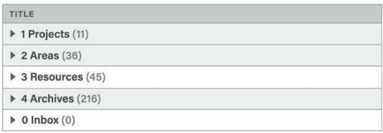

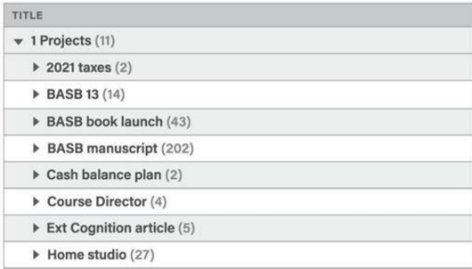

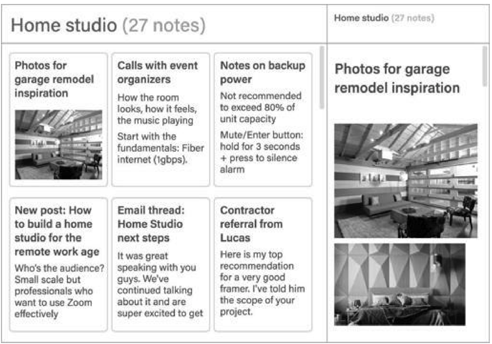

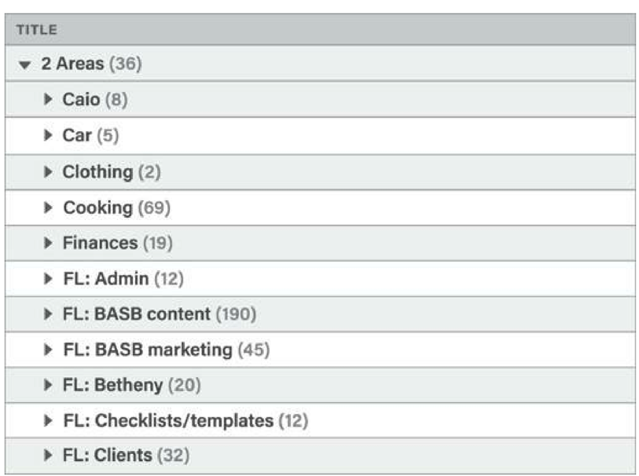

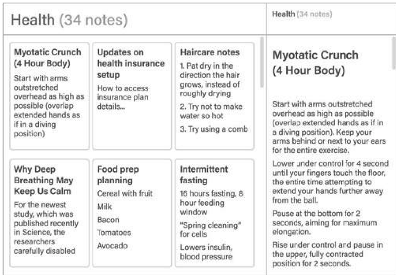

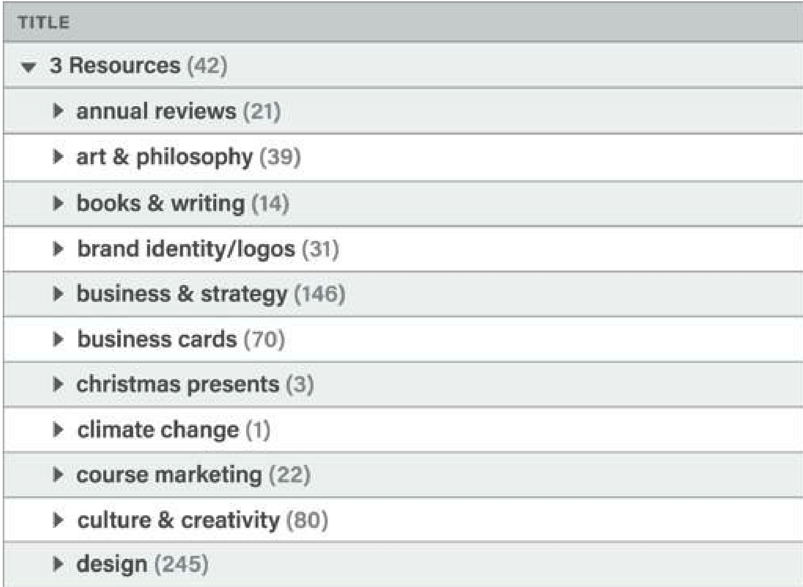

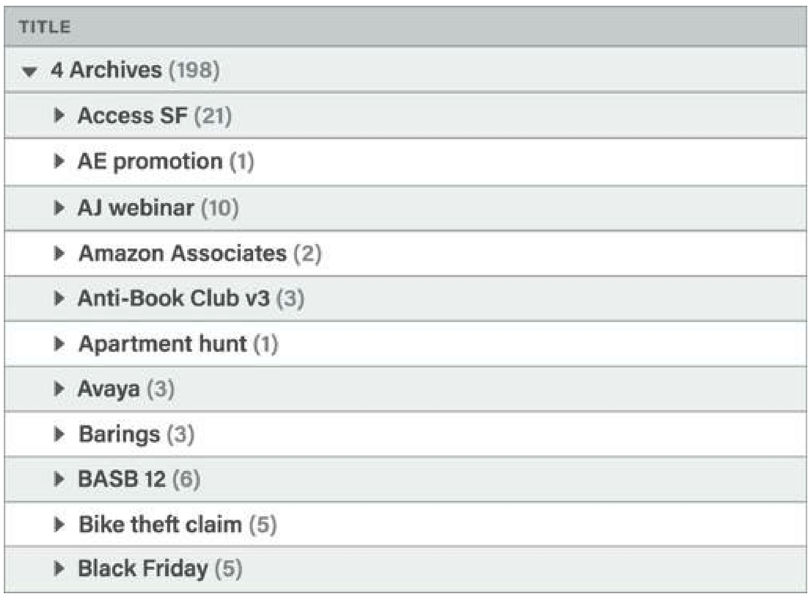

文件夹结构：
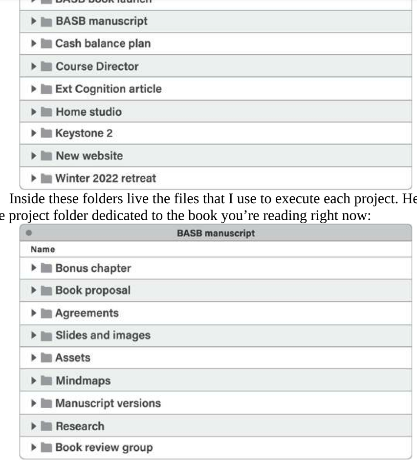

# 6、流动的价值
我们通常建立好一个文件夹结构里面，里面的内容就不动了，某种程度来说，PARA的流动性给了我们重新审视这些文件，这些知识的机会。更重要的是，养成这样的习惯，我们就能更加聚焦应该聚焦的内容。

这样的文件夹结构和我前面的思考有些不一样，整体上来说，Joplin的信息库，文件系统，OB的系统还有Notion，都应该于一个类似的PARA结构。一方面我们的思考模式不太需要切换，另外也不用费心为新的软件设计结构了。从这个角度来说，这个过程是值得的。

# 7、为什么选择在Notion中整理

在现在搭建的这个知识管理体系中，Notion会成为所有信息的处理中心。Joplin只是暂存的，所以不用刻意使用。OB主要是用来输出，所以也不是重点。之所以选择Notion有几个原因：
* 它其实本质上是一个网页制作工具，是一个个人的站点
* 它有数据库的功能，就是统计，汇总，筛选这样的功能
* 它可以整体复制，也就是项目复制下次可以继续使用
* 页面即文件夹

这些功能实际上以前是用confluence做的，但是灵活性和稳定性来说，Notion付出代价小太多了！

关于整理环节，用华老的话再合适不过了，读书是从薄到厚，再由厚到薄的过程。而这个从薄到厚的过程，可以认为就是我们这个整理的环节。举例说明：

* **想法信息**

从手机备忘录到joplin，甚至不用去joplin到了Notion的inbox，这个时候就要开始认真去扩展里面的内容，然后再到具体的分类里面，可以创建新的页面之类的。这里就是读书读厚的过程。往往这些想法扩展起来会非常大，而这个写下来的力量，却是实实在在的。针对一个想法，还有补充，可以不断往里面补充。

* **读书笔记**
反观最近自己写的很多文章，其实都还是属于读厚过程的产物，并不完全是属于自己的，这些东西是可以放在Notion中，而不是OB中。这次在学习PARA的过程中，网络上找了很多资料，大多数都止步于概念解释和名词解释，基本上也能听懂，但是背后的逻辑是很那明白的，所以在实施的时候就会有很多的卡点（摩擦）。这个时候我的选择是回去看书，找到书以后发现关于这个体系的前因后果，思考出发点，再结合自己的情况，理解就更深刻了。这个过程中不断有新的思考，就是我们在不断读厚的过程。

信息压缩是AI时代非常重要的词，但是能做到准确压缩的前提是我们真正读厚了之后的结果。信息压缩总结可以在Notion中体现。压缩的信息可以认为是为了给`未来的自己`提供一个索引。

# 7、完美主义的诱惑
我们始终容易受到各种诱惑，完美主义和慵懒的对立，始终是存在的。PARA让我们简化了文件知识的管理过程。但是里面的文件夹又容易让我们陷入完美主义的泥沼。所以

> 我们不要去囤积信息，而是要懂得去使用知识，我们也不需要把笔记软件弄得漂漂亮亮的，而是要懂得让笔记的内容，知识，发挥它的真实效果。软件本身，方法论实践，够用就好！