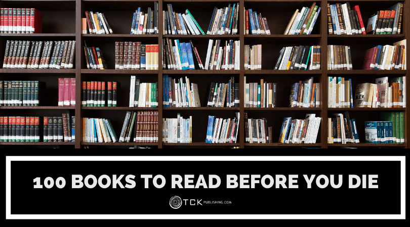
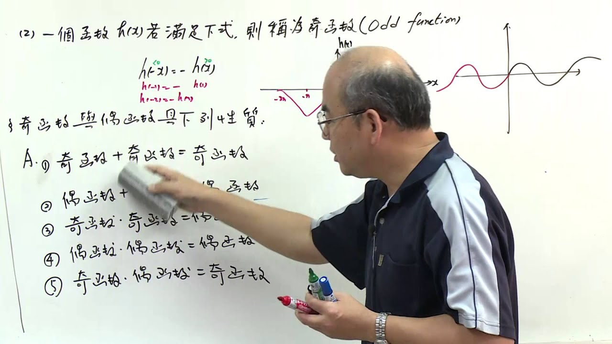
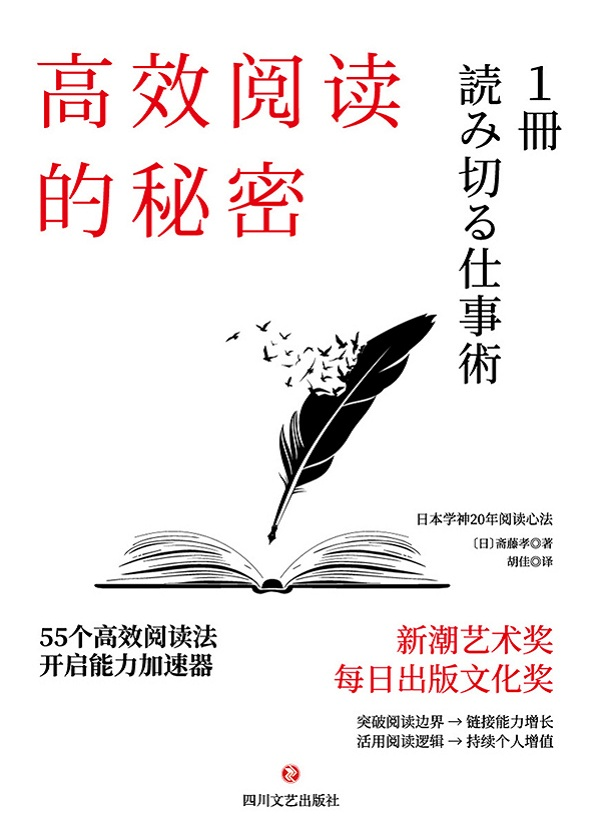
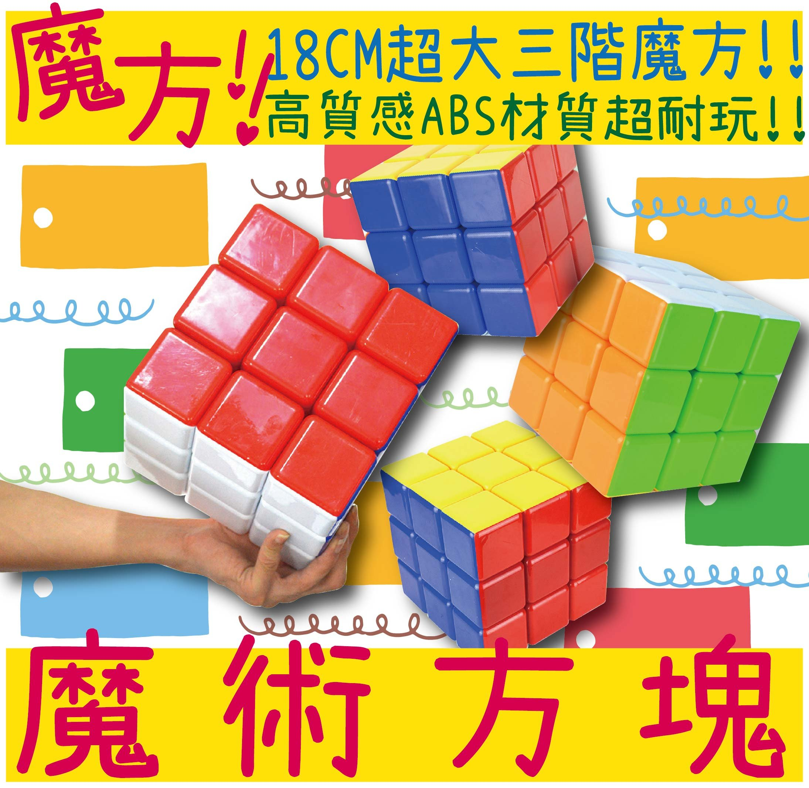
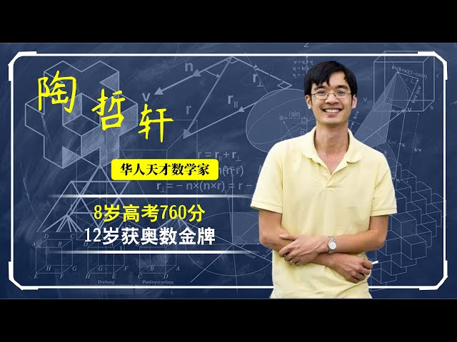
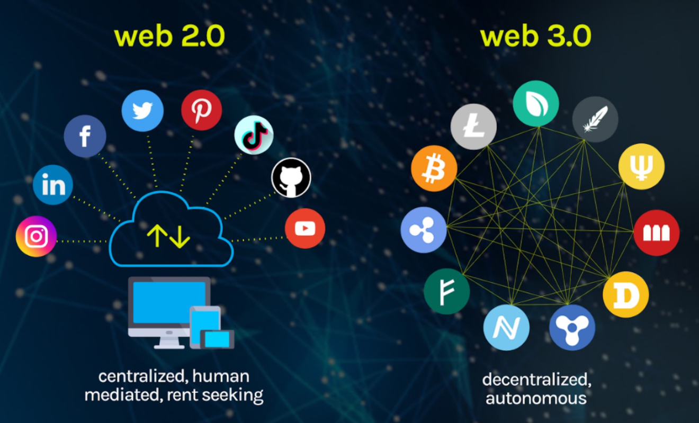
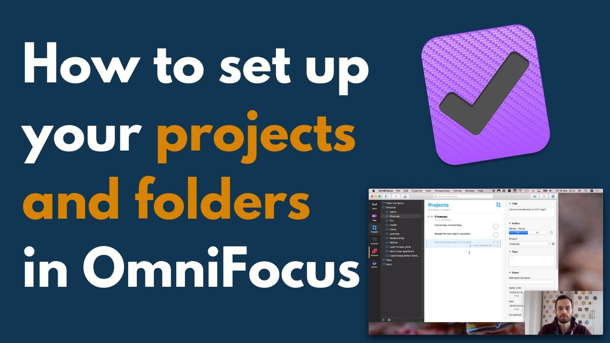
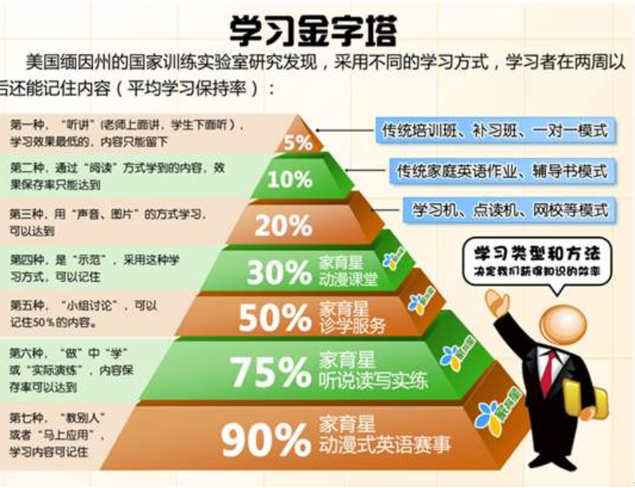
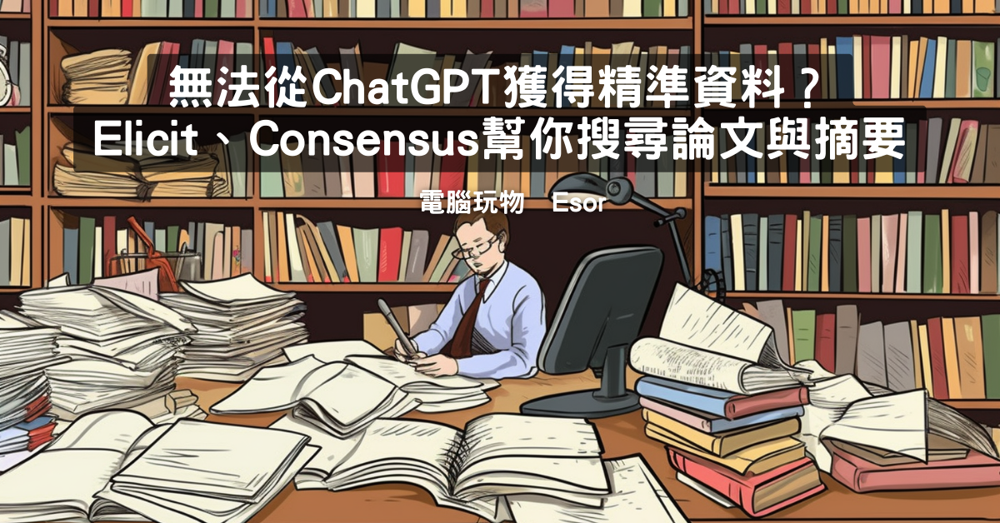
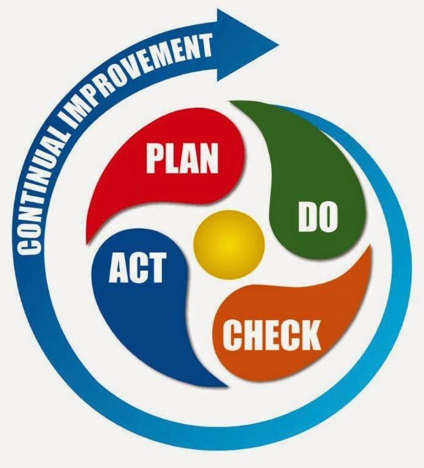

* content
{:toc}

信息爆炸已经是很久以前出现的名词了，实在不是特别有新意的东西。时代在快速发展，新知识新技能新要求层出不穷，我们总是疲于奔命，无暇自顾，越来越吃力，我们也想成长更快，成长更好，但是实在无能为力，还时不时半途而废。

买了很多书，买了很多课程，他们总是能触动我的痛点，但是总也无法解决我的痛点，我们也期待快乐教育，但是成年了，我们很难再快乐起来了。

接下来从个人的经历深入剖析为什么我们总会半途而废。以及为什么需要有一个高效学习的体系。

> 看到有人说100本书，300本书，700本书，真的吗？反正我不信，我一年才看几本书还看不完，碎片化学习也挺好

# 1、有人可以一年看100本书？我不信

听说有人可以一年看100本书，也有人可以看300本书，700本书。这些方法就像是，老师教了我1+1=2，现在让我去解微积分方程。
诚然，看书不是学习的唯一途径，时至今日，获取知识和信息的渠道和手段已经非常丰富了。纵然在如此忙碌的情况下，居然有人可以一年看100本书。我们的内心开始脑补的是，这个人真厉害，我感觉自己光读完都得一周，还要消化吸收，甚至我们潜意识里面认为，他可以倒背如流。我们算一下，如果100本书/1年，那就是差不多3-4天一本，放我们自己身上，这显然是做不到的，我们一天能自由支配的时间能有多少呢？2个小时？

如果还要说300本？700本，搞笑的吧，一天2本书，他吃什么呀？不工作的吗？看书能当饭吃吗？

对，这些人让我重新燃起了希望，所以重新想了想这些年我半途而废的那些历史，你有类似的经历吗？

# 2、壮观的半途而废史

说起来，自己并不算一个很懒的人，甚至思考上也不算懒，但是结果并不算好，我想细数过往种种，大概只是为了今天这篇博文多了素材而已。从半途而废的历史可以看出来，学习的目标，计划，对结果的预期，整体的把控是多么重要。内容比较多，可以挑着看。

## 2.1、阅读折腾史

最早接触的是《如何阅读一本书》，差不多已经过去快20年了，也算是认认真真读了，但是往后的岁月里面，最后只留下一个叫做“主题阅读”的东西，然后并没有深入实践过。接触这本书以后市面上陆陆续续也出了很多类似的书，没有再看，最近几年又入手了一本《高效阅读》。照着里面的方法也尝试了，坚持了一段时间没有再坚持下去。年轻的时候曾经想象过老了看看线装繁体的《二十四史》和四书五经，还托人去那个地方购买，一直没有成行。这个莫名的“夙愿”，让我买了一些书。罗胖第一次卖书《战天京》，那段时间担心买不到了，遗憾的是，他本来就是个商人，后来开始名正言顺大大方方卖…… 。

> 为什么阅读上没有深入。很大一个原因我想是因为并不明确知道，自己为什么要看这些东西，它们是兴趣爱好还是职业需要？还是个人提升还是别的什么，反正没有和钱挂钩，也没有和自己的人生目标挂钩（啥人生目标？不知道不知道），看了也没有反馈，所有的一切都像是在收集，苦哈哈收集，希望将来有一天有用，然而，20年过去了，啥也没有发生。

这个时候一个把自己拉出来，很重要的观念是，`一门深入，长时薰修，一通百通`。另外一个说法，据说是曾国藩讲的，看书就看一个人的，就当成是一个长者，随着自己的人生阅历变化，视角变化等等。

但是也因为有了这个观点，走向了另外一个极端——不再看书，轻易不开始，也就真的没开始。

## 2.2、滑板一直没学会
有几年觉得自己要运动了，大冬天跑去游泳馆，脑补游泳馆为了这个爱运动的自己居然还开着，这是啥精神？太伟大了，我说的是游泳馆伟大，因为没有人去，又开着，真伟大。但是到了地方，人满为患！！！

照着视频强迫自己学会了换气，学会了蛙泳，但是自由泳一直没有学，因为看了很多视频都说要先学会打腿，就一直没有开始，10多年了，也没学会，其实根本就没有学。

看很多极限运动视频觉得滑板真酷，身边的同龄人觉得大龄中年男子玩很另类，大概就是很容易运动受伤骨折啥的，加上真的挺胖，浅尝辄止了。

冲浪？大概能站起来。仅此而已。浮潜？没意思！深潜？没深入！水上摩托艇？也就开几分钟。海里游泳？一望无际，实在有点吓人！
> 这些运动项目，为什么没有坚持和深入，费钱的咱不说了。游泳和滑板还是挺能说明问题的。学习之前并没有明确的目标我想学到啥程度，既然我们不是专业人士，那总有个大概的诉求。很长一段时间对于这类信息和知识，自己选择的方式是询问其他人，而不是自己哪怕看看视频呢？大概总有个数自己想要达到啥程度吧

球类运动一直有参与但是都没有太深入，实在是觉得自己不是专业人士也不知道打到啥程度，只是为了锻炼身体，它就变得很玄学。啥是锻炼身体，多少算锻炼身体了？咋知道自己锻炼有效果了呢？一次陪客户，他的陪练教练是退役运动员，而且是非常高水平的，你可以想象最高级别的是啥样的就行。第一次正儿八经在生活中见到一直抽拉的状况，而这之前从来没有接触过，纵然是有些孤陋寡闻了，但是也说明这方面知识的短缺。
> 这个客户后来转打网球，可以想象水平不低。但是除了哇塞，我没有进一步的动作。今天回想起来，在运动上我没有很明确的目标，所有的运动浅尝辄止，除了花点时间花点钱，看起来没有留下什么，不对，一身肥肉还是留下了。

跑步大概是门槛最低的运动了，但是显然也没有坚持下来，尝试姿势跑步法（可能是装逼的潜意识），买了书，打算上课的，疫情前那个老头子好像国内有开课，后来跟着上了1个月的减脂课，头发掉了不少。后续就没有后续了。关于跑步，大概是在运动上最后的倔强了。因为毕竟买了书了。老实说，这种书我总是期望逐字逐句看的，结果并不好。因为看不下去，看了几页没再看了。
> 现在回想起来为什么做不到，大概是因为目标不明确，不知道自己想要跑成啥样。这个时候妄图去找到一个方法一个技巧搞定一切是很不现实的。

## 2.3、魔方没有学会

小朋友回来说有魔方，但是我看了几次都没看会，大概坚持了2天吧，放弃了。也照着说明书看了，还是没看会，这个事其实有10多年了，总是让自己时不时想起来这个事。

> 我想大概也是一样的问题，今天之前一直觉得是自己功利心过强了，今天想来大概还是对它的了解不够，兴趣不够，大概这个行业里面有啥阶段不熟，进而对于自己多久学会没有正确的认知。也就没有计划去学习。而这个过程伴随的挫败感和焦虑始终萦绕。

## 2.4、能想象吗？居然看数学分析

对数学有一种莫名的情愫，总觉得数学是一切自然科学的基础，这固然没错，但是关我毛事呀。很神奇的是好像关我事。有一天很神奇买了一本陶哲轩的《数学分析》，对，你没看错，然后我一页都看不懂，不知道是哪根神经抽到了，居然看了介绍以后买了，那时候他刚出道不久吧。

相对应的还有关于算法，因为不是科班出身，总对算法有莫名的情愫，现在印象比较深的是模拟退火算法，遗传算法。现在我都不知道它们是干哈的，但是在图书馆看了几天看不下去了。基本上完全看不懂。
> 我想大概是这些东西，个人来说，其实并没有现实的意义，同时，如果真的要看算法，至少应该有大概的了解它们为什么会产生，我为什么要学它。我想可能当时自己的内心，是希望找到一个武林秘籍，从此独步天下。不曾想即使知道了又如何呢？王子和公主幸福生活在一起，可能也会因为牙膏咋挤而产生矛盾，毕竟他们认识的时候才20出头，人生却有70年！

## 2.5、nginx死那里了

计算机技术的更迭速度非常之快，每天都会有新技术充斥各大媒体。每年总有一些新的概念和理念出来。老实说Web2.0认真学习过，Web3.0到现在都不知道是个啥，前段时间认真看了一本书，发现它的体系已经非常庞杂了。显然也是一个很大的坑。这些都有些远了。说说近的事。家里有个华硕的路由器，公司有个云服务器。

云服务器要弄SSL证书，几年下来都是手工操作的，甚至有时候时间长了，还忘记咋弄又要重新学。实际上现在已经有很多更简单的方案。而在处理服务器各种配置的过程中。

在很久以前，曾经有一个非常朴素又功利的想法。希望有一个正统的教程告诉我服务器的权限应该如何设置，很长时间都没有得到特别理想的答案。说起来到现在也没有，但是不影响一直就这么用着。
> 这里我想说的是，我总是很快陷入细节，而准备不足，实际项目实施的时候不可能会是这样。但是到了自己这里，就特别想要看到它的反馈，现在突然想到，也许那只是我的玩具而已。一个成瘾的玩具，而不是工具！

> 换句话说，在这方面的学习，一直没有形成有效的机制来更好支持学习过程，从而总是不断反复，只见树木不见森林！

和服务器这些技术类似的还有关于PS的学习，包括美工，20多年前就告诉自己我不会美工不会ps，居然20多年都没学会，其实认真思考发现是根本没去学，因为一直有一个声音，我不会。然后更多的声音是，为什么你什么都要会，你要学会整合资源！但是问题是，我都不知道如何去整合资源。这就像一个家长送孩子去上很贵的培训班，但是并不是培训班里面讲是什么。

## 2.6、时间管理和效率管理

和阅读同时起步的还有时间管理，后面会有博文详细介绍。时间管理分了几个阶段，从柳笔歇夫的《奇特的一生》到胜间和代《时间投资法》，再到番茄工具法等等不一而足，最后都没有坚持下来，成为长期的体系。直到意识到时间不可被管理，要管理的是目标和预期。
> 和前面一样，年轻的时候可以很冲动，现在冲不动了，停下来观察自己了。

总结起来，为什么会半途而废：
* 开始前没有明确目标，不知道为什么要学
* 缺乏相应计划，没有明确了解各个阶段成果
* 开始后对困难没有足够了解，也是因为前面俩不明确造成的。
* 对结果没有明确认知。也就是所谓小红帽看到野花跑开了……

都造成了半途而废。所以出发前的准备工作就显得尤为重要了。那么什么才是高效学习的障碍呢？

# 3、高效学习？可能吗？
从上面的个人经历大概可以看出来，一个傻傻坚持的胖子，实在让人有些心疼！
高效学习是许多人一直追求的目标，但是到底什么是高效学习呢？

## 3.1、知识相对论
前面几篇博文讲到的知识和信息的区别，我们认为能帮我们搞定事情的才是知识。但是我们很容易忽略一点，我们看一本书，它是知识还是信息呢？难道它不是知识吗？

它是知识，它是作者的知识！但是，它是我们的信息。我们只有内化了才是我们的知识。

我们清楚了，学习的过程是把信息转换为知识的过程，也可以说是内化的过程。我们所谓的高效就是如何提高这个过程高效

## 3.2、什么才是高效

有段时间非常迷恋效率工具，虽然最后大多数半途而废。所以高效对应的是低效，那这里的效是指什么呢？我们知道如果凭感觉，我们是无法切实提升的。而高效的重点，从实用主义的角度出发。就是拿结果的效率。
我们要用最短的时间拿到最好的结果。最快的速度掌握最需要掌握的知识。重新说一遍，我们要通过学习搞定一件事。不管是将来的还是现在的，一定是很明确的事！

高效就是：
* 最快的速度
    * 我们的时间是有限的 
* 掌握知识
    * 我们需要掌握的内化的知识和技能
* 搞定事情
    * 最后能用出来
    * 可以是搞定这件事，或者辅助搞定这件事
* 记住并复现
    * 记住它，将来还能用
    * 说起来一生中值得记住的东西并没有那么多
    * 遇到了，就好好珍惜吧

那么什么是快速呢？

## 3.3、AI来了还要学吗？

关于高速阅读，前几年流行过量子阅读，一本书大概就几分钟时间就进入大脑了，报名的家长还不少。油管上也有很多高速阅读的视频和课程，我们只需要知道一点：

> 如果这项技能真的很重要，真的很稀缺，我们最好还是付出点代价，哪怕是花点钱。我们不要期望付出100元的成本换回来100W的收益。

碎片化学习是时下非常流行的说法，它真的能奏效吗？可以看前面知识管理的部分，还有前面讲到的知识相对论。AI在这件事上有助推了一波。本来我再快再快只能看100本书，现在好了，我可以看1000本了，因为AI帮我抽出来最有效结论，我看这个东西就可以了。

其实换一个角度就很好理解。我们知道现在很多AI模型的基础是基于概率的。我们知道这句话，对于我们理解AI幻觉，AI对齐没有太大的帮助。同理，我们看1000本书的摘要，并不会让我们的大脑神经元建立深刻的连接。甚至连装逼都来不及，它就被忘记了。

如果不能为我所用，学它干嘛！AI时代我们更需要输出，去用，去积累。这个时候高效学习反而更重要了。所以为什么需要有这样的体系？

# 4、体系的力量和价值

说起来是容易的，做起来为什么很难。因为它需要的是体系的支撑，很很多人想的不一样，我认为每个人都有体系。只是这个体系从小就形成了。它在很小的时候建立，一直发展。但是显然，它不太能适应现在高速发展的时代。

体系可以是我们日常做事的方式方法，我们进入一个新领域，开始一项新技能，我们如何快速达到行业优秀的前提。而体系的搭建显然不是一蹴而就的，所以才显得弥足珍贵。

那我能不能拿别人现成的体系流程规则呢？答案是否定的，因为每个人的认知基础不同，知识储备职业积累不一样，这个体系的很多细节考虑都会有差异。

我们知道体系的打造是长期的过程，这个这个过程就需要我们通过PDCA的闭环不断优化。我们要清晰知道这段时间内，我们通过学习和体系打造相辅相成的过程，才最终建立起属于自己的体系。

