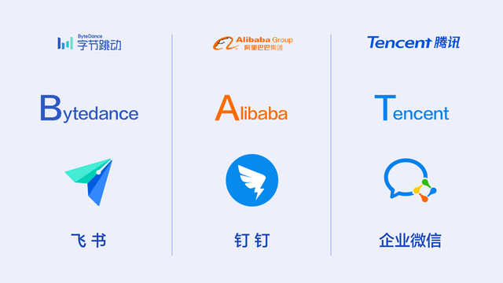
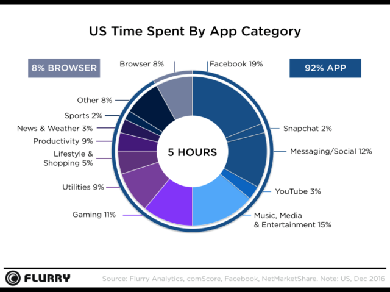
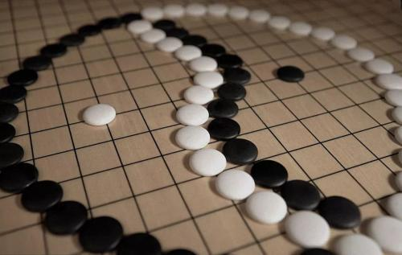
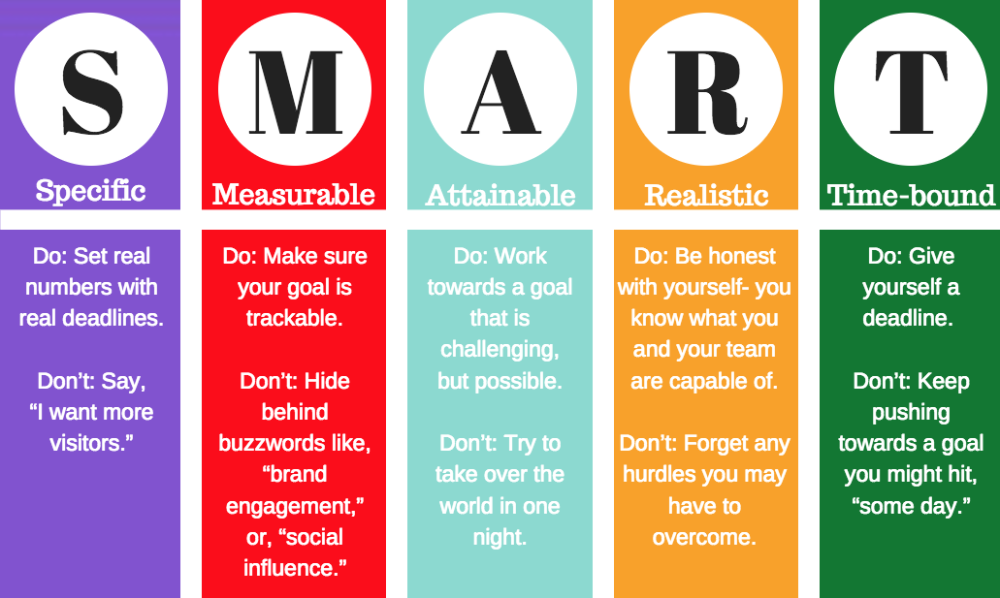
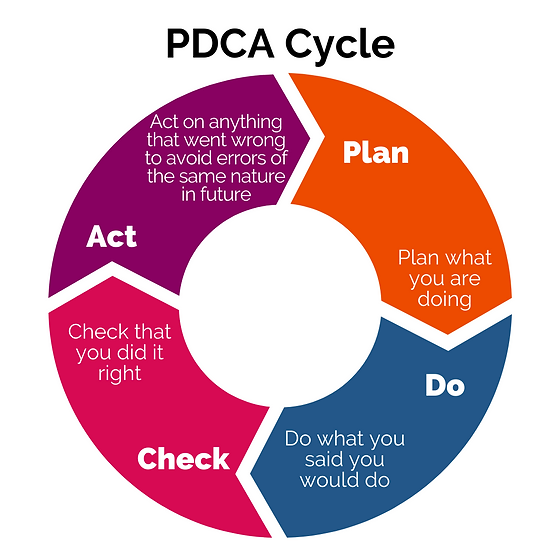
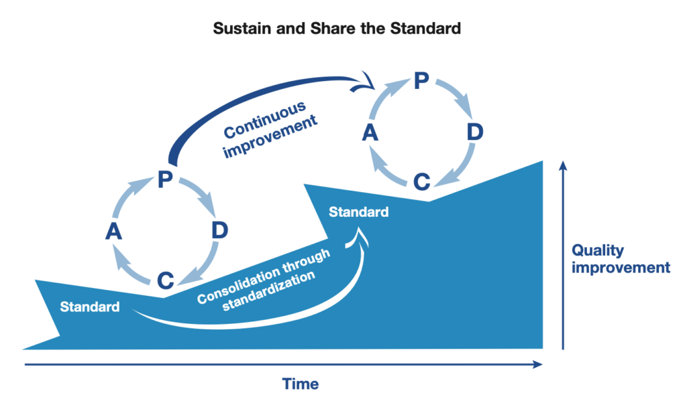

* content
{:toc}

和一位学霸聊过，他的高中班级类似李雪琴的高中班级，985起步。他认为：
> 我聪明，并且我沉得下心堆积经验和时间，我认为这两个都是不可或缺的

显然，这样的回答于我们今天要搭建的这个高效学习体系目标不符了。作为普罗大众我们还有机会吗？
这里先说结论，据研究，一个人智商高，仅仅只是智商高，并不能轻易拓展到其他领域。换句话说，智商测试本身也有局限性的。

而我们要想办法搭建的体系，是一套适合普通人自己高效学习体系。

<!-- more -->

# 1、专注力是一切的前提

## 1.1、为什么重要
> Attention is your need 。你的注意力在哪里，你的能量就在哪里。
前半句因为OpenAI首席科学家的推动，有了滥用之势。但是也同时告诉我们，在这信息的海洋中，我们更加要聚焦在那些能给我们带来价值的部分。

在很多年前，信息爆炸刚刚开始的时候，就有经济学家指出，当信息获得不再成为瓶颈，专注力就会成为稀缺资源。换句话说，社会资源的分配总是倾向于更有价值的那部分人。某些X教鼓吹未来那个地方满地黄金，So，那个时候黄金显然不再具备稀缺性了。

且不说现如今各大短视频公司的推荐算法有多强大，当所有人都开始能快速获取信息的时候，那么也就意味着如何更高效利用这些信息成为很重要的衡量标准。奶头乐就成为商家非常需要的手段。

> 注意力是我们作为普通人，最重要也最稀缺的资源。比钱还重要！！！

所以作为普通人我们能做哪些事帮忙我们提升专注力/注意力呢？

## 1.2、可是手机太香了呀

手机总是很那离手的，钉钉，企微，微信，飞书，邮件……，就像一条又一条的狗链子拴着我们，哪也去不了。在电脑前工作，总是免不了有意无意要去看看发生了什么。

有些人上班第一件事看新闻，有人刷朋友圈，有人看小红书，总之，看不到这些，我不知道有没有被世界抛弃，当看到富豪榜上依然没有自己的时候，稍微冷静一下，干点活吧。

当然，我们说工作是为了老板那点钱，学习和个人提升才是自己的，现实却往往是提升最快的技能都是在工作中完成的。我们不刻意区分高效学习是针对工作还是针对个人，要提升专注力，合理分配自己的注意力资源，首先需要想办法减少干扰。

> 做重要的事，特别是学习的时候，不要抵抗自己的天性，尽量找安静的地方。

我的做法现在初见成效，后续继续优化：
* 关闭手机大部分应用提醒，特别是社交媒体
* 关闭朋友圈消息
* 关闭大部分App的右上角角标，手机第一屏的应用都关闭了角标
* 社交应用App设定使用时间
* 大部分微信群折叠并静音

这个时候你也许会好奇，老板突然找我咋办？客户突然找我咋办？有一些是意外之外的，有一些属于是把重要不紧急的事，拖拉成了紧急的事。所以，可以试试看哦

> 社交媒体的这些产品经理，他们的KPI指标可是要占据每个人屏幕时间的，如果我们不用了，他们可就难受了哟。

关闭这个以后，我们好像腾出来了时间，但是我好像老是被人打断，又很难接上，咋办？

## 1.3、老是是被打断，烦死了

我们仔细回想一下，当我们全神贯注做一件事，被人打断，哪怕是1分钟打断，我们甚至要10分钟，20分钟才能接上那个感觉，非常难受。甚至还续不上了。码字和写代码，做设计可能都有类似的状况。

> 这里的状况好像除了要明确告诉大家你要干啥了，别打扰你，另外就是让自己变强大了。

关于这里的状态，我们想说的是另外一个事。我们从早到晚会在不同的事情上切换，但是常常遇到的情况是前面的事会深深影响后面。安排自己看书30分钟，然后去写个文档，写完又去看书。进入写文档状态至少也得10多分钟，甚至更久。

这里有一个改你那是注意力残留（attention residue）。字面理解就是前面那件事我们不会马上就丢开了，实际上会影响后面的事。

> 这里的建议做法是，同样的事尽量安排在相同的时间去做，大脑的注意力就容易集中。所以自己自主安排就显得尤为重要。

其实这里最重要的是，摸鱼咱们要定个摸鱼时间。看社交媒体等也是类似。甚至包括家里要缴水电煤气费，要去购物，一次性尽量搞定。

我也想一次性搞定，可是我一次专注不了那么久怎么办？

## 1.4、可是专注不了那么久呀，Deadline的魔力
很久以前听过一个阿里高管的故事，他是一个业务能手，个人能力非常强，但是也是火爆脾气，又让人感觉不合群，很多人不习惯，公司想给他更大的担子，结果发现这个人在大庭广众之下讲话会磕巴，这个时候派了一个HR去支持他。HR通过观看往年视频发现他在20分钟左右才开始磕巴。于是她就在10多分钟，快要磕巴的时候，安排人给他送水之类的，打断他。然后就发现他很流畅的讲完了，后来慢慢步入正轨了。

这个故事和专注力有一些关系，我想可能是说专注力是有限的，并不是每个人天然就具备长时间的专注力。

说回我们的话题，很多人都有开学前补作业的经历，也有项目上线前疯狂加班的过往。我们发现虽然作为普通人我们很难接受领导给我们倒排的时间，但是真正没有Deadline的时候，往往只会越拖越久。插个题外话，软件项目管理上一个有名的案例是计划几个月完成结果做了几十年（真有钱，这合同咋签的呀）。

所以我们就需要给重要的事设定一个期限，这个期限并不全是大的期限，更多的是短期任务。这个时候往往大力出奇迹了。就像是飞机还有2个小时起飞了，收拾东西就很快。但是前几天可能都没啥动静！

微观层面最好的方法就属番茄工作法了，后面还会详细介绍。大概就是我们设定25分钟做一件事，然后休息5分钟。
这里很多人会有个误区，我25分钟干不了啥事呀，回想自己的很多任务都是超过1小时的。我最早接触它的时候，同行前辈也改了改，觉得45分钟合适。如果这样想，就完全浪费了番茄工作法了，它很核心的是
> 任务分解！分解任务到番茄时间内！

> 总结下来，提高专注力还有个办法是遵从自己的生物特性，分解任务，给任务限定时效，发挥Deadline的魔力！

ok，摸鱼群/吃饭群/同学K歌群的兄弟姐妹们总要招呼咋办

## 1.5、摸鱼为什么是第一生产力 

摸鱼是没有办法不正视的状况，前段时间比较出名的《伟大不能被计划》，还有谷歌等公司的工程师日，也就是工作日有一天不用干公司的活但是可以用公司的资源。说起来好听，尼玛不就是摸鱼嘛！

我们知道注意力是稀缺资源，重要资源，有限资源。所以我们不可能一天到晚极致专注，那不是人，机器也做不到。这个时候不得不想起来早年在台企，港企的短暂经历。

个人体会，早年产品开发，技术攻关时最大的触发点都不在办公室里产生，有在地铁上，有在飞机上。有在散步洗澡时，为什么现在还记得很深刻，确实因为那几个产品倾注了太多青春和汗水。话说回来，为什么会这样呢？

《极致专注力》里面提到这种状态被称为发散注意力。当我们放松下来以后，比如午间休息，通勤路上，摸鱼的时候等等，进入这个状态的大脑会帮我们串联想法，养精蓄锐，催生创造力。

我们的想法就像是漫天繁星点点，当我们要用的时候，它们自动串联起来，发散的时候串联是随机的，碰撞出不一样的化学反应效果。

我们都知道摸鱼的时候，脑子里那根筋一直绷着，并不会完全放飞，其实效率会更高，因为憋着也憋不出个屁来。所以作者来了一句：

> Distraction is not the problem; over-stimulating our mind is the problem.

> 通俗来说：分心没事，超载才致命

还有其他一些例子，比如开车听广播，开车的人不晕车，有些人思考的时候习惯有些小动作等等。看起来分心了，反而更专注了。

## 1.6、提前计划/睡前计划

这个是书中提到的方法，每天睡觉前想一下明天要做的3件最重要的事，写下来，踏实去睡！我还没有开始实践，但是睡觉的时候手机不进卧室真的太重要了！如果睡不好，啥时候都干不成，《自控力》里面也提到睡眠的重要性。

但是不管如何，提前计划一下还是很有必要的，如果晚上不行，早上也应该计划一下，看看今天可能会有哪些突发事件，已经哪些重要的事先做，避免它变成紧急。

当然，这些只是提升专注力的一些方案。目前对我来说还是有效果的，希望可以尝试。

如果专注力已经非常糟糕，可能就不是这些办法能解决的了。只能逐步改善《自控力2》里面提到的大部分是关于冥想瑜伽的内容，我想可能也是这样逐步去恢复吧。

> 但是千金难买我愿意，如果文章你能看到这里，我想你至少是已经做了准备的了

作为普通人如何打造高效学习的体系呢？

# 3、全局思维起步复盘思维断后
> 有了专注力，更重要的是有主动性，回想自己这些年的学习，总是在对抗功利性，然而恰恰最重要的就是功利心，或者说目的性。

下面分别介绍打造普通人高效学习很重要的6个思维，分别是全局，记录，统计，规范，分享和复盘思维。

## 3.1、为什么我总是坚持不下去-全局思维

先看看我的经历：

### 听说时间管理很重要，赶快去学一下
时间管理有个软件叫OminiFoucs，说是学习曲线很陡，去看看。果然很陡。放弃了

### 要学习PS
听说有个教程很强，一看线上课程的先导课，不错，特别切中我的焦虑和痛点，买。买了发现没时间看，也没时间实践，老师是个骗子！割我韭菜呢！哼，我可不是韭菜，以后不买了！

### 听说算法很重要
对啊，算法很重要，LeeCode刷起来，github搞起来，太难了，要不明天吧

### 听说Obsidian很好
发现学习曲线很陡，啥意思呢，看了那么多视频，还是无法下手，好像和我工作也没啥关系，要不要学习呢？不学好像落后了，学吧，发现还挺难的。然后告诉自己，有必要吗？

### 弄一个技术
卡住了，就是卡在技术细节上了，然后总是不得要领。搞得灰头土脸的。

### 我想赚钱/我要运动/我要学习
很多时候我们避免不了要去问别人这样的问题，我想如何如何，希望别人马上给一个答案，也包括老师我想读书，给我推荐个书，在没有明确需求的情况下，没有人可以帮助我们。这也是为什么有人说当你看完100本书，你就知道自己要看什么书了。

实际上几十年来，我拿起来又放下的东西，数不胜数，但是不影响我又拿起来了。直到这次跟着沙牛学习，狠下心来好好打造自己的体系。

也许听到这里，你会觉得，是我的执行力不行，我的耐力不够，但是我想说的是，其实都不是！

### 执行力是伪命题
很久以前就意识到，执行力都是伪命题，至少在企业里面，大多数执行力的问题是任务分解的问题。回到学习上，我们会发现大多数时候我们都很急躁要解决一个问题，然后去找资料来看。这个时候已经出问题了。为什么呢？比如说我要学习PPT，是因为，我需要做PPT，我做PPT总是很慢，这个理由很简单，也很自然。

重点来了：
* 我为什么要学PPT制作——`目标`
* 我要学习哪些东西能达成这个目标——`计划`
* 要学习到什么程度才可以？——`度量`
* 我怎么知道我学会了？——`检测`
* 我当前的痛点和问题是什么？——`关联`
* 我有多少时间去学习，如何学——`计划`

这个时候引出来的就是我们一个关于高效学习的思维——全局思维。

> 当你准备好了，老师就出现了！

我们只有明确了学习的目标目的，我们才能真正开始高效学习，而这里一个很重要的衡量标准就是现在广受推崇也广受诟病的SMART原则

### 如何构建学习的全局观
* **静下来，慢下来，为什么要学**
从前面的分析可以看出来，目标很重要，我们只有知道自己为什么要学已经学到什么样的程度是OK的，才能开始，这个过程中SMART原则能帮我们梳理很多。另外有几个推荐的思考方向：
    * **从最终场景出发**，比如解决技术问题，我们可以从这个技术问题要解决的业务问题出发。可能就会发现这个问题可能不用解决了，因为有其他的思路和方案，途径。
    * **从自己的根本需求出发**。比如时间管理，我们可能细节上纠结不清，那就不纠结了，我们想想为啥要时间管理？然后去找这个状况背后的原因。

* **从基础脉络入手**
    * **学习软件从官方帮助开始**。学习一个软件，比如这次学习Notion，我就是从官方教程入手的。其实很颠覆，因为几十年来，我基本没有看过官方帮助，感觉实在太Low了，这玩意还要看帮助？另外一个例子是Obsidian，发现官方中文文档不是官方的，越看越乱，建议从英文帮助出发。
    * **学习成熟领域从通识出发**。比如学习西方思想，就从《西方思想史》这类书入手，理科也是类似的，从通识类书籍入手，对它们有整体的概览，然后确定中间学什么。建立计划。
    * **学习新领域从科普出发**。这次AI浪潮真是滔天巨浪，但是和我们普通人的关系，真是一言难尽，我想还是应该从一些科普类的文章入手，了解我们真正要做的是什么。

 > 总结起来，就是先静下来，慢下来，先想清楚自己真正要的是什么，如何衡量它，然后开始建立学习计划，打算上哪些课程，看哪些书。`主动`非常重要。

* **迷路的时候如何回家**
我们一开始建立的目标，和对这个学习内容的整体计划设计，会让我们在后续学习过程中迷失自己的时候，及时走回来。这段时间整理知识管理体系的时候，就发现时不时会陷入到某个软件的细节中去。那这个时候全局思维会让我明白
    * 我一定要用这个软件的这个功能吗？
    * 如果一定要，我能不能先放一放，有时间再折腾？
    * 对我实现全局目标有哪些影响吗？

* **避免过早优化**
我们在搭建流程，或者平常学习的时候，总是免不了想要优化，改善，这就很容易陷入细节，而忘记了我们的根本目标，而全局思维让我们明白，当前什么才是最重要的！

* **信心的源泉**
我们在学习过程中，遇到困难和困扰是必然的，只有一开始我们想好了要出发，那我们掉到坑里的时候，就能很快爬出来。换个坑呗，不至于在坑里唉声叹气，怨天尤人的。

* **碎片化学习也需要全局**
平常如果有刷短视频的习惯，会觉得每天长了很多知识，各行各业都有。早期刚开始兴起RSS的时候，我在Google Reader里面订阅的内容非常多，每天都会焦虑于又没看完，越看越焦虑，不看不焦虑。短视频也是类似的状况。我想说的是，其实碎片化学习如果只是到了解这个程度，真不能叫学习。如果真有兴趣，还是因为系统性去了解。

有了全局思维，离成功就不远了。接下来飞轮要开始启动，还有一个很重要的事，记下来。

## 3.2、写下来的力量
我们在学习过程中，有2个事很重要，一方面是笔记，这是毋庸置疑的，因为我们在内化知识的过程中，就是不断让这些信息和我们内在知识建立连接的过程，然后让这些信息成为我们内在体系的一部分。如何记录后面会有笔记的说明。

重要的是，我们要明白大脑更像是冯诺依曼体系中，电脑的CPU，它的缓存非常小，是用来运算的辅助，如果我们把它用来记忆，那简直是暴殄天物了。

记录下来就是硬盘，记录甚至连内存都算不上。大脑更重要的是计算，而不是存储。写下来的神奇力量在于，我们大脑可以专注于理解消化，让知识内化，而不是记忆。

除此之外，还有一部分是关于学习过程本身的，我们在学习的过程中，让学习更加高效更加流畅，它是一个长期的过程，所以对于学习过程本身的记录就显得尤为重要了。读到这里，大概明白了，每个人的学习体系是不同的，它是迭代演化出来的，照搬别人的体系，几乎都是无法奏效的。后面的复盘会用到这部分内容。

好的，我知道了写下来很重要，咋写？

## 3.3、规范让我们最快进入心流
我们在学习的过程中，需要记录笔记，需要处理参考文档，需要把东西放在该放的地方。这个时候规范就很重要了。我们需要不断迭代优化自己的规范，让自己能快速处理这些状况，这样才能让自己把注意力放在最重要的事情上，不会因为这些繁琐琐碎的事影响自己。

让自己尽快进入心流状态。

那我们学完了，真的学会了吗？我们需要反馈，需要了解我们的理解对了吗？

## 3.4、分享的价值
在技术领域深有体会的是，有时候我们花了很长时间摸索出一个东西，好像是个宝贝其实没什么。举例来说，jekyll样式中，图片没有居中，有些大有些小，我想的是办法是用Js去处理，遍历所有js，心理暗自窃喜宝刀未老，问了同事，用css一行代码解决了。

这个例子大概就是说，如果你觉得自己学会了一项独步天下的武功，最好show出来，让大家看看是个啥。我们也许需要更多被顶在墙角的尴尬，才真的理解了这个知识，其实是怎么回事。

我们不用担心自己学的东西被人学走了，如果那么轻易被学走，放心，它真的很容易被发现！

> 我们需要的是阳谋，把所有的手段摆出来，对方也无能为力。尽量不要陷入蓝海战术，小概率的成功事件带来的快乐。

分享出来，用自己的语言，通俗的视角讲出来，也正是费曼学习法的真谛。这也是为什么一些人乐于给别人讲题，最后有不错结果的原因吧。

## 3.5、复盘的力量，PDCA
广为流传的1万小时定律，如果我们弹钢琴1万小时，我们就能达到很高的水平，我们算一下，如果1天2个小时，就是5000天，差不多10年。看起来好像没那么难。但是大部分情况下，我们做10年保安，我们只会变成一个老一点的保安。而不是保安领域的专家。

这里牵扯出来的是所谓刻意练习，我们这1万小时不是瞎练的，而是刻意练习。就是有针对性的练习，这个练习是有明确目标的，或者说至少符合一部分SMART原则的。

复盘就是我们认为非常重要定期内观自己，定期设定训练目标非常重要而有效的手段。

在制造业非常著名的PDCA，也叫戴明环，曾经在日本经济腾飞中立下汗马功劳。

计划——执行——检查——行动

但是其实更重要是一个一个环嵌套着前进。

许多人因为听说复盘很重要，复盘很有效，但是不知道咋复盘，所以就拿了别人模板来复盘。一开始发现是听有效的，看看这周干了啥，如何干得更好，但是持续不了太久。这里和全局思维类似，复盘很重要的部分是计划，也就是我们当时为什么定这个目标。从高效学习体系来说，复盘很重要的是：

* 我想要在下个阶段达成什么目标
    * 这个目标和高效学习体系整体有什么关系
    * 这个目标如何衡量它已经达成了
    * 这个目标有哪些具体的任务承载
* 我当时为什么会那么想
    * 肯定自己，哪些是做得好的要继续发扬
    * 精进，哪些地方没做好，为什么没做好
    * 是外部原因还是自我原因，如何规避和改善

复盘很重要的是宽容看待自己，有量化指标也有主观感受。最后的结果要能体现在我们的学习体系中，并内化。

# 4、总结
有了这些失败案例的分享，有了思维的支撑，普通人也可以搭建好属于自己的高效学习体系了。