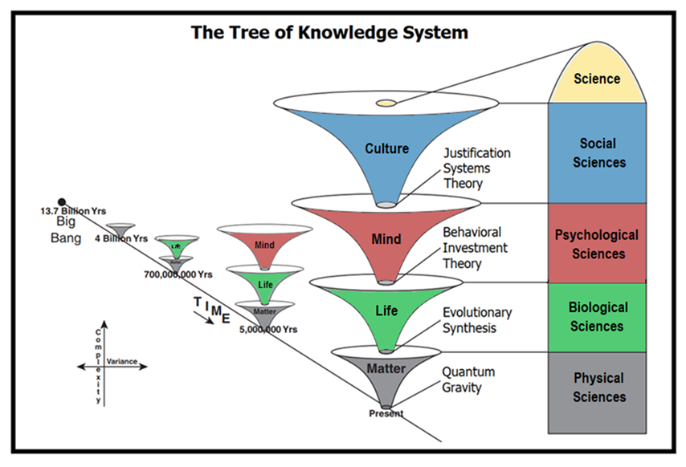
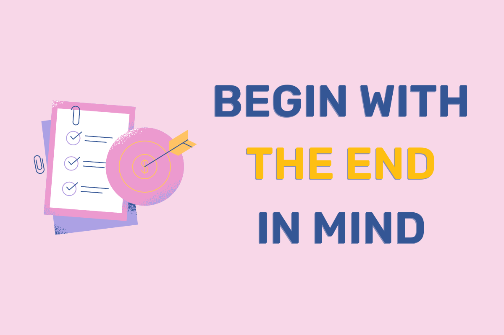
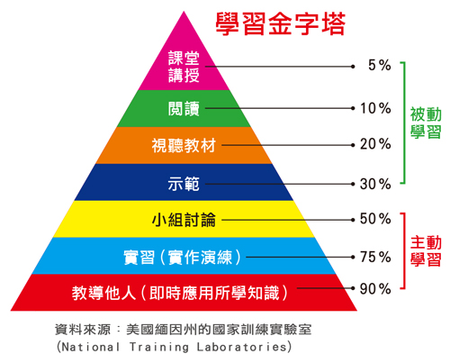
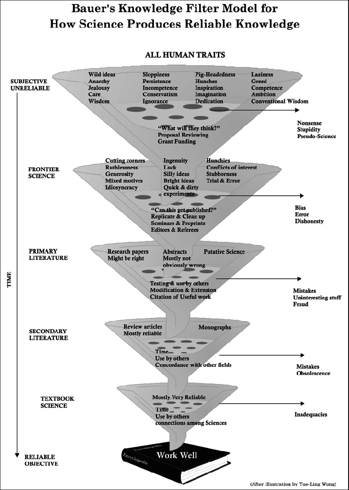

* content
{:toc}

经过前面2篇思维的分解，我们知道作为普通人如果愿意建立自己的高效体系，就可以建立。

开始之前，我们先冷静一下！下面是找到近几年油管上关于高效学习的视频，普遍10分钟左右，少有过半小时的，主要的思路是类似的，`通过这x步，轻松打造高效学习系统`。我们期望通过看这样的视频马上打造好自己的体系——很难呀！

所以我们应该如何去打造自己的高效学习系统呢？我们从学习的最终目的开始思考整个体系如何搭建。

<!-- more -->

# 1、此系统非彼系统—树木和森林
上面提到的那些方法技巧软件等等，我们会发现在实践的时候，很快就会遇到卡点。把他们总结的方法应用在自己身上，总是很别扭不得劲。

举例来说，知道要**减少信息源，减少干扰**，但是，当我们回到办公室，回到熟悉的场合，各种事扑面而来。给我们传授方法的老师，也许是一个比较独立有自我想法的人，而我们如果是相对内向，主见不足，第一步就被打趴下了。因为干扰源头就是领导，就是家里的环境等等。

再比如我们做好**知识整理**，这个想法毋庸置疑是对的，但是其实也是正确的废话，因为我们开始整理的时候马上发现，一个文件不知道该放项目文件夹，还是某个知识领域的文件夹。知识领域的文件夹又应该如何划分。本来我们是想整理文件，然后开始了哲学沉思，我是谁，我在哪里，我在干嘛？

> 简单办法，精炼结论，最大的问题是彼此的背景知识不同，经验经历不同，并不能完全照抄。需要我们针对自己的情况再做大量的调整，适配工作。

道法术器的说法略显矫情。上面介绍的大部分的内容都是针对我们具体操作中的点，也就是所谓术和器，包括对软件的介绍和一些方法。我们在执行过程中很快就会发现，卡点很多，针对我们自己的情况，会有很多的不适应。所以我们应该从哪里入手呢？

# 2、以终为始—我们想要干什么

我们为什么要搭建一个属于自己的高效学习系统，因为我们想更高效学习，而这个学习一定会带来切实改善。如果说人生目标太遥远，至少我们当前在工作中遇到的卡点，遇到工作中效率不够高，或者是我们想要去考一个证书，或者我们想要解决一些人生困惑，总之，我们希望从这里开始，我们的人生要开始转动了。

我们可以想象5年以后，10年以后，我们因为有了这样的一套体系，一套不断完善不断演化的体系，我们的生活和工作都带来了巨大变化。如果没有这样的预期和想象，实在没有必要去折腾这样一套高效学习的体系。

个人而言，这么多年下来，捡起来丢下去的东西实在过于多了，也过于发散了。可以说一直不得要领，所以希望能借此机会打造自己的高效学习体系，让过往在生命中留下印记的，连接起来，在未来的星辰大海更加璀璨。

> 说人话就是，在高速发展的时代中，在行业里面拿到更好的回报。

回到眼下，需要解决的是工作中那些需要提升的技能，四十不惑时让自己该不惑就真正不惑（总不能老是骗自己吧），也让生命中值得做得事，做得更好。

> 说人话就是，如果要装逼，逼格要高点。

总结起来，就是学东西又快又好，不是停留在掉书袋的阶段，而是切实深入到这个领域中去，以拿到回报为基准。那如何界定我们掌握了这项知识呢？

# 3、勇猛精进—我们要输出哪些内容

## 3.1、 广义上看实践是最好的输出
某种程度上来说，我们学习一个技能，或者学习一个方法，最后用在自己身上，实践出来给自己带来价值，很大程度上来说，它已经内化在自己身上了，要不然也使不出来。从这个角度来说，实践就是输出。实践就是需要把抽象的知识，从别人身上用在自己的状况下。

如果一件事我们经常做，重复做，必然会越来越纯熟，越来越精进。但是我们会发现，过一段时间不用，渐渐就开始生疏了。就好比Linux的命令，vi的操作，乃至于日常Word的使用。时间长了不用，总需要回忆，甚至要查资料，重新开始学习，所以除了实践，更重要的是沉淀。

## 3.2、 静下来写给未来的自己
常常会发现，工作中有些事即使重复做，长期做，但是效率不高，这个时候做一些提高效率的事，刻意练习，专门突破就很有必要了。如果这个时候没有记录下来，我们会发现时间长了又会忘记。梳理好写下来就显得尤为重要。

写下来有几个方面的好处：
* **强迫自己静下来**
    * 重新梳理这个知识技能的来龙去脉，特别是自己是如何掌握它
    * 这里蕴含着，将来如果自己忘记了，提醒自己如何快速回忆起
    * 它包含了自己内在体系的接纳和思考路径
* **自己将来不用从头学**
    * 如果还需要这个技能，照着做
    * 比如服务器安装，这就是专属自己的手册
* **破除知识的诅咒**
    * 避免不知道自己知道
    * 留下学会这个知识技能前的知识体系和内心感觉

写下来可以给将来的自己看也可以别人看。实际上大脑是用来思考的。写下来我们就知道我们不用再关注它了，它在一个很安全的地方。然后就是别人看。

## 3.3、回答问题教会别人
工作中生活中，好像辛苦学会的东西不应该轻易教给别人。但是很遗憾的是，捂在手里，它很快就坏了。真正有价值的是阳谋，我们只有在不断和别人沟通的过程中，才真正让这项技能内化固化沉淀。
如果一项技能一个方法别人很容易学会，几乎可以肯定这项技术这个技能，并没有太大稀缺性和竞争力。也不值得我们捂着，我们抱着手里的芝麻不放，也失去了抱着西瓜的机会。

> 能用自己的语言简明扼要把一个东西讲清楚，是一个并不算低的要求，但这也正是它完全内化的标志。也表明了，对我们来说，它从信息变成知识了。

## 3.4、如何优化我们的输出过程
既然我们要搭建这个体系，就需要开始度量这个过程，我们如何了解到这个阶段的效果呢。

* 第一步，记下来
    * 我们至少记录下来我们发布了什么
    * 可以使用Notion的数据库，我们：
        * 什么时间
        * 发布了什么
        * 什么类型的内容
        * 多少字数，花了多少时间
        * 输出方式（公司分享/视频平台/文字平台/单独给同事讲）
        * 使用情况
        * 其他
* 第二步，找指标
    * 建议是先从全局找
    * 类似每个月发了多少篇，多少主题？
    * 后期细化
* 第三步，优化
    * 阶段性优化具体指标

那有了输出的想法，我们如何输出呢？其实输出的时候我们就会发现，想要输出就需要十倍的输入，甚至更多。所以，如何学习呢？

# 4、干就完了—如何学习
我们接触到的大部分关于高效学习的内容，都属于这个过程，因为这个环节是最受重视最受瞩目的。
我想在这个环节上，我们需要考虑*快速阅读*，*深度理解*，*持久记忆*。
因为这个过程的工具，方法等都非常多，而且其实是没有办法快速奏效，短期提升的。就像是运动员的成绩会在各大赛事上展现，但是训练总是枯燥而漫长的。

我想这个环节我们可以有这样的思路
* 第一步，记下来
    * 我们每次开始学习记录时间
    * 我们的学习笔记记录下来
    * 我们的学习感受记录下来
    * 我们使用的各种工具
* 第二步，找指标
    * 阅读的速度，字数/分钟
    * 记忆存留情况

* 第三步，优化
    * 缓慢优化
    * 笔记规范
    * 文件命名规范
    * 其他

这个过程中，并不建议一开始就有很多量化的指标，每个人在学习过程中，感受，思路各方面都不太相同。过早的量化容易限制自己对这个过程的探索。在不断的记录总结中，更容易找到适合自己下个阶段的优化目标。
更重要的原因在于，这个过程中对自己的内观，会发现自己很多思维习惯，思考方式反而更重要。

> 重要的是，了解自己为什么会这样去理解，这样去想。为什么自己是这样的学习方式和学习模式，然后再有针对性去调整，刻意联系自己的学习技能技巧。

> 这个过程不建议马上改变自己的学习方法，而是先记录下来观察自己，然后再针对性优化。

在开始学之前，还有一个非常重要的事，就是我们为什么要去学这个东西？

# 5、 其实我们要学—计划

个人而言，这部分是最欠缺的，很多时候我会很快陷入到细节里面去，这次整理课程的时候，刻意让自己避开，尽量让自己慢下来，结果拖到课程结束了也才学到中途，还是勇敢承认自己就是这样的吧。

文章开头的*以终为始*针对整个高效学习体系搭建，这里特指我们要开始的这个知识/技能，我们的目标是什么？如何通过学习、实践达成这个目标。它的好处是我们事先预估了一个困难情况，也了解了我们希望达成的目标，对这个目标有一定的思考。在我们真正开始学习的时候，也许会有调整，会有挑战，对照这个目标，不至于止步不前，也不会深陷泥沼，不可自拔。

所以先见森林就显得尤为重要了。

所以这个环节我们需要做一个计划表(可以在Notion里面做)。以及给可能需要的后续环节记录做好模板，比如笔记，学习时间，输出记录等等

> 这个环节很重要的是，我们在制定计划时，当时的思考出发点，和当时的思考逻辑，当我们完成一项学习的时候，就可以反推当时思考的点，是因为：
> * 对这个行业的了解不深
> * 还是自己偷懒了，不想做
> * 我们也可以尝试推演以后的改进方向
> * 甚至我们可以思考计划不做是不是更好？

记录内容：
* 做计划耗时
* 用了啥工具
* 如何思考的
* 计划调整时的原因和思考
* 最后复盘看下计划和实际情况的差异

优化的方向包括：
* 计划的工具使用规范
* 计划复盘的角度

这里的计划指的是要开始学习了，学习之前还需要做的是收集资料，这里把计划和收集分开来，并没有特别的深意，大部分情况下，如果不是特别急迫的内容，我们前期可以轻松一些做收集的工作，即使是AI如火如荼的今天，我们也可以只针对某个领域，某个方向阶段性学习。

所以这些资料哪里来呢？

# 6、去芜存菁—整理

前段时间做知识管理的时候，把Joplin作为前置的收集工具，当时觉得3个工具有点多了，甚至不想做，等开始梳理学习过程的时候，我们其实是需要做大量的信息收敛，信息存放在Joplin，学习过程在Notion，最终沉淀去OB。但是Joplin被我用成了稍后阅读了。什么意思呢？因为它有很方便的信息收集功能，通过浏览器插件很容易就收集信息了，也就造成了事实上它的inbox很臃肿。

整理的过程就是去芜存菁的过程，我们如何更高效使用。这个过程很重要的是留下我们真正要深入学习的素材。

比如说我们打算学习一个技术，网上有很多资料，我们可以自己去学，可以买课程，可以买书，去芜存菁的意思就是接下来的学习过程中，我们要重点对待这些内容了。留下来的内容就是要开始做学习计划了。

> 这个阶段要思考的是，如果提高自己资料的判断能力，选择的思考思路很重要。

记录的内容：
* 工具的选择
* 资料选择时的思考
优化的内容
* 流程的优化
* 选择技能的精进

我目前的做法是通过wallabag来过渡，整理要做的事是把真正需要的内容纳入到joplin，文件的形式就直接放到Notion的学习计划中去了。

## 别人的书单和计划是没用的
我们很容易明白，为什么别人的书单和计划是没用的，他们只是信息，对于他们有效，是因为基于他们的知识背景、工作经历、认知水平，对于我们未必有用的，这里的去芜存菁是一个非常重要的过程。

那么，零散的信息收集在哪里？
# 7、来者是客—收集

目前我几个重点的学习方向，资料来源是油管、某报频道、一些人的博客、推、某信。

很多年前使用RSS一度给自己带来非常大的焦虑。因为担心错失信息。这次整理的时候，RSS给我帮了很大的忙。
大部分信息都直接在RSS阶段处理掉了，有需要的会转入到wallabag中去。

## RSS直接用
推，油管，频道都可以直接用

## 收藏夹和备忘录
推现在基本上把RSS都搞死了，所以现在的做法是分享到备忘录。某信是通过它自己的收藏夹。

> 这个过程优化就是如何让信息能汇总进来，而不被各个App裹挟着，在推荐算法的洪流中迷失

# 总结
体系的建立也是遵从全局思维，从最大的框架开始搭建，然后逐步完善其中的细节。通过前面的分析，我们知道，这个体系完全成型，并发挥巨大作用需要很漫长的演化过程，但是只要开始，就会给我们带来收益。

遵从知识管理的思路，我们知道，想要搭建一个属于我们自己的高效学习体系，功利一点来说，我们是希望学习能有成效，就是能切实高效提升我们的个人价值。

高效学习体系的骨架大概从这几个角度思考：

* 学习
* 记录学习过程
* 记录过程总结
* 规则流程
* 工具

只有我们记录下来，我们才有分析的基础，才能针对性优化，才知道自己真的开始变得不一样。

如何开始，我们就从最小的MVP开始，从一个小的知识点开始。

我们一定要走完完整的流程，然后才明白我们最先需要优化的部分和环节。
