* content
{:toc}

知识的留存是学习上很重要的一个指标，也就是我们记住了多少。学生时代的学习目标和步入职场并不完全一致。我们知道学生时代的目标很大程度上是筛选，以及思维的训练，很多内容并不直接影响现实生活，就像常常提到买菜不需要牛顿定律一样。

步入职场，我们做到够用就好，如果需要深究的领域也需要考虑投入产出比。《最强大脑》中的那些记忆大神，并不是我们所追求的目标。


所以我们应该如何提升我们在记忆上的效率呢？

<!-- more -->

# 1、记忆法未必适合我们

大师托尼博赞1991开始举办世界记忆大赛，这期间，我们见证了一个又一个记忆力的传奇，短时间记住多副杂乱扑克牌的顺序，已经是基本操作了。而大部分人使用的方法就是——记忆宫殿。


简单来说它是通过将我们要记忆的内容和一个“宫殿”（可以是虚拟想象的，也可以是日常熟知的，类似自己的房间等）中的物品相结合，从而通过回忆这个“宫殿”，回忆起这些内容。通过这个方式，这些大师们创造了一个又一个神话。这样的介绍也让许多人跃跃欲试。

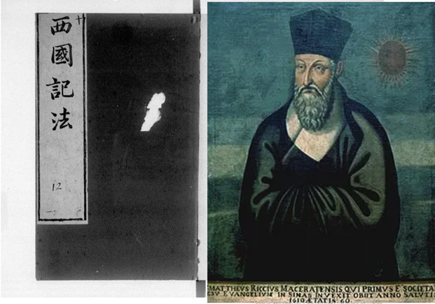

而更早关于类似记忆方法是利玛窦的《西国记法》(史景迁写过注解，可以看他的书)。我们也有走马观碑的典故。

为什么要讲这一段内容，很大原因在于，我们需要克制马上学习它的冲动。

> 说人话就是不脱一层皮，根本不可能学会它。

其实很好理解，我们记忆一个知识点就需要一个宫殿/房间。我们要记忆10个知识点呢？100个呢？1000个呢？如果我是路痴，面临的挑战自然也更大。

问题是，我们真的需要记住那么多东西吗？我想应该不是的，遗忘是生命赋予我们的优势。我们需要把空间让位给真正需要记住的部分。

对于快速记住的那些内容，我们知道过段时间就会遗忘，我们如何让它们更持久呢？我们先来看一下记忆遗忘曲线，了解我们是如何遗忘的。

# 2、记忆遗忘曲线


艾宾浩斯记忆遗忘曲线成名已久，我们多少了解，但是如果不是特别原因，我们很难会去细究。而这也正是许多误解的来源。另外，针对不同的知识点，每个人的状况也有差异。

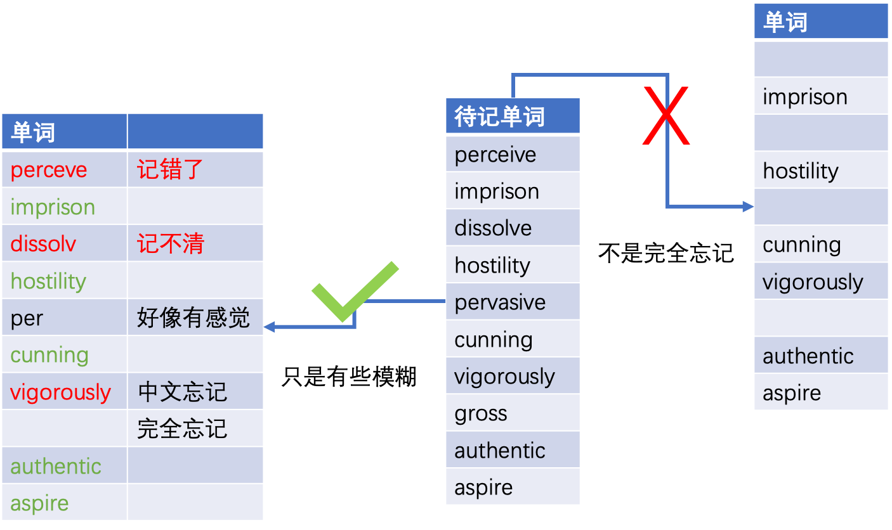

通常潜意识会认为，遗忘就是彻底忘记了，完全没有印象了，大部分情况却是，我们只是模糊了，一个单词忘记了其中一些部分，或者记错了，并不完全是忘记了。

针对这个遗忘曲线，我们自然就想到了，打断这个过程。在它快要遗忘的时候，我们重新复习一下，阻断它。10个单词有5个模糊，重点突破这5个，另外的5个，我们可以时间长一些再去复习。这样的好处是不言而喻的：
* 不用每次全量复习
* 我们的复习更有针对性

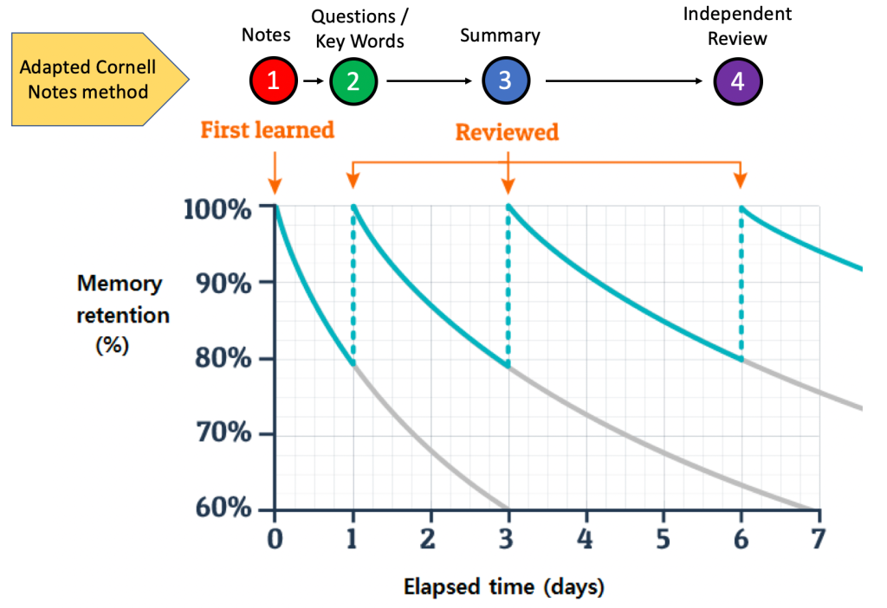

间隔复习，是我们对抗遗忘的最佳利器，我们可以试着自己去构造这样的体系。

# 3、改善之道—间隔重复
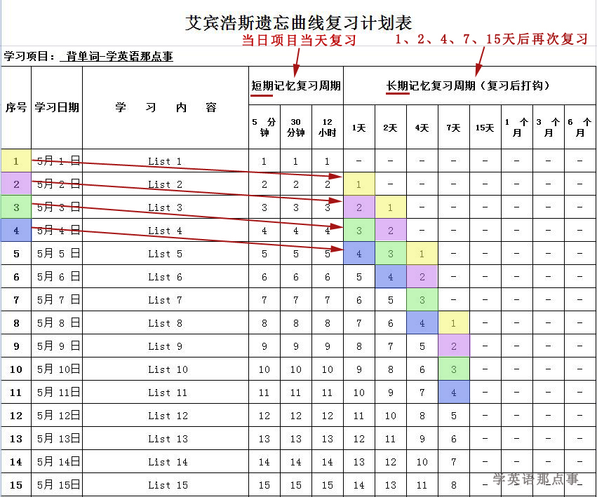

做这样的一个表，我们就知道什么知识点什么时候复习是最合适的，也是最有效，时间利用率最高的。但是，冷静！

这个表格我们能用吗？能用，但是也不能用，它缺了一个很重要的部分——动态跟进。正如前面的记忆遗忘曲线解读的那样，我们对那些知识点的记忆留存情况并不一致。而我们在复习以后，它的留存率也有不同。

我们尝试做这样的思考：

* 1.设定知识点展示间隔，最大重复展示次数。
* 2.显示一个知识点。
* 3.如果回答正确，则将间隔加倍。
* 4.如果回答错误，则将间隔重置为 1。
* 5.将重复次数加 1。
* 6.重复步骤 2-5，直到重复次数达到目标重复次数。
* 7.将知识点标记为已学习。

这是一个非常简化的思路。也有人使用纸质的盒子来实现这个过程，如果对于更多的知识量它恐怕很难胜任。


下面是一段伪代码，大概可以了解这个思路：

``` delphi
program AnkiAlgorithm;

uses
  SysUtils;

type
  TCard = record
    Front: string;    // 知识点问题
    Back: string;     // 知识点答案
    Interval: Integer;  // 重复次数
    DueDate: TDateTime;  // 间隔时间
  end;

function CalculateNextDueDate(card: TCard): TDateTime;
begin
  if card.Interval = 0 then
    Result := Now  // 首次学习，设置为当前日期
  else
    Result := card.DueDate + card.Interval;  // 计算下一次复习的日期
end;

procedure StudyCard(card: TCard; success: Boolean);
begin
  if success then
  begin
    card.Interval := card.Interval * 2;  // 成功记住，将复习间隔延长
    card.DueDate := CalculateNextDueDate(card);
  end
  else
  begin
    card.Interval := 1;  // 未记住，将复习间隔重置为1
    card.DueDate := CalculateNextDueDate(card);
  end;
end;

var
  card: TCard;
begin
  // 初始化卡片
  card.Front := '离太阳最近的行星是什么?';
  card.Back := '水星';
  card.Interval := 0;
  card.DueDate := CalculateNextDueDate(card);

  // 模拟第一次学习
  WriteLn('Question: ' + card.Front);
  ReadLn;
  WriteLn('Answer: ' + card.Back);
  ReadLn;

  // 模拟复习结果
  StudyCard(card, True);  // 假设成功记住了答案

  // 输出下一次复习的日期
  WriteLn('Next review date: ' + DateToStr(card.DueDate));
  ReadLn;
end.
```

从这里我们可以看出来，最近关键的内容是重复间隔的时间和重复的频次。我们自己去实现这样的过程显然是不现实的，所以就引出这篇文章的主角——Anki

# 3、Anki的使用
关于记忆法和遗忘曲线的研究，最深入的当属SuperMemo，它的创始人大学研究了这些课题，后来成立了公司，现在已经是V30了，作为商业软件，它不轻松

而在很早以前，基于SuperMemo-V2的算法，有了一个开源的软件Anki。相比SuperMemo，它的易用性了有了很大的提升，学习门槛低了很多，而且因为开源和插件的缘故，发展势头非常勇猛。但是为什么我又要提SuperMemo这一段，是因为我想也许有一天我还是会捡起它来。

## 3.1、先明确目的
在我们搭建体系的过程中，所有使用的软件，我们都有一个原则，它够用就可以了，首先我们要明白的是，我们希望通过来解决什么问题——记忆留存，长久记忆。所以插件和界面如果很费劲就别折腾了。

## 3.2、下载安装
它的源码现在放在github上，地址是[https://github.com/ankitects/anki](https://github.com/ankitects/anki)。在它的relaese里面就可以下载最近版本了，可以看出来支持很多系统。
> 这里下载的是最新版本。

另外一个下载渠道是[https://apps.ankiweb.net](https://apps.ankiweb.net)。

## 3.3、添加牌组
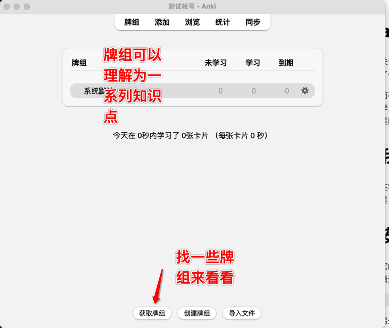

默认情况下面我们可以看到这个面板上，有几个按钮，下面的牌组=一系列要学习知识点集合。
为了让我们对它有更直观的理解，我们就从网址下载一些别人做好的牌组。
从这个网址，我们找到中文的牌组来下载，[https://ankiweb.net/shared/decks](https://ankiweb.net/shared/decks)。

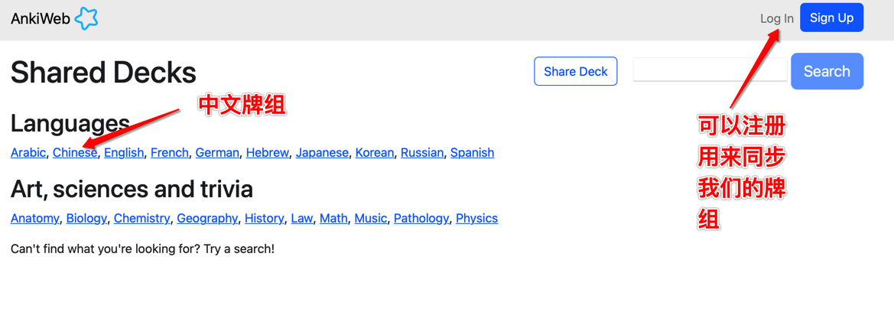

打开中文内容，我们选择妙蛙的内容

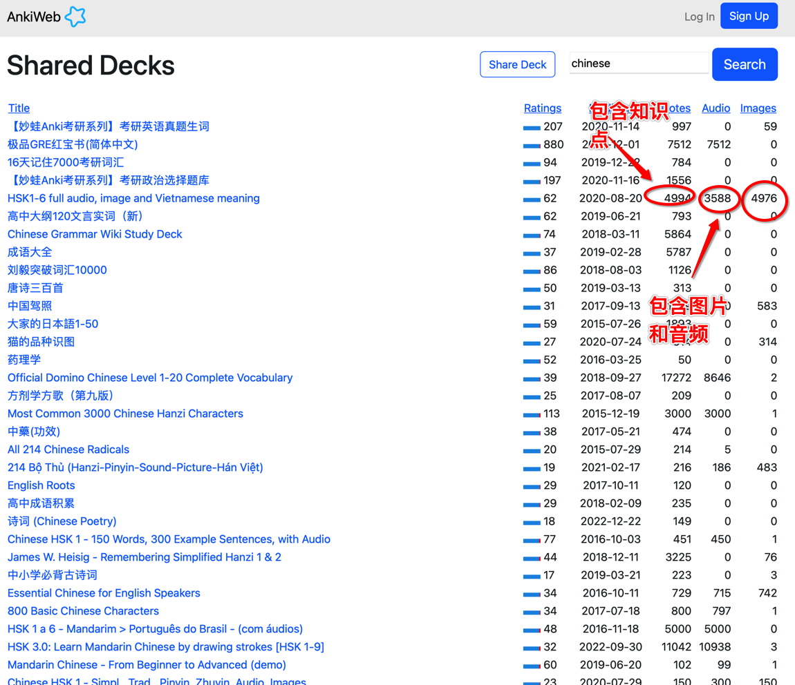

点击download下载文件

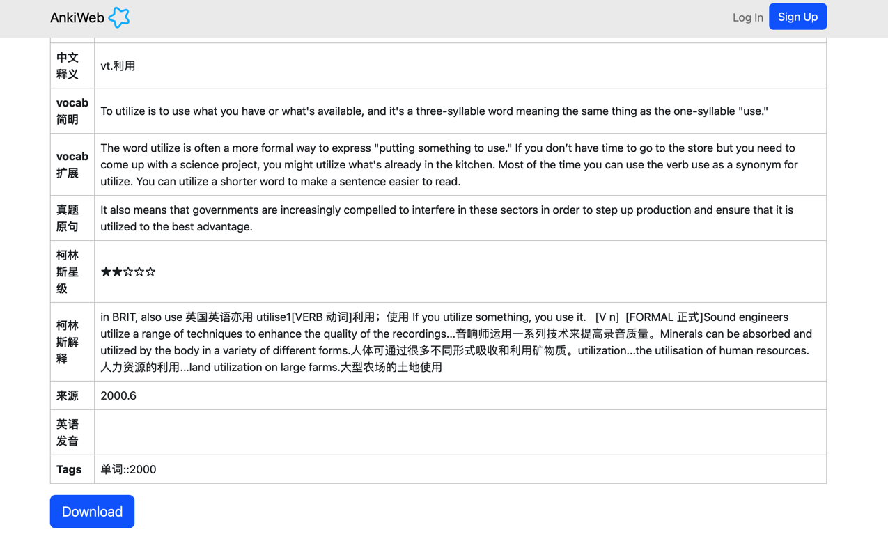

下载以后直接双击文件就可以添加进来了。


添加成功以后，我们就可以看到这样的界面：

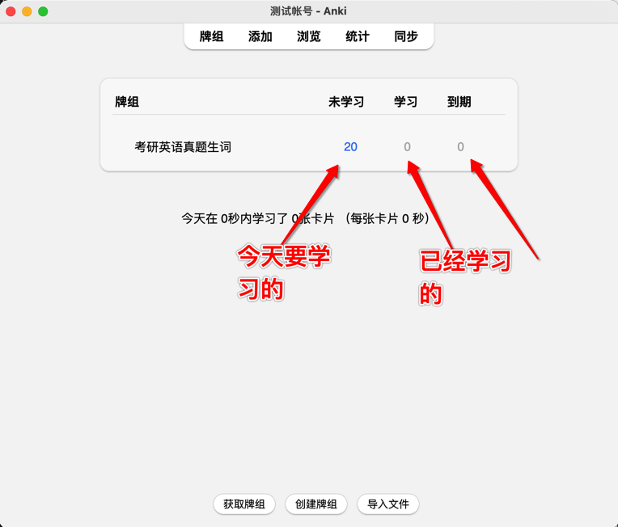


## 3.4、开始学习
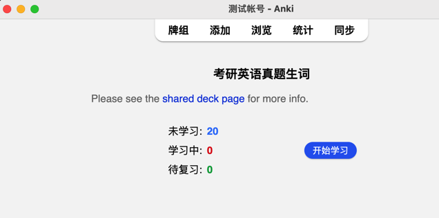

点击开始学习，我们就开始学习今天要学的20个单词了。

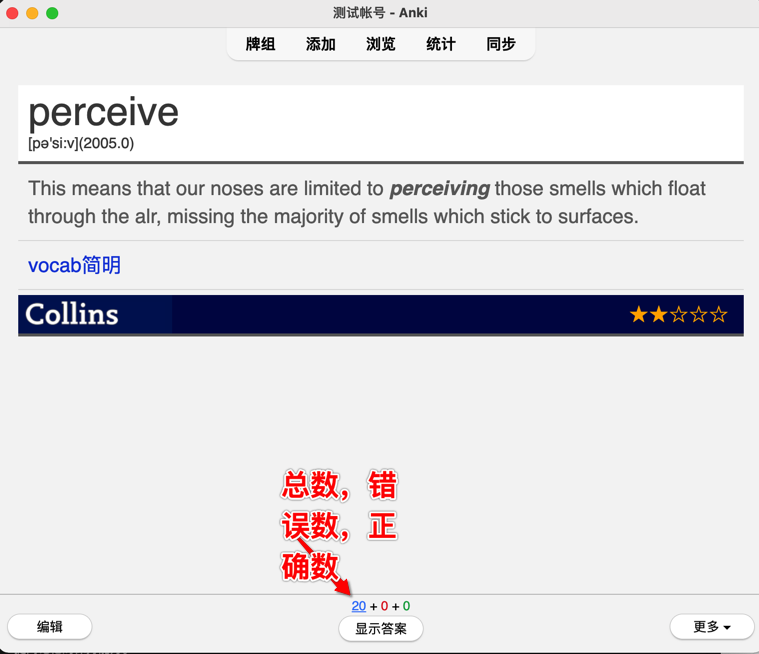

> 这里容易有个误区，以为它来评判我们的记忆情况，并不是如此，它只是忠于我们对自己的了解。

我们点击`显示答案`以后，我们自己评判对这个知识点的掌握情况，
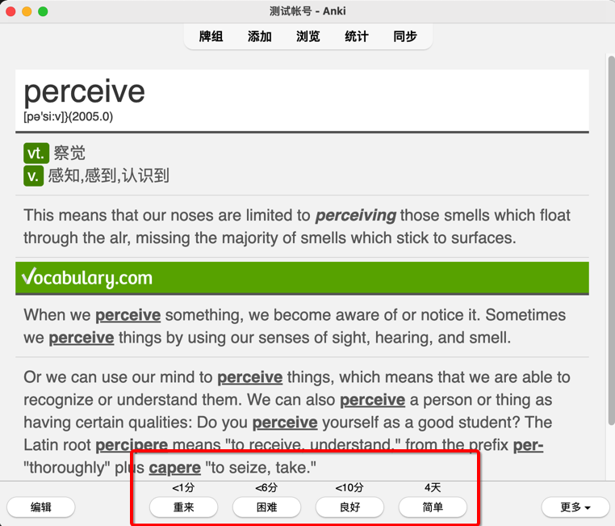

我们自我评估这个知识点的掌握情况：
* 如果觉得已经掌握了
    * 那么默认情况下，4天以后再复习
    * 这个**4天**不是固定的，随着学习的深入，它会动态调整
* 如果觉得很困难
    * 我们现在马上再好好学习一下
    * 等会很快就会出现这个词

> 这里记忆效果的差异，取决于我们对自己的了解程度。有时候累了，懒了，可能就点得快了。

我们选择任何一个按钮，系统就对这个知识点进行了新一轮的动态评估。然后开始展示下一个知识点。
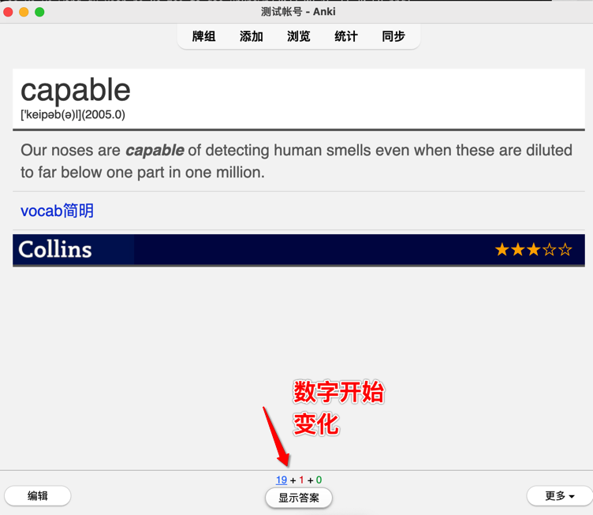

## 3.5、统计学习情况


大部分情况下，这就是我们利用Anki辅助我们记忆的过程。

## 3.6、每日新卡片设置
从前面的学习过程中，我们知道，一次学习的知识点/卡片数（下面开始用卡片代替知识点，方便说明）是20，到了明天我们除了新学的卡片，还有老的卡片要复习，这个时候也许就是40张卡片了。这个时候我们进入牌组的设置，就可以看到这个信息了。

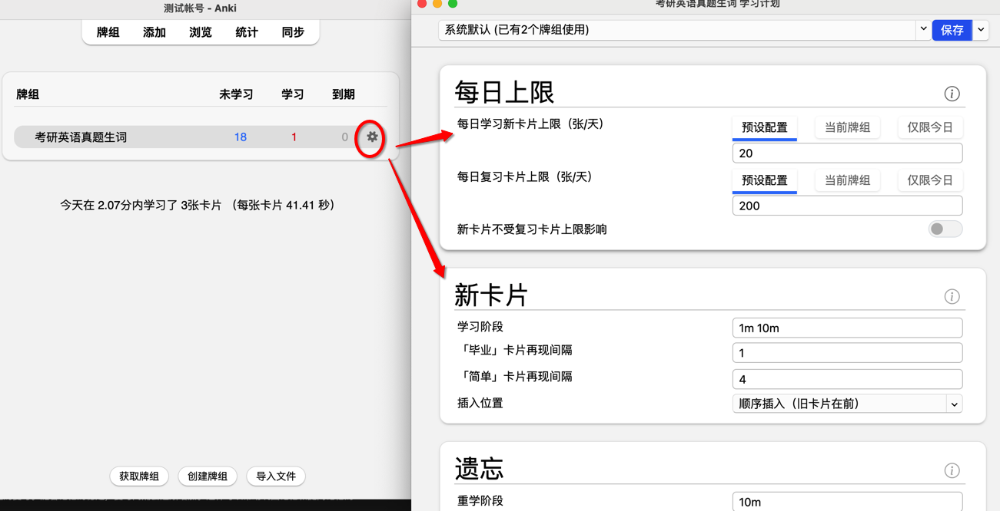

如果觉得20个太少，可以增加一些，个人建议不超过50，多了时间不太够，反而增加了很大负担。而且增加了每天新卡片数量，对应复习的卡片也会有建议。
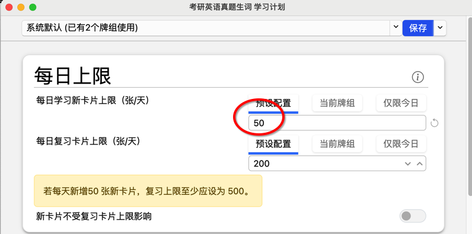

这个很好理解，我们把握自己每天要看的卡片的总数就可以了。

## 3.7、卡片和卡片模板
简单理解卡片=知识点。我们把需要学习的知识分解成不同的卡片，每个卡片正面是问题/概要/关键字，背面是答案。我们通过看正面的问题/概要/关键字，回忆起后面的答案，这就是学习的过程。

针对不同的知识我们对卡的正面和背面都有不同的诉求，比如我们希望正面有图片，希望正面是一个选择题的样式，一个判断题的样式，这就要提到卡片模板。我们可以直观看一下模板的样式区别，可以从`添加`这里点开选择：

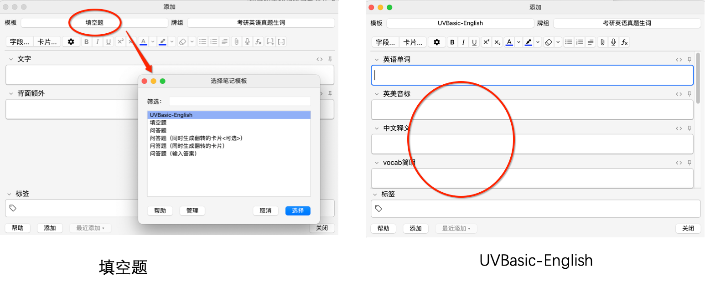

如果需要更复杂的模板管理，可以通过工具菜单—管理模板，来查看和编辑。

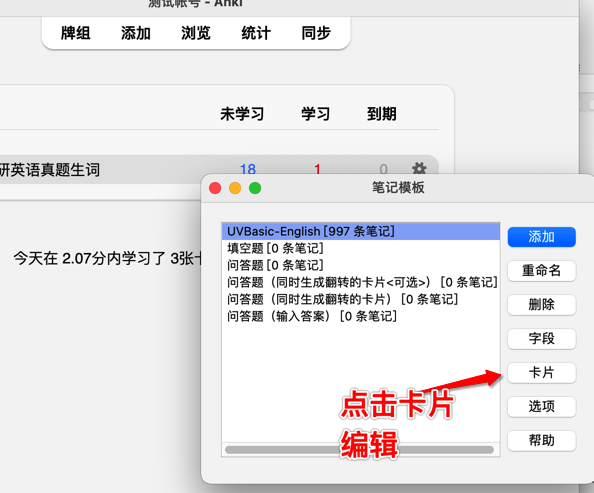

选择好以后就能看到卡片的代码。

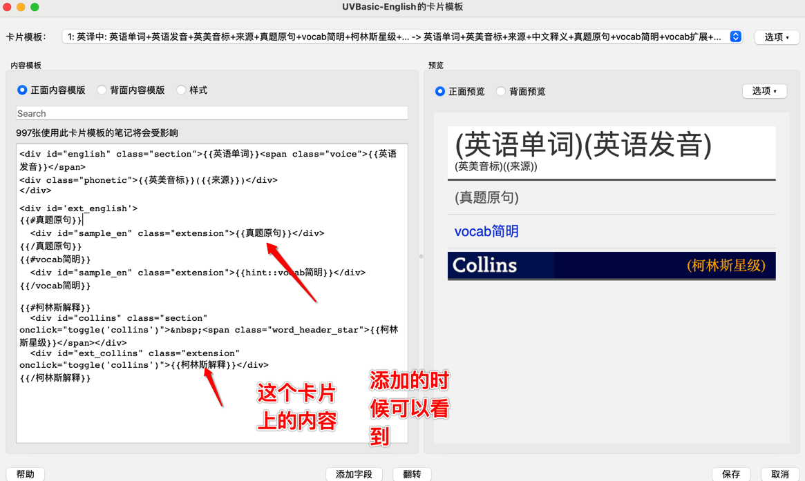

不要被这段代码给唬住了，它是一个html格式的代码，右边是它的展示效果。里面涉及到的css可以放在样式中。

其中2个大括号中的内容，就是卡片上的字段名。

可以看出来，它的关系大概是这样的：
* 模板
    * 正面html
    * 背面html
    * css
* 知识点
    * 一个知识点不同组成部分
    * 简单就是 问题+答案，2个字段
    * 复杂一些 问题有多个部分组成，答案有多部分组成，这些组成就叫字段
* 卡片

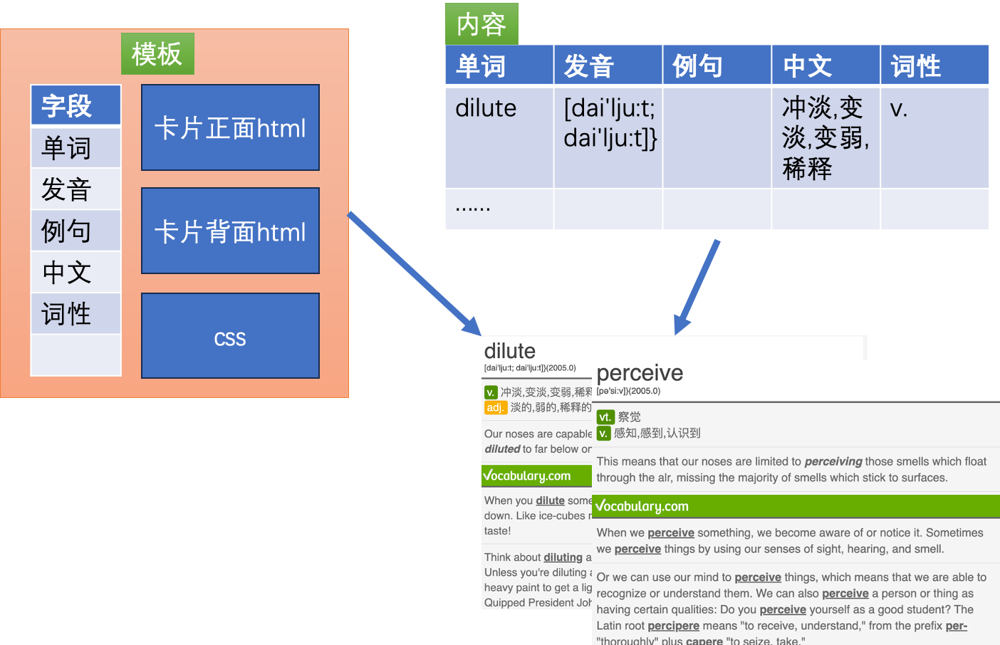

看到这里我想大概心里就明白了，折腾模板和卡片属实没啥必要。

## 3.8、网络资源
牌组的制作着实需要花费大量心力，那就花钱解决吧，有几个地方可以去尝试：
* 某宝
* [https://ankiweb.net/shared/decks?search=chinese&sort=modified](https://ankiweb.net/shared/decks?search=chinese&sort=modified)
* [https://file.ankichinas.cn/](https://file.ankichinas.cn/)
* [http://www.ankichina.net/manual/anki/](http://www.ankichina.net/manual/anki/)

# 总结一下
> 工欲善其事，必先利其器。很多情况下是没有问题的，但是我们也要清楚自己的目标是什么。如果一直没有使用过类似软件，那么Anki一定是会提升我们的效率的。在这个基础上再优化不迟。

完成>完美，开始做很重要。

另外，它并不是万能的，使用过程中，我们会发现不同类型的知识，使用的方式也不同，如果不是特别的原因，也不建议花太多时间去折腾牌组制作。

## 不同内容的学习策略

对于不同类型的学习内容，可以采用不同的复习策略和间隔调整方式来适应其特点和学习需求。下面是一些常见的学习内容类型及相应的复习策略和间隔调整方式：
### 基础概念和事实性知识
对于需要记忆基础概念和事实性知识的学习内容，可以采用较短的初始复习间隔，并且在初次学习后进行多次快速的复习。随着记忆的稳定，复习间隔会逐渐增加。这样可以帮助巩固记忆和提高记忆的保持能力。
### 复杂概念和理论框架
对于复杂概念和理论框架的学习内容，需要更多的时间和重复来理解和掌握。初始复习间隔可以设置稍长一些，以给予更多的时间用于学习和消化内容。随着学习的深入和理解的加深，复习间隔逐渐增加，但仍需保持一定的频率进行复习，以巩固记忆和加强理解。
### 技能和实践应用
对于需要培养技能和实践应用的学习内容，除了理论性的学习，实际操作和练习也非常重要。在学习过程中，复习间隔可以设置为较短的时间，以便及时进行实际操作和练习。随着技能的熟练度提高，复习间隔可以逐渐延长，但仍需定期进行复习和实践，以保持技能的掌握和应用能力。
### 语言学习和词汇记忆
对于语言学习和词汇记忆，重复和巩固是非常关键的。初始复习间隔可以较短，以加强记忆和熟悉词汇。随着时间的推移，复习间隔逐渐增加，但需要保持一定的频率进行复习，以巩固词汇记忆和提高语言运用能力。

需要强调的是，这些策略和方式是一般性的指导，并不适用于所有情况。每个人的学习风格和学科特点也可能影响复习策略的选择。因此，个体化的调整和灵活性在使用Anki或其他学习工具时非常重要。根据自己的学习需求和反馈，可以逐步调整复习策略和间隔，以找到最适合自己的学习方式。


如何开始，先去找个卡片来学习，不要尝试自己做，也不要尝试理解里面的东西。因为它只是辅助我们记忆的工具。