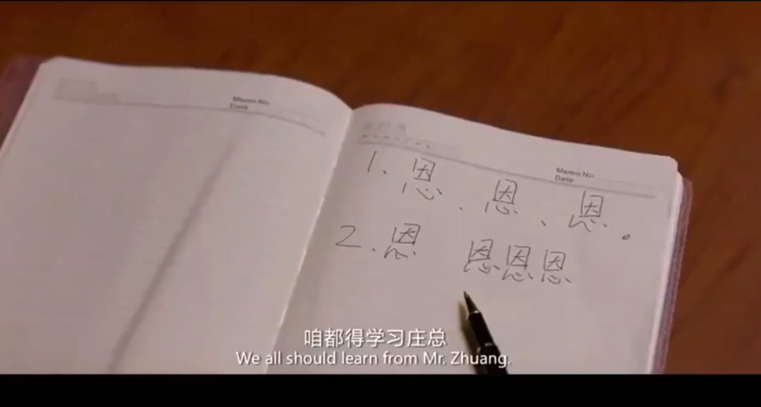
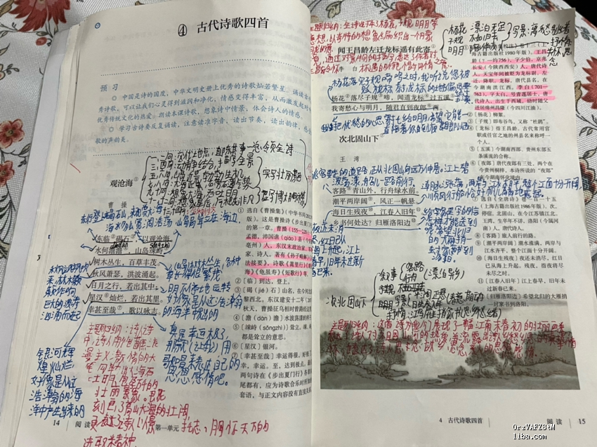
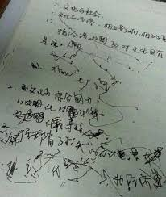
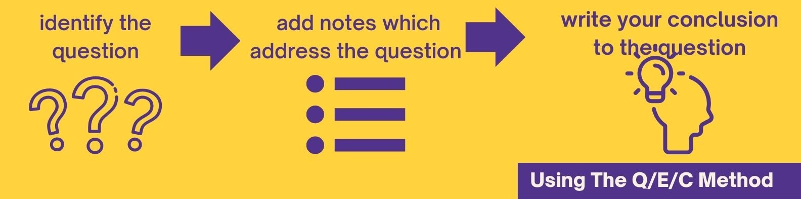
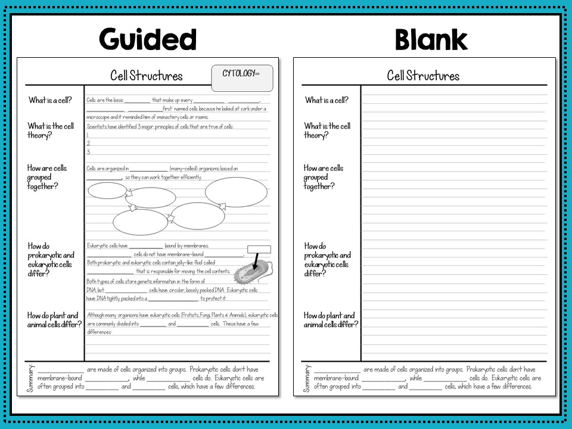
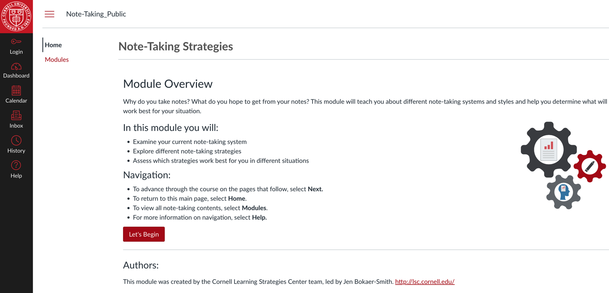
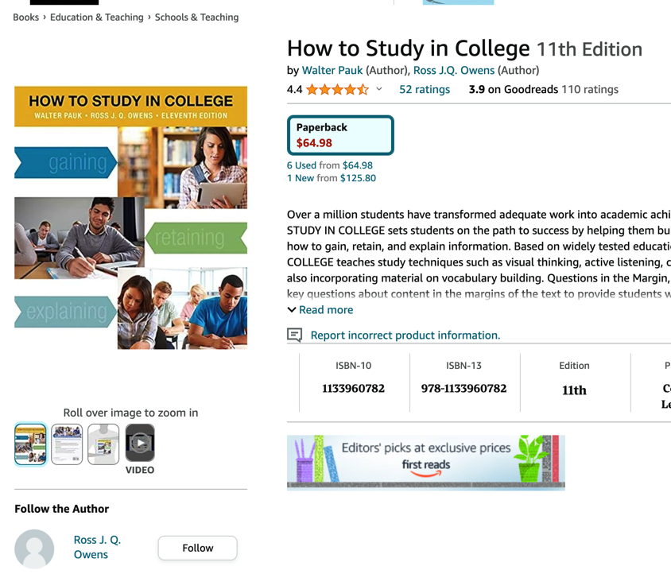
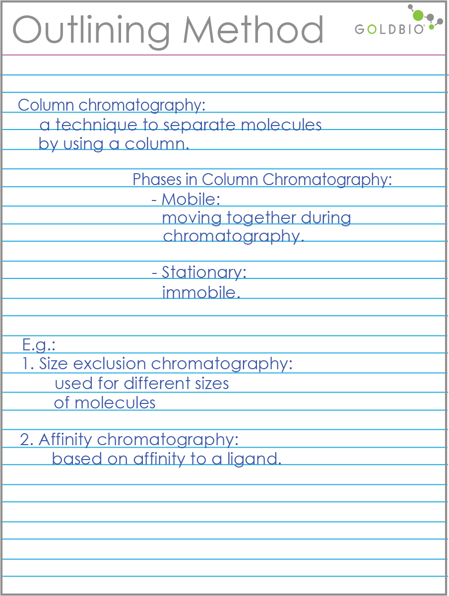
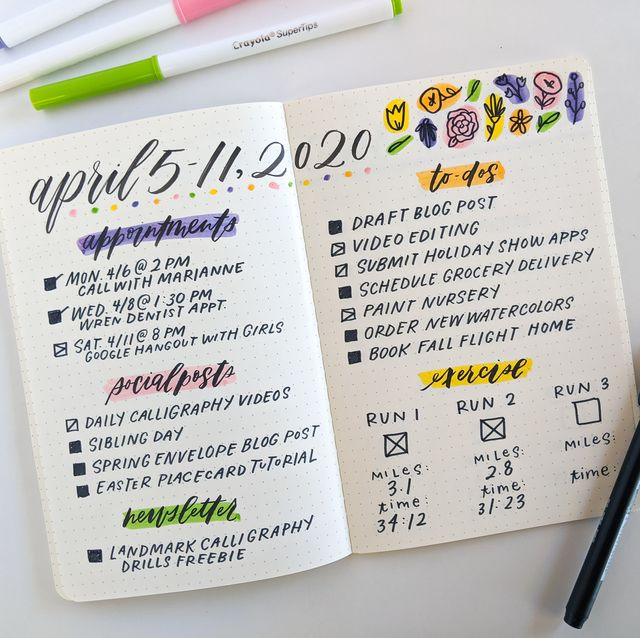

* content
{:toc}

步入社会以后，还在坚持学习，总是难免要记笔记的。我们可能遇到完全不记笔记的，或者记的满满当当，或者记的漂漂亮亮。总会让我们有一些触动。记笔记在学习过程中是自然而然的事，然而却一直困扰着许多人。

在搭建高效学习体系的过程中，记笔记本身并不是我们要重点考虑的，我们也不用刻意因为某个具体的笔记方法特别在意。

市面上广为流传的康奈尔笔记法，子弹笔记法，卡片盒笔记法，还有清单笔记等等，我们会发现每个笔记法都有它独特的地方。我们明白这些方法如果真要贯彻实施都不容易，都有一定学习曲线。

所以我们应该如何记笔记呢？笔记应遵循什么样的原则呢？我们需要明白的是：
* 笔记是桥梁，连接我们内在体系
* 学习的目的是为了解决问题，我们从问题出发
* 大部分不需要逐字逐句

别人不是我们，甚至，别人咋样，和刚开始梳理学习体系的我们也没关系！

<!-- more -->
# 1、功夫在诗外—记笔记并没有那么重要

## 1.1、笔记的形和神
回顾自己的笔记习惯，和市面上成名已久的各种笔记法，我们就会发现，多数是告诉我们，笔记应该长什么样，比如康奈尔笔记的分区。这就是笔记的**形**，它是比较容易掌握的。

而难的是笔记的神，一篇课文，一个知识点，我们可以分区记录不同的内容，但是应该是什么样的视角，什么样的思路路径去写笔记呢？这个是笔记的**神**，需要长期积累和打磨。

恰恰是这个部分，很难遇到可以深入交流的朋友，很难遇到特别合适的老师来指导。也许这是笔记最难的部分。为了这个问题，我们可以尝试从几个角度去思考。

## 1.2、笔记是干什么的
我们首先要明白，为什么要记笔记。作为高效学习的构成部分，它需要辅助我们掌握和理解学习的内容。从这个角度看，它只是我们学习过程的一部分。所以它应该尽量言简意赅，也就是内容要少。因为：
* 如果记录内容很多，潜意识不会去看它，认为它很完整，随时可以去看，不急！
* 索引性的内容会激发我们的回忆，更好的检查我们的结果。
* 如果太全面，反而没有重点。

## 1.3、笔记应该怎么用
个人的经历中，接触过几类状况，完全不记笔记、笔记很详细和笔记很凌乱。
### 完全不记
* 一个前辈，60后大学生，他的特点是输出非常高产
    * 群里的总能非常快速大片大片输出高质量内容，他给我们的观点是，记录不重要，要记在脑子里的才重要。他的记忆力和抓住重点的能力是很强的。
* 一个理科高材生，大家一致认为学习能力强
    * 听课很认真，交流很认真，很神奇的是，确实很能抓住核心，抓住重点，并高效输出。
> 这两种情况在我看来都是特例，我的理解是，我所接触和从事的行业，在他们这里，可能是属于相对比较简单的。夸张一些来说，我做的是初中数学，他们过往经历的是微积分。

### 笔记详细
个人有段时间学习视频内容时，会逐字逐句理解，思考，记录，满满当当的笔记，内容可能有所有字幕的2-3倍。学生时代也有过类似的状况，每个知识点都在考证，非常深入，以至于现在都还能回想起几十年前的一些东西。它可能有的：
* 好处
    * 不太会走神，基本上全神贯注
* 坏处
    * 不容易抓住重点。
    * 偏离目标—考试

> 笔记很详细不知道针对什么样的场景会有效，学生时间会回去翻看，但是毕业以后，这么复杂的笔记恐怕不太愿意去看。不久前学习一个课程的时候，也是满满当当记了几万字，现在想起来倍感压力。

记录很详尽，还有一个情况是，这个知识我们知道得太少，以至于大部分知识点都是新知识，都是重点，难点。

### 笔记凌乱
大多数情况下，笔记是这样的状态，零零碎碎，记录一些关键字。记的时候确实也认真，记完确实也没看，可能偶尔看一下。如果认真整理，里面的东西需要重新弄过，也就是需要重新誊写一遍。

相对应的，最近在做知识管理的时候，在手机备忘录里面的内容就是这种形式。特别是和人交流过程中记录的内容，是凌乱的，好在有这个转到Notion的过程，会重新梳理一下，内容倒也不多。

> 笔记凌乱可能有几个原因：
> * 事先没有预习和准备，不知道会出现什么，所以没有节奏
> * 手写内容，写字太慢，几步下来 

有了这些情况，那么我们笔记应该如何去记录呢？

## 1.4、功夫在诗外
所以笔记的问题不在笔记本身，而在学习之前的准备，我们大概知道哪些知识点需要重点考虑，有一个大概的脉络。

学习以后，这个笔记我们应该很容易拿起来回顾，也就是说尽量做到事后不用过多补充。笔记的留白是为了让自己更好回忆起当时的内容。

我们尽量不要去事后补笔记，因为它会给我们一个心理暗示，事后可以补，真正高效的是学习的当下，课堂效果是最重要的。

> 虽然现在很多课程可以反复回看，实际上时间成本很高，也少了锻炼自己总结能力的机会。

至于应该如何记录，我们首先应该考虑的是如何去学。

# 2、我们应该如何去学习
早期介绍网易创始人丁磊的时候，说他看书会跳着看，如果都能看懂了，他就不看了。工作中遇到的另外一个前辈，他在学习新技术，或者看书之前，会想尝试着自己去构思，如果他来做，大概是怎么做，如果他来写这本书大概会怎么写，然后再去看，取长补短，兼容并蓄。长期训练自己的学习力。

> 这里面反应出来很重要的点，并不是他们的方法，而是他们的状态——主动学习。

我们在开始学习之前，首先要考虑的是这些问题。其实也是在不断拾掇自己的内在知识的过程，知道缺了什么要补什么

# 3、开始学习开始记笔记
## 3.1、保障主线任务

我们在学习的过程中，上课听到老师讲的东西/看到文章：
* 觉得要等会再查一下
* 感觉是个重点
* 这个东西要去试试
* 突然想到另外一个事
* 上课的主线内容

这里最重要的当然上课的主线内容，但是听着听着发现有个知识点不是这个课堂上的，我们可能需要回去再看看。另外发现自己走神了，想起另外一个事，怕忘记了，不知道写哪里好。

所以我们理想的状态是：**尽量把干扰项从脑子里清除出去，回到主线上**。

## 3.2、适当留白降低干扰

为了达成这个目标，我们需要让自己能有办法，快速把这些东西都清除出去。回到记笔记这件事上，我们就需要让自己的笔记有地方/有方式，可以放这些东西。而这些东西不能影响主线。说到这里，最近容易想到的至少是2个办法：
* 随时准备便签纸
* 笔记本上划个区域给这些杂事

> 目的都是为了让我们进入主线任务，或者是心流状态。所有打断它的干扰，尽快剥离走。

> 如果是手写，建议就用一个颜色的笔，避免分心。这个虽然因人而异，其实是为了避免我们自己要给颜色做特殊定义，陷入两难。

## 3.3、避免自动驾驶
当我们使用电脑记录笔记的时候，如果我们的打字速度足够快，会有一种倾向全部记下来，进入一种自动驾驶的僵尸状态。这个时候很重要的是，我们始终保持自主学习的心态，就需要在学习的过程中随时整理思路。这也是为什么我们笔记难的地方，就在于，我们不能让自己有太多事后补救的依赖心态。

对某些知识点考虑用 知识点—论据—结论 这样的结构去记录。

除了这个方法，我们为了能快速记笔记，尽量多使用简写，可以是自己发明的也可以是约定俗成的。只要有地方可以查到这个简写是什么意思就可以了。

# 4、冷静！不期待一招鲜的方案
我们知道油管上有很多介绍各种笔记法的视频，明显能感觉出来，医学生、理工科和人文社科类学生的笔记法会有差异。所以回到我们自己身上，就会明白，我们不应去追求一招鲜的笔记方法，针对不同的学科应该形成自己的笔记规范，当然，这个规范主要是针对`神`的。笔记的框架可以大同小异。当然，都是在适应自己的过程中不断迭代出来的。

我们知道每个人对知识的理解和洞察是不同的，这个不是我们要担忧和考虑的问题，只要去做了，自然就会提高，如果真的提高太慢，那倒不愁了，知道自己哪里慢，总会有办法解决的。

> 下面介绍的几个方法，可能对于职场人士，考证考级的用处更大一些。我们学习的目标更明确，应该是项目导向，任务导向的。

# 5、压缩即智能—笔记应该多还是少
最近笔记火的一段话，OpenAI的首席科学家提出来`压缩即智能`。但是要明白的是，作为AI的从业者，他所说的智能和我们理解的智能并不一致。

笔记应该多还是应该少，我们应该去考虑的是，从我们的最终目标出发，我们是希望通过考试，还是希望掌握这个知识，还是希望通过它来变现，要求就会不同。

**技术知识**

我们如果想要具体操作的技术，操作记录最好都记录下来，这个可以认为是实验记录了。如果是我们学习操作系统，AI原理之类的，能弄明白其中的关系，在某个阶段可能重要，那可以少一些

人文社科类，个人成长之类的内容，尽量是:

树-->平面（本来有个挺好的图片，当时不知道为啥没有保存下来）

我们前面提到到过，一本书，一堂课，呈现给我们的是一个平面的结构，而老师脑子里面的是树，是一个网。我们需要把这个过程在我们自己大脑里面内化，构建，也就是他这个输出的逆过程。

我们也有人理解为，只要读到这个概要就够了，这显然不现实。因为输出的前提是有大量内容支撑 ，我们需要做的是用我们自己的知识体系去吸纳它们。

# 6、如何让自己回忆
所以需要准备一个不太厚的A4软抄本，为什么是一个本子，因为这样我们能随时拿出来看，拿出来回顾。为了激励自己去回顾，我们让自己弄个标记或者一个章，知道自己复习了多少次了。

内容足够精炼是为了让自己能没有啥负担去做这件事。

至于为什么用纸质的，这个因人而异，但是，很明显，写下来的时候，会强迫自己去梳理思路，也是一个很好的复习过程。

# 7、康奈尔笔记法

## 7.1、基本介绍
即Cornell笔记法，它强调的是提起和总结信息的要点，不建议记录太多细节。它的简单结构分3个部分：
- 左栏记录关键点、要点、标题等。**简单明了**
- 右栏记录详细笔记。可以记录更多细节和思考。 
- 顶部留出的总结栏

## 7.2、要点
* 总结时提取左右两栏的主要信息点，以点状或简短语句的形式写出。
* 确认总结是否准确反映原本笔记，将要点表达清晰。
* 必要时还可以在后页或边缘位置增加备注或思考。
* 定期回顾时，先在总结栏进行复习,然后配合详细笔记进行复习。
* 出现不明白之处可以查询原文进行理解。
* 录完成后立即进行总结性归纳。
* 多次学习同一内容，进行梳理与更新记录。
* 整理成册按主题对笔记进行分类。
* 日常保持简短复习来巩固要点。
* 长期需整体复习以检验学习效果。
* 可以试着将笔记解释给他人，有利理解。
* 便签语录法记住要点，贴在显眼位置。
* 适时分享笔记，与他人学习互动。
* 将笔记与实际工作联系，强化应用。

## 7.3、学习资源
* [康奈尔大学教程](https://canvas.cornell.edu/courses/1451)

这是一个向导式的课程，可以感受一下它们对这件事的理解

* How to Study in College

网上有很多卖康奈尔笔记本的，总的来说，形是容易掌握的，神可能还是需要点时间。除了康奈尔笔记法还有清单笔记法。整体思路异曲同工。

# 8、清单笔记法
整体来说和康奈尔笔记法类似，笔记法分几个区域，让自己尽量进入主线。
它的出发点是通过一定的方法和技巧，建立一个比较合理的结构，类似博客右侧的toc那样，还原出一个知识结构。这个结构不同于目录，它能更好帮我们回忆起整个脉络。

另外因为记录的内容很少，所以它相对就很好记了。

另外最近几年比较火的一个笔记法

# 9、子弹笔记法

这个笔记法其实已经不是我们通常理解的读书笔记了，而是一套日记的方法，只是把我们很多的内容纳入进来。

> （Bullet Journal）是一种极为高效且便捷的日程管理& 笔记记录方法。 它可以很方便地集成To-do List、笔记、日记等于一体，通过简洁描述来规划、记录我们的日程、工作、学习和生活。 它的核心是使用精简的描述和符号来快速完成日程和事件的记录。

从这个描述来看，还是挺流氓的叫法，叫它笔记法有点太屈才了。其他的方法叫notes，它就叫Journal。

基本上一年一本，有些人会早上起来，就写下今天要做的最重要的3件事，确保它们都做完。因为有这样一个笔记本，随时可以翻看，复盘和学习也就更容易一些。

它更像是日程管理，而不是纯粹的笔记。

# 总结

另外还有卡片盒子笔记法等等，有电子的也有纸质的，各种软件。我们会发现，这些笔记法，针对的更多是一本教科书，一本需要深入啃下去的书，一门课程。但是和我们工作以后的学习目标并不一致。某种程度上来说，如果我们参加线上线下课程，是可以用其中的一些笔记法。毕竟，如果不记住，不学会，干嘛要去学呢？

关于线下课程如果可以录音的话，有2个工具可以辅助，Pad的Notability，它可以边录音边写笔记，这样就很容易回溯。另外飞书的飞书妙记，可以帮我们把视频音频转换成文本，这个过程也是可以回溯的，就是拉到哪里，文字也显示到哪里。

我们从学习整体流程来看，记笔记固然是重要的，但是更重要的是，我们如何在这个过程中，评估一个学习方法，一个学习工具对于我们学习来说，切实的帮助，需要我们建立的体系中，有指标来衡量和度量这个工具和方法，我们才能知道最适合自己的方法。

## 为什么不提思维导图
用了几十年思维导图工具，用过不下20款，更多时候，我们只是把它当成一个word来用，正是因为它炫酷的效果，便捷的操作，让它出圈，也让它从最初的脑力大师托尼博赞那里，把阳春白雪变成普通人的日常工具。但是，对于大多数人来说，它只是稍微改了一点样子的Office。