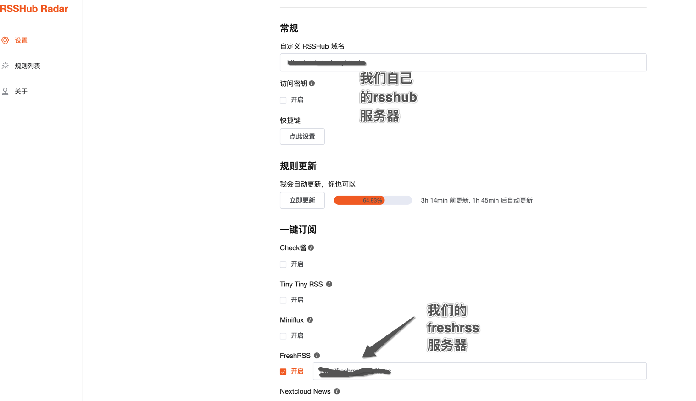
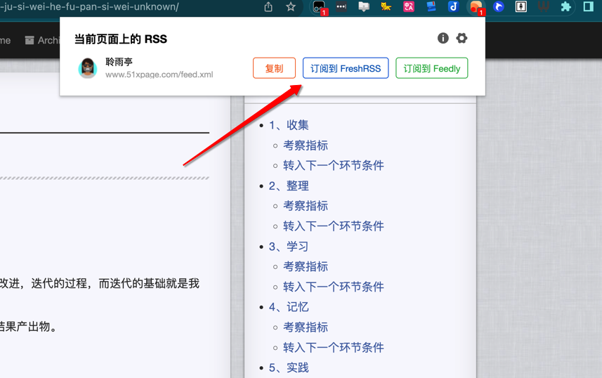
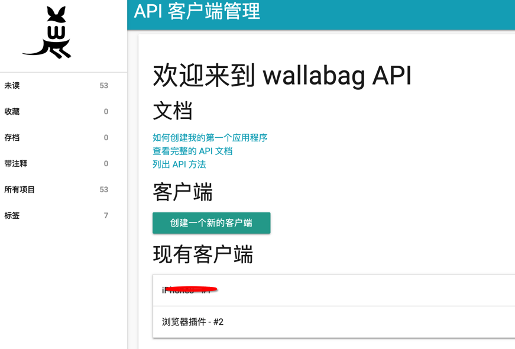
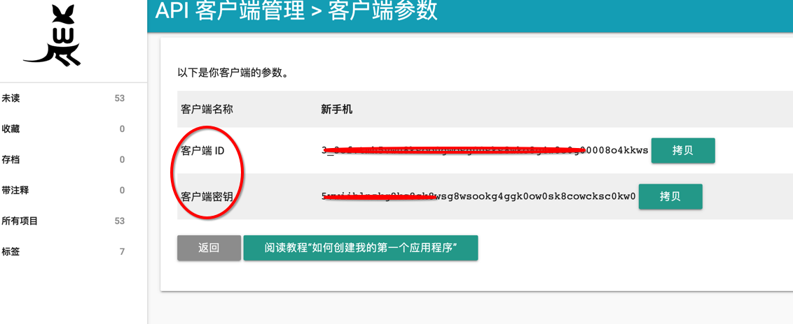
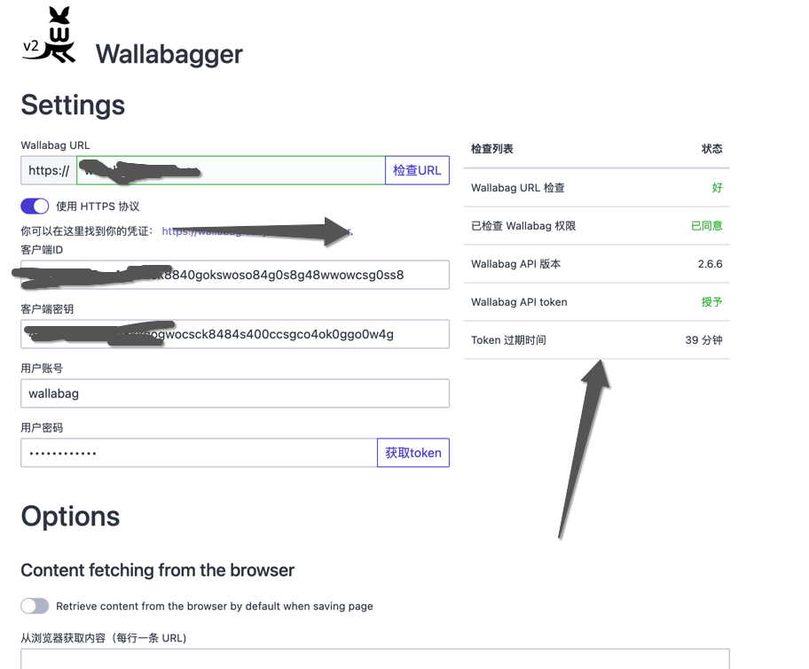

* content
{:toc}

搭建高效学习体系的关键，需要始终了解我们有2个目标：
* 学习知识解决问题
* 学习学习的知识，提升学习能力

前面一个问题很好理解，我们需要通过学习来提升自我，后面一个问题是需要我们始终，长期持续改进，迭代的过程，而迭代的基础就是我们有完善的数据记录和复盘的累积。

承袭知识管理的PARA结构，学习的最佳实践是放在Project中，我们的学习是有期限，有目标，有结果产出物。

而在搭建这个体系的过程中，我们还需要秉承Unix设计的一个模块化思路：
* 每个程序只做一件事，不要试图在单个程序中完成多个任务
* 组合完成一件复杂的事

高效学习的流程我们也秉承这样的思路，每个环节的目标是清晰的，每个环节内部的方法都是可以替换，可以优化迭代的。

<!-- more -->
# 1、收集
收集的原则是有足够的隔离。让真正需要进入学习阶段的内容用于学习。
这个阶段大部分信息都分散在：

* **wallabag**
    * 主要来自于FreshRss
    * 其次是部分网页

* **Joplin**
    * wallabag中确实需要的内容
    * 无法进入wallabag的，如推

* **手机备忘录**
    * 无法进入wallabag的
    * 会进入Notion页面

## 1.1、freshRSS设置
freshrss本身的安装部署文章已经很多了，这里主要介绍几个增加源和日常处理的内容。

如何增加源？一方面是行业内的主流网站，另外一个通过`RSSHub Radar`，它是一个Chrome插件。直接去chrome商店可以下载，安装以后主要配置2个地方

它会自动展示这个网页中的rss链接。如

另外，因为手机端的RSS阅读器是NetNewWire，当我们看到一个网页，比如一个博客还不错，就可以通过分享的方式，添加到FreshRSS中去。当然，有一些网页不可以通过RSS的方式添加，就只能通过wallabag，或者放到Joplin中去了。

> NewNewWire当天的文章如果觉得可以，需要进一步阅读就放到Wallabag去了，当天的文章全部标记已读。以前用Google Reader最后陷入焦虑，很大原因是缺了这些环节，让它成为孤立的部分。

## 1.2、RssHub设置
RssHub的口号是一切皆可Rss，什么意思呢？因为RSS毕竟是比较老的协议，它最大的问题是阻碍这些平台赚钱，因为如果使用了Rss，就意味着推送很难生效，如类似微信公众号之类的文章，更是收不到广告费了。

RssHub的目标是通过它的转换，把一个没有Rss服务的网站，通过它的中转变成Rss服务，所以就出现了微信封杀它，推特倒不是封杀它，所有爬虫都杀！

RssHub自己可以部署，默认用他们的服务器也可以，自己部署需要注意的是，有些网站做了反爬虫限制，国内的地址可能无法抓取某些网站。

## 1.3、wallabag设置
wallabag的安装需要注意域名的设置，比如我安装的时候，域名是https的，结果在http状态下显示有些css就加载不对，改成https就可以了。

它可以在手机上安装，也可以在浏览器中安装，这里介绍浏览器插件的设置。
打开Api设置，地址类似这样 [https://wallabag.eazylife.cc/developer](https://wallabag.eazylife.cc/developer)

创建一个新的客户端，记得2个id

在浏览器插件那里点击选项，在里面填写这些信息就可以了

最后点击获取Token，右边会告诉我们结果。

它的管理原则简单一些，确实要开始学习了，认真研读，脱水进入Notion

## 1.4、推信息收集
推暂时没有好的办法，只能通过备忘录了，因为FreshRss和Wallabag都无法抓取，网上即使有各种办法，恐怕都是比较难的，用自己账号登录模拟抓取的方式也有风险。加上现在有谣传马要收费对抗黄推。

对于无法通过这种方式抓取的文章，就放到joplin去了。

## 考察指标
* 收集顺畅与否
* 信息是否足够集中
* 下一个阶段整理是否容易，比如老半天找不到它

## 转入下一个环节条件
* 条件足够
* 目标清晰

> 信息收集过程中多点问题不大，当然尽量还是朝着目标去。

# 2、整理
这个时候开始建立项目结构。如果我们决定开始学习这项技能，就开始了一个项目。

整理的意思就是把前面收集的信息，逐个做脱水进入到Notion中来，并建立这个学习计划的条目，作为学习材料存在。

这里的状态和计划都是为了后面做日历视图用的，有了日历视图我们就会更清楚知道时间安排。

## 考察指标
* 材料汇总脱水是否顺畅
    * 意思就是什么东西放哪里搞清楚了不
    * 每次搞来搞去的麻烦不
* 材料存放查找便利程度

## 转入下一个环节条件
* 学习目标明确（SMART）
* 计划制定完成

因为我们是通过项目的方式学习的，所以目标一定是要很明确的，如果说是一个长期的学习，我们也应该拆分成项目，其他的内容放在领域中就可以了。这个环节很重要的是，我们需要明确提出要解决的问题。

# 3、学习
前一天制定次日学习任务，从任务列表中选择简单的事项记录下来。

学习具体材料的时候，有2个目标用来记录，可以根据需要多做一些模板，在数据库的新建按钮下面：

分别针对学习的康奈尔笔记和实践的操作记录笔记

实践记录

> 学习过程中要始终盯着目标去，如果当前的方案难度非常大，一定要对着目标检视，当前的方案是否可行，是否进一步使用它？

## 考察指标
* 每个学习材料的学习时间
* 材料补充情况

## 转入下一个环节条件
* 既有学习材料学习完毕
* 目标达成不需要补充材料
* 每个学习的详细情况都记录完成

# 4、记忆
如果有必要，转成Anki卡片，或者形成完成笔记在Notion中

## 考察指标
* 记忆耗时
* 记忆留存情况

## 转入下一个环节条件
* 记忆留存可以

# 5、实践
如果是实践类的，比如说学习Prompt，那么就应该可以直接用，有一个使用的结果，记录这个学习的过程。

## 考察指标
* 实践效率，做了多长时间
* 用了多少资源？

## 转入下一个环节条件
* 问题解决

# 6、输出
学习完毕在Notion里面整理一个大纲模式的笔记。另外在Ob中留存工具

## 考察指标
* 书写是否流畅，正常除了截图啥的，不应该再回Notion查东西了
* 工具链是否顺畅

## 转入下一个环节条件
* 写完发布
* 内部分享

最后开始复盘，考察学习过程中前面各个环节得失，比如找资料有更好渠道？更好方法？

# 总结

另外为了方便后面复盘，每次计划调整我们都在Notion主页记录下来调整的原因和理由。
为什么加一个每日待办，是我们需要把待办变成最后的选择，而不是待办推着我们走。否认很容易就陷入待办焦虑，待办越来越长，最后放弃。

这个模板也就是我们所有后续学习的基础模板，每次都复制它，修改，所有的改进也都体现在这个模板上。