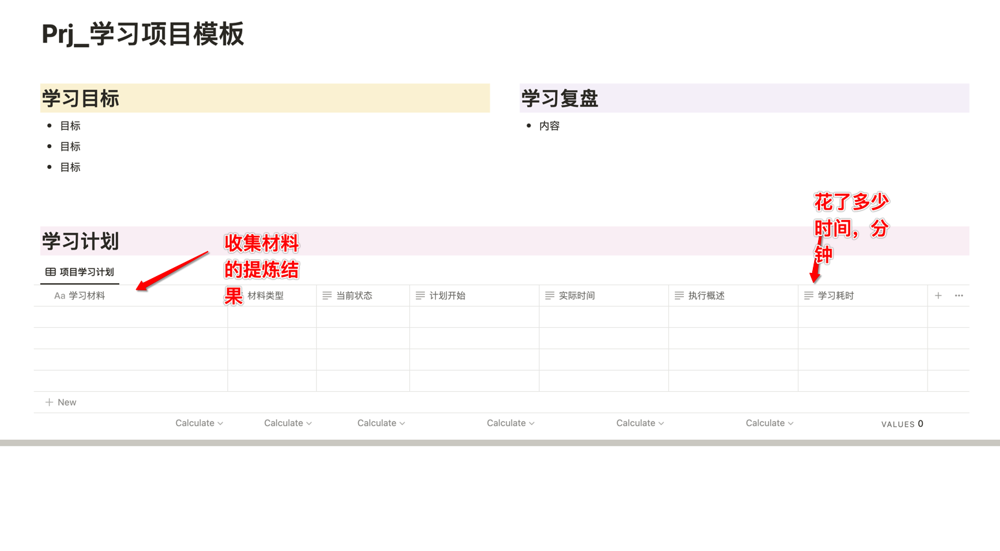
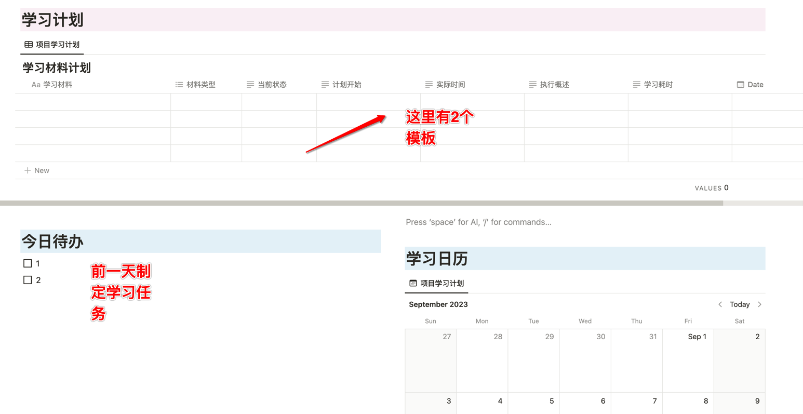
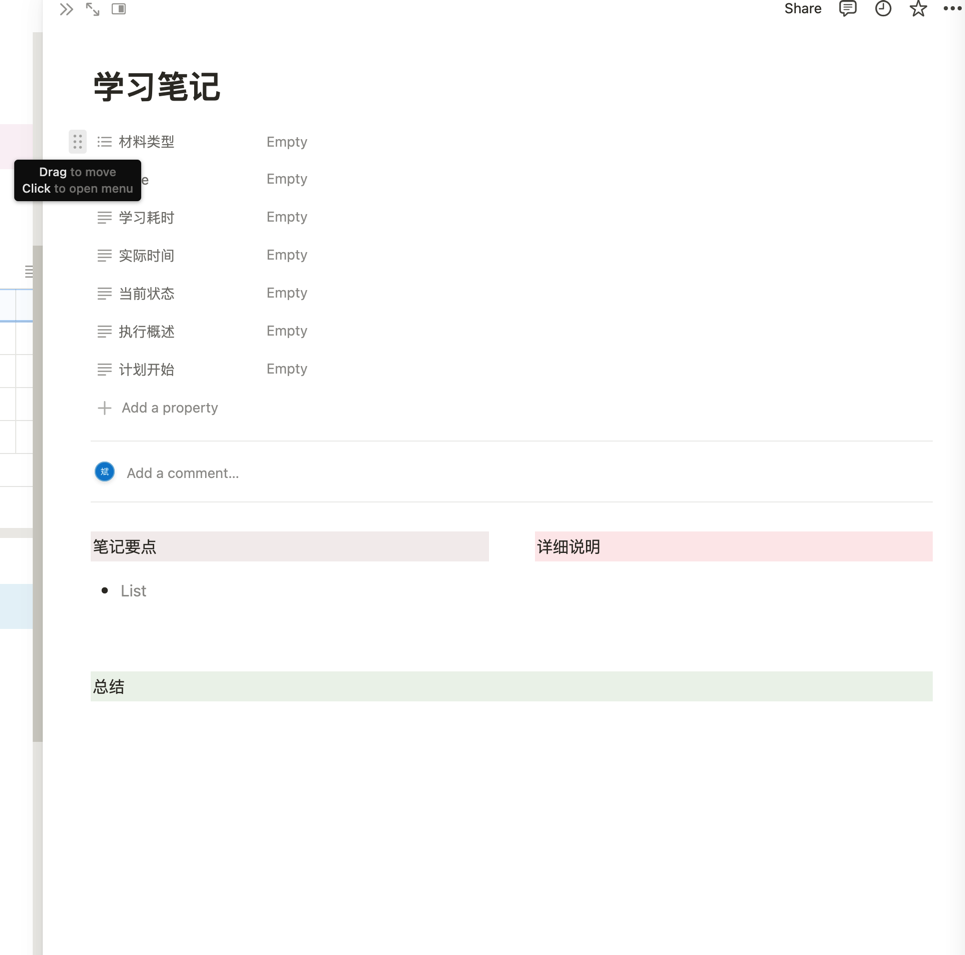
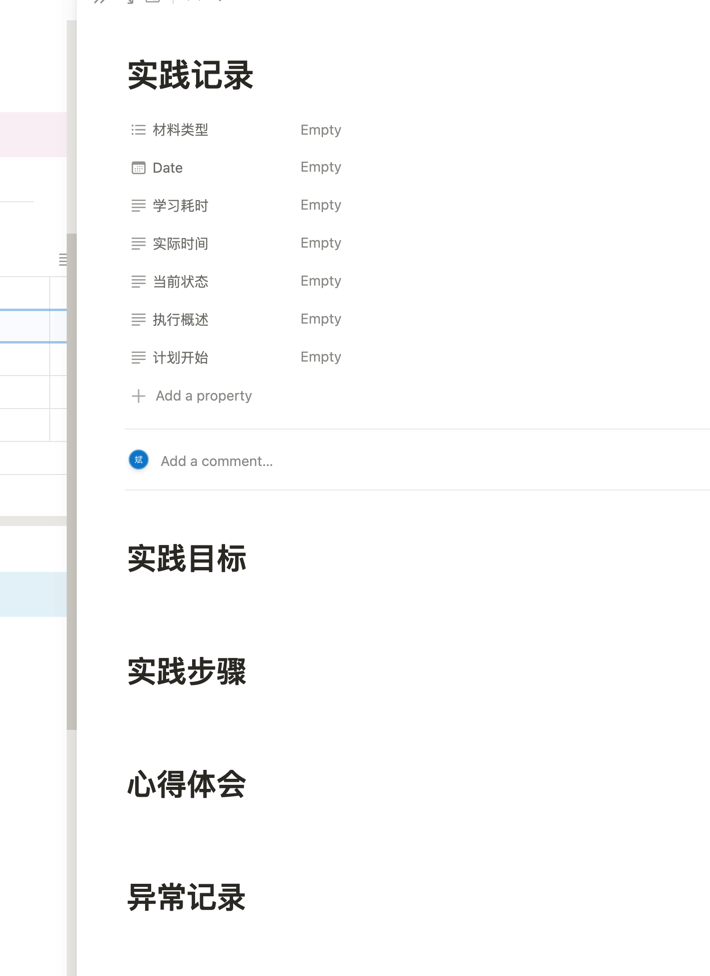
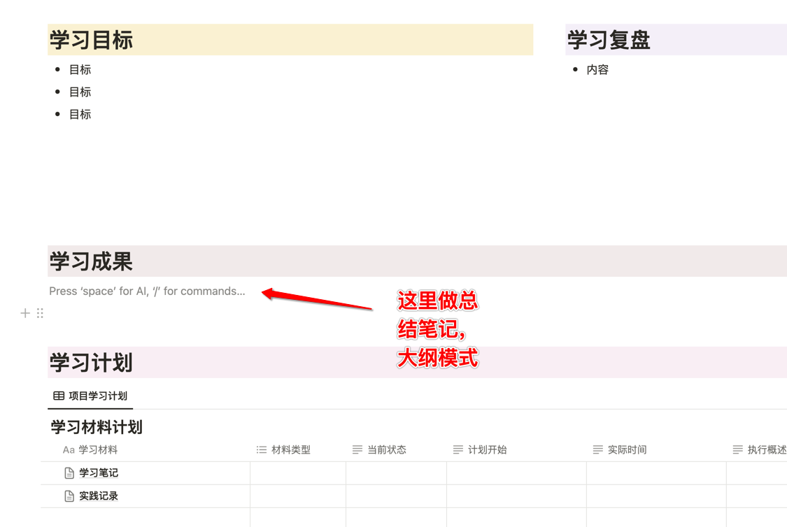
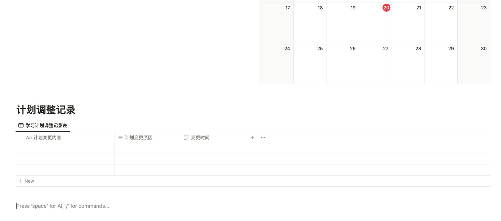

* content
{:toc}

搭建高效学习体系的关键，需要始终了解我们有2个目标：
* 学习知识解决问题
* 学习学习的知识，提升学习能力

前面一个问题很好理解，我们需要通过学习来提升自我，后面一个问题是需要我们始终，长期持续改进，迭代的过程，而迭代的基础就是我们有完善的数据记录和复盘的累积。

承袭知识管理的PARA结构，学习的最佳实践是放在Project中，我们的学习是有期限，有目标，有结果产出物。

而在搭建这个体系的过程中，我们还需要秉承Unix设计的一个模块化思路：
* 每个程序只做一件事，不要试图在单个程序中完成多个任务
* 组合完成一件复杂的事

高效学习的流程我们也秉承这样的思路，每个环节的目标是清晰的，每个环节内部的方法都是可以替换，可以优化迭代。

<!-- more -->
# 1、收集
收集的原则是有足够的隔离。让真正需要进入学习阶段的内容用于学习。
这个阶段大部分信息都分散在：

* **wallabag**
    * 主要来自于FreshRss
    * 其次是部分网页

* **Joplin**
    * wallabag中确实需要的内容
    * 无法进入wallabag的，如推
* **手机备忘录**
    * 无法进入wallabag的
    * 会进入Notion页面

## 考察指标
* 收集顺畅与否
* 信息是否足够集中
* 下一个阶段整理是否容易，比如老半天找不到它

## 转入下一个环节条件
* 条件足够
* 目标清晰

> 信息收集过程中多点问题不大，当然尽量还是朝着目标去。

# 2、整理
这个时候开始建立项目结构。如果我们决定开始学习这项技能，就开始了一个项目。

整理的意思就是把前面收集的信息，逐个做脱水进入到Notion中来，并建立这个学习计划的条目，作为学习材料存在。

这里的状态和计划都是为了后面做日历视图用的，有了日历视图我们就会更清楚知道时间安排。

## 考察指标
* 材料汇总脱水是否顺畅
    * 意思就是什么东西放哪里搞清楚了不
    * 每次搞来搞去的麻烦不
* 材料存放查找便利程度

## 转入下一个环节条件
* 学习目标明确（SMART）
* 计划制定完成

# 3、学习
前一天制定次日学习任务，从任务列表中选择简单的是事项记录下来。

学习具体材料的时候，有2个目标用来记录，可以根据需要多做一些模板，在数据库的新建按钮下面：

分别针对学习的康奈尔笔记和实践的操作记录笔记

实践记录

> 学习过程中要始终盯着目标去，如果当前的方案难度非常大，一定要对着目标检视，当前的方案是否可行，是否进一步使用它？

## 考察指标
* 每个学习材料的学习时间
* 材料补充情况

## 转入下一个环节条件
* 既有学习材料学习完毕
* 目标达成不需要补充材料
* 每个学习的详细情况都记录完成

# 4、记忆
如果有必要，转成Anki卡片，或者形成完成笔记在Notion中

## 考察指标
* 记忆耗时
* 记忆留存情况

## 转入下一个环节条件
* 记忆留存可以

# 5、实践
如果是实践类的，比如说学习Prompt，那么就应该可以直接用，有一个使用的结果。记录这个学习的过程。

## 考察指标
* 实践效率，做了多长时间
* 用了多少资源？

## 转入下一个环节条件
* 问题解决

# 6、输出
学习完毕在Notion里面整理一个大纲模式的笔记。另外在Ob中留存工具

## 考察指标
* 书写是否流畅，正常除了截图啥的，不应该再回Notion查东西了
* 工具链是否顺畅

## 转入下一个环节条件
* 写完发布
* 内部分享

最后开始复盘，考察学习过程中前面各个环节得失，比如找资料有更好渠道？更好方法？

# 总结

另外为了方便后面复盘，每次计划调整我们都在Notion主页记录下来调整的原因和理由。
为什么加一个每日待办，是我们需要把待办变成最后的选择，而不是待办推着我们走。否认很容易就陷入待办焦虑，待办越来越长，最后放弃。

