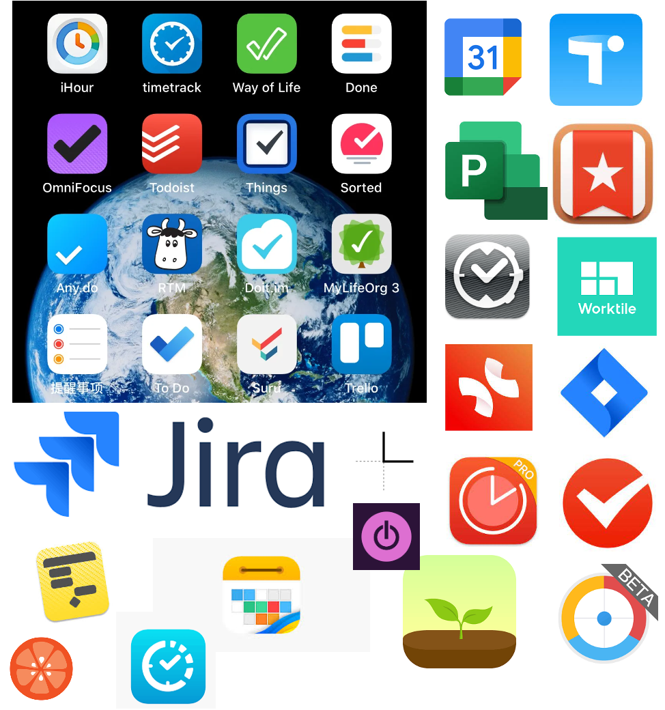
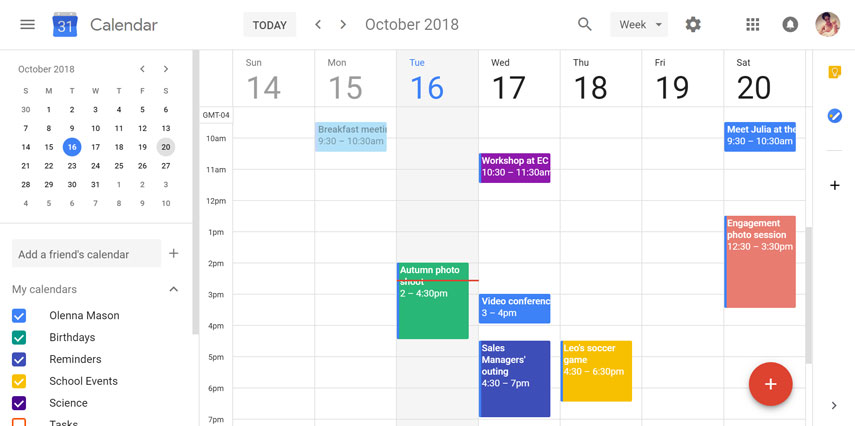
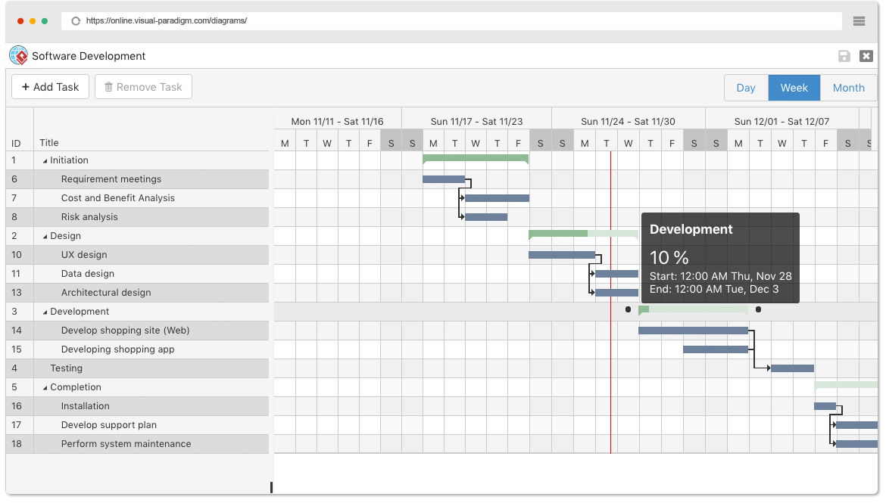
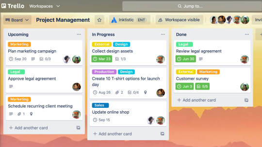
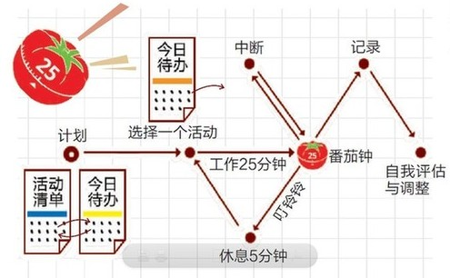
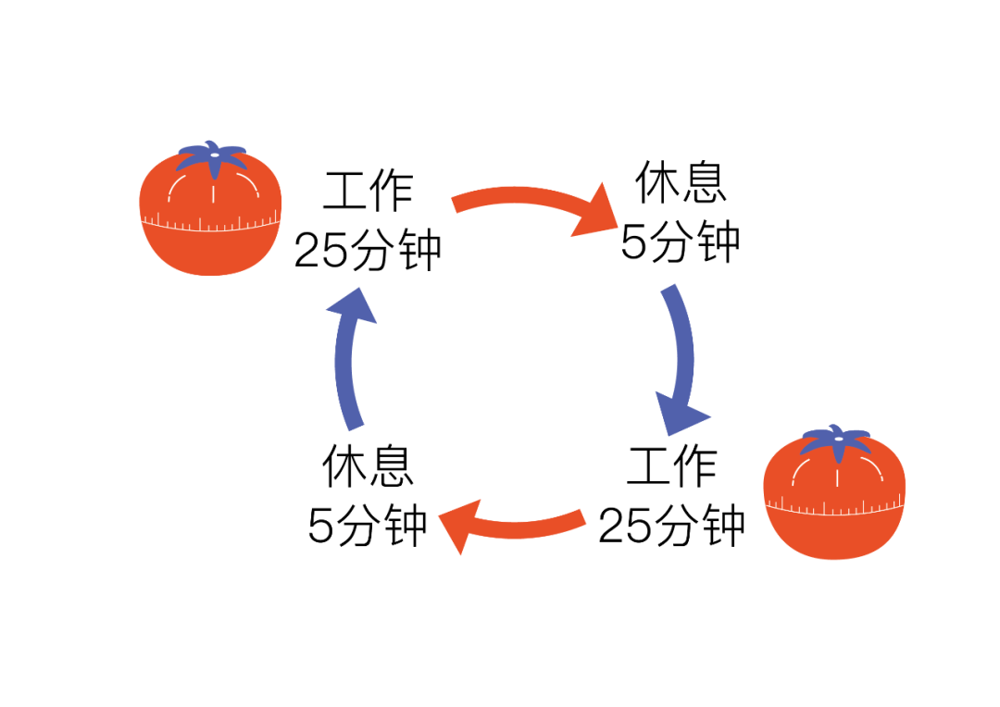
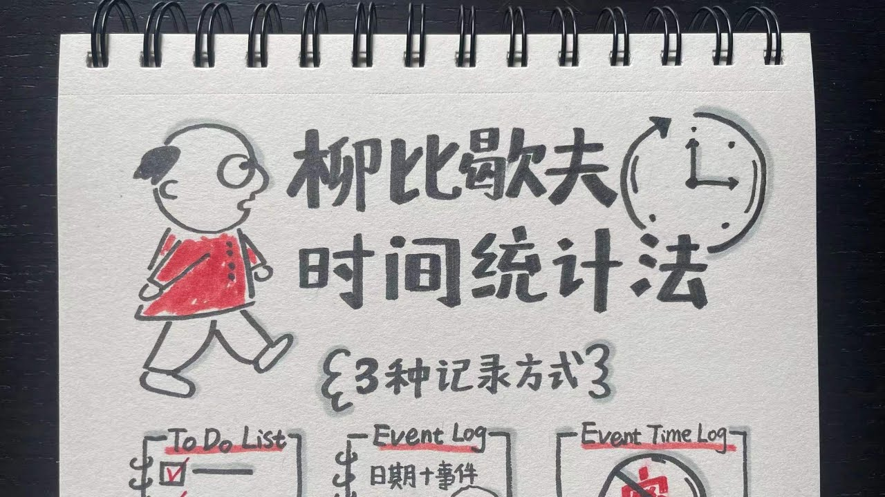
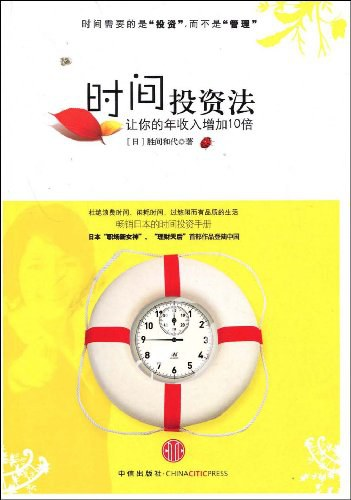
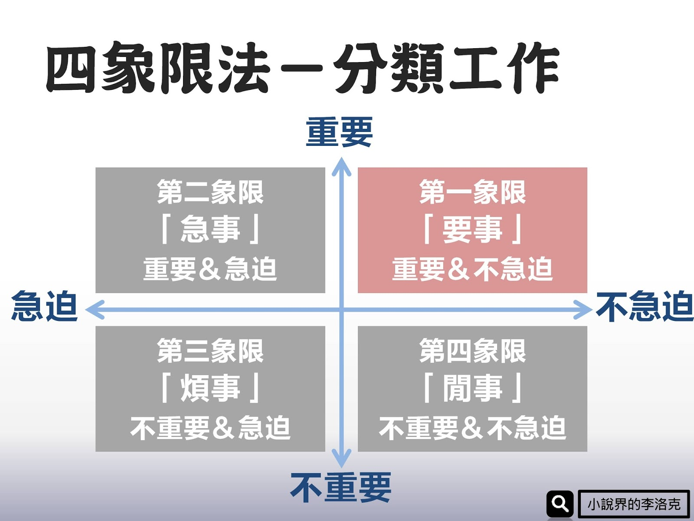
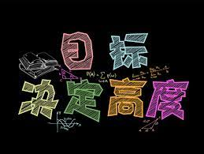

* content
{:toc}

时间管理？时间说，你谁呀，你就敢管我？但是说归说，在时间管理上躺平—诈尸—躺平反复了数十年。
躺在功劳簿上的工具不计其数，下面这个图，也算是有那么点意思了吧。

从理论上深入思考源于《奇特的一生》，在《时间投资法》深入，止步于GTD。中间起起落落很大的原因还是工作的变动，这也说明基于具体技巧的时间管理方法通常很难奏效。也因为这些原因，到了后来的钉钉，企业微信，飞书，实在没有探索的欲望了，反倒是把Excel给学了又学，用了又用。

下面来欣赏个人时间管理上的失败史，看看有你尝试过的影子不。

<!-- more -->
# 1、废寝忘食就是时间管理
很小开始住校，好像一直在读书，也不知道是看了哪本书，讲了很多科学家的故事，这些科学家挑灯夜读呀，古时候各种大家吧，反正就是主打勤奋，还有马上厕上之类。悬梁刺股呀，凿壁偷光呀！

于是我就被窝里里手电筒照着看书，大清早大家都没起来就路灯下看书，才那么小点的小朋友，脑子咋想的呀。

* 美术课？不会也得学呀！
* 音乐课？五音不全怕啥？开课了就得学！
* 单杠拉不动？自己练去！

最后居然得出来：废寝忘食就是时间管理！

不夸张说，这个想法持续了很多年，中间居然从来没有怀疑过，哪怕想一下，废寝忘食，挑灯夜读就不能高效点嘛！

# 2、用了软件就是时间管理
> 关键词：日历、任务

毕业后从小公司起步，人少，完全不会涉及到这玩意，后来换了地方，身边的人开始折腾这些玩意，主要那会谷歌还是风光无限，Google Reader总会介绍些新鲜玩意。所以时间得管起来。

这个阶段更多的是个人的一些小工具，现在回想起来，用工具之前完全没有想过用它来干啥，出发点就集中在，这玩意好呀，咱得学得用呀。于是，咱可不就得用嘛！

Any.do，Foxmail里面的日程，Outlook里面的日历等等，基本上都集中在这些任务管理，日历上。

> 基本上，这些软件最后的下场都是，里面任务堆满了，换个软件继续。用的比较多是Dreammail

# 3、项目管理才是时间管理
> 关键词：甘特图

后来开始带研发团队了，项目管理的知识得跟上。看样子最专业的就是Ms Project了。学呗，找项目总监请教不好意思，就找他要他的mpp文件，找他的文件目录结构，真是初生牛犊不怕虎，人家也不好得罪咱，虽然项目管理做得差，但是项目还得咱团队支撑着。

甘特图很重要是吧，上！前置后置任务很重要是吧，上！资源很重要是吧，放进去！成本要算吧，加！

Ms Project用起来有门槛？换软件呀！甘特图就是用表格也能堆起来，要不然自己做一个？尝试了一下没搞定，算了，换软件。

> 这个阶段真的是，无知者无畏呀！项目管理的基本知识不了解，就敢直接上手折腾了呀！

这个阶段虽然说是项目管理也折腾了一下，但是核心还是产品研发，说白了就是自己一个人上。也正是因为技术上投入太深，个人依赖就很大。这是后话了。

> 尝试过被弄死的工具包括Redmine、Jira、OminiPlan、Milk、XMind(没看错，我用它的干特图功能)。当然，还有Project。

# 4、项目为啥都是倒排？
> todo，doing，done
在真实项目中，大多数是倒排的，从研发角度来看显然不合理。但是合同就是那么签订的，项目的计划即使排了，老板也会退回来，因为加班就不算项目计划的一部分。项目管理是质量，时间，资源的平衡。但是研发看不到这么多视角。不倒排，合同就没有了，要养那么多人也没得养了。你还想留点余量？想啥呢？没有！

所以这种项目管理很不合理，应该换！这样的组织架构不行，换（这个换不了，哈哈）！听说敏捷很好。咱学去！

所以时间管理，项目管理就变成不要长期的甘特图了，一个计划1年？扯淡！2周的计划就可以了。

所以也就改成了是不是瀑布了，任务开始管理了。

这个阶段用得比较多的是Trello、Worktile、Tower、Teambition之类的工具。

> 不管是传统项目管理，还是敏捷，搞定事情才是最重要的！但是这个阶段也许是因为年轻力壮，做东西还算比较快，加上拼命加班，反而掩盖了问题。

> Trello一度是项目管理个人管理的重要工具。现在回想起来，更多的是觉得它能行，但是它没那么智能。在我脑子还糊涂的时候，它能不糊涂！后来被收购了就没咋用了！

> 拖动卡片是很容易的，创建卡片也是很容易的，难的是，卡片的规则，推动的规则！卡片背后的任务梳理！任务分解！

但是，事情并没有想象中顺利，个人生活几乎都没有了！时间管理管了个寂寞呀？到底啥是时间管理呢

# 5、疯狂冲塔—悲壮
这个阶段开始，尝试各种App，各种软件，特意查了一下iOS的下载记录，还有Mac上的软件，还有很多Win上已经不记得名字的。留个影，将来恐怕也不会疯狂用它们了！

* 奇妙清单
* Pomotodo
* BeFocus
* 微软todo
* GoogleTasks
* Toggl Track
* Omini Focus 3
    * 多次冲塔，多次摔死
* Calendars 5
    * 几百块，说买就买了，并没咋用
* Priori
* Forest
* 实体番茄钟
    * 有方的，有圆的
    * 有机械的，有电子
* Task Alarm
* Sorted
    * 创始人讲了故事，大意是市面上的软件都不行
    * 他们挺好，但是最后还是没坚持下来
* Flat Tomato
* aTimeLogger
* TickTick
* iThermonitor
* TimeGoledn
* Doit.im
* Calendars:Planner
* Cal
* Clean Calendar
* MyCalendar
* Any.do

这么多的记忆和陪伴，为啥就是不行呢？是软件不行吗？是用它的人不行好吗！

## 相对完整的番茄工作法

## 简化的番茄工作法

这个对比大概就能知道，为啥不行了？因为很多时候，一个方法论的产生，背后有很多思考，而执行的时候，完全抛弃了总结。

# 6、你了解自己吗—柳比歇夫的神迹
> 关键词：你了解自己吗？

这个时候很巧看到本书，《奇特的一生》，这个家伙死后来了很多领域的人，他在很多领域都颇有建树，但是又没有刻意出头，以至于大家都很奇怪他到底是哪个领域的。整理遗物时，人们发现有很多记录时间的笔记本，才明白他一直在记录自己的时间使用情况，据说连至亲的重大时刻也都没有停止。所以他对自己的时间管理能力非常了解。

说干就干，这个时候已经要躲开前面那些花里胡哨，功能强的app了。选了aTimeLogger。它的特点主打一个丑字，另外其实也不好用。但是强迫自己去用，原因是为了每周整理的时候，让自己静下来复盘，另外它还和Google Calendar的数据结合（为此写了一个非常简陋的Chrome插件）。另外还有电脑上也装了类似今天iOS上的时间记录软件—ResumeTime。

> 这个时候开始有点意识到自己对自身的了解是很不充分的，特别是随着年龄增长，想要冲击一些东西的时候，会败下阵来。

借着这个势头看了时间管理的书，特别是胜间和代《时间投资法》，深深影响着我的很多想法！

# 7、治未病—要管的时候已经晚了
> 关键词：想要管理时间？晚了！

《时间投资法》的作者本身也是留美的高级白领。她提到一个场景，带孩子去医院看病很花时间，那我们就想办法不要去看病，所以他会带着孩子骑自行车购物等等。类似场景描述的冲击，让当时的我突然明白过来，我们纠结和执着于当下的时间管理，已经是病入膏肓的状态。

我们期望通过一些工具一些手段来获得更多的时间，然后期望去把这个空间填满，然后再通过时间管理，获得更多时间…… 。但是，为什么呢？

实际上，我们需要做的是，在今天这这个状况发生前，就要思考为什么会发生这些事，规避它发生固然重要，更重要的是，我们其实想要什么样的人生？

> 所以其实这个阶段开始明白过来，时间管理也许是伪命题！但是寻找工具脚步并没有停下。

> 很奇怪的是，这本书日本好像也没那么轰动，国内很长时间也没得卖，都是影印本。

# 8、不紧急但重要—四象限
> 关键词：四象限 

这个阶段开始接触时间管理更多的方法和技巧，比如

我们应该把时间更多花在重要不紧急的事上，从根本上避免紧急状况的发生。而不用时刻奔赴在紧急的火场。我们知道这很重要，但是当我们离开培训现场，离开学习的环境，回到现实中，我们时刻都在救火，都在扑灭各种大大小小的火，火苗都顾不上了。

而我也是这个阶段开始从《关键链》中开始思考，那条关键路径在哪里？借此破冰，开始后续的工作。

> 这个自己弄了一些工具，也找了一些工具，如Priori等

但是技术债一直会以各种形式存在于我们生活的方方面面。所以什么才是我们最重要的呢

# 9、根本—目标

四象限法则的基础是评判一件事的归属到底是什么！所以我们需要了解，我们的评判标准是什么！
当我们开始思考这个问题的时候，我们就会发现，我们的人生目标并不清晰，也不明确！

当然，从短期来看，项目完成状况，从长期来看，我们需要一个什么样的人生呢？我们可以以终为始去想一个项目的目标，一段时间某件事的目标，但是当我们把时间拉长，5，10年，把目标拉大，一个一万米高空的人生目标，当我们想清楚，我们未来真正需要的东西，真正在意的人和事，就能更精准更快速的去评判，什么才是重要不紧急的事，也从这个时候开始，时间管理才真正起步了。

> 这个阶段甚至找了Countdown to Zero这样的工具，人生还能吃几次饭！

# 总结

客观来说，微观层面最好的应该就是番茄工作法了，但是即使看了书也没用起来，大概还是根深蒂固的观念吧。后来尝试GTD的时候，觉得太复杂就没有继续，我想核心还是自己觉得不重要吧。倒是同事提到的吃青蛙深得我心。每天先做那件让自己觉得很恶心又很重要的事，其他的是，就洒洒水了！

## 为什么又开始了？
* 每天过得有点乱
* 想梳理下健身计划
* 想多学点东西
* 没老吧！