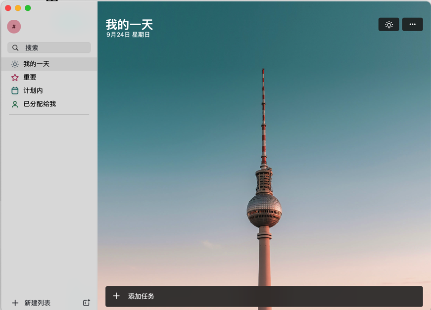
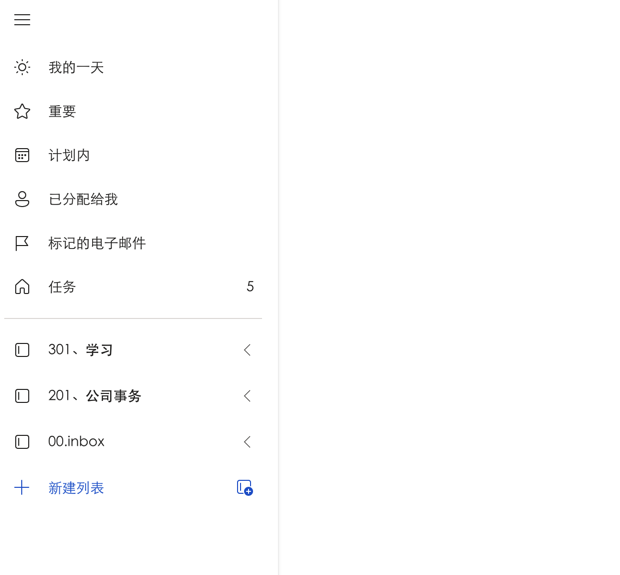
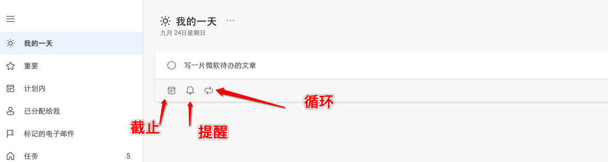
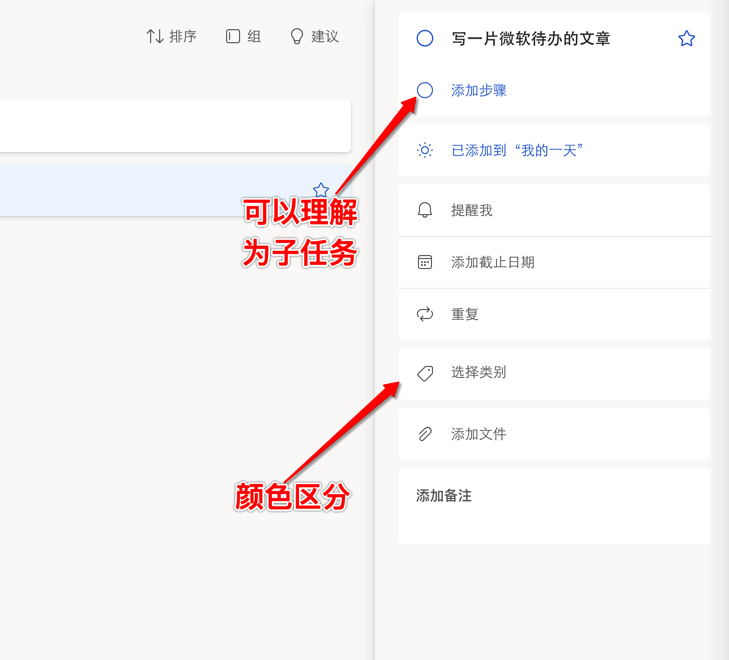
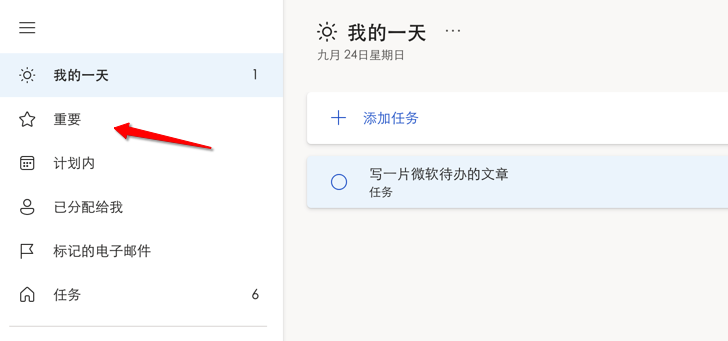
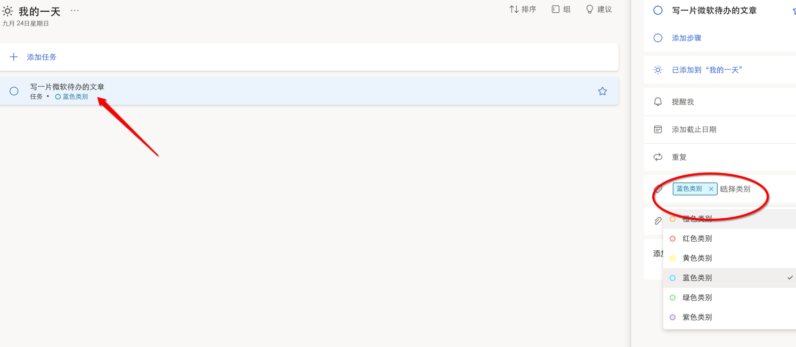
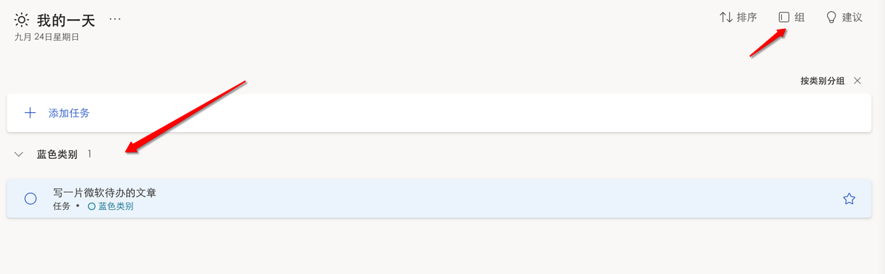

* content
{:toc}

其实微软todo一直没有入我眼，只是很多年前有人推荐过奇妙清单，一时风光无限，然后就被微软收购了，然后关闭了，后来有了todo。所以它其实也不算一无是处。

不说和奇妙清单一模一样嘛，也是一毛一样！大公司就是任性。想买就买，想关就关。

<!-- more -->

# 安装使用

官网提供下载，Mac和iOS都在AppStore里面弄，Windows可以在Store里面下载。不过比较遗憾的时候，我的电脑上，Win不能用，Mac勉强能用，但是无法输入帐号。

不过它主打的也就是一个全平台同步吧。目前iOS和网页都是可以的。

网页地址如下：
[https://to-do.live.com/tasks/auth/callback](https://to-do.live.com/tasks/auth/callback)

# 任务和列表
它的管理方式通过列表来管理任务，同样的，我们认为开始干的才叫待办，会汇总在我的一天中。这里还能继续添加任务

通过这个列表就可以管理各种待办了。

# 任务添加

添加是很容易的，它有一些属性用来方便我们管理。点开刚刚创建的待办就能看到。

# 任务筛选
这个是我给它取的名字，如果这个任务很重要，就可以加星

另外可以设置它的类别，类似Mac的文件夹颜色

这样设置的好处是可以按类别来划分任务

# 总结
可以看得出来，它的用法是非常简单的，作为微软整个体系的一部分，它可以和Outlook结合，后续可能也会和AI结合，但是我们也明白，如果我们想要在时间管理上做更细更深入的内容，它就有点吃力了。

另外我们可以看出来它的入口，是我的一天，也就是这一天开始的，所以也就造成，它的统计分析能功能是比较弱的。